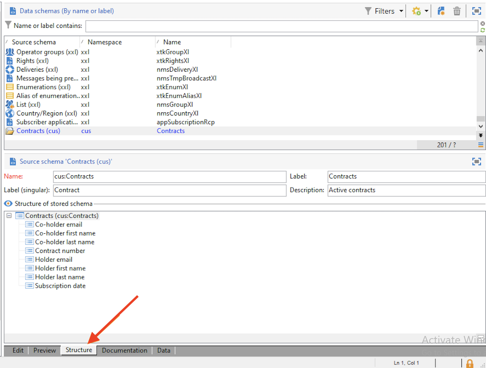

# Een nieuw schema maken {#create-new-schema}

Als u de schema&#39;s wilt bewerken, maken en configureren, klikt u op de knop **[!UICONTROL Administration > Configuration > Data schemas]** knooppunt van de Adobe Campaign-clientconsole.

>[!NOTE]
>
>Ingebouwde gegevensschema&#39;s kunnen alleen worden verwijderd door een beheerder van uw Adobe Campaign-console.


De **[!UICONTROL Edit]** wordt de XML-inhoud van een schema weergegeven:


>[!NOTE]
>
>Met het besturingselement &#39;Naam&#39; kunt u de schemasleutel invoeren die bestaat uit de naam en naamruimte. De kenmerken &quot;name&quot; en &quot;namespace&quot; van het hoofdelement van het schema worden automatisch bijgewerkt in de XML-bewerkingszone van het schema. Sommige naamruimten zijn alleen intern. [Meer informatie](schemas.md#reserved-namespaces)

De **[!UICONTROL Preview]** tab genereert automatisch het uitgebreide schema:


>[!NOTE]
>
>Wanneer het bronschema wordt opgeslagen, wordt het genereren van het uitgebreide schema automatisch gestart.

Als u de volledige structuur van een schema moet controleren, kunt u gebruiken **[!UICONTROL Preview]** tab. Als het schema is uitgebreid, zult u al zijn uitbreidingen dan kunnen visualiseren. Als aanvulling op de **[!UICONTROL Documentation]** worden alle schemakenmerken en -elementen en hun eigenschappen (SQL-veld, type/lengte, label, beschrijving) weergegeven. De **[!UICONTROL Documentation]** is alleen van toepassing op gegenereerde schema&#39;s.

## Hoofdlettergebruik: een contracttabel maken {#example--creating-a-contract-table}

In het volgende voorbeeld maakt u een nieuwe tabel voor **contracten** in de database. In deze tabel kunt u voor elk contract de voor- en achternaam en het e-mailadres van de houder en de medehouder opslaan.

Hiervoor moet u het schema van de tabel maken en de databasestructuur bijwerken om de bijbehorende tabel te genereren. De gedetailleerde stappen worden hieronder vermeld.

1. Bewerk de **[!UICONTROL Administration > Configuration > Data schemas]** knoop van de boom van Adobe Campaign en klik **[!UICONTROL New]**.
1. Kies de optie **[!UICONTROL Create a new table in the data template]** en klik op **[!UICONTROL Next]** .

   

1. Geef een naam voor de tabel en een naamruimte op.

   

   >[!NOTE]
   >
   >Standaard worden schema&#39;s die door gebruikers worden gemaakt, opgeslagen in de naamruimte &#39;cus&#39;. Raadpleeg voor meer informatie hierover [Identificatie van een schema](extend-schema.md#identification-of-a-schema).

1. Maak de inhoud van de tabel. Wij adviseren gebruikend de specifieke medewerker om ervoor te zorgen geen montages ontbreken. Om dit te doen, klik **[!UICONTROL Insert]** en kiest u het type instelling dat u wilt toevoegen.

   

1. Definieer de instellingen voor de tabel met contracten.

   U kunt de tabel het beste maken in de Cloud-database door de opdracht `dataSource="nms:extAccount:ffda"` kenmerk. Dit kenmerk wordt standaard toegevoegd bij het maken van een nieuwe tabel.

   ```
   <srcSchema created="YYYY-MM-DD HH:MM:SS.TZ" desc="Active contracts" img="crm:crm/mscrm/mscrm_account_16x16.png"
           label="Contracts" labelSingular="Contract" lastModified="YYYY-MM-DD HH:MM:SS.TZ"
           mappingType="sql" name="Contracts" namespace="cus" xtkschema="xtk:srcSchema">
      <element dataSource="nms:extAccount:ffda" desc="Active contracts" img="crm:crm/mscrm/mscrm_account_16x16.png"
           label="Contracts" labelSingular="Contract" name="Contracts">
           <attribute name="holderName" label="Holder last name" type="string"/>
           <attribute name="holderFirstName" label="Holder first name" type="string"/>
           <attribute name="holderEmail" label="Holder email" type="string"/>
           <attribute name="co-holderName" label="Co-holder last name" type="string"/>           
           <attribute name="co-holderFirstName" label="Co-holder first name" type="string"/>           
           <attribute name="co-holderEmail" label="Co-holder email" type="string"/>    
           <attribute name="date" label="Subscription date" type="date"/>     
           <attribute name="noContract" label="Contract number" type="long"/> 
      </element>
   </srcSchema>
   ```

   Voeg het type van contractopsomming toe.

   ```
   <srcSchema created="AA-MM-DD HH:MM:SS.TZ" desc="Active contracts" img="crm:crm/mscrm/mscrm_account_16x16.png" label="Contracts" labelSingular="Contract" AA-MM-DD HH:MM:SS.TZ"mappingType="sql" name="Contracts" namespace="cus" xtkschema="xtk:srcSchema">
      <enumeration basetype="byte" name="typeContract">
         <value label="Home" name="home" value="0"/>
         <value label="Car" name="car" value="1"/>
         <value label="Health" name="health" value="2"/>
         <value label="Pension fund" name="pension fund" value="2"/>
      </enumeration>
      <element dataSource="nms:extAccount:ffda" desc="Active contracts" img="crm:crm/mscrm/mscrm_account_16x16.png"
           label="Contracts" labelSingular="Contract" name="Contracts">
           <attribute name="holderName" label="Holder last name" type="string"/>
           <attribute name="holderFirstName" label="Holder first name" type="string"/>
           <attribute name="holderEmail" label="Holder email" type="string"/>
           <attribute name="co-holderName" label="Co-holder last name" type="string"/>           
           <attribute name="co-holderFirstName" label="Co-holder first name" type="string"/>           
           <attribute name="co-holderEmail" label="Co-holder email" type="string"/>    
           <attribute name="date" label="Subscription date" type="date"/>     
           <attribute name="noContract" label="Contract number" type="long"/> 
      </element>
   </srcSchema>
   ```

1. Sla het schema op en klik op de knop **[!UICONTROL Structure]** tabblad om de structuur te genereren:

   

1. Werk de databasestructuur bij om de tabel te maken waarnaar het schema wordt gekoppeld. Raadpleeg [deze sectie](update-database-structure.md) voor meer informatie.
