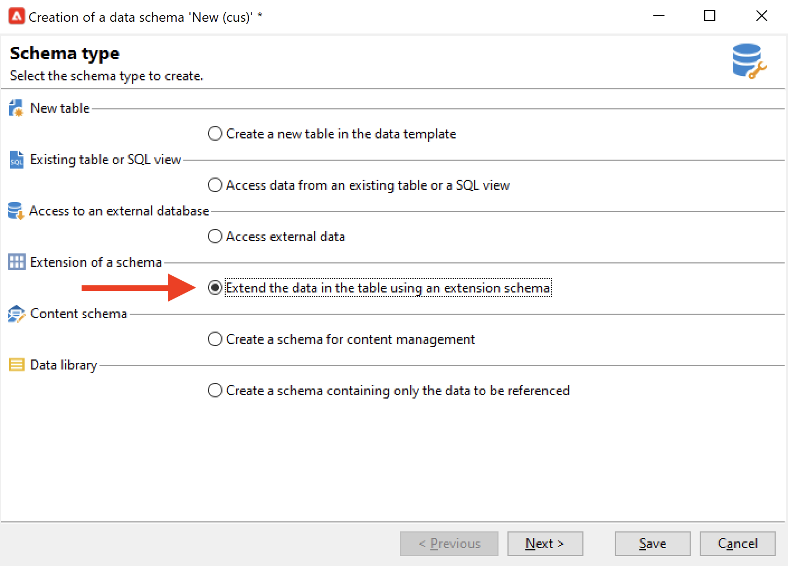
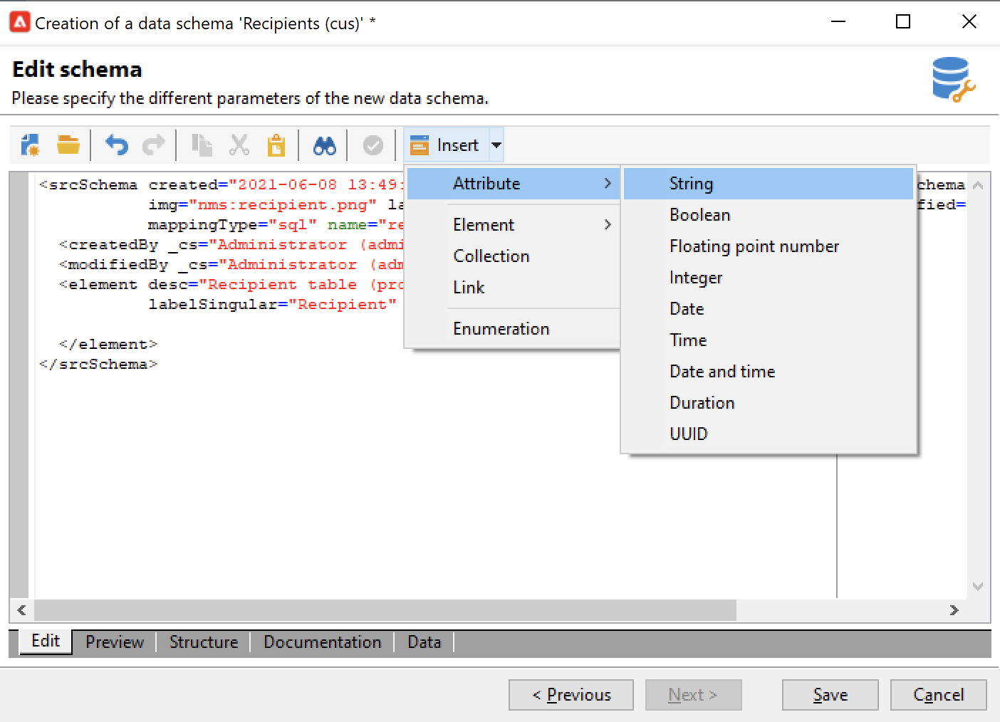
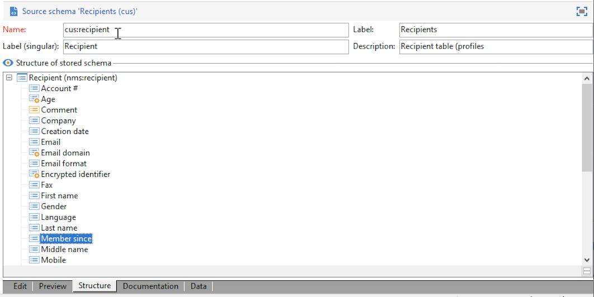

# Een schema uitbreiden{#extend-schemas}

Als technische gebruiker, kunt u datamodel van de Campagne aanpassen om aan de behoeften van uw implementatie te voldoen: Voeg elementen aan een bestaand schema toe, wijzig een element in een schema of schrap elementen.

De belangrijkste stappen om het datamodel van de Campagne aan te passen zijn:

1. Een extensieschema maken
1. Campagne-database bijwerken
1. Het invoerformulier aanpassen

>[!CAUTION]
>Ingebouwd schema mag niet rechtstreeks worden gewijzigd. Als u een ingebouwd schema moet aanpassen, moet u het uitbreiden.

[!DNL :bulb:] Raadpleeg  [deze pagina](datamodel.md) voor een beter begrip van ingebouwde tabellen en hun interactie voor campagnes.

Voer de volgende stappen uit om een schema uit te breiden:

1. Navigeer naar de map **[!UICONTROL Administration > Configuration > Data schemas]** in de Verkenner.
1. Klik op de knop **Nieuw** en selecteer **[!UICONTROL Extend the data in a table using an extension schema]**.

   

1. Identificeer het ingebouwde schema om het uit te breiden en te selecteren.

   

   Door overeenkomst, noem het uitbreidingsschema het zelfde als het ingebouwde schema, en gebruik een douanenamespace.  Sommige naamruimten zijn alleen intern. [Meer informatie](schemas.md#reserved-namespaces).

   

1. Voeg in de schema-editor de benodigde elementen toe via het contextmenu en sla deze op.

   

   In het onderstaande voorbeeld voegen we het kenmerk MembershipYear toe, zetten we een lengtelimiet voor achternaam (deze limiet overschrijft de standaardwaarde) en verwijderen we de geboortedatum uit het ingebouwde schema.

   

   ```
   <srcSchema created="YYYY-MM-DD" desc="Recipient table" extendedSchema="nms:recipient"
           img="nms:recipient.png" label="Recipients" labelSingular="Recipient" lastModified="YYYY-MM-DD"
           mappingType="sql" name="recipient" namespace="cus" xtkschema="xtk:srcSchema">
    <element desc="Recipient table" img="nms:recipient.png" label="Recipients" labelSingular="Recipient" name="recipient">
       <attribute label="Member since" name="MembershipYear" type="long"/>
       <attribute length="50" name="lastName"/>
       <attribute _operation="delete" name="birthDate"/>
   </element>
   </srcSchema>
   ```

1. Verbinding met Campagne verbreken en opnieuw verbinden om de update van de schemastructuur op het tabblad **[!UICONTROL Structure]** te controleren.

   

1. Werk de databasestructuur bij om de wijzigingen toe te passen. [Meer informatie](update-database-structure.md)

1. Nadat de wijzigingen in de database zijn geïmplementeerd, kunt u het invoerformulier voor de ontvanger aanpassen om de wijzigingen zichtbaar te maken. [Meer informatie](forms.md)
