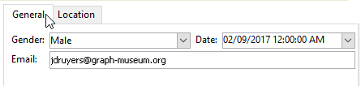

# Aan de slag met invoerformulieren {#gs-ac-forms}

Wanneer u een schema maakt of uitbreidt, moet u de bijbehorende invoerformulieren maken of wijzigen om deze wijzigingen zichtbaar te maken voor eindgebruikers.

Met een invoerformulier kunt u een instantie bewerken die is gekoppeld aan een gegevensschema in de Adobe Campaign Client Console. Het formulier wordt geïdentificeerd door de naam en naamruimte ervan.

De identificatiecode van een formulier is een tekenreeks die bestaat uit de naamruimte en de naam die door een dubbele punt wordt gescheiden, bijvoorbeeld: &quot;cus:contact&quot;.

## Invoerformulieren bewerken

Invoerformulieren maken en configureren vanuit de **[!UICONTROL Administration]> [!UICONTROL Configuration] >[!UICONTROL Input forms]** map van de clientconsole:


In de bewerkingszone kunt u de XML-inhoud van het invoerformulier invoeren:


In het voorbeeld wordt een weergave van het invoerformulier gegenereerd:


## Formulierstructuur

De beschrijving van een formulier is een gestructureerd XML-document waarin de grammatica van het formulierschema wordt gevolgd **xtk:form**.

Het XML-document van het invoerformulier moet de `<form>` hoofdelement met de  **name** en  **namespace** kenmerken om de formuliernaam en naamruimte te vullen.

```
<form name="form_name" namespace="name_space">
...
</form>
```

Een formulier is standaard gekoppeld aan het gegevensschema met dezelfde naam en naamruimte. Als u een formulier wilt koppelen aan een andere naam, stelt u de optie **entiteitsschema** kenmerk van de `<form>` element aan de naam van de schemasleutel. Als u de structuur van een invoerformulier wilt illustreren, kunt u een interface beschrijven met het voorbeeldschema &quot;focus:receiver&quot;:

```
<srcSchema name="recipient" namespace="cus">
  <enumeration name="gender" basetype="byte">    
    <value name="unknown" label="Not specified" value="0"/>    
    <value name="male" label="Male" value="1"/>   
    <value name="female" label="Female" value="2"/>   
  </enumeration>

  <element name="recipient">
    <attribute name="email" type="string" length="80" label="Email" desc="E-mail address of recipient"/>
    <attribute name="birthDate" type="datetime" label="Date"/>
    <attribute name="gender" type="byte" label="Gender" enum="gender"/>
  </element>
</srcSchema>
```

Het invoerformulier op basis van het voorbeeldschema:


```
<form name="recipient" namespace="cus">
  <input xpath="@gender"/>
  <input xpath="@birthDate"/>
  <input xpath="@email"/>
</form>
```

De beschrijving van de besturingselementen voor bewerken begint bij het `<form>` hoofdelement. Een bewerkingsbesturingselement is ingevoerd in een **`<input>`** met de **xpath** kenmerk met het pad van het veld in het schema.

Het bewerkingsbesturingselement past zich automatisch aan het overeenkomstige gegevenstype aan en gebruikt het label dat in het schema is gedefinieerd.

>[!NOTE]
>
>U kunt het label dat in het gegevensschema is gedefinieerd, overschrijven door het **label** aan de `<input>` element:\
>`<input label="E-mail address" xpath="@name" />`

Elk veld wordt standaard weergegeven op één regel en neemt alle beschikbare ruimte in beslag, afhankelijk van het type gegevens.

 Alle formulierkenmerken worden vermeld in [Campaign Classic v7-documentatie](https://experienceleague.adobe.com/developer/campaign-api/api/control-Button.html){target="_blank"}.

## Opmaak {#formatting}

De lay-out van de controles kijkt als lay-out die in HTML lijsten wordt gebruikt, met de mogelijkheid om een controle in verscheidene kolommen te verdelen, interliniërende elementen, of het specificeren van de bezetting van beschikbare ruimte. Houd er echter rekening mee dat u met de opmaak het gebied alleen door verhoudingen kunt opsplitsen. U kunt geen vaste afmetingen voor een object opgeven.

De besturingselementen van het bovenstaande voorbeeld in twee kolommen weergeven:


```
<form name="recipient" namespace="cus">
  <container colcount="2">
    <input xpath="@gender"/>
    <input xpath="@birthDate"/>
    <input xpath="@email"/>
  </container>
</form>
```

De **`<container>`** met de **colcount** kunt u de weergave van onderliggende besturingselementen op twee kolommen forceren.

De **colspan** attribuut op een controle breidt de controle door het aantal kolommen uit ingegaan in zijn waarde:


```
<form name="recipient" namespace="cus">
  <container colcount="2">
    <input xpath="@gender"/>
    <input xpath="@birthDate"/>
    <input xpath="@email" colspan="2"/>
  </container>
</form> 
```

Door de **type=&quot;frame&quot;** -kenmerk, voegt de container een frame toe rondom de onderliggende besturingselementen met het label in de **label** kenmerk:


```
<form name="recipient" namespace="cus">
  <container colcount="2" type="frame" label="General">
    <input xpath="@gender"/>
    <input xpath="@birthDate"/>
    <input xpath="@email" colspan="2"/>
  </container>
</form>
```

A **`<static>`** -element kan worden gebruikt om het invoerformulier op te maken:


```
<form name="recipient" namespace="cus">
  <static type="separator" colspan="2" label="General"/>
  <input xpath="@gender"/>
  <input xpath="@birthDate"/>
  <input xpath="@email" colspan="2"/>
  <static type="help" label="General information about recipient with date of birth, gender, and e-mail address." colspan="2"/>
</form>
```

De **`<static>`** tag met de **scheidingsteken** Met tekst kunt u een scheidingsbalk toevoegen met een label in het dialoogvenster **label** kenmerk.

Er is een Help-tekst toegevoegd met de `<static>` -tag met Help-type. De inhoud van de tekst wordt ingevoerd in het dialoogvenster **label** kenmerk.

## Containers gebruiken {#containers}

Gebruiken **containers** om een set besturingselementen te groeperen. Zij worden vertegenwoordigd door de **`<container>`** element. Deze werden hierboven gebruikt om besturingselementen in te delen in meerdere kolommen.

De **xpath** kenmerk op een `<container>` Hiermee kunt u het verwijzen naar onderliggende besturingselementen vereenvoudigen. De verwijzing van controles is dan met betrekking tot de ouder `<container>` bovenliggend.

Voorbeeld van een container zonder &quot;xpath&quot;:

```
<container colcount="2">
  <input xpath="location/@zipCode"/>
  <input xpath="location/@city"/>
</container>
```

Voorbeeld met de toevoeging van &quot;xpath&quot; aan het element &quot;location&quot;:

```
<container colcount="2" xpath="location">
  <input xpath="@zipCode"/>
  <input xpath="@city"/>
</container>
```

Containers worden gebruikt om complexe besturingselementen samen te stellen met een set velden die zijn opgemaakt in pagina&#39;s.

### Tabs toevoegen (laptop) {#tab-container}

Een **notebook** container gebruiken voor het opmaken van gegevens op pagina&#39;s die toegankelijk zijn via tabs.



```
<container type="notebook">
  <container colcount="2" label="General">
    <input xpath="@gender"/>
    <input xpath="@birthDate"/>
    <input xpath="@email" colspan="2"/>
  </container>
  <container colcount="2" label="Location">
    ...
  </container>
</container>
```

De hoofdcontainer wordt gedefinieerd door de **type=&quot;laptop&quot;** kenmerk. Tabs worden gedeclareerd in de onderliggende containers en het label van de tabbladen wordt gevuld vanuit het tabblad **label** kenmerk.

Voeg de **style=&quot;down&quot;** kenmerk om de verticale plaatsing van tablabels onder het besturingselement te forceren. Dit kenmerk is optioneel. Standaardwaarde is **&quot;up&quot;**.


`<container style="down" type="notebook">  ... </container>`

### Pictogrammen toevoegen (iconbox) {#icon-list}

Gebruik deze container om een verticale pictogrambalk weer te geven waarmee u de pagina&#39;s kunt selecteren die u wilt weergeven.


```
<container type="iconbox">
  <container colcount="2" label="General" img="xtk:properties.png">
    <input xpath="@gender"/>
    <input xpath="@birthDate"/>
    <input xpath="@email" colspan="2"/>
  </container>
  <container colcount="2" label="Location" img="nms:msgfolder.png">
    ...
  </container>
</container>
```

De hoofdcontainer wordt gedefinieerd door de **type=&quot;iconbox&quot;** kenmerk. De pagina&#39;s die aan de pictogrammen zijn gekoppeld, worden gedeclareerd in de onderliggende containers. Het label van de pictogrammen wordt vanuit het **label** kenmerk.

Het pictogram van een pagina wordt gevuld vanaf het tabblad `img="<image>"` kenmerk, waarbij `<image>` Dit is de naam van de afbeelding die overeenkomt met de sleutel waaruit de naam en naamruimte bestaan (bijvoorbeeld &quot;xtk:properties.png&quot;).

De afbeeldingen zijn beschikbaar in het menu **[!UICONTROL Administration > Configuration > Images]** knooppunt.

### Containers verbergen (visibleGroup) {#visibility-container}

U kunt een set besturingselementen verbergen via een dynamische voorwaarde.

Dit voorbeeld illustreert de zichtbaarheid van besturingselementen voor de waarde van het veld Geslacht:

```
<container type="visibleGroup" visibleIf="@gender=1">
  ...
</container>
<container type="visibleGroup" visibleIf="@gender=2">
  ...
</container>
```

Een zichtbaarheidscontainer wordt gedefinieerd door het kenmerk **type=&quot;visibleGroup&quot;**. De **visibleIf** bevat de zichtbaarheidsvoorwaarde.

Voorbeelden van syntaxis van voorwaarde:

* **visibleIf=&quot;@email=&#39;peter.martinezATneeolane.net&#39;&quot;**: test gelijkheid op tekenreeks-type gegevens. De vergelijkingswaarde moet tussen aanhalingstekens staan.
* **visibleIf=&quot;@gender >= 1 en @gender != 2 inch**: voorwaarde op een numerieke waarde.
* **visibleIf=&quot;@boolean1=true of @boolean2=false&quot;**: test op Booleaanse velden.

### Voorwaardelijke weergave (enabledGroup) {#enabling-container}

Met deze container kunt u een set gegevens in- of uitschakelen vanuit een dynamische voorwaarde. Als u een besturingselement uitschakelt, wordt het niet bewerkt. In het volgende voorbeeld wordt getoond hoe besturingselementen kunnen worden ingeschakeld in het veld &quot;Geslacht&quot;:

```
<container type="enabledGroup" enabledIf="@gender=1">
  ...
</container>
<container type="enabledGroup" enabledIf="@gender=2">
  ...
</container>
```

Een machtigingscontainer wordt gedefinieerd door de **type=&quot;enabledGroup&quot;** kenmerk. De **enabledIf** bevat de activeringsvoorwaarde.

## Een koppeling bewerken {#editing-a-link}

Vergeet niet dat een koppeling als volgt in het gegevensschema wordt gedeclareerd:

```
<element label="Company" name="company" target="cus:company" type="link"/>
```

De bewerkingscontrole voor de koppeling in de invoervorm is als volgt:


```
<input xpath="company"/>
```

Doelselectie is toegankelijk via het bewerkingsveld. Invoer wordt ondersteund door &#39;type-ahead&#39;, zodat een doelelement gemakkelijk kan worden gevonden op basis van de eerste paar ingevoerde tekens. De zoekopdracht is dan gebaseerd op de **Rekenreeks** gedefinieerd in het doelschema. Als het schema niet bestaat na bevestiging in de controle, wordt een bevestigingsbericht van de verwezenlijking van het on-the-fly doel getoond. De bevestiging leidt tot een nieuw verslag in de doellijst en associeert het met de verbinding.

Een vervolgkeuzelijst wordt gebruikt om een doelelement te selecteren in de lijst met records die al zijn gemaakt.

De **[!UICONTROL Modify the link]** (map) wordt een selectievormulier gestart met de lijst met doelelementen en een filterzone.

De **[!UICONTROL Edit link]** (vergrootglas) wordt de bewerkvorm van het gekoppelde element gestart. Het gebruikte formulier wordt standaard afgetrokken op de sleutel van het doelschema. De **formulier** kunt u de naam van het bewerkingsformulier afdwingen (bijvoorbeeld &quot;cus:company2&quot;).

U kunt de keuze van doelelementen beperken door de optie **`<sysfilter>`** -element uit de koppelingsdefinitie in het invoerformulier:

```
<input xpath="company">
  <sysFilter>
    <condition expr="[location/@city] =  'Newton"/>
  </sysFilter>
</input>
```

U kunt de lijst ook sorteren met de opdracht **`<orderby>`** element:

```
<input xpath="company">
  <orderBy>
    <node expr="[location/@zipCode]"/>
  </orderBy>
</input>
```

## Eigenschappen van besturing {#control-properties}

* **noAutoComplete**: schakelt type-ahead uit (met de waarde &quot;true&quot;)
* **createMode**: maakt de koppeling direct als deze niet bestaat. Mogelijke waarden zijn:

   * **none**: schakelt creatie uit. Er wordt een foutbericht weergegeven als de koppeling niet bestaat
   * **inline**: maakt de koppeling met de inhoud in het bewerkingsveld
   * **editie**: geeft het bewerkingsformulier weer op de koppeling. Wanneer het formulier wordt gevalideerd, worden de gegevens opgeslagen (standaardmodus)

* **noZoom**: geen formulier bewerken op de koppeling (met de waarde &quot;true&quot;)
* **formulier**: laadt de bewerkingsvorm van het doelelement

## Een lijst met (niet-gebonden) koppelingen toevoegen {#list-of-links}

Een verbinding ingegaan in het gegevensschema als inzamelingselement (unbound= &quot;waar&quot;) moet door een lijst gaan om alle elementen te bekijken verbonden aan het.

Het principe bestaat uit het weergeven van de lijst met gekoppelde elementen die zijn geoptimaliseerd voor het laden van gegevens (downloaden via gegevensbatch, alleen uitvoeren van de lijst als deze zichtbaar is).

Voorbeeld van een verzamelingskoppeling in een schema:

```
<element label="Events" name="rcpEvent" target="cus:event" type="link" unbound="true">
...
</element>
```

De lijst in de invoervorm:

```
 <input xpath="rcpEvent" type="linklist">
  <input xpath="@label"/>
  <input xpath="@date"/>
</input>
```

De lijstcontrole wordt bepaald door **type=&quot;linklist&quot;** kenmerk. Het lijstpad moet naar de verzamelingskoppeling verwijzen.

De kolommen worden gedeclareerd via de **`<input>`** elementen van de lijst. De **xpath** kenmerk verwijst naar het pad van het veld in het doelschema.

Een werkbalk met een label (gedefinieerd op de koppeling in het schema) wordt automatisch boven de lijst geplaatst.

De lijst kan via **[!UICONTROL Filters]** en geconfigureerd om de kolommen toe te voegen en te sorteren.

De **[!UICONTROL Add]** en **[!UICONTROL Delete]** Met knoppen kunt u verzamelingselementen toevoegen aan en verwijderen uit de koppeling. Standaard wordt bij het toevoegen van een element de bewerkingsvorm van het doelschema gestart.

De **[!UICONTROL Detail]** wordt automatisch toegevoegd wanneer de knop **zoom=&quot;true&quot;** kenmerk is voltooid op het tabblad **`<input>`** tag van de lijst: hiermee kunt u het bewerkingsformulier van de geselecteerde regel starten.

Filteren en sorteren kan worden toegepast wanneer de lijst wordt geladen:

```
 <input xpath="rcpEvent" type="linklist">
  <input xpath="@label"/>
  <input xpath="@date"/>
  <sysFilter>
    <condition expr="@type = 1"/>
  </sysFilter>
  <orderBy>
    <node expr="@date" sortDesc="true"/>
  </orderBy>
</input>
```

## Een relatietabel definiëren {#relationship-table}

Met een relatietabel kunt u twee tabellen koppelen aan N-N-kardinaliteit. De relatietabel bevat alleen de koppelingen naar de twee tabellen.

Als u een element aan de lijst toevoegt, kunt u daarom een lijst van een van de twee koppelingen in de relatietabel voltooien.

Voorbeeld van een relatietabel in een schema:

```
<srcSchema name="subscription" namespace="cus">
  <element name="recipient" type="link" target="cus:recipient" label="Recipient"/>
  <element name="service" type="link" target="cus:service" label="Subscription service"/>
</srcSchema>
```

Bij ons voorbeeld beginnen we met de invoervorm van het schema &#39;cus:receiver&#39;. De lijst moet de verenigingen met abonnementen aan de diensten tonen en moet u toestaan om een abonnement toe te voegen door een bestaande dienst te selecteren.


```
<input type="linklist" xpath="subscription" xpathChoiceTarget="service" xpathEditTarget="service" zoom="true">
  <input xpath="recipient"/>
  <input xpath="service"/>
</input>
```

De **xpathChoiceTarget** Met dit kenmerk kunt u een selectievorm starten vanuit de ingevoerde koppeling. Het creëren van het verslag van de relatietabel zal automatisch de verbinding aan de huidige ontvanger en de geselecteerde dienst bijwerken.

>[!NOTE]
>
>De **xpathEditTarget** Met dit kenmerk kunt u de geselecteerde regel op de ingevoerde koppeling geforceerd bewerken.

### Eigenschappen van List {#list-properties}

* **noToolbar**: verbergt de werkbalk (met de waarde &quot;true&quot;)
* **toolbarCaption**: Hiermee wordt het label van de werkbalk overgeslagen
* **toolbarAlign**: wijzigt de verticale of horizontale geometrie van de werkbalk (mogelijke waarden: &quot;vertical&quot;|&quot;horizontal&quot;)
* **img**: hiermee wordt de afbeelding weergegeven die aan de lijst is gekoppeld
* **formulier**: laadt de bewerkingsvorm van het doelelement
* **zoomen**: voegt de **[!UICONTROL Zoom]** knop om het doelelement te bewerken
* **xpathEditTarget**: stelt de bewerking in voor de ingevoerde koppeling
* **xpathChoiceTarget**: start bovendien het selectievorm op de ingevoerde koppeling

## Besturingselementen voor geheugenlijsten toevoegen {#memory-list-controls}

Met geheugenlijsten kunt u de verzamelingselementen bewerken door de lijstelementen vooraf te laden. Deze lijst kan niet worden gefiltreerd of worden gevormd.

Deze lijsten worden gebruikt op XML in kaart gebrachte inzamelingselementen of op laag-volumeverbindingen.

## Een kolomlijst toevoegen {#column-list}

Met dit besturingselement wordt een bewerkbare kolomlijst weergegeven met een werkbalk die knoppen Toevoegen en Verwijderen bevat.

```
<input xpath="rcpEvent" type="list">
  <input xpath="@label"/>
  <input xpath="@date"/>
</input>
```

Het besturingselement voor de lijst moet worden ingevuld met de knop **type=&quot;list&quot;** en het pad van de lijst moet naar het verzamelingselement verwijzen.

De kolommen worden gedeclareerd in het onderliggende object **`<input>`** -tags van de lijst. Het label en de grootte van de kolom kunnen met de **label** en **colSize** kenmerken.

>[!NOTE]
>
>Pijlen in de sorteervolgorde worden automatisch toegevoegd wanneer de **ordered=&quot;true&quot;** wordt toegevoegd aan het inzamelingselement in het gegevensschema.

De werkbalkknoppen kunnen horizontaal worden uitgelijnd:

```
<input nolabel="true" toolbarCaption="List of events" type="list" xpath="rcpEvent" zoom="true">
  <input xpath="@label"/>
  <input xpath="@date"/>
</input>
```

De **toolbarCaption** wordt de horizontale uitlijning van de werkbalk afgedwongen en wordt de titel boven de lijst ingevoerd.

### Inzoomen in een lijst inschakelen {#zoom-in-a-list}

U kunt de gegevens in een lijst invoegen en bewerken in een afzonderlijk bewerkingsformulier.

```
<input nolabel="true" toolbarCaption="List of events" type="list" xpath="rcpEvent" zoom="true" zoomOnAdd="true">
  <input xpath="@label"/>
  <input xpath="@date"/>

  <form colcount="2" label="Event">
    <input xpath="@label"/>
    <input xpath="@date"/>
  </form>
</input>
```

Het bewerkingsformulier wordt ingevuld via het `<form>`  element onder lijstdefinitie. De structuur is identiek aan die van een invoerformulier. De **[!UICONTROL Detail]** wordt automatisch toegevoegd wanneer de knop **zoom=&quot;true&quot;** kenmerk is voltooid op het tabblad **`<input>`** -tag van de lijst. Met dit kenmerk kunt u het bewerkingsformulier van de geselecteerde regel starten.

>[!NOTE]
>
>De **zoomOnAdd=&quot;true&quot;** Met kenmerk wordt afgedwongen dat het bewerkingsformulier wordt opgevraagd wanneer een lijstelement wordt ingevoegd.

### Eigenschappen van List {#list-properties-1}

* **noToolbar**: verbergt de werkbalk (met de waarde &quot;true&quot;)
* **toolbarCaption**: Hiermee wordt het label van de werkbalk overgeslagen
* **toolbarAlign**: wijzigt de positie van de werkbalk (mogelijke waarden: &quot;vertical&quot;|&quot;horizontal&quot;)
* **img**: hiermee wordt de afbeelding weergegeven die aan de lijst is gekoppeld
* **formulier**: laadt de bewerkingsvorm van het doelelement
* **zoomen**: voegt de **[!UICONTROL Zoom]** knop om het doelelement te bewerken
* **zoomOnAdd**: hiermee wordt het bewerkingsformulier gestart na toevoeging
* **xpathChoiceTarget**: start bovendien het selectievorm op de ingevoerde koppeling

## Niet-bewerkbare velden toevoegen {#non-editable-fields}

Als u een veld wilt weergeven en wilt voorkomen dat het wordt bewerkt, gebruikt u de opdracht **`<value>`** de tag of de **readOnly=&quot;true&quot;** kenmerk op de **`<input>`** -tag.

Voorbeeld op het veld &quot;Geslacht&quot;:


```
<value value="@gender"/>
<input xpath="@gender" readOnly="true"/>
```

## Keuzerondje toevoegen {#radio-button}

Met een keuzerondje kunt u kiezen uit verschillende opties. De **`<input>`** -tags worden gebruikt om de mogelijke opties weer te geven, en **checkedValue** geeft de waarde aan die aan de keuze is gekoppeld.

Voorbeeld op het veld &quot;Geslacht&quot;:

```
<input type="RadioButton" xpath="@gender" checkedValue="0" label="Choice 1"/>
<input type="RadioButton" xpath="@gender" checkedValue="1" label="Choice 2"/>
<input type="RadioButton" xpath="@gender" checkedValue="2" label="Choice 3"/>
```


## Selectievakje toevoegen {#checkbox}

Een selectievakje geeft een Booleaanse status weer (geselecteerd of niet). Dit besturingselement wordt standaard gebruikt door Booleaanse velden (true/false). Een variabele met de standaardwaarde 0 of 1 kan aan deze knop worden gekoppeld. Deze waarde kan worden overgeladen via de **checkValue** kenmerken.

```
<input xpath="@boolean1"/>
<input xpath="@field1" type="checkbox" checkedValue="Y"/>
```


## Navigatiehiërarchie bewerken {#navigation-hierarchy-edit}

Deze controle bouwt een boom op een reeks gebieden om uit te geven.

De te bewerken besturingselementen worden gegroepeerd in een **`<container>`** zijn ingevoerd onder **`<input>`** code van het structuurbesturingselement:

```
<input nolabel="true" type="treeEdit">
  <container label="Text fields">
    <input xpath="@text1"/>
    <input xpath="@text2"/>
  </container>
  <container label="Boolean fields">
    <input xpath="@boolean1"/>
    <input xpath="@boolean2"/>
  </container>
</input>
```


## Een expressieveld toevoegen {#expression-field}

Een expressieveld werkt een veld dynamisch bij vanuit een expressie. De **`<input>`** -tag wordt gebruikt met een **xpath** -kenmerk om het pad in te voeren van het veld dat moet worden bijgewerkt en een **expr** kenmerk met de update-expressie.

```
<!-- Example: updating the boolean1 field from the value contained in the field with path /tmp/@flag -->
<input expr="Iif([/tmp/@flag]=='On', true, false)" type="expr" xpath="@boolean1"/>
<input expr="[/ignored/@action] == 'FCP'" type="expr" xpath="@launchFCP"/>
```

## Context van formulieren {#context-of-forms}

Door het uitvoeren van een invoerformulier wordt een XML-document geïnitialiseerd dat de gegevens bevat van de entiteit die wordt bewerkt. Dit document vertegenwoordigt de context van het formulier en kan als werkruimte worden gebruikt.

### De context bijwerken {#updating-the-context}

Als u de context van het formulier wilt wijzigen, gebruikt u de `<set expr="<value>" xpath="<field>"/>` -tag, waarbij `<field>` het doelveld is, en `<value>` is de update-expressie of -waarde.

Voorbeelden van het gebruik van de `<set>` tag:

* **`<set expr="'Test'" xpath="/tmp/@test" />`**: plaatst de waarde &#39;Test&#39; op de tijdelijke locatie. /tmp/@test1
* **`<set expr="'Test'" xpath="@lastName" />`**: werkt de entiteit in het kenmerk &quot;lastName&quot; bij met de waarde &quot;Test&quot;
* **`<set expr="true" xpath="@boolean1" />`**: stelt de waarde van het veld &quot;boolean1&quot; in op &quot;true&quot;
* **`<set expr="@lastName" xpath="/tmp/@test" />`**: wordt bijgewerkt met de inhoud van het kenmerk &quot;lastName&quot;

De context van het formulier kan worden bijgewerkt tijdens het initialiseren en sluiten van het formulier via het dialoogvenster **`<enter>`** en **`<leave>`** -tags.

```
<form name="recipient" namespace="cus">
  <enter>
    <set...
  </enter>
  ...
  <leave>
    <set...
  </leave>
</form>
```

>[!NOTE]
>
>De `<enter>`  en  `<leave>`   -tags kunnen worden gebruikt op de `<container>` van pagina&#39;s (&quot;laptop&quot;- en &quot;iconbox&quot;-typen).

### Expressietaal {#expression-language-}

Een macrotaal kan in formulierdefinitie worden gebruikt om voorwaardelijke tests uit te voeren.

De **`<if expr="<expression>" />`** -tag voert de instructies uit die onder de -tag zijn opgegeven als de expressie wordt geverifieerd:

```
<if expr="([/tmp/@test] == 'Test' or @lastName != 'Doe') and @boolean2 == true">
  <set xpath="@boolean1" expr="true"/>
</if>
```

De **`<check expr="<condition>" />`** tag gecombineerd met de **`<error>`** -tag voorkomt validatie van het formulier en geeft een foutbericht weer als niet aan de voorwaarde wordt voldaan:

```
<leave>
  <check expr="/tmp/@test != ''">
    <error>You must populate the 'Test' field!</error> 
  </check>
</leave>
```

## Assistent (wizard) {#wizards}

Een assistent begeleidt u door een reeks gegevensinvoerstappen in de vorm van pagina&#39;s. De ingevoerde gegevens worden opgeslagen wanneer u het formulier valideert.

Om een medewerker toe te voegen, gebruik het volgende type van structuur:

```
<form type="wizard" name="example" namespace="cus" img="nms:rcpgroup32.png" label="Wizard example" entity-schema="nms:recipient">
  <container title="Title of page 1" desc="Long description of page 1">
    <input xpath="@lastName"/>
    <input xpath="comment"/>
  </container>
  <container title="Title of page 2" desc="Long description of page 2">
    ...
  </container>
  ...
</form>
```

De aanwezigheid van de **type=&quot;wizard&quot;** kenmerk op de `<form>` Met een element kunt u de wizardmodus definiëren in de constructie van het formulier. De pagina&#39;s worden voltooid vanaf `<container>` elementen die onderliggende elementen zijn van de `<form>` element. De `<container>` -element van een pagina wordt gevuld met de titelkenmerken voor de titel en het desc om de beschrijving onder de paginatitel weer te geven. De **[!UICONTROL Previous]** en **[!UICONTROL Next]** knoppen worden automatisch toegevoegd om te kunnen bladeren tussen pagina&#39;s.

De **[!UICONTROL Finish]** slaat de ingevoerde gegevens op en sluit het formulier.

### SOAP-methoden {#soap-methods}

De uitvoering van de SOAP-methode kan worden gestart vanuit een gevulde **`<leave>`** aan het einde van een pagina.

De **`<soapcall>`** -tag bevat de aanroep van de methode met de volgende invoerparameters:

```
<soapCall name="<name>" service="<schema>">
  <param type="<type>" exprIn="<xpath>"/>  
  ...
</soapCall>
```

De naam van de dienst en zijn implementatieschema zijn ingegaan via **name** en **service** kenmerken van de **`<soapcall>`** -tag.

De invoerparameters worden beschreven op de **`<param>`** elementen onder de **`<soapcall>`** -tag.

Het parametertype moet via het **type** kenmerk. De mogelijke typen zijn:

* **string**: tekentekenreeks
* **boolean**: Boolean
* **byte**: 8-bits geheel getal
* **kort**: 16-bits geheel getal
* **lang**: 32-bits geheel getal
* **kort**: 16-bits geheel getal
* **double**: drijvende-kommagetal met dubbele precisie
* **DOMElement**: knooppunt van elementtype

De **exprIn** bevat de locatie van de gegevens die als parameter moeten worden doorgegeven.

**Voorbeeld**:

```
<leave>
  <soapCall name="RegisterGroup" service="nms:recipient">         
    <param type="DOMElement" exprIn="/tmp/entityList"/>         
    <param type="DOMElement" exprIn="/tmp/choiceList"/>         
    <param type="boolean"    exprIn="true"/>       
  </soapCall>
</leave>
```
