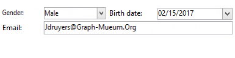

# Aan de slag met invoerformulieren{#gs-ac-forms}

Wanneer u een schema maakt of uitbreidt, moet u de bijbehorende invoerformulieren maken of wijzigen om deze wijzigingen zichtbaar te maken voor eindgebruikers.

Met een invoerformulier kunt u een instantie bewerken die is gekoppeld aan een gegevensschema vanuit de Adobe Campaign-clientconsole. Het formulier wordt geïdentificeerd door de naam en naamruimte ervan.

De identificatiecode van een formulier is een tekenreeks die bestaat uit de naamruimte en de naam die door een dubbele punt wordt gescheiden, bijvoorbeeld: &quot;cus:contact&quot;.

## Invoerformulieren bewerken

Maak en configureer invoerformulieren vanuit de map **[!UICONTROL Administration]> [!UICONTROL Configuration] >[!UICONTROL Input forms]** van de clientconsole:


In de bewerkingszone kunt u de XML-inhoud van het invoerformulier invoeren:


In het voorbeeld wordt een weergave van het invoerformulier gegenereerd:


## Formulierstructuur

De beschrijving van een formulier is een gestructureerd XML-document waarin de grammatica van het formulierschema **xtk:form** wordt gevolgd.

Het XML-document van het invoerformulier moet het basiselement `<form>` bevatten met de kenmerken **name** en **namespace** om de formuliernaam en naamruimte te vullen.

```
<form name="form_name" namespace="name_space">
...
</form>
```

Een formulier is standaard gekoppeld aan het gegevensschema met dezelfde naam en naamruimte. Om een vorm met een verschillende naam te associëren, plaats **entiteit-schema** attributen van het `<form>` element aan de naam van de schemasleutel. Als u de structuur van een invoerformulier wilt illustreren, kunt u een interface beschrijven met het voorbeeldschema &quot;focus:receiver&quot;:

```
<srcSchema name="recipient" namespace="cus">
  <enumeration name="gender" basetype="byte">    
    <value name="unknown" label="Not specified" value="0"/>    
    <value name="male" label="Male" value="1"/>   
    <value name="female" label="Female" value="2"/>   
  </enumeration>

  <element name="recipient">
    <attribute name="email" type="string" length="80" label="Email" desc="E-mail address of recipient"/>
    <attribute name="birthDate" type="datetime" label="Date"/>
    <attribute name="gender" type="byte" label="Gender" enum="gender"/>
  </element>
</srcSchema>
```

Het invoerformulier op basis van het voorbeeldschema:


```
<form name="recipient" namespace="cus">
  <input xpath="@gender"/>
  <input xpath="@birthDate"/>
  <input xpath="@email"/>
</form>
```

De beschrijving van de bewerkingsbesturingselementen begint bij het basiselement `<form>`. Een bewerkingscontrole is ingegaan in een **`<input>`** element met het **xpath** attribuut dat de weg van het gebied in zijn schema bevat.

Het bewerkingsbesturingselement past zich automatisch aan het overeenkomstige gegevenstype aan en gebruikt het label dat in het schema is gedefinieerd.

>[!NOTE]
>
>U kunt het etiket beschrijven dat in zijn gegevensschema wordt bepaald door **label** attributen aan `<input>` element toe te voegen:\
>`<input label="E-mail address" xpath="@name" />`

Elk veld wordt standaard weergegeven op één regel en neemt alle beschikbare ruimte in beslag, afhankelijk van het type gegevens.

 Alle formulierkenmerken worden vermeld in  [Campaign Classic v7-documentatie](https://experienceleague.adobe.com/developer/campaign-api/api/control-Button.html).

## Opmaak {#formatting}

De lay-out van de controles kijkt als lay-out die in HTML lijsten wordt gebruikt, met de mogelijkheid om een controle in verscheidene kolommen te verdelen, interliniërende elementen, of het specificeren van de bezetting van beschikbare ruimte. Houd er echter rekening mee dat u met de opmaak het gebied alleen door verhoudingen kunt opsplitsen. u kunt geen vaste afmetingen opgeven voor een object.

De besturingselementen van het bovenstaande voorbeeld in twee kolommen weergeven:


```
<form name="recipient" namespace="cus">
  <container colcount="2">
    <input xpath="@gender"/>
    <input xpath="@birthDate"/>
    <input xpath="@email"/>
  </container>
</form>
```

Met het **`<container>`**-element met het **colcount**-kenmerk kunt u de weergave van onderliggende besturingselementen op twee kolommen forceren.

Het **colspan** attribuut op een controle breidt de controle door het aantal kolommen uit ingegaan in zijn waarde:


```
<form name="recipient" namespace="cus">
  <container colcount="2">
    <input xpath="@gender"/>
    <input xpath="@birthDate"/>
    <input xpath="@email" colspan="2"/>
  </container>
</form> 
```

Door het **type=&quot;frame&quot;** attribuut te vullen, voegt de container een kader rond de kindcontroles met het etiket toe in het **label** attribuut:



```
<form name="recipient" namespace="cus">
  <container colcount="2" type="frame" label="General">
    <input xpath="@gender"/>
    <input xpath="@birthDate"/>
    <input xpath="@email" colspan="2"/>
  </container>
</form>
```

Een **`<static>`**-element kan worden gebruikt om het invoerformulier op te maken:


```
<form name="recipient" namespace="cus">
  <static type="separator" colspan="2" label="General"/>
  <input xpath="@gender"/>
  <input xpath="@birthDate"/>
  <input xpath="@email" colspan="2"/>
  <static type="help" label="General information about recipient with date of birth, gender, and e-mail address." colspan="2"/>
</form>
```

Met de tag **`<static>`** met het type **separator** kunt u een scheidingsbalk toevoegen met een label in het kenmerk **label**.

Er is een Help-tekst toegevoegd met de tag `<static>` met het type help. De inhoud van de tekst wordt ingevoerd in het **label**-kenmerk.

## Containers gebruiken {#containers}

Gebruik **containers** om een set besturingselementen te groeperen. Zij worden vertegenwoordigd door het **`<container>`** element. Deze werden hierboven gebruikt om besturingselementen in te delen in meerdere kolommen.

Met het kenmerk **xpath** op een `<container>` kunt u de verwijzing van onderliggende besturingselementen vereenvoudigen. De verwijzing van controles is dan met betrekking tot de ouder `<container>` ouder.

Voorbeeld van een container zonder &quot;xpath&quot;:

```
<container colcount="2">
  <input xpath="location/@zipCode"/>
  <input xpath="location/@city"/>
</container>
```

Voorbeeld met de toevoeging van &quot;xpath&quot; aan het element &quot;location&quot;:

```
<container colcount="2" xpath="location">
  <input xpath="@zipCode"/>
  <input xpath="@city"/>
</container>
```

Containers worden gebruikt om complexe besturingselementen samen te stellen met een set velden die zijn opgemaakt in pagina&#39;s.

### Tabs toevoegen (laptop) {#tab-container}

Gebruik een **notebook** container om gegevens op te maken in pagina&#39;s die toegankelijk zijn vanaf tabs.


```
<container type="notebook">
  <container colcount="2" label="General">
    <input xpath="@gender"/>
    <input xpath="@birthDate"/>
    <input xpath="@email" colspan="2"/>
  </container>
  <container colcount="2" label="Location">
    ...
  </container>
</container>
```

De hoofdcontainer wordt gedefinieerd door het **type=&quot;laptop&quot;**-kenmerk. Tabs worden gedeclareerd in de onderliggende containers en het label van de tabbladen wordt gevuld met het kenmerk **label**.

Voeg het **style=&quot;down&quot;** attribuut toe om de verticale plaatsing van lusjeetiketten onder de controle te dwingen. Dit kenmerk is optioneel. De standaardwaarde is **&quot;up&quot;**.


`<container style="down" type="notebook">  ... </container>`

### Pictogrammen toevoegen (iconbox) {#icon-list}

Gebruik deze container om een verticale pictogrambalk weer te geven waarmee u de pagina&#39;s kunt selecteren die u wilt weergeven.


```
<container type="iconbox">
  <container colcount="2" label="General" img="xtk:properties.png">
    <input xpath="@gender"/>
    <input xpath="@birthDate"/>
    <input xpath="@email" colspan="2"/>
  </container>
  <container colcount="2" label="Location" img="nms:msgfolder.png">
    ...
  </container>
</container>
```

De hoofdcontainer wordt gedefinieerd door het **type=&quot;iconbox&quot;**-kenmerk. De pagina&#39;s die aan de pictogrammen zijn gekoppeld, worden gedeclareerd in de onderliggende containers. Het label van de pictogrammen wordt gevuld van het **label** attribuut.

Het pictogram van een pagina wordt gevuld met het kenmerk `img="<image>"`, waarbij `<image>` de naam is van de afbeelding die overeenkomt met de sleutel die uit de naam en naamruimte bestaat (bijvoorbeeld &quot;xtk:properties.png&quot;).

De afbeeldingen zijn beschikbaar via het knooppunt **[!UICONTROL Administration > Configuration > Images]**.

### Containers verbergen (visibleGroup) {#visibility-container}

U kunt een set besturingselementen verbergen via een dynamische voorwaarde.

Dit voorbeeld illustreert de zichtbaarheid van besturingselementen voor de waarde van het veld Geslacht:

```
<container type="visibleGroup" visibleIf="@gender=1">
  ...
</container>
<container type="visibleGroup" visibleIf="@gender=2">
  ...
</container>
```

Een zichtbaarheidscontainer wordt bepaald door het attribuut **type=&quot;visibleGroup&quot;**. Het **visibleIf**-kenmerk bevat de zichtbaarheidsvoorwaarde.

Voorbeelden van syntaxis van voorwaarde:

* **visibleIf=&quot;@email=&#39;peter.martinezATneeolane.net&#39;&quot;**: test gelijkheid op koord-type gegevens. De vergelijkingswaarde moet tussen aanhalingstekens staan.
* **visibleIf=&quot;@gender >= 1 en @gender != 2&quot;**: voorwaarde op een numerieke waarde.
* **visibleIf=&quot;@boolean1=true of @boolean2=false&quot;**: testen op Booleaanse velden.

### Voorwaardelijke weergave (enabledGroup) {#enabling-container}

Met deze container kunt u een set gegevens in- of uitschakelen vanuit een dynamische voorwaarde. Als u een besturingselement uitschakelt, wordt het niet bewerkt. In het volgende voorbeeld wordt getoond hoe besturingselementen kunnen worden ingeschakeld met behulp van de waarde van het veld &quot;Geslacht&quot;:

```
<container type="enabledGroup" enabledIf="@gender=1">
  ...
</container>
<container type="enabledGroup" enabledIf="@gender=2">
  ...
</container>
```

Een toelatende container wordt bepaald door het **type=&quot;enabledGroup&quot;** attribuut. Het **enabledIf** attribuut bevat de activeringsvoorwaarde.

## Een koppeling bewerken {#editing-a-link}

Vergeet niet dat een koppeling als volgt in het gegevensschema wordt gedeclareerd:

```
<element label="Company" name="company" target="cus:company" type="link"/>
```

De bewerkingscontrole voor de koppeling in de invoervorm is als volgt:


```
<input xpath="company"/>
```

Doelselectie is toegankelijk via het bewerkingsveld. Invoer wordt ondersteund door &#39;type-ahead&#39;, zodat een doelelement gemakkelijk kan worden gevonden op basis van de eerste paar ingevoerde tekens. Het onderzoek wordt dan gebaseerd op **Berekend koord** die in het gerichte schema wordt bepaald. Als het schema niet bestaat na bevestiging in de controle, wordt een bevestigingsbericht van de verwezenlijking van het on-the-fly doel getoond. De bevestiging leidt tot een nieuw verslag in de doellijst en associeert het met de verbinding.

Een vervolgkeuzelijst wordt gebruikt om een doelelement te selecteren in de lijst met records die al zijn gemaakt.

Met het pictogram **[!UICONTROL Modify the link]** (map) wordt een selectievorm gestart met de lijst met doelelementen en een filterzone.

Met het pictogram **[!UICONTROL Edit link]** (vergrootglas) wordt de bewerkvorm van het gekoppelde element gestart. Het gebruikte formulier wordt standaard afgetrokken op de sleutel van het doelschema. Met het kenmerk **form** kunt u de naam van het bewerkingsformulier afdwingen (bijvoorbeeld &quot;cus:company2&quot;).

U kunt de keuze van doelelementen beperken door het element **`<sysfilter>`** van de koppelingsdefinitie in het invoerformulier toe te voegen:

```
<input xpath="company">
  <sysFilter>
    <condition expr="[location/@city] =  'Newton"/>
  </sysFilter>
</input>
```

U kunt de lijst ook sorteren met het element **`<orderby>`**:

```
<input xpath="company">
  <orderBy>
    <node expr="[location/@zipCode]"/>
  </orderBy>
</input>
```

## Eigenschappen van besturing {#control-properties}

* **noAutoComplete**: schakelt type-vooruit uit (met de waarde &quot;waar&quot;)
* **createMode**: maakt de koppeling direct als deze niet bestaat. Mogelijke waarden zijn:

   * **geen**: schakelt creatie uit. Er wordt een foutbericht weergegeven als de koppeling niet bestaat
   * **inline**: maakt de koppeling met de inhoud in het bewerkingsveld
   * **editie**: geeft het bewerkingsformulier weer op de koppeling. Wanneer het formulier wordt gevalideerd, worden de gegevens opgeslagen (standaardmodus)

* **noZoom**: geen formulier bewerken op de koppeling (met de waarde &quot;true&quot;)
* **formulier**: Hiermee wordt de bewerkingsvorm van het doelelement overbelast

## Een lijst met (niet-gebonden) koppelingen toevoegen {#list-of-links}

Een verbinding ingegaan in het gegevensschema als inzamelingselement (unbound= &quot;waar&quot;) moet door een lijst gaan om alle elementen te bekijken verbonden aan het.

Het principe bestaat uit het weergeven van de lijst met gekoppelde elementen die zijn geoptimaliseerd voor het laden van gegevens (downloaden via gegevensbatch, alleen uitvoeren van de lijst als deze zichtbaar is).

Voorbeeld van een verzamelingskoppeling in een schema:

```
<element label="Events" name="rcpEvent" target="cus:event" type="link" unbound="true">
...
</element>
```

De lijst in de invoervorm:

```
 <input xpath="rcpEvent" type="linklist">
  <input xpath="@label"/>
  <input xpath="@date"/>
</input>
```

Lijstbesturingselement wordt gedefinieerd door het **type=&quot;linklist&quot;**-kenmerk. Het lijstpad moet naar de verzamelingskoppeling verwijzen.

De kolommen worden gedeclareerd via de elementen **`<input>`** van de lijst. Het **xpath** attribuut verwijst naar de weg van het gebied in het doelschema.

Een werkbalk met een label (gedefinieerd op de koppeling in het schema) wordt automatisch boven de lijst geplaatst.

De lijst kan via de **[!UICONTROL Filters]** knoop worden gefiltreerd en worden gevormd om de kolommen toe te voegen en te sorteren.

Met de knoppen **[!UICONTROL Add]** en **[!UICONTROL Delete]** kunt u verzamelingselementen aan de koppeling toevoegen en verwijderen. Standaard wordt bij het toevoegen van een element de bewerkingsvorm van het doelschema gestart.

De **[!UICONTROL Detail]** knoop wordt automatisch toegevoegd wanneer **zoom=&quot;waar&quot;** attribuut op **`<input>`** markering van de lijst wordt voltooid: hiermee kunt u het bewerkingsformulier van de geselecteerde regel starten.

Filteren en sorteren kan worden toegepast wanneer de lijst wordt geladen:

```
 <input xpath="rcpEvent" type="linklist">
  <input xpath="@label"/>
  <input xpath="@date"/>
  <sysFilter>
    <condition expr="@type = 1"/>
  </sysFilter>
  <orderBy>
    <node expr="@date" sortDesc="true"/>
  </orderBy>
</input>
```

## Een relatietabel definiëren {#relationship-table}

Met een relatietabel kunt u twee tabellen koppelen aan N-N-kardinaliteit. De relatietabel bevat alleen de koppelingen naar de twee tabellen.

Als u een element aan de lijst toevoegt, kunt u daarom een lijst van een van de twee koppelingen in de relatietabel voltooien.

Voorbeeld van een relatietabel in een schema:

```
<srcSchema name="subscription" namespace="cus">
  <element name="recipient" type="link" target="cus:recipient" label="Recipient"/>
  <element name="service" type="link" target="cus:service" label="Subscription service"/>
</srcSchema>
```

Bij ons voorbeeld beginnen we met de invoervorm van het schema &#39;cus:receiver&#39;. De lijst moet de verenigingen met abonnementen aan de diensten tonen en moet u toestaan om een abonnement toe te voegen door een bestaande dienst te selecteren.


```
<input type="linklist" xpath="subscription" xpathChoiceTarget="service" xpathEditTarget="service" zoom="true">
  <input xpath="recipient"/>
  <input xpath="service"/>
</input>
```

Met het kenmerk **xpathChoiceTarget** kunt u een selectievorm starten vanuit de ingevoerde koppeling. Het creëren van het verslag van de relatietabel zal automatisch de verbinding aan de huidige ontvanger en de geselecteerde dienst bijwerken.

>[!NOTE]
>
>Met het kenmerk **xpathEditTarget** kunt u het bewerken van de geselecteerde regel op de ingevoerde koppeling forceren.

### Eigenschappen van List {#list-properties}

* **noToolbar**: verbergt de werkbalk (met de waarde &quot;true&quot;)
* **toolbarCaption**: Hiermee wordt het werkbalklabel overbelast
* **toolbarAlign**: wijzigt de verticale of horizontale geometrie van de werkbalk (mogelijke waarden: &quot;vertical&quot;|&quot;horizontal&quot;)
* **img**: Hiermee geeft u de afbeelding weer die aan de lijst is gekoppeld
* **formulier**: Hiermee wordt de bewerkingsvorm van het doelelement overbelast
* **zoomen**: voegt de  **[!UICONTROL Zoom]** knop toe om het doelelement te bewerken
* **xpathEditTarget**: sets die de ingevoerde koppeling bewerken
* **xpathChoiceTarget**: start bovendien het selectievorm op de ingevoerde koppeling

## Besturingselementen voor geheugenlijsten toevoegen {#memory-list-controls}

Met geheugenlijsten kunt u de verzamelingselementen bewerken door de lijstelementen vooraf te laden. Deze lijst kan niet worden gefilterd of worden gevormd.

Deze lijsten worden gebruikt op XML in kaart gebrachte inzamelingselementen of op laag-volumeverbindingen.

## Een kolomlijst toevoegen {#column-list}

Met dit besturingselement wordt een bewerkbare kolomlijst weergegeven met een werkbalk die knoppen Toevoegen en Verwijderen bevat.

```
<input xpath="rcpEvent" type="list">
  <input xpath="@label"/>
  <input xpath="@date"/>
</input>
```

De lijstcontrole moet met **type= &quot;lijst&quot;** attributen worden ingevuld, en de weg van de lijst moet naar het inzamelingselement verwijzen.

De kolommen worden gedeclareerd in de onderliggende **`<input>`**-tags van de lijst. Kolomlabel en -grootte kunnen worden geforceerd met de kenmerken **label** en **colSize**.

>[!NOTE]
>
>Pijlen in de sorteervolgorde worden automatisch toegevoegd wanneer het kenmerk **ordered=&quot;true&quot;** wordt toegevoegd aan het verzamelingselement in het gegevensschema.

De werkbalkknoppen kunnen horizontaal worden uitgelijnd:

```
<input nolabel="true" toolbarCaption="List of events" type="list" xpath="rcpEvent" zoom="true">
  <input xpath="@label"/>
  <input xpath="@date"/>
</input>
```

Het **toolbarCaption** attribuut dwingt de horizontale groepering van de toolbar af en gaat de titel boven de lijst in.

### Inzoomen in een lijst inschakelen {#zoom-in-a-list}

U kunt de gegevens in een lijst invoegen en bewerken in een afzonderlijk bewerkingsformulier.

```
<input nolabel="true" toolbarCaption="List of events" type="list" xpath="rcpEvent" zoom="true" zoomOnAdd="true">
  <input xpath="@label"/>
  <input xpath="@date"/>

  <form colcount="2" label="Event">
    <input xpath="@label"/>
    <input xpath="@date"/>
  </form>
</input>
```

Het bewerkingsformulier wordt ingevuld vanuit het element `<form>` onder lijstdefinitie. De structuur is identiek aan die van een invoerformulier. De **[!UICONTROL Detail]** knoop wordt automatisch toegevoegd wanneer **zoom=&quot;waar&quot;** attribuut op **`<input>`** markering van de lijst wordt voltooid. Met dit kenmerk kunt u het bewerkingsformulier van de geselecteerde regel starten.

>[!NOTE]
>
>Als u het kenmerk **zoomOnAdd=&quot;true&quot;** toevoegt, moet het bewerkingsformulier worden opgevraagd wanneer een lijstelement wordt ingevoegd.

### Eigenschappen van List {#list-properties-1}

* **noToolbar**: verbergt de werkbalk (met de waarde &quot;true&quot;)
* **toolbarCaption**: Hiermee wordt het werkbalklabel overbelast
* **toolbarAlign**: wijzigt de positie van de werkbalk (mogelijke waarden: &quot;vertical&quot;|&quot;horizontal&quot;)
* **img**: Hiermee geeft u de afbeelding weer die aan de lijst is gekoppeld
* **formulier**: Hiermee wordt de bewerkingsvorm van het doelelement overbelast
* **zoomen**: voegt de  **[!UICONTROL Zoom]** knop toe om het doelelement te bewerken
* **zoomOnAdd**: Hiermee wordt het bewerkingsformulier gestart als het wordt toegevoegd
* **xpathChoiceTarget**: start bovendien het selectievorm op de ingevoerde koppeling

## Niet-bewerkbare velden toevoegen {#non-editable-fields}

Als u een veld wilt weergeven en wilt voorkomen dat het wordt bewerkt, gebruikt u de tag **`<value>`** of vult u het kenmerk **readOnly=&quot;true&quot;** in op de tag **`<input>`**.

Voorbeeld op het veld &quot;Geslacht&quot;:


```
<value value="@gender"/>
<input xpath="@gender" readOnly="true"/>
```

## Keuzerondje toevoegen {#radio-button}

Met een keuzerondje kunt u kiezen uit verschillende opties. De **`<input>`** markeringen worden gebruikt om van de mogelijke opties een lijst te maken, en het **checkedValue** attribuut specificeert de waarde verbonden aan de keus.

Voorbeeld op het veld &quot;Geslacht&quot;:

```
<input type="RadioButton" xpath="@gender" checkedValue="0" label="Choice 1"/>
<input type="RadioButton" xpath="@gender" checkedValue="1" label="Choice 2"/>
<input type="RadioButton" xpath="@gender" checkedValue="2" label="Choice 3"/>
```


## Selectievakje toevoegen {#checkbox}

Een selectievakje geeft een Booleaanse status weer (geselecteerd of niet). Dit besturingselement wordt standaard gebruikt door Booleaanse velden (true/false). Een variabele met de standaardwaarde 0 of 1 kan aan deze knop worden gekoppeld. Deze waarde kan worden overbelast via de kenmerken **checkValue**.

```
<input xpath="@boolean1"/>
<input xpath="@field1" type="checkbox" checkedValue="Y"/>
```


## Navigatiehiërarchie bewerken {#navigation-hierarchy-edit}

Deze controle bouwt een boom op een reeks gebieden om uit te geven.

De besturingselementen die moeten worden bewerkt, worden gegroepeerd in een **`<container>`** die wordt ingevoerd onder de **`<input>`**-tag van het structuurbesturingselement:

```
<input nolabel="true" type="treeEdit">
  <container label="Text fields">
    <input xpath="@text1"/>
    <input xpath="@text2"/>
  </container>
  <container label="Boolean fields">
    <input xpath="@boolean1"/>
    <input xpath="@boolean2"/>
  </container>
</input>
```


## Een expressieveld toevoegen {#expression-field}

Een expressieveld werkt een veld dynamisch bij vanuit een expressie. De **`<input>`**-tag wordt gebruikt met een **xpath**-kenmerk om het pad in te voeren van het veld dat moet worden bijgewerkt en een **expr**-kenmerk met de update-expressie.

```
<!-- Example: updating the boolean1 field from the value contained in the field with path /tmp/@flag -->
<input expr="Iif([/tmp/@flag]=='On', true, false)" type="expr" xpath="@boolean1"/>
<input expr="[/ignored/@action] == 'FCP'" type="expr" xpath="@launchFCP"/>
```

## Context van formulieren {#context-of-forms}

Door het uitvoeren van een invoerformulier wordt een XML-document geïnitialiseerd dat de gegevens bevat van de entiteit die wordt bewerkt. Dit document vertegenwoordigt de context van het formulier en kan als werkruimte worden gebruikt.

### De context bijwerken {#updating-the-context}

Als u de context van het formulier wilt wijzigen, gebruikt u de tag `<set expr="<value>" xpath="<field>"/>`, waarbij `<field>` het doelveld is en `<value>` de update-expressie of -waarde.

Voorbeelden van het gebruik van de tag `<set>`:

* **`<set expr="'Test'" xpath="/tmp/@test" />`**: Hiermee wordt de waarde &#39;Testen&#39; op de tijdelijke locatie geplaatst. /tmp/@test1
* **`<set expr="'Test'" xpath="@lastName" />`**: Hiermee wordt de entiteit in het kenmerk &quot;lastName&quot; bijgewerkt met de waarde &quot;Test&quot;
* **`<set expr="true" xpath="@boolean1" />`**: stelt de waarde van het veld &quot;boolean1&quot; in op &quot;true&quot;
* **`<set expr="@lastName" xpath="/tmp/@test" />`**: updates met de inhoud van het kenmerk &quot;lastName&quot;

De context van het formulier kan worden bijgewerkt tijdens het initialiseren en sluiten van het formulier via de codes **`<enter>`** en **`<leave>`**.

```
<form name="recipient" namespace="cus">
  <enter>
    <set...
  </enter>
  ...
  <leave>
    <set...
  </leave>
</form>
```

>[!NOTE]
>
>De `<enter>` en `<leave>`   -tags kunnen worden gebruikt op de `<container>` pagina&#39;s (&quot;laptop&quot;- en &quot;iconbox&quot;-typen).

### Expressietaal {#expression-language-}

Een macrotaal kan in formulierdefinitie worden gebruikt om voorwaardelijke tests uit te voeren.

De tag **`<if expr="<expression>" />`** voert de instructies uit die onder de tag zijn opgegeven als de expressie wordt geverifieerd:

```
<if expr="([/tmp/@test] == 'Test' or @lastName != 'Doe') and @boolean2 == true">
  <set xpath="@boolean1" expr="true"/>
</if>
```

De tag **`<check expr="<condition>" />`** in combinatie met de tag **`<error>`** voorkomt validatie van het formulier en geeft een foutbericht weer als niet aan de voorwaarde wordt voldaan:

```
<leave>
  <check expr="/tmp/@test != ''">
    <error>You must populate the 'Test' field!</error> 
  </check>
</leave>
```

## Assistent (wizard) {#wizards}

Een assistent begeleidt u door een reeks gegevensinvoerstappen in de vorm van pagina&#39;s. De ingevoerde gegevens worden opgeslagen wanneer u het formulier valideert.

Om een medewerker toe te voegen, gebruik het volgende type van structuur:

```
<form type="wizard" name="example" namespace="cus" img="nms:rcpgroup32.png" label="Wizard example" entity-schema="nms:recipient">
  <container title="Title of page 1" desc="Long description of page 1">
    <input xpath="@lastName"/>
    <input xpath="comment"/>
  </container>
  <container title="Title of page 2" desc="Long description of page 2">
    ...
  </container>
  ...
</form>
```

Met de aanwezigheid van het **type=&quot;wizard&quot;**-kenmerk op het `<form>`-element kunt u de wizardmodus definiëren in de constructie van het formulier. De pagina&#39;s worden voltooid van `<container>`-elementen, onderliggende elementen van het `<form>`-element. Het element `<container>` van een pagina is gevuld met de titelkenmerken voor de titel en desc om de beschrijving onder de paginatitel weer te geven. De knoppen **[!UICONTROL Previous]** en **[!UICONTROL Next]** worden automatisch toegevoegd om bladeren tussen pagina&#39;s mogelijk te maken.

Met de knop **[!UICONTROL Finish]** slaat u de ingevoerde gegevens op en sluit u het formulier.

### SOAP-methoden {#soap-methods}

De uitvoering van de SOAP-methode kan worden gestart vanuit een gevulde **`<leave>`**-tag aan het einde van een pagina.

De tag **`<soapcall>`** bevat de aanroep van de methode met de volgende invoerparameters:

```
<soapCall name="<name>" service="<schema>">
  <param type="<type>" exprIn="<xpath>"/>  
  ...
</soapCall>
```

De naam van de service en het implementatieschema worden ingevoerd via de kenmerken **name** en **service** van de tag **`<soapcall>`**.

De invoerparameters worden beschreven in de **`<param>`**-elementen onder de tag **`<soapcall>`**.

Het parametertype moet via het **type** attribuut worden gespecificeerd. De mogelijke typen zijn:

* **tekenreeks**: tekenreeks
* **Booleaans**: Boolean
* **byte**: 8-bits geheel getal
* **kort**: 16-bits geheel getal
* **lang**: 32-bits geheel getal
* **kort**: 16-bits geheel getal
* **dubbel**: drijvende-kommagetal met dubbele precisie
* **DOMElement**: elementtype node

Het **exprIn** attribuut bevat de plaats van de gegevens die als parameter moeten worden overgegaan.

**Voorbeeld**:

```
<leave>
  <soapCall name="RegisterGroup" service="nms:recipient">         
    <param type="DOMElement" exprIn="/tmp/entityList"/>         
    <param type="DOMElement" exprIn="/tmp/choiceList"/>         
    <param type="boolean"    exprIn="true"/>       
  </soapCall>
</leave>
```
