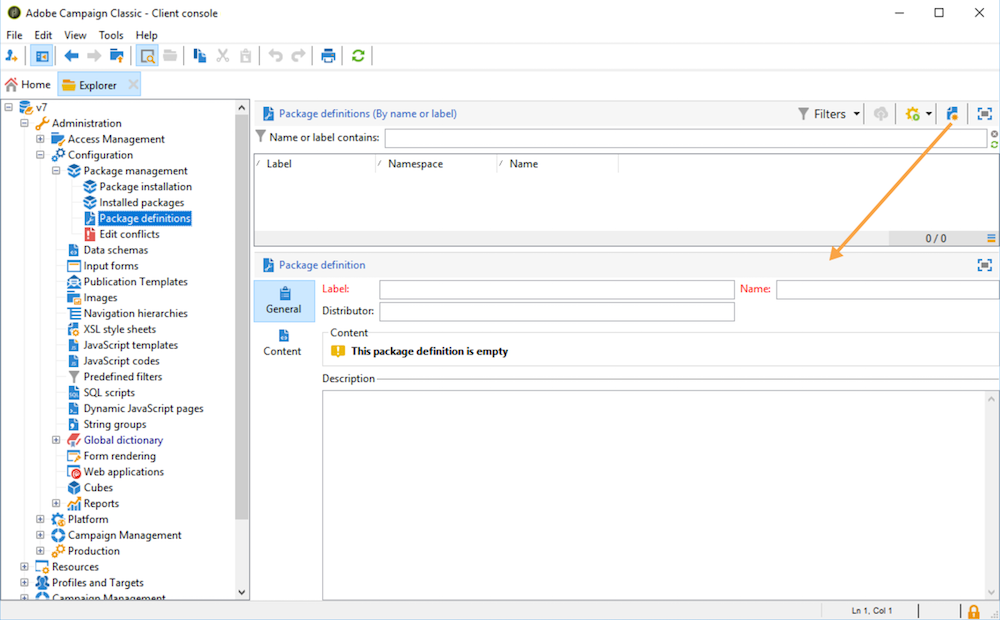

# Werken met gegevenspakketten{#data-packages}

## Aan de slag met pakketten {#gs-data-packages}

Met gegevenspakketten kunt u aangepaste instellingen en gegevens van uw platform exporteren en importeren. Een pakket kan verschillende typen configuraties en componenten bevatten, al dan niet gefilterd.

In de gegevenspakketten van de Campagne, worden de entiteiten van het gegevensbestand van Adobe Campaign getoond in de dossiers van XML. In een pakket wordt elke entiteit vertegenwoordigd met al haar gegevens.

Het beginsel van **gegevenspakketten** moet een gegevensconfiguratie uitvoeren en het in een ander milieu van Adobe Campaign integreren. Leer hoe te om een verenigbare reeks gegevenspakketten in deze [&#x200B; sectie &#x200B;](#data-package-best-practices) te handhaven.

### Typen pakketten {#types-of-packages}

U kunt in Adobe Campaign met drie typen pakketten werken: gebruikerspakketten, platformpakketten en beheerpakketten.

* A **gebruikerspakket** laat u de lijst van uit te voeren entiteiten selecteren. Dit type pakket beheert afhankelijkheden en controleert fouten.
* A **platformpakket** omvat alle toegevoegde technische middelen (niet standaard): schema&#39;s, de code van JavaScript, enz.
* Een **admin pakket** omvat alle toegevoegde malplaatjes en bedrijfsvoorwerpen (niet standaard): malplaatjes, bibliotheken, enz.

>[!CAUTION]
>
>Het **platform** en **admin** pakketten bevatten een vooraf bepaalde lijst van te uitvoeren entiteiten. Elke entiteit is verbonden met het filtreren voorwaarden die u toelaten om de uit-van-de-doosmiddelen van het gecreeerde pakket te verwijderen.

## Gegevensstructuur {#data-structure}

De beschrijving van een gegevenspakket is een gestructureerd document van XML dat met de grammatica van **xrk voldoet:navtree** gegevensschema, zoals in het hieronder voorbeeld:

```xml
<package>
  <entities schema="nms:recipient">
    <recipient email="john.smith@adobe.com" lastName="Smith" firstName="John">      
      <folder _operation="none" name="nmsRootFolder"/>      
      <company _operation="none" name="Adobe"/>
    </recipient>
  </entities>
  <entities schema="sfa:company">
    <company name="Adobe">
      <location city="London" zipCode="W11 2BQ"/>
    </company>
  </entities>
</package>
```

Het XML-document moet beginnen en eindigen met het element `<package>` . Alle `<entities>` -elementen die volgen, verdelen de gegevens op documenttype. Een `<entities>` element bevat de gegevens van het pakket in het formaat van het gegevensschema ingegaan in het **schema** attribuut. De gegevens in een pakket moeten geen interne sleutels bevatten die niet compatibel tussen bases, zoals auto-geproduceerde sleutels (**automatische 1&rbrace; optie) zijn.**

In ons voorbeeld zijn de verbindingen op de koppelingen `folder` en `company` vervangen door zogenaamde toetsen op hoog niveau in de doeltabellen:

```xml
<recipient>
  <folder _operation="none" name="nmsRootFolder"/>
  <company _operation="none" name="Adobe"/>
</recipient>
```

Het kenmerk `operation` met de waarde `none` definieert een koppelingskoppeling.

Een gegevenspakket kan manueel van om het even welke tekstredacteur worden gebouwd. U moet ervoor zorgen dat de structuur van het XML-document voldoet aan het `xtk:navtree` -gegevensschema. De clientconsole heeft een export- en importmodule voor gegevenspakketten.

## Pakketten exporteren {#export-packages}

U kunt pakketten op drie verschillende manieren exporteren:

* Gebruik de **[!UICONTROL Package Export]** -assistent om een set objecten in één pakket te exporteren. [Meer informatie](#export-a-set-of-objects-in-a-package)
* Om a **enig voorwerp** uit te voeren, klik op het met de rechtermuisknop aan en selecteer **[!UICONTROL Actions > Export in a package]**.
* Gebruik de **definities van het Pakket** om een pakketstructuur tot stand te brengen waarin u voorwerpen toevoegt die later op in een pakket moeten worden uitgevoerd. [Meer informatie](#manage-package-definitions)

Nadat een pakket is geëxporteerd, kunt u het pakket en alle toegevoegde entiteiten importeren in een andere Campagne-instantie.

### Een set objecten in een pakket exporteren {#export-a-set-of-objects-in-a-package}

Ga als volgt te werk om een set objecten in een gegevenspakket te exporteren:

1. Blader naar de exportassistent voor pakketten via het **[!UICONTROL Tools > Advanced > Export package...]** -menu van de verkenner.
1. Selecteer de [&#x200B; types van pakketten &#x200B;](#types-of-packages).

   

1. Klik **toevoegen** knoop om de entiteiten te selecteren om als pakket uit te voeren.

   >[!CAUTION]
   >
   >Als u een **[!UICONTROL Offer category]**, **[!UICONTROL Offer environment]**, **[!UICONTROL Program]** of **[!UICONTROL Plan]** typemap uitvoert, selecteer nooit **xtk:omslag** aangezien u sommige gegevens kunt verliezen. Selecteer de entiteit die met de omslag beantwoordt: **nms:offerCategory** voor aanbiedingscategorieën, **nms:offerEnv** voor aanbiedingsmilieu&#39;s, **nms:programma** voor programma&#39;s, en **nms:plan** voor plannen.

   Het afhankelijkheidsmechanisme bestuurt de uitvoersequentie van de entiteit. Voor meer op dit, verwijs naar [&#x200B; het Leiden gebiedsdelen &#x200B;](#manage-dependencies).

1. Klik op **[!UICONTROL Next]** en definieer de filterquery voor het type document dat u wilt extraheren. U moet de het filtreren clausule voor gegevensextractie vormen.

   >[!NOTE]
   >
   >De vraagredacteur wordt voorgesteld in [&#x200B; deze sectie &#x200B;](../../automation/workflow/query.md).

1. Klik op **[!UICONTROL Next]** en selecteer de sorteervolgorde van de geëxporteerde gegevens.

1. Bekijk een voorvertoning van de gegevens die u wilt extraheren om uw configuratie te controleren.

1. Op de laatste pagina van de exportassistent voor pakketten kunt u het exporteren starten. De gegevens worden opgeslagen in het bestand dat wordt aangegeven in het veld **[!UICONTROL File]** .

### Afhankelijkheden beheren {#manage-dependencies}

Tijdens het exportproces worden de koppelingen tussen de verschillende geëxporteerde elementen bijgehouden. Dit mechanisme wordt gedefinieerd door twee regels:

* objecten die zijn gekoppeld aan een koppeling met een `own` - of `owncopy` -tekstintegriteit, worden geëxporteerd in hetzelfde pakket als het geëxporteerde object.
* objecten die zijn gekoppeld aan een koppeling met een `neutral` - of `define` -tekstintegriteit (gedefinieerde koppeling), moeten afzonderlijk worden geëxporteerd.

>[!NOTE]
>
>De types van integriteit verbonden aan schemaelementen worden bepaald in [&#x200B; deze pagina &#x200B;](database-links.md).

#### Een campagne exporteren {#export-a-campaign}

Hieronder ziet u hoe u een campagne kunt exporteren. De uit te voeren marketingcampagne bevat:
* a `MyTask` taak
* a `campaignWorkflow` in de volgende map: **[!UICONTROL Administration > Production > Technical workflows > Campaign processes > MyWorkflow]** .

De taak en de workflow worden geëxporteerd in hetzelfde pakket als de campagne, aangezien de overeenkomende schema&#39;s zijn verbonden door koppelingen naar een `own` type-integriteit.

De inhoud van het pakket is:

```xml
<?xml version='1.0'?>
<package author="Administrator (admin)" buildNumber="7974" buildVersion="7.1" img=""
label="" name="" namespace="" vendor="">
 <desc></desc>
 <version buildDate="2013-01-09 10:30:18.954Z"/>
 <entities schema="nms:operation">
  <operation duration="432000" end="2013-01-14" internalName="OP1" label="MyCampaign"
  modelName="opEmpty" start="2013-01-09">
   <controlGroup>
    <where filteringSchema=""/>
   </controlGroup>
   <seedList>
    <where filteringSchema="nms:seedMember"></where>
    <seedMember internalName="SDM1"></seedMember>
   </seedList>
   <parameter useAsset="1" useBudget="1" useControlGroup="1" useDeliveryOutline="1"
   useDocument="1" useFCPValidation="0" useSeedMember="1" useTask="1"
   useValidation="1" useWorkflow="1"></parameter>
   <fcpSeed>
    <where filteringSchema="nms:seedMember"></where>
   </fcpSeed>
   <owner _operation="none" name="admin" type="0"/>
   <program _operation="none" name="nmsOperations"/>
   <task end="2013-01-17 10:07:51.000Z" label="MyTask" name="TSK2" start="2013-01-16 10:07:51.000Z"
   status="1">
    <owner _operation="none" name="admin" type="0"/>
    <operation _operation="none" internalName="OP1"/>
    <folder _operation="none" name="nmsTask"/>
   </task>
   <workflow internalName="WKF12" label="CampaignWorkflow" modelName="newOpEmpty"
   order="8982" scenario-cs="Notification of the workflow supervisor (notifySupervisor)"
   schema="nms:recipient">
    <scenario internalName="notifySupervisor"/>
    <desc></desc>
    <folder _operation="none" name="Folder4"/>
    <operation _operation="none" internalName="OP1"/>
   </workflow>
  </operation>
 </entities>
</package>   
```

De verbinding met een type pakket wordt gedefinieerd in een schema met het kenmerk `@pkgAdmin and @pkgPlatform` . Beide eigenschappen ontvangen een XTK-expressie die de voorwaarden voor aansluiting bij het pakket definieert.

```xml
<element name="offerEnv" img="nms:offerEnv.png" 
template="xtk:folder" pkgAdmin="@id != 0">
```

Ten slotte kunt u met het kenmerk `@pkgStatus` de exportregels voor deze elementen of kenmerken definiëren. Afhankelijk van de waarde van het kenmerk, wordt het element of kenmerk gevonden in het geëxporteerde pakket. De drie mogelijke waarden voor dit kenmerk zijn:

* `never`: exporteert het veld/de koppeling niet
* `always`: forceert export voor dit veld
* `preCreate`: staat het maken van de gekoppelde entiteit toe

>[!NOTE]
>
>De waarde `preCreate` wordt alleen geaccepteerd voor koppelingstypegebeurtenissen. Hiermee kunt u een entiteit maken of ernaar verwijzen die nog niet in het geëxporteerde pakket is geladen.

## Pakketdefinities beheren {#manage-package-definitions}

Met pakketdefinities kunt u een pakketstructuur maken waarin u entiteiten toevoegt die later in één pakket worden geëxporteerd. Vervolgens kunt u dit pakket en alle toegevoegde entiteiten importeren in een andere Campagne-instantie.

### Een pakketdefinitie maken {#create-a-package-definition}

Pakketdefinities zijn toegankelijk via het menu **[!UICONTROL Administration > Configuration > Package management > Package definitions]** .

Als u een pakketdefinitie wilt maken, klikt u op de knop **[!UICONTROL New]** en vult u vervolgens de algemene informatie over de pakketdefinitie in.



Vervolgens kunt u entiteiten toevoegen aan de pakketdefinitie en deze exporteren naar een XML-bestandspakket.

**Verwante onderwerpen:**

* [Entiteiten toevoegen aan een pakketdefinitie](#add-entities-to-a-package-definition)
* [Genereren van pakketdefinities configureren](#configure-package-definitions-generation)
* [Pakketten uit een pakketdefinitie exporteren](#export-packages-from-a-package-definition)

### Entiteiten toevoegen aan een pakketdefinitie {#add-entities-to-a-package-definition}

Klik in het tabblad **[!UICONTROL Content]** op de knop **[!UICONTROL Add]** om de entiteiten te selecteren die u met het pakket wilt exporteren. De beste praktijken wanneer het selecteren van entiteiten worden voorgesteld in [&#x200B; deze sectie &#x200B;](#export-a-set-of-objects-in-a-package).


Entiteiten kunnen rechtstreeks vanaf hun locatie in de instantie aan een pakketdefinitie worden toegevoegd. Hiervoor voert u de volgende stappen uit:

1. Klik met de rechtermuisknop op de gewenste entiteit en selecteer vervolgens **[!UICONTROL Actions > Export in a package]** .

1. Selecteer **[!UICONTROL Add to a package definition]** en selecteer vervolgens de pakketdefinitie waaraan u de entiteit wilt toevoegen.

1. De entiteit wordt toegevoegd aan de pakketdefinitie, zal het met het pakket (zie [&#x200B; worden uitgevoerd deze sectie &#x200B;](#export-packages-from-a-package-definition)).

### Genereren van pakketdefinities configureren {#configure-package-definitions-generation}

Pakketgeneratie kan worden geconfigureerd via het tabblad pakketdefinitie **[!UICONTROL Content]** . Klik hiertoe op de koppeling **[!UICONTROL Generation parameters]** .


* Gebruik de optie **[!UICONTROL Include the definition]** om de definitie op te nemen die momenteel wordt gebruikt in de pakketdefinitie.
* Gebruik de optie **[!UICONTROL Include an installation script]** om een JavaScript-script toe te voegen dat moet worden uitgevoerd bij het importeren van het pakket. Als deze optie is geselecteerd, wordt een tab **[!UICONTROL Script]** toegevoegd aan het scherm met pakketdefinities.
* Met de optie **[!UICONTROL Include default values]** kunt u de waarden van alle kenmerken van de entiteiten toevoegen aan het pakket.

  Deze optie is niet standaard geselecteerd om lange exportbewerkingen te voorkomen. Dit betekent dat kenmerken van entiteiten met standaardwaarden (&#39;lege tekenreeks&#39;, &#39;0&#39; en &#39;onwaar&#39; als deze niet anders in het schema zijn gedefinieerd) standaard niet aan het pakket worden toegevoegd en daarom niet worden geëxporteerd.

  >[!CAUTION]
  >
  >Als de instantie waarin het pakket wordt geïmporteerd, entiteiten bevat die identiek zijn aan die van het pakket (bijvoorbeeld met dezelfde externe id), worden de kenmerken ervan niet bijgewerkt. Dit kan gebeuren als de kenmerken van de eerste instantie standaardwaarden hebben, omdat ze niet in het pakket zijn opgenomen. In dat geval voorkomt u dat versies worden samengevoegd door de optie **[!UICONTROL Include default values]** te selecteren, aangezien alle kenmerken van de eerste instantie samen met het pakket worden geëxporteerd.

### Pakketten uit een pakketdefinitie exporteren {#export-packages-from-a-package-definition}

Voer de volgende stappen uit om een pakket uit een pakketdefinitie te exporteren:

1. Selecteer de te exporteren pakketdefinitie, klik op de knop **[!UICONTROL Actions]** en selecteer **[!UICONTROL Export the package]** .
1. Controleer de naam en locatie van het geëxporteerde bestand.
1. Klik op de knop **[!UICONTROL Start]** om het exporteren te starten.

## Pakketten importeren {#import-packages}

De importassistent voor pakketten is toegankelijk via het hoofdmenu **[!UICONTROL Tools > Advanced > Import package]** van de clientconsole.

### Een pakket uit een bestand installeren {#install-a-package-from-a-file}

Voer de volgende stappen uit om een bestaand gegevenspakket te importeren:

1. Toegang tot de importassistent via het hoofdmenu **[!UICONTROL Tools > Advanced > Import package]** van de clientconsole.
1. Selecteer het XML-bestand en klik op **[!UICONTROL Open]** .

De inhoud van het te importeren pakket wordt vervolgens in het middelste gedeelte van de editor weergegeven.

Klik op **[!UICONTROL Next]** en **[!UICONTROL Start]** om het importeren te starten.

### Een ingebouwd pakket installeren {#install-a-standard-package}

Ingebouwde pakketten (ook bekend als (standaardpakketten) worden geïnstalleerd wanneer de Adobe Campaign wordt geconfigureerd. Afhankelijk van uw machtigingen, uw implementatiemodel en uw productaanbod kunt u nieuwe standaardpakketten importeren.

Raadpleeg de licentieovereenkomst om te controleren welke pakketten u kunt installeren.

## Aanbevolen werkwijzen voor gegevenspakketten {#data-package-best-practices}

In deze sectie wordt beschreven hoe u gegevenspakketten op consistente wijze kunt ordenen gedurende de levensduur van het project.


### Versies

U moet altijd importeren binnen dezelfde versie van het platform. U moet controleren dat u uw pakketten tussen twee instanties opstelt die de zelfde bouwstijl hebben. Dwing nooit de import en werk altijd eerst het platform bij (als de build anders is).

>[!IMPORTANT]
>
>Het importeren tussen verschillende versies wordt niet ondersteund door Adobe.

Let op het schema en de databasestructuur. Het invoeren van een pakket met schema moet door schemageneratie worden gevolgd.

### Pakkettypen {#package-types}

Begin door verschillende typen pakketten te definiëren. Er worden slechts vier typen gebruikt:

**Entiteiten**

* Alle &quot;xtk&quot;- en &quot;nms&quot;-specifieke elementen in Adobe Campaign, zoals schema&#39;s, formulieren, mappen, leveringssjablonen, enz.
* U kunt een entiteit beschouwen als zowel een element &quot;admin&quot; als een element &quot;platform&quot;.
* U mag niet meer dan één entiteit in een pakket opnemen wanneer u het pakket uploadt naar een Campagne-instantie.

Als u uw configuratie op een nieuw geval moet opstellen, kunt u al uw entiteitpakketten invoeren.

**Eigenschappen**

Dit type pakket:
* Beantwoord een cliëntvereiste/specificatie.
* Bevat een of meer functies.
* Alle afhankelijkheden moeten worden opgenomen om de functionaliteit zonder enig ander pakket te kunnen uitvoeren.

**Campagnes**

Dit pakket is niet verplicht. Het is soms nuttig om een specifiek type voor alle campagnes te creëren, zelfs als een campagne als eigenschap kan worden gezien.

**Updates**

Zodra gevormd, kan een eigenschap in een ander milieu worden uitgevoerd. Het pakket kan bijvoorbeeld worden geëxporteerd van een ontwikkelomgeving naar een testomgeving. Bij deze test wordt een defect aan het licht gebracht. In de eerste plaats moet het worden aangepast aan de ontwikkelomgeving. Vervolgens moet de pleister op het testplatform worden aangebracht.

De eerste oplossing zou zijn om de hele functie opnieuw te exporteren. Maar om elk risico te vermijden (het bijwerken van ongewenste elementen) is het veiliger om een pakket te hebben dat alleen de correctie bevat.

Daarom raden we u aan een updatepakket te maken dat slechts één entiteitstype van de functie bevat.

Een update kan niet alleen een oplossing zijn, maar ook een nieuw element van uw entiteit/functie/campagnemakket. Als u wilt voorkomen dat het hele pakket wordt geïmplementeerd, kunt u een updatepakket exporteren.

### Naamconventies {#data-package-naming}

Nu er typen zijn gedefinieerd, moeten we een naamgevingsconventie opgeven. Adobe Campaign staat het niet toe om subfolders voor pakketspecificaties tot stand te brengen, betekenend dat de aantallen de beste oplossing voor het blijven georganiseerd zijn. Nummervoorvoegselpakketnamen.

U kunt bijvoorbeeld de volgende conventie gebruiken:

* Entiteit: van 1 tot 99
* Te gedenken gebeurtenis: van 100 tot 199
* Campagne: van 200 tot 299
* Bijwerken: van 5000 tot 5999

#### Volgorde van pakketten voor entiteiten {#entity-packages-order}

Om de invoer te helpen, zouden de entiteitpakketten door bevolen moeten worden aangezien zij zouden moeten worden ingevoerd.

Bijvoorbeeld:

* 001 - Schema
* 002 - Formulier
* 003 - Afbeeldingen
* enz.

>[!NOTE]
>
>Forms zou slechts **na** schemaupdates moeten worden ingevoerd.


#### Pakketdocumentatie {#package-documentation}

Wanneer u een pakket bijwerkt, moet u altijd een opmerking in het beschrijvingsveld plaatsen om eventuele wijzigingen en redenen (bijvoorbeeld &quot;voeg een nieuw schema toe&quot; of &quot;repareer een fout&quot;) nader toe te lichten.

U kunt het beste ook de datum van de update invoeren.

>[!IMPORTANT]
>
>Het beschrijvingsveld mag maximaal 2.000 tekens bevatten.
