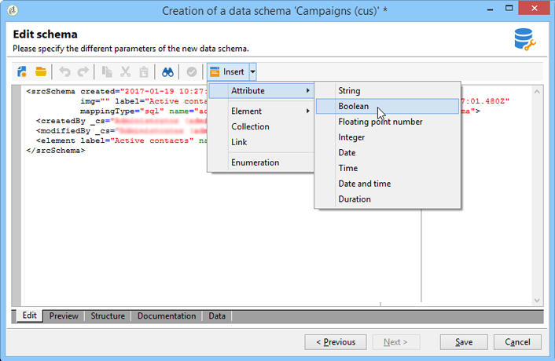

# Werken met schema&#39;s{#gs-ac-schemas}

De fysieke en logische structuur van de data die in de applicatie worden overgedragen, wordt in XML beschreven. Het volgt een grammatica specifiek voor Adobe Campaign, genoemd a **schema**.

Een schema is een XML-document dat is gekoppeld aan een databasetabel. De code definieert de gegevensstructuur en beschrijft de SQL-definitie van de tabel:

* De naam van de tabel
* Velden
* Koppelingen met andere tabellen

Hierin wordt ook de XML-structuur beschreven die wordt gebruikt om gegevens op te slaan:

* Elementen en kenmerken
* Hiërarchie van elementen
* Element- en kenmerktypen
* Standaardwaarden
* Labels, beschrijvingen en andere eigenschappen.

Met schema&#39;s kunt u een entiteit in de database definiëren. Er is een schema voor elke entiteit.

Adobe Campaign past gegevensschema&#39;s toe op:

* Bepaal hoe het gegevensobject in de toepassing aan onderliggende databasetabellen is gekoppeld.
* Definiëren van koppelingen tussen de verschillende dataobjecten in de Campaign-applicatie.
* Definiëren en beschrijven van de afzonderlijke velden die in elk object zijn opgenomen.

Voor een beter inzicht in de ingebouwde lijsten van de Campagne en hun interactie, verwijs naar [&#x200B; deze sectie &#x200B;](datamodel.md).

>[!CAUTION]
>
>Sommige ingebouwde schema&#39;s van de Campagne hebben een bijbehorend schema op het gegevensbestand van de Wolk. Deze schema&#39;s worden geïdentificeerd door **Xxl** namespace en moeten niet worden gewijzigd of worden uitgebreid.

## Syntaxis van schema&#39;s {#syntax-of-schemas}

Het hoofdelement van het schema is **`<srcschema>`** . Het bevat de subelementen **`<element>`** en **`<attribute>`** .

Het eerste subelement **`<element>`** valt samen met de hoofdmap van de entiteit.

```
<srcSchema name="recipient" namespace="cus">
  <element name="recipient">  
    <attribute name="lastName"/>
    <attribute name="email"/>
    <element name="location">
      <attribute name="city"/>
   </element>
  </element>
</srcSchema>
```

>[!NOTE]
>
>Het hoofdelement van de entiteit heeft dezelfde naam als het schema.


Met de tags **`<element>`** worden de namen van entiteitelementen gedefinieerd. **`<attribute>`** -tags van het schema definiëren de namen van de kenmerken in de **`<element>`** -tags waaraan ze zijn gekoppeld.

## Identificatie van een schema {#identification-of-a-schema}

Een gegevensschema wordt geïdentificeerd door zijn naam en zijn namespace.

Met een naamruimte kunt u een set schema&#39;s groeperen op interessegebied. Bijvoorbeeld, wordt **focus** namespace gebruikt voor klant-specifieke configuratie (**klanten**).

>[!CAUTION]
>
>Standaard moet de naam van de naamruimte beknopt zijn en alleen toegestane tekens bevatten, in overeenstemming met XML-naamgevingsregels.
>
>Id&#39;s mogen niet beginnen met numerieke tekens.

## Gereserveerde naamruimten {#reserved-namespaces}

Bepaalde naamruimten zijn gereserveerd voor beschrijvingen van de systeementiteiten die vereist zijn voor de werking van de Adobe Campaign-toepassing. De volgende namespace **moet niet worden gebruikt** om een nieuw schema, in om het even welke hogere/lagere casecombinatie te identificeren:

* **xxl**: gereserveerd aan de gegevensbestandschema&#39;s van de Wolk
* **xtk**: gereserveerd aan gegevens van het platformsysteem
* **nl**: gereserveerd aan het algemene gebruik van de toepassing
* **nms**: gereserveerd aan leveringen (ontvanger, levering, het volgen, enz.)
* **ncm**: gereserveerd aan inhoudsbeheer
* **temp**: gereserveerd aan tijdelijke schema&#39;s
* **crm**: gereserveerd aan de schakelaars van CRM integratie

De identificatiesleutel van een schema is een koord dat wordt gebouwd gebruikend namespace en de naam die door een dubbelpunt wordt gescheiden; bijvoorbeeld: **nms:recipient**.

## Campagne-schema&#39;s maken of uitbreiden {#create-or-extend-schemas}

Om een gebied of ander element aan één van de schema&#39;s van kerngegevens in Campagne, zoals de ontvankelijke lijst (nms :recipient) toe te voegen, moet u dat schema uitbreiden.

Voor meer op dit, verwijs naar [&#x200B; een schema &#x200B;](extend-schema.md) uitbreiden.

Als u een geheel nieuw type gegevens wilt toevoegen dat niet bestaat in Adobe Campaign (bijvoorbeeld een contracttabel), kunt u rechtstreeks een aangepast schema maken.

Voor meer op dit, verwijs naar [&#x200B; creeer een nieuw schema &#x200B;](create-schema.md).


Nadat u een schema hebt gemaakt of uitgebreid om in te werken, kunt u het beste de XML-inhoudselementen definiëren in dezelfde volgorde als hieronder.

## Opsommingen {#enumerations}

Opsommingen worden eerst gedefinieerd, vóór het hoofdelement van het schema. Hiermee kunt u waarden in een lijst weergeven om de keuzes te beperken die de gebruiker voor een bepaald veld heeft.

Voorbeeld:

```xml
<enumeration basetype="byte" name="exTransactionTypeEnum" default="store">
<value label="Website" name="web" value="0"/>
<value label="Call Center" name="phone" value="1"/>
<value label="In Store" name="store" value="2"/>
</enumeration>
```

Wanneer u velden definieert, kunt u deze opsomming als volgt gebruiken:

```xml
<attribute desc="Type of Transaction" label="Transaction Type" name="transactionType" 
type="string" enum="exTransactionTypeEnum"/>
```

>[!NOTE]
>
>U kunt door de gebruiker beheerde opsommingen ook gebruiken (meestal onder **[!UICONTROL Administration]** > **[!UICONTROL Platform]** ) om de waarden voor een bepaald veld op te geven. Dit zijn in feite globale opsommingen, en een betere keus als uw opsomming buiten het specifieke schema kan worden gebruikt u binnen werkt.

<!--
## Index {#index} 

In the context of a [FDA Snowflake deployment](../architecture/fda-deployment.md), you need to declare indexes. Indexes are the first elements declared in the main element of the schema. 

They can be unique or not, and reference one or more fields.

Examples:

```
<dbindex name="email" unique="true">
  <keyfield xpath="@email"/>
</dbindex>
```

```
<dbindex name="lastNameAndZip">
  <keyfield xpath="@lastName"/>
  <keyfield xpath="location/@zipCode"/>
</dbindex>
```

The **xpath** attribute points to the field in your schema that you wish to index.

>[!IMPORTANT]
>
>It is important to remember that the SQL query read performance gains provided by indexes also come with a performance hit on writing records. The indexes should therefore be used with precaution.

For more on indexes, refer to the [Indexed fields](database-mapping.md#indexed-fields) section.

-->

## Toetsen {#keys}

Elke lijst moet minstens één sleutel hebben, en vaak wordt het automatisch gevestigd in het belangrijkste element van het schema door de **sectie** attributen te gebruiken die aan **waar** worden geplaatst.

Bovendien in de context van een [&#x200B; plaatsing van de Onderneming (FFDA) &#x200B;](../architecture/enterprise-deployment.md), gebruik **@autouuid** en plaats het aan **waar**.

De primaire sleutel kan ook worden bepaald gebruikend het **interne** attribuut.

Voorbeeld:

```xml
<key name="householdId" internal="true">
  <keyfield xpath="@householdId"/>
</key>
```

In dit voorbeeld, in plaats van het laten **@autopk** of **@autouuid** attributen een standaard primaire sleutel tot stand brengen genoemd &quot;id&quot;wij specificeren onze eigen &quot;huishoudenId&quot;primaire sleutel.

>[!CAUTION]
>
>Wanneer het creëren van een nieuw schema of tijdens een schemauitbreiding, moet u de zelfde primaire zeer belangrijke opeenvolgingswaarde (@pkSequence) voor het volledige schema houden.

Leer meer over sleutels in [&#x200B; deze sectie &#x200B;](database-mapping.md#management-of-keys).

## Attributen (velden) {#attributes--fields-}

Met kenmerken kunt u de velden definiëren waaruit het gegevensobject bestaat. U kunt de **[!UICONTROL Insert]** knoop in de toolbar van de schemageditie gebruiken om lege attributenmalplaatjes in uw XML te laten vallen waar uw curseur is. Lees meer in [deze sectie](create-schema.md).



De volledige lijst van attributen is beschikbaar in de `<attribute>` elementensectie in [&#x200B; Campaign Classic v7 documentatie &#x200B;](https://experienceleague.adobe.com/docs/campaign-classic/using/configuring-campaign-classic/schema-reference/elements-attributes/attribute.html?lang=nl-NL#content-model){target="_blank"}. Hier volgen een aantal veelgebruikte kenmerken: **@advanced**, **@dataPolicy**, **@default**, **@desc**, **@enum**, **@expr**, **@label**, **@length**, 16&rbrace;@name **,**@notNull **,**@required **,**@ref **,**@xml **,**@type **.**

Voor meer informatie over elk attribuut, verwijs naar de beschrijving van Attributen in [&#x200B; de documentatie van Campaign Classic v7 &#x200B;](https://experienceleague.adobe.com/docs/campaign-classic/using/configuring-campaign-classic/schema-reference/elements-attributes/schema-introduction.html?lang=nl-NL#configuring-campaign-classic){target="_blank"}.

### Voorbeelden {#examples}

Voorbeeld van het definiëren van een standaardwaarde:

```xml
<attribute name="transactionDate" label="Transaction Date" type="datetime" default="GetDate()"/>
```

Voorbeeld van het gebruik van een gemeenschappelijk kenmerk als een sjabloon voor een veld dat ook als verplicht is gemarkeerd:

```xml
<attribute name="mobile" label="Mobile" template="nms:common:phone" required="true" />
```

Voorbeeld van een berekend veld dat verborgen is met het attribuut **@advanced** :

```xml
<attribute name="domain" label="Email domain" desc="Domain of recipient email address" expr="GetEmailDomain([@email])" advanced="true" />
```

Voorbeeld van een gebied van XML dat ook op een SQL gebied wordt opgeslagen en **@dataPolicy** attributen heeft.

```xml
<attribute name="secondaryEmail" label="Secondary email address" length="100" xml="true" sql="true" dataPolicy="email" />
```

>[!CAUTION]
>
>Hoewel de meeste kenmerken volgens een 1-1-cardinaliteit aan een fysiek veld van de database zijn gekoppeld, is dit niet het geval voor de XML-velden of de berekende velden.\
>Een XML-veld wordt opgeslagen in een memoveld (&quot;mData&quot;) van de tabel.\
>Een gegevens verwerkt gebied nochtans wordt gecreeerd dynamisch telkens als een vraag wordt begonnen, bestaat het daarom slechts in de toepassingslaag.

## Koppelingen {#links}

De verbindingen zijn enkele laatste elementen in het belangrijkste element van uw schema. Ze definiëren hoe alle verschillende schema&#39;s in uw instantie op elkaar betrekking hebben.

De verbindingen worden verklaard in het schema dat de **buitenlandse sleutel** van de lijst bevat waaraan het wordt verbonden.

Er zijn drie soorten kardinaliteit: 1-1, 1-N, en N-N. Het is het type 1-N dat door gebrek wordt gebruikt.

### Voorbeelden {#examples-1}

Een voorbeeld van een verbinding 1-N tussen de ontvankelijke lijst (out-of-the-box schema) en een lijst van douanetransacties:

```xml
<element label="Recipient" name="lnkRecipient" revLink="lnkTransactions" target="nms:recipient" type="link"/>
```

Een voorbeeld van een 1-1 verbinding tussen een douaneschema &quot;Auto&quot;(in &quot;cus&quot;namespace) en de ontvankelijke lijst:

```xml
<element label="Car" name="lnkCar" revCardinality="single" revLink="recipient" target="cus:car" type="link"/>
```

Voorbeeld van een externe verbinding tussen de ontvankelijke lijst en een lijst van adressen die op het e-mailadres en niet een primaire sleutel wordt gebaseerd:

```xml
<element name="emailInfo" label="Email Info" revLink="recipient" target="nms:address" type="link" externalJoin="true">
  <join xpath-dst="@address" xpath-src="@email"/>
</element>
```

Hier komt &#39;xpath-dst&#39; overeen met de primaire sleutel in het doelschema en &#39;xpath-src&#39; komt overeen met de externe sleutel in het bronschema.

## Audit trail {#audit-trail}

Eén handig element dat u onder aan het schema wilt opnemen, is een trackingelement (audittrail).

In het onderstaande voorbeeld kunt u velden opnemen die betrekking hebben op de aanmaakdatum, de gebruiker die de gegevens heeft gemaakt, de datum en de auteur van de laatste wijziging voor alle gegevens in de tabel:

```xml
<element aggregate="xtk:common:auditTrail" name="auditTrail"/>
```

## De databasestructuur bijwerken {#updating-the-database-structure}

Nadat de wijzigingen zijn voltooid en opgeslagen, moeten alle wijzigingen die van invloed kunnen zijn op de SQL-structuur worden toegepast op de database. Om dit te doen, gebruik de medewerker van de gegevensbestandupdate.


Raadpleeg [deze sectie](update-database-structure.md) voor meer informatie.

>[!NOTE]
>
>Wanneer de wijzigingen niet de gegevensbestandstructuur beïnvloeden, moet u enkel schema&#39;s regenereren. Selecteer hiertoe de schema&#39;s die u wilt bijwerken, klik met de rechtermuisknop en kies **[!UICONTROL Actions > Regenerate selected schemas...]** .
