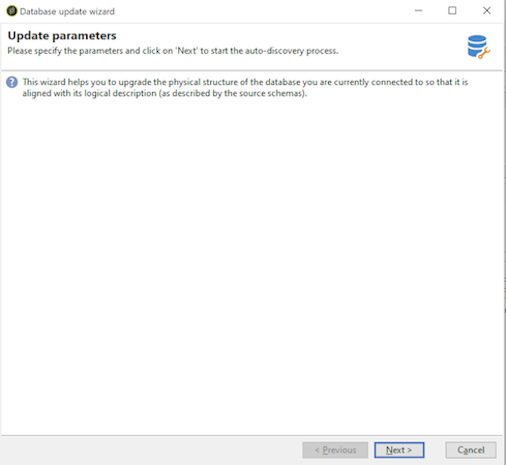

# De databasestructuur bijwerken{#updating-the-database-structure}

Om de wijzigingen toe te passen die aan de schema&#39;s worden aangebracht, lanceer de de updatetovenaar van het Gegevensbestand. Deze assistent is toegankelijk via **[!UICONTROL Tools > Advanced > Update database structure]** . Het controleert of de fysieke structuur van het gegevensbestand zijn logische beschrijving aanpast en de SQL updatescripts uitvoert.

De modules in het gegevensbestand worden automatisch bevolkt en geactiveerd.

Voer de stappen uit en bekijk het SQL-script voor de update van de database:

>[!NOTE]
>
>Dit bevindt zich in een bewerkingsveld en kan worden gewijzigd om SQL-code te verwijderen of toe te voegen.

Start vervolgens de database-update:

