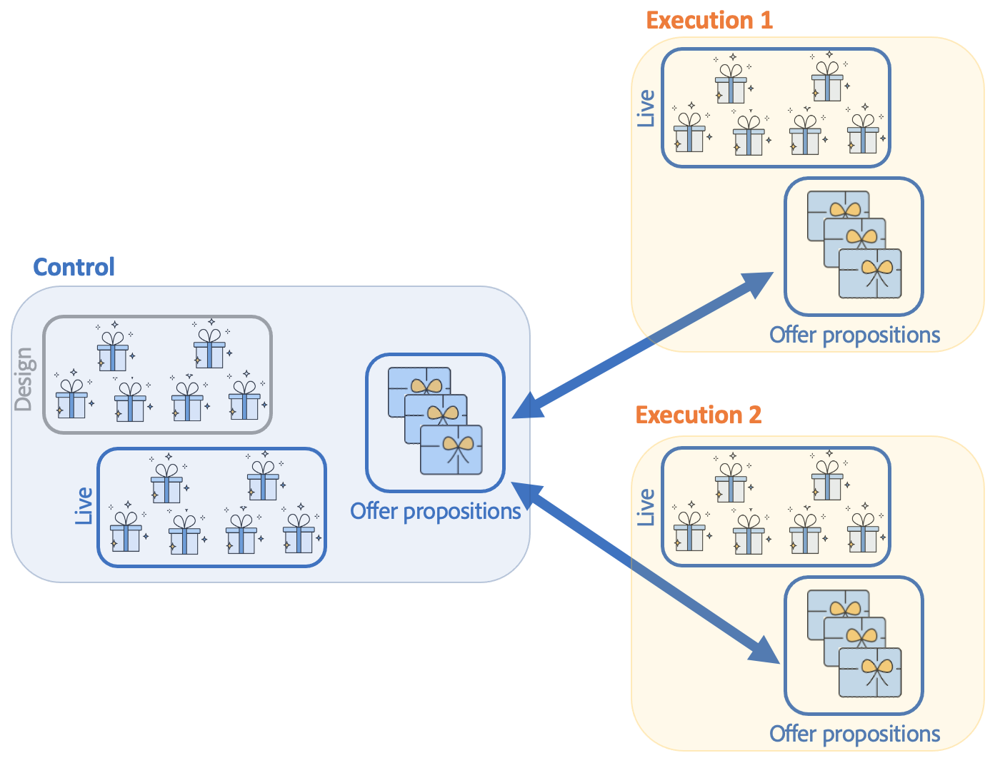

# Werken met omgevingen en architectuur voor interactie met campagnes

## Omgevingen {#environments}

Er zijn twee milieu&#39;s voor elke het richten dimensie die wordt gebruikt wanneer het beheren van aanbiedingen:

* A **ontwerp** omgeving waarin de aanbiedingsmanager zorgt voor het maken en categoriseren van aanbiedingen, het bewerken ervan en het starten van het goedkeuringsproces zodat deze kunnen worden gebruikt. De regels voor elke categorie, de aanbiedingsruimten waarop aanbiedingen kunnen worden ingediend, en de vooraf gedefinieerde filters die worden gebruikt om te bepalen of een aanbieding in aanmerking komt, worden ook in deze omgeving gedefinieerd.

   Categorieën kunnen ook handmatig worden gepubliceerd in de online omgeving.

   De procedure voor het goedkeuren van aanbiedingen is gedetailleerd [in deze sectie](interaction-offer.md#approve-offers).

* A **leven** de omgeving waarin goedgekeurde aanbiedingen van de ontwerpomgeving en de verschillende aanbiedingsruimten, filters, categorieën en regels die in de ontwerpomgeving zijn geconfigureerd, kunnen worden gevonden. Tijdens een vraag aan de motor van de Aanbieding, zal de motor altijd aanbiedingen van het levende milieu gebruiken.

Een aanbieding wordt slechts opgesteld op de aanbiedingsruimten die tijdens het goedkeuringsproces worden geselecteerd. Daarom kan een aanbieding levend maar onbruikbaar op een aanbiedingsruimte zijn die ook levend is.

## Binnenkomende en uitgaande interacties {#interaction-types}

In de module Adobe Campaign Interaction worden twee soorten interactie voorgesteld:

* **binnenkomend** interacties, geïnitieerd door een contact. [Meer informatie](interaction-present-offers.md)
* **uitgaand** interacties, geïnitieerd door een manager van de Levering van de Campagne. [Meer informatie](interaction-send-offers.md)

Deze twee soorten interacties kunnen worden uitgevoerd in **unitaire modus** (aanbieding wordt berekend voor één enkel contact) of in **batchmodus** (de aanbieding wordt berekend voor een reeks contacten). Over het algemeen worden binnenkomende interacties uitgevoerd in monitaire modus en uitgaande interacties in batchmodus. Er kunnen echter bepaalde uitzonderingen zijn, namelijk [transactieberichten](../send/transactional.md) bijvoorbeeld, waarbij de uitgaande interactie plaatsvindt in monitaire modus.

Zodra een aanbieding kan of moet worden ingediend (volgens de uitgevoerde configuraties), speelt de motor van de Aanbieding de intermediaire rol: het berekent automatisch de best mogelijke aanbieding voor een contact tussen beschikbare die door ontvangen gegevens over het contact en de verschillende regels te combineren die kunnen worden toegepast zoals gespecificeerd in de toepassing.


## Verdeelde architectuur

Om scalability te kunnen steunen en de dienst 24/7 op het binnenkomende kanaal te verlenen, **Interactie** wordt uitgevoerd in een verdeelde architectuur. Dit type architectuur wordt al gebruikt met [Berichtencentrum](../dev/architecture.md#transac-msg-archi) en bestaat uit verschillende gevallen:

* één of meerdere controleinstanties gewijd aan het uitgaande kanaal en die de marketing en de basis van het milieuontwerp bevatten
* één of meerdere uitvoeringsinstanties specifiek voor het binnenkomende kanaal


Besturingsinstanties worden toegewezen aan het binnenkomende kanaal en bevatten de onlineversie van de catalogus. Elke uitvoeringsinstantie is onafhankelijk en gewijd aan één contactsegment (bijvoorbeeld, één uitvoeringsinstantie per land). De vraag aan de motor van de Aanbieding moet direct op de uitvoering (één specifieke URL per uitvoeringsinstantie) worden uitgevoerd. Aangezien synchronisatie tussen instanties niet automatisch is, moeten de interacties van het zelfde contact door de zelfde instantie worden verzonden.

### Synchronisatie {#synchronization}

De synchronisatie van aanbiedingen wordt uitgevoerd via pakketten. Bij uitvoeringsinstanties krijgen alle catalogusobjecten de naam van de externe account vooraf. Dit betekent dat verschillende besturingsinstanties (bijvoorbeeld ontwikkelings- en productieinstanties) op dezelfde uitvoeringsinstantie kunnen worden ondersteund.

>[!CAUTION]
>
>Gebruik korte en expliciete interne namen.

Aanbiedingen worden automatisch geïmplementeerd en vervolgens gepubliceerd op uitvoerings- en besturingsinstanties.

Aanbiedingen die zijn verwijderd in de ontwerpomgeving, worden in alle online exemplaren uitgeschakeld. De verouderde voorstellen en de aanbiedingen worden automatisch geschrapt op alle instanties na de purge periode (die in de plaatsingsmedewerker van elke instantie wordt gespecificeerd) en het glijden periode (die in de de typologieregels van inkomende voorstellen wordt gespecificeerd).



Er wordt een workflow gemaakt voor elke omgeving en externe account voor propositiesynchronisatie. De synchronisatiefrequentie kan worden aangepast voor elke omgeving en externe account.

U moet op de hoogte zijn van de volgende synchronisatiemechanismen:

* Als u de valfunctie van een anonieme omgeving aan een geïdentificeerd milieu gebruikt, moeten deze twee milieu&#39;s op de zelfde uitvoeringsinstantie zijn.
* De synchronisatie tussen verschillende uitvoeringsinstanties wordt niet in real-time uitgevoerd. Interacties van dezelfde contactpersoon moeten naar dezelfde instantie worden verzonden. De controleinstantie moet aan het uitgaande kanaal (geen echte tijd) worden gewijd.
* De marketingdatabase wordt niet automatisch gesynchroniseerd. De marketinggegevens die in de wegingsregels en de subsidiabiliteitsregels worden gebruikt, moeten bij uitvoeringsgevallen worden gedupliceerd. Dit proces komt niet als standaard, u moet het ontwikkelen tijdens de integratieperiode.
* De synchronisatie van voorstellen wordt uitsluitend uitgevoerd door een FDA-verbinding.
* Als u Interaction en het Centrum van het Bericht op de zelfde instantie gebruikt, zal de synchronisatie via protocol FDA in beide gevallen voorkomen.

### Pakketconfiguratie {#packages-configuration}

Willekeurige schema-extensies die rechtstreeks zijn gekoppeld aan **Interactie** (aanbiedingen, voorstellen, ontvangers, enz.) moeten worden ingezet op de uitvoeringsinstanties.

De **Interactie** het pakket is op alle instanties geïnstalleerd (controle en uitvoering). Er zijn twee extra pakketten beschikbaar: één pakket voor de besturingsinstanties en het andere voor elke uitvoeringsinstantie.

>[!NOTE]
>
>Wanneer u het pakket installeert, **lang** tekstvelden van het dialoogvenster **nms:voorstel** tabel, zoals de propositie-id, wordt **int64** tekstvelden. Dit type gegevens wordt beschreven in [Campaign Classic v7-documentatie](https://experienceleague.adobe.com/docs/campaign-classic/using/configuring-campaign-classic/schema-reference/schema-structure.html?lang=en#mapping-the-types-of-adobe-campaign-dbms-data){target=&quot;_blank&quot;}.

De duur van het gegevensbehoud wordt gevormd op elke instantie (via **[!UICONTROL Data purge]** in de implementatiewizard). Bij uitvoering moet deze periode overeenstemmen met de historische diepte die nodig is voor de berekening van de typologische regels (verschuivingstermijn) en de subsidiabiliteitsregels.

Op besturingsinstanties:

1. Eén externe account maken per uitvoeringsinstantie:

   

   * Vul het label in en voeg een korte en expliciete interne naam toe.
   * Selecteer **[!UICONTROL Execution instance]**.
   * Schakel de optie **[!UICONTROL Enabled]** in.
   * Voltooi de verbindingsparameters voor de uitvoeringsinstantie.
   * Elke uitvoeringsinstantie moet aan een identiteitskaart worden verbonden. Deze id wordt toegewezen wanneer u op het tabblad **[!UICONTROL Initialize connection]** knop.
   * Controleer het gebruikte type toepassing: **[!UICONTROL Message Center]**, **[!UICONTROL Interaction]**, of beide.
   * Voer de gebruikte FDA-account in. Een exploitant moet op de uitvoeringsinstanties worden gecreeerd en moet de volgende lees- en schrijfrechten op het gegevensbestand van de betrokken instantie hebben:

      ```
      grant SELECT ON nmspropositionrcp, nmsoffer, nmsofferspace, xtkoption, xtkfolder TO user;
      grant DELETE, INSERT, UPDATE ON nmspropositionrcp TO user;
      ```
   >[!NOTE]
   >
   >Het IP adres van de controleinstantie moet op de uitvoeringsinstanties worden toegelaten.

1. Configureer de omgeving:

   

   * Voeg de lijst met uitvoeringsinstanties toe.
   * Geef voor elke synchronisatie de synchronisatieperiode en filtercriteria op (bijvoorbeeld per land).

      >[!NOTE]
      >
      >Als er een fout optreedt, kunt u de synchronisatieworkflows raadplegen en meldingen aanbieden. Deze zijn te vinden in de technische workflows van de toepassing.

Als voor optimalisatie slechts een deel van de marketingdatabase wordt gedupliceerd op de uitvoeringsinstanties, kunt u een beperkt schema opgeven dat is gekoppeld aan de omgeving, zodat gebruikers alleen gegevens kunnen gebruiken die beschikbaar zijn op de uitvoeringsinstanties. U kunt een aanbieding maken met gegevens die niet beschikbaar zijn op uitvoeringsinstanties. Om dit te doen, moet u de regel op de andere kanalen deactiveren door deze regel op het uitgaande kanaal ( te beperken **[!UICONTROL Taken into account if]** veld).


### Onderhoudsopties {#maintenance-options}

Hier is een lijst van onderhoudsopties beschikbaar op de controle instantie:

>[!CAUTION]
>
>Deze opties mogen alleen voor specifieke onderhoudsbeurten worden gebruikt.

* **`NmsInteraction_LastOfferEnvSynch_<offerEnvId>_<executionInstanceId>`**: laatste datum waarop een omgeving is gesynchroniseerd op een bepaalde instantie.
* **`NmsInteraction_LastPropositionSynch_<propositionSchema>_<executionInstanceIdSource>_<executionInstanceIdTarget>`**: datum waarop de voorstellen van een bepaald schema in laatste instantie werden gesynchroniseerd.
* **`NmsInteraction_MapWorkflowId`**: een optie die de lijst bevat van alle gegenereerde synchronisatieworkflows.

De volgende optie is beschikbaar bij uitvoeringsinstanties:

**NmsExecutionInstanceId**: optie met de instantie-id.

### Installatie van pakketten {#packages-installation}

Als uw instantie niet eerder het **Interactie** geen migratie nodig is. Standaard wordt de tabel met voorstellen weergegeven in 64 bits nadat de pakketten zijn geïnstalleerd.

>[!CAUTION]
>
>Afhankelijk van het volume van bestaande voorstellingen in uw instantie, kan deze bewerking even duren.

* Als uw instantie weinig of geen voorstellingen heeft, is geen handmatige wijziging van de tabel met voorstellingen nodig. De wijziging wordt uitgevoerd wanneer pakketten worden geïnstalleerd.
* Als uw instantie veel voorstellingen heeft, is het beter om de structuur van de lijst met voorstellingen te veranderen alvorens de controlepakketten te installeren en hen in werking te stellen. We raden u aan de query&#39;s uit te voeren tijdens een periode met weinig activiteit.

>[!NOTE]
>
>Als u specifieke configuraties in de voorstellingstabel hebt uitgevoerd, pas dienovereenkomstig de vragen aan.


Er zijn twee methoden:

**Werktabel** (aanbevolen)

```
CREATE TABLE NmsPropositionRcp_tmp AS SELECT * FROM nmspropositionrcp WHERE 0=1;
ALTER TABLE nmspropositionrcp_tmp
  ALTER COLUMN ipropositionid TYPE bigint,
  ALTER COLUMN iinteractionid TYPE bigint;
INSERT INTO nmspropositionrcp_tmp SELECT * FROM nmspropositionrcp;
DROP TABLE nmspropositionrcp;
CREATE INDEX proposition_id ON NmsPropositionRcp (ipropositionid);
CREATE INDEX nmspropositionrcp_deliveryid ON NmsPropositionRcp (ideliveryid);
CREATE INDEX nmspropositionrcp_lastmodified ON NmsPropositionRcp (tslastmodified);
CREATE INDEX nmspropositionrcp_offerid ON NmsPropositionRcp (iofferid);
CREATE INDEX nmspropositionrcp_offerspaceid ON NmsPropositionRcp (iofferspaceid);
CREATE INDEX nmspropositionrcp_recipientidid ON NmsPropositionRcp (irecipientid);
ALTER TABLE nmspropositionrcp_tmp RENAME TO nmspropositionrcp;
```

**Tabel wijzigen**

```
ALTER TABLE nmspropositionrcp
  ALTER COLUMN ipropositionid TYPE bigint,
  ALTER COLUMN iinteractionid TYPE bigint;
```
