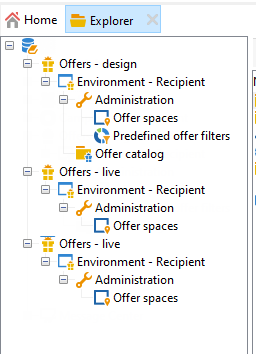
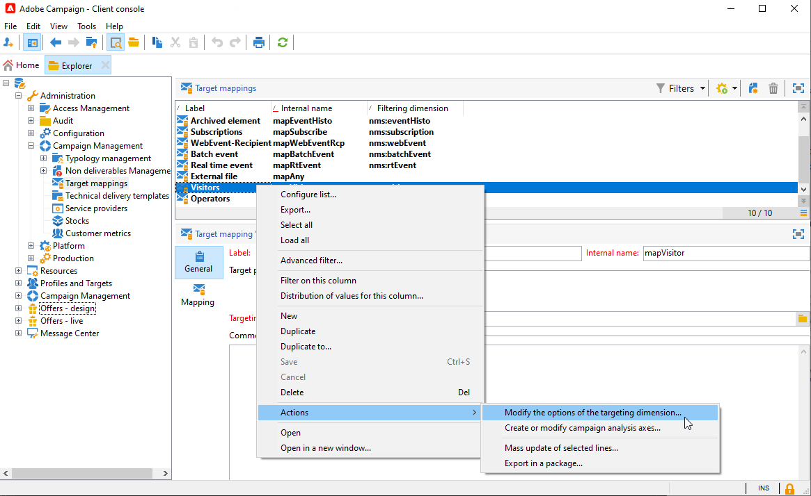

# Werken met omgevingen{#work-with-environments}

## Live- en ontwerpomgevingen{#live-design-environments}

De interactie werkt met twee soorten aanbiedingsmilieu&#39;s:

* **[!UICONTROL Design]** bieden omgevingen aan die aanbiedingen bevatten die worden bewerkt en kunnen worden gewijzigd. Deze aanbiedingen zijn niet door de goedkeuringscyclus geweest en niet geleverd aan contacten.
* **[!UICONTROL Live]** bieden omgevingen aan die goedgekeurde aanbiedingen bevatten terwijl deze aan contactpersonen worden aangeboden. De aanbiedingen in deze omgeving zijn alleen-lezen.

Elk **[!UICONTROL Design]** milieu is gekoppeld aan een **[!UICONTROL Live]** milieu. Wanneer een aanbieding is voltooid, worden de inhoud en de subsidiabiliteitsregels ervan onderworpen aan een goedkeuringscyclus. Zodra deze cyclus is voltooid, wordt het desbetreffende aanbod automatisch aan de **[!UICONTROL Live]** milieu. Vanaf dat moment is het beschikbaar voor levering.

Campagne wordt standaard geleverd met een **[!UICONTROL Design]** milieu en **[!UICONTROL Live]** omgeving. Beide omgevingen zijn vooraf geconfigureerd om zich te richten op de [ingebouwde tabel voor ontvangers](../dev/datamodel.md#ootb-profiles).

>[!NOTE]
>
>Om ontvankelijke lijst te richten, moet u de medewerker van de doelafbeelding gebruiken om de milieu&#39;s tot stand te brengen. [Meer informatie](#creating-an-offer-environment).

Leveringsmanagers kunnen alleen de **[!UICONTROL Live]** milieu en hefboomwerking bieden aan om hen te leveren. Aanbiedingsmanagers kunnen de **[!UICONTROL Design]** en bekijk de **[!UICONTROL Live]** milieu. [Meer informatie](interaction-operators.md)

## Een omgeving maken voor anonieme interacties{#create-an-offer-environment}

Door gebrek, komt de Campagne met een ingebouwde milieu om de ontvankelijke lijst (geïdentificeerde aanbiedingen) te richten. Als u een andere tabel als doel wilt instellen, bijvoorbeeld anonieme profielen die uw website bezoeken voor binnenkomende interacties, moet u de configuratie bijwerken.

Volg de onderstaande stappen:

1. Bladeren naar **[!UICONTROL Administration]** > **[!UICONTROL Campaign management]** > **[!UICONTROL Target mappings]** klikt u met de rechtermuisknop op de doeltoewijzing die u wilt gebruiken en selecteert u **[!UICONTROL Actions]** > **[!UICONTROL Modify the options of the targeting dimension]**.

   

1. Klikken **[!UICONTROL Next]**, selecteert u de **[!UICONTROL Generate a storage schema for propositions]** en klik op **[!UICONTROL Save]**.

   

   >[!NOTE]
   >
   >Als de optie al is ingeschakeld, schakelt u deze uit en controleert u deze opnieuw.

1. Adobe Campaign creëert twee omgevingen - **[!UICONTROL Design]** en **[!UICONTROL Live]** - met gerichte informatie uit de eerder ingeschakelde doeltoewijzing. Het milieu wordt preconfigured met het richten informatie.

Als u **[!UICONTROL Visitor]** de **[!UICONTROL Environment dedicated to incoming anonymous interactions]** wordt automatisch ingeschakeld in de omgeving **[!UICONTROL General]** tab.

Met deze optie kunt u anonieme interactiespecifieke functies activeren, vooral wanneer u omgevingen configureert die spaties bieden. U kunt opties ook vormen die u toestaan om van een &quot;geïdentificeerd&quot;milieu aan een &quot;anonieme&quot;milieu over te schakelen.

U kunt bijvoorbeeld een koppeling tot stand brengen tussen een ontvankelijke omgeving en een aanbiedingsruimte (geïdentificeerd contact) die overeenkomt met een bezoekersomgeving (niet-geïdentificeerd contact). Op deze manier worden verschillende aanbiedingen ter beschikking gesteld van de contactpersoon, afhankelijk van of deze contactpersoon al dan niet wordt geïdentificeerd. Raadpleeg voor meer informatie hierover [Aanbiedingsruimten maken](interaction-offer-spaces.md).

>[!NOTE]
>
>Voor meer informatie over anonieme interacties op een binnenkomend kanaal, verwijs naar [Anonieme interacties](anonymous-interactions.md).
