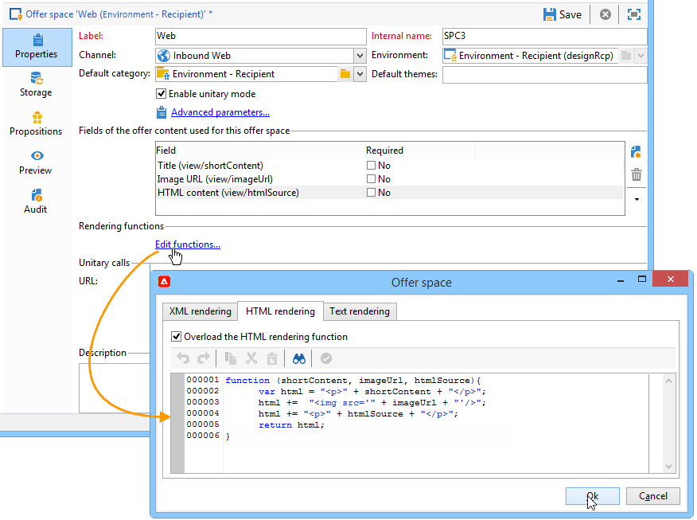
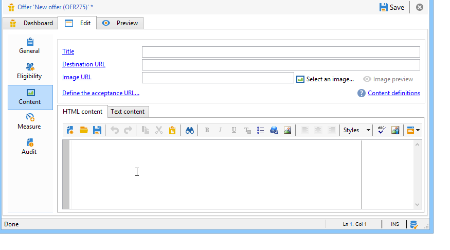

# Een voorstel toevoegen op een webpagina{#add-an-offer-in-web}

Als u de Offertenmotor op een webpagina wilt aanroepen, voegt u een aanroep van een JavaScript-code rechtstreeks in de pagina in. Deze vraag keert de aanbiedingsinhoud in een gericht element terug.

Het script dat URL aanroept ziet er als volgt uit:

```
<script id="interactionProposalScript" src="https://<SERVER_URL>/nl/interactionProposal.js?env=" type="text/javascript"></script>
```

De &quot;**env**&quot; de parameter ontvangt de interne naam van het levende milieu gewijd aan anonieme interactie.

Om een aanbieding te presenteren, moeten wij een milieu en een aanbiedingsruimte in Adobe Campaign creëren, dan de pagina van de HTML vormen.

In de volgende gebruiksgevallen worden de mogelijke opties beschreven voor het integreren van aanbiedingen via JavaScript.

## Optie 1: modus HTML {#html-mode}

### Een anonieme aanbieding presenteren {#presenting-an-anonymous-offer}

**Stap 1: De engine voor voorstellen voorbereiden**

1. Open de Adobe Campaign-interface en bereid een anonieme omgeving voor.
1. Maak een aanbiedingsruimte die is gekoppeld aan de anonieme omgeving.
1. Maak een aanbieding en geef deze weer in verband met de aanbiedingsruimte.

**Stap 2: De inhoud van de pagina HTML bijwerken**

De pagina HTML moet een element met een @id-kenmerk bevatten met de waarde van de interne naam van de gemaakte aanbiedingsruimte (&quot;i_internal name space&quot;). Het aanbod zal in dit element door Interaction worden opgenomen.

In ons voorbeeld ontvangt het kenmerk @id de waarde &quot;i_SPC12&quot;, waarbij &quot;SPC12&quot; de interne naam is van de eerder gemaakte aanbiedingsruimte:

```
<div id="i_SPC12"></div>
```

In ons voorbeeld is de URL voor het aanroepen van het script als volgt (&quot;OE3&quot; is de interne naam van de live omgeving):

```
<script id="interactionProposalScript" src="https://instance.adobe.org:8080/nl/interactionProposal.js?env=OE3" type="text/javascript"></script>
```

>[!CAUTION]
>
>De `<script>` -tag mag niet zelfsluitend zijn.

Deze statische vraag zal automatisch een dynamische vraag produceren die alle parameters bevat nodig door de motor van de Aanbieding.

Dit gedrag laat u verscheidene aanbiedingsruimten op de zelfde pagina gebruiken, die door één enkele vraag aan de motor van de Aanbieding worden beheerd.

**Stap 3: Geef de resultaten weer op de pagina HTML**

De inhoud van de aanbiedingsrepresentatie wordt door de aanbiedingsengine geretourneerd aan de pagina HTML:

```
<div id="banner_header">
 <div id="i_SPC12">
   <table>
    <tbody>
        <tr>
            <td><h3>Fly to Japan!</h3></td>
        </tr>
        <tr>
            <td></td>
            <td>
            <p>Discover Japan for 2 weeks at an unbelievable price!!</p>
            <p><b>2345 Dollars - All inclusive</b></p>
        </td>
        </tr>
    </tbody>
    </table>
 </div>
<script src="https://instance.adobe.org:8080/nl/interactionProposal.js?env=OE3" id="interactionProposalScript" type="text/javascript"></script>
</div>
```

### Een geïdentificeerde aanbieding presenteren {#presenting-an-identified-offer}

Om een aanbieding aan een geïdentificeerde contact voor te stellen, is het proces gelijkaardig zoals dat gedetailleerd [in deze sectie](#presenting-an-anonymous-offer).

In de inhoud van de Web-pagina, moet u het volgende manuscript toevoegen dat de contact tijdens de vraag aan de motor van de Aanbieding zal identificeren:

```
<script type="text/javascript">
  interactionTarget = <contact_identifier>;
</script>
```

1. Ga naar de aanbiedingsruimte die door de webpagina wordt aangeroepen, en klik op **[!UICONTROL Advanced parameters]** en voeg een of meer identificatietoetsen toe.

   

   In dit voorbeeld is de identificatiesleutel samengesteld omdat deze zowel op de e-mail als op de naam van de ontvanger is gebaseerd.

1. Tijdens de Web-pagina vertoning, laat de manuscriptevaluatie u ontvankelijke identiteitskaart op de motor van de Aanbieding overgaan. Als de id een samenstelling heeft, worden de toetsen weergegeven in dezelfde volgorde als in de geavanceerde instellingen en worden ze van elkaar gescheiden door een |.

   In het volgende voorbeeld heeft de contactpersoon zich aangemeld bij de website en is de contactpersoon door zijn e-mail en naam herkend tijdens het aanroepen naar de engine voor voorstellen.

   ```
   <script type="text/javascript">
     interactionTarget = myEmail|myName;
   </script>
   ```

### Een HTML-renderfunctie gebruiken {#using-an-html-rendering-function}

Als u de representatie van de HTML-aanbieding automatisch wilt genereren, kunt u een renderfunctie gebruiken.

1. Ga naar de aanbiedingsruimte en klik op de knop **[!UICONTROL Edit functions]** koppeling.
1. Selecteer **[!UICONTROL Overload the HTML rendering function]**.
1. Ga naar de **[!UICONTROL HTML rendering]** en voegt de variabelen die overeenkomen met de velden die voor de aanbiedingsinhoud zijn gedefinieerd, in de aanbiedingsruimte in.

   

   In dit voorbeeld wordt de aanbieding weergegeven in de vorm van een banner op een webpagina en bestaat deze uit een klikbare afbeelding en een titel die overeenkomen met de velden die zijn gedefinieerd in de inhoud van de aanbieding.

## Optie 2: XML-modus {#xml-mode}

### Een voorstel presenteren {#presenting-an-offer}

Campagne **Interactie** kunt u een knoop van XML aan de pagina terugkeren van de HTML die de motor van de Aanbieding omhoog roept. Dit XML-knooppunt kan worden verwerkt door functies die aan de kant van de klant moeten worden ontwikkeld.

De vraag aan de motor van de Aanbieding kijkt als dit:

```
<script type="text/javascript" id="interactionProposalScript" src="https://<SERVER_URL>/nl/interactionProposal.js?env=&cb="></script>
```

* De &quot;**env**&quot; parameter ontvangt de interne naam van de live omgeving.

* De &quot;**cb**&quot; parameter ontvangt de naam van de functie die het XML-knooppunt zal lezen dat wordt geretourneerd door de engine die de (callback) propositie(s) bevat. Deze parameter is optioneel.

* De &quot;**t**&quot;parameter ontvangt de waarde van het doel, slechts voor een geïdentificeerde interactie. Deze parameter kan ook worden doorgegeven met de **interactionTarget** variabele. Deze parameter is optioneel.

* De &quot;**c**&quot; de parameter ontvangt de lijst van interne namen van de categorieën. Deze parameter is optioneel.

* De &quot;**th**&quot; de parameter ontvangt de lijst van thema&#39;s. Deze parameter is optioneel.

* De &quot;**gctx**&quot; parameter ontvangt de vraaggegevens globaal (context) aan de volledige pagina. Deze parameter is optioneel.

Het geretourneerde XML-knooppunt ziet er als volgt uit:

```
<propositions>
 <proposition id="" offer-id="" weight="" rank="" space="" div=""> //proposition identifiers
   ...XML content defined in Adobe Campaign...
 </proposition>
 ...
</propositions>
```

In het onderstaande gebruiksgeval worden de configuraties beschreven die in Adobe Campaign moeten worden uitgevoerd om de XML-modus in te schakelen en wordt vervolgens het resultaat van de aanroep naar de engine op de pagina HTML weergegeven.

1. **Een omgeving en een aanbiedingsruimte maken**

   Raadpleeg voor meer informatie over het maken van een omgeving [deze pagina](interaction-env.md).

   Raadpleeg voor meer informatie over het maken van een aanbiedingsruimte [deze pagina](interaction-offer-spaces.md).

1. **Het aanbiedingsschema uitbreiden om nieuwe velden toe te voegen**

   In dit schema worden de volgende velden gedefinieerd: Titel nummer 2 en prijs.

   De naam van het schema in het voorbeeld is **focus:aanbieding**

   ```
   <srcSchema _cs="Marketing offers (cus)" created="2013-01-18 17:14:20.762Z" createdBy-id="0"
              desc="" entitySchema="xtk:srcSchema" extendedSchema="nms:offer" img="nms:offer.png"
              label="Marketing offers" labelSingular="Marketing offers" lastModified="2013-01-18 15:20:18.373Z"
              mappingType="sql" md5="F14A7AA009AE1FCE31B0611E72866AC3" modifiedBy-id="0"
              name="offer" namespace="cus" xtkschema="xtk:srcSchema">
     <createdBy _cs="Administrator (admin)"/>
     <modifiedBy _cs="Administrator (admin)"/>
     <element img="nms:offer.png" label="Marketing offers" labelSingular="Marketing offer"
              name="offer">
       <element label="Content" name="view">
         <element label="Price" name="price" type="long" xml="true"/>
         <element label="Title 2" name="title2" type="string" xml="true"/>
   
         <element advanced="true" desc="Price calculation script." label="Script price"
                  name="price_jst" type="CDATA" xml="true"/>
         <element advanced="true" desc="Title calculation script." label="Script title"
                  name="title2_jst" type="CDATA" xml="true"/>
       </element>
     </element>
   </srcSchema>
   ```

   >[!CAUTION]
   >
   >Elk element moet tweemaal worden gedefinieerd. CDATA-typeelementen (&quot;_jst&quot;) kunnen personalisatievelden bevatten.
   >
   >Vergeet niet de databasestructuur bij te werken.

   U kunt het aanbiedingsschema uitbreiden om nieuwe velden zowel in batch- als eenheidsmodus en in elke gewenste indeling (tekst, HTML en XML) toe te voegen.

1. **De aanbiedingsformule uitbreiden om nieuwe velden te bewerken en een bestaand veld te wijzigen**

   Bewerk de **Voorstel (nsm)** invoerformulier.

   Voeg in de sectie Weergaven de twee nieuwe velden in met de volgende inhoud:

   ```
   <input label="Title 2" margin-right="5" prebuildSubForm="false" type="subFormLink" xpath="title2_jst">
        <form label="Edit title 2" name="editForm" nothingToSave="true">
            <input nolabel="true" toolbarAlign="horizontal" type="jstEdit" xpath="." xpathInsert="/ignored/customizeTitle2">
            <container>
                <input menuId="viewMenuBuilder" options="inbound" type="customizeBtn" xpath="/ignored/customizeTitle2"/>
            </container>
            </input>
        </form>
    </input>
    <input nolabel="true" type="edit" xpath="title2_jst"/>
    <input label="Price" margin-right="5" prebuildSubForm="false" type="subFormLink" xpath="price_jst">
        <form label="Edit price" name="editForm" nothingToSave="true">
        <input nolabel="true" toolbarAlign="horizontal" type="jstEdit" xpath="." xpathInsert="/ignored/customizePrice">
            <container>
                <input menuId="viewMenuBuilder" options="inbound" type="customizeBtn" xpath="/ignored/customizePrice"/>
            </container>
        </input>
        </form>
    </input>
    <input colspan="2" label="Prix" nolabel="true" type="number" xpath="price_jst"/>
   ```

   Opmerking toevoegen aan het doel-URL-veld:

   

   >[!CAUTION]
   >
   >De velden van de ( `<input>`) moet het formulier verwijzen naar de CDATA-typeelementen die zijn gedefinieerd in het gemaakte schema.

   De rendering in het formulier met aanbiedingsweergaven ziet er als volgt uit:

   

   De **[!UICONTROL Title 2]** en **[!UICONTROL Price]** zijn toegevoegd en **[!UICONTROL Destination URL]** wordt niet meer weergegeven.

1. **Een aanbieding maken**

   Raadpleeg voor meer informatie over het maken van aanbiedingen [deze pagina](interaction-offer.md).

   In het volgende gebruiksgeval wordt de aanbieding als volgt vermeld:

   

1. **Het voorstel goedkeuren**

   Goedkeuren of laten goedkeuren door iemand anders, dan activeren op de aanbiedingsruimte die bij de laatste stap is gecreëerd, zodat deze beschikbaar wordt gesteld in de gekoppelde live omgeving.

1. **De vraag van de motor en het resultaat op de pagina van de HTML**

   De vraag aan de motor van de Aanbieding in de pagina van de HTML ziet als volgt:

   ```
   <script id="interactionProposalScript" src="https://<SERVER_URL>/nl/interactionProposal.js?env=OE7&cb=alert" type="text/javascript">
   ```

   De waarde van &quot;**env**&quot; parameter is de interne naam van de live omgeving.

   De waarde van &quot;**cb**&quot; parameter is de naam van de functie die het XML-knooppunt moet interpreteren dat door de engine wordt geretourneerd. In ons voorbeeld opent de aangeroepen functie een modaal venster (alert() functie).

   Het XML-knooppunt dat door de Offer-engine wordt geretourneerd, ziet er als volgt uit:

   ```
   <propositions>
    <proposition id="a28002" offer-id="10322005" weight="1" rank="1" space="SPC14" div="i_SPC14">
     <xmlOfferView>
      <title>Travel to Russia</title>
      <price>3456</price>
      <description>Discover this vacation package!INCLUDES 10 nights. FEATURES buffet breakfast daily. BONUS 5th night free.</description>
      <image>
       <path>https://myinstance.com/res/Track/ae1d2113ed732d58a3beb441084e5960.jpg</path>
       <alt>Travel to Russia</alt>
      </image>
     </xmlOfferView>
    </proposition>
   </propositions>
   ```

### Een renderfunctie gebruiken {#using-a-rendering-function-}

Het is mogelijk een XML-renderfunctie te gebruiken om een aanbiedingspresentatie te maken. Deze functie zal de knoop van XML wijzigen die aan de pagina van de HTML tijdens de vraag aan de motor van de Aanbieding is teruggekeerd.

1. Ga naar de aanbiedingsruimte en klik op de knop **[!UICONTROL Edit functions]** koppeling.
1. Selecteer **[!UICONTROL Overload the XML rendering function]**.
1. Ga naar de **[!UICONTROL XML rendering]** en voegt u de gewenste functie in.

   De functie kan er als volgt uitzien:

   ```
   function (proposition) {
     delete proposition.@id;
     proposition.@newAttribute = "newValue";
   } 
   ```


## Een SOAP-integratie instellen

De SOAP-webservices die worden aangeboden voor aanbiedingsbeheer, verschillen van de services die gewoonlijk in Adobe Campaign worden gebruikt. U hebt toegang tot deze bestanden via de interactie-URL die in de vorige sectie is beschreven. U kunt nu aanbiedingen voor een bepaalde contactpersoon presenteren of bijwerken.

### Voorstel {#offer-proposition}

Voor een aanbiedingsvoorstel via ZEEP, voeg toe **nms:proposition#propose** gevolgd door de volgende parameters:

* **targetId**: primaire sleutel van de ontvanger (kan een samengestelde sleutel zijn).
* **maxCount**: geeft het aantal voorstellen voor de contactpersoon aan.
* **context**: Hiermee kunt u contextinformatie toevoegen in het ruimteschema. Als het gebruikte schema **nms:interactie**, **`<empty>`** worden toegevoegd.
* **categorieën**: geeft aan tot welke categorie(ën) de aanbiedingen moeten behoren.
* **thema&#39;s**: geeft het thema of de thema&#39;s aan waartoe de aanbieding(en) moeten behoren.
* **uuid**: waarde van het permanente cookie van Adobe Campaign (&quot;uuid230&quot;).
* **nli**: waarde van het Adobe Campaign-sessiecookie (&quot;nlid&quot;).
* **noProp**: gebruik de waarde &quot;true&quot; om de invoeging van een voorstel te deactiveren.

>[!NOTE]
>
>De **targetId** en **maxCount** instellingen zijn verplicht. De andere zijn optioneel.

In antwoord op de vraag, zal de dienst van de ZEEP de volgende parameters terugkeren:

* **interactionId**: ID van de interactie.
* **voorstellen**: XML-element, bevat de lijst met voorstellingen, elk met een eigen id en HTML-representatie.

### Aanbieding bijwerken {#offer-update}

Voeg de **nms:interaction#UpdateStatus** naar de URL, gevolgd door de volgende parameters:

* **voorstel**: tekenreeks met tekens, bevat deze de voorstel-id die als uitvoer is opgegeven tijdens een aanbiedingsvoorstel. Zie [Voorstel](#offer-proposition).
* **status**: type tekenreeks, geeft de nieuwe status van de aanbieding aan. De mogelijke waarden worden vermeld in de **propositionStatus** opsomming, in de **nms:algemeen** schema. Bijvoorbeeld, out-of-the-box, beantwoordt aantal 3 aan **Geaccepteerd** status.
* **context**: Met het XML-element kunt u contextinformatie toevoegen in het ruimteschema. Als het gebruikte schema **nms:interactie**, **`<empty>`** worden toegevoegd.

### Voorbeeld met een SOAP-aanroep {#example-using-a-soap-call}

Hier is een voorbeeld van code voor een vraag van de ZEEP:

```
<%
  var space = request.parameters.sp
  var cnx = new HttpSoapConnection(
    "https://" + request.serverName + ":" + request.serverPort + "/interaction/" + env + "/" + space,
    "utf-8",
    HttpSoapConnection.SOAP_12)
  var session = new SoapService(cnx, "nms:interaction")
  var action = request.parameters.a
  if( action == undefined )
    action = 'propose'

  try
  {
    switch( action )
    {
    case "update":
      var proposition = request.parameters.p
      var status      = request.parameters.st
      session.addMethod("UpdateStatus", "nms:interaction#UpdateStatus",
       ["proposition", "string",
        "status",      "string",
        "context",     "NLElement"],
       [])
      session.UpdateStatus(proposition, status, <undef/>)
      var redirect = request.parameters.r
      if( redirect != undefined )
        response.sendRedirect(redirect)
      break;

    case "propose":
      var count = request.parameters.n
      var target = request.parameters.t
      var categorie = request.parameters.c
      var theme = request.parameters.th
      var layout = request.parameters.l
      if( count == undefined )
        count = 1
      session.addMethod("Propose", "nms:proposition#Propose",
       ["targetId",      "string",
        "maxCount",      "string",
         "categories",    "string",
         "themes",        "string",
        "context",       "NLElement"],
       ["interactionId", "string",
        "propositions",  "NLElement"])
      response.setContentType("text/html")
      var result = session.Propose(target, count, category, theme, <empty/>)
      var props = result[1]
  %><table><tr><%
      for each( var propHtml in props.proposition.*.mdSource )
      {
        %><td><%=propHtml%></td><%
      }
  %></tr></table><%
      break;
    }
  }
  catch( e )
  {
  }
  %>
```
