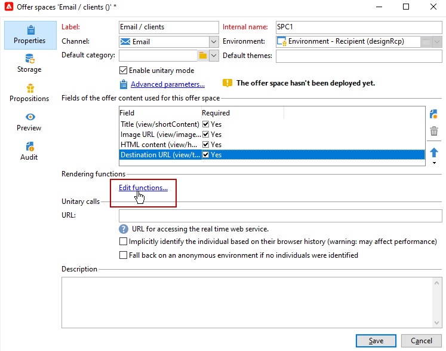
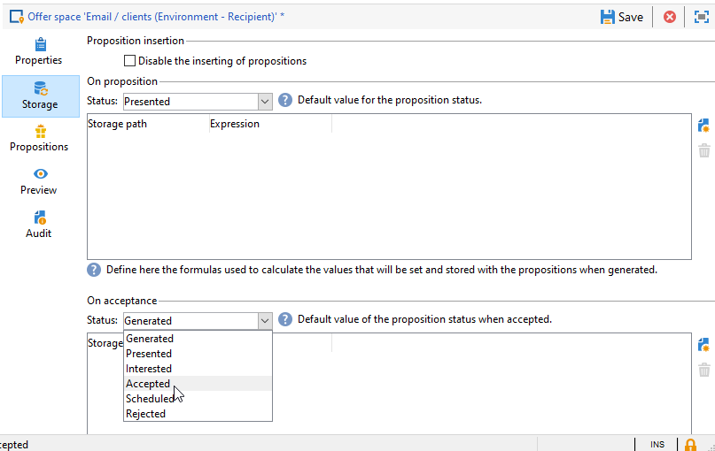

# Plaatsingen voor aanbiedingen maken{#creating-offer-spaces}

De inhoud van de aanbiedingscatalogus wordt geconfigureerd in aanbiedingsruimten. Standaard kan de inhoud de volgende velden bevatten: **[!UICONTROL Title]**, **[!UICONTROL Destination URL]**, **[!UICONTROL Image URL]**, **[!UICONTROL HTML content]** en **[!UICONTROL Text content]**. De gebiedsopeenvolging wordt gevormd in de aanbiedingsruimte.

Als **technisch beheerder**, kunt u aanbiedingsruimten maken in de ontwerpomgeving. U moet toegang hebben tot de submap voor de aanbiedingsruimte. Nadat deze aanbiedingsruimten zijn gemaakt, worden deze automatisch gedupliceerd naar de live omgeving tijdens de goedkeuring van de aanbieding.

De rendering HTML wordt gemaakt via een renderfunctie. De volgorde van de velden die in de renderfunctie zijn gedefinieerd, moet gelijk zijn aan de volgorde die in de inhoud is geconfigureerd.


Volg onderstaande stappen om een nieuwe aanbiedingsruimte te maken:

1. Klik in de lijst met aanbiedingsruimten op **[!UICONTROL New]**.

   

1. Selecteer het kanaal u wilt gebruiken en het etiket van de aanbiedingsruimte veranderen.

   

1. Schakel de optie **[!UICONTROL Enable unitary mode]** in

1. Ga naar de **[!UICONTROL Content field]** venster en klik op **[!UICONTROL Add]**.

   

1. Ga naar de **[!UICONTROL Content]** en selecteer de velden in de volgende volgorde: **[!UICONTROL Title]** vervolgens **[!UICONTROL Image URL]** vervolgens **[!UICONTROL HTML content]** vervolgens **[!UICONTROL Destination URL]**.

   

1. Controleer de **[!UICONTROL Required]** om elk veld verplicht te maken.

   >[!NOTE]
   >
   >Deze optie wordt gebruikt bij de voorvertoning en maakt de aanbiedingsruimten ongeldig wanneer u publiceert als een van de verplichte velden in de aanbieding ontbreekt. Als een aanbieding echter al live is op een aanbiedingsruimte, worden deze criteria niet in aanmerking genomen.

   

1. Klikken **[!UICONTROL Edit functions]** om een renderfunctie te maken.

   Deze functies worden gebruikt om aanbiedingsvertegenwoordiging op een aanbiedingsruimte te produceren. Er zijn verschillende mogelijke indelingen: HTML of tekst.

   **Opmerking** - XML-indeling is beperkt tot binnenkomende interacties die niet beschikbaar zijn in deze versie van het product. [Meer informatie](../start/v7-to-v8.md#gs-unavailable-features)

   _

1. Ga naar de **[!UICONTROL HTML rendering]** en selecteert u **[!UICONTROL Overload the HTML rendering function]**.
1. Voeg uw renderfunctie in.

   

## Voorzettingsstatussen voorstellen {#offer-proposition-statuses}

De status van het voorstel varieert afhankelijk van de interactie met de doelpopulatie. De module van de Interactie van de campagne komt met een reeks waarden die op het aanbiedingsvoorstel tijdens zijn levenscyclus kunnen worden toegepast. U moet het platform vormen zodat de status verandert wanneer het aanbiedingsvoorstel wordt gecreeerd en wordt goedgekeurd.

>[!NOTE]
>
>De statusupdate is een **asynchroon** proces. Deze wordt uitgevoerd door de workflow voor het bijhouden van gegevens, die elk uur wordt geactiveerd.

### Statuslijst voorstel {#status-list}

De volgende statussen zijn beschikbaar voor aanbiedingen:

* **[!UICONTROL Accepted]**
* **[!UICONTROL Scheduled]**
* **[!UICONTROL Generated]**
* **[!UICONTROL Interested]**
* **[!UICONTROL Presented]**
* **[!UICONTROL Rejected]**

Deze waarden worden niet standaard toegepast: zij moeten worden gevormd.

>[!NOTE]
>
>De status van een aanbiedingsvoorstel wordt automatisch gewijzigd in &quot;Presenteerd&quot; als de aanbieding gekoppeld is aan een levering met de status &quot;Verzonden&quot;.

### De status van de aanbieding wanneer het voorstel wordt gecreeerd {#configuring-the-status-when-the-proposition-is-created}

Wanneer een aanbiedingsvoorstel **gemaakt**, wordt de status bijgewerkt.

In de **[!UICONTROL Design]** milieu, voor elke aanbiedingsruimte, vorm de status om van toepassing te zijn wanneer een voorstel, afhankelijk van de informatie wordt gecreeerd u in de aanbiedingsrapporten wilt tonen.

Volg de onderstaande stappen om dit te doen:

1. Ga naar de **[!UICONTROL Storage]** van de gewenste ruimte.
1. Selecteer de status die u wilt toepassen op het voorstel wanneer het wordt gemaakt.

   

### De status van de aanbieding wanneer het voorstel wordt aanvaard {#configuring-the-status-when-the-proposition-is-accepted}

Zodra een voorstel is gedaan **aanvaard**, gebruik één van de waarden die door gebrek worden verstrekt om de nieuwe status van het voorstel te vormen. De update wordt toegepast wanneer een ontvanger op een koppeling in de aanbieding klikt.

Volg de onderstaande stappen om dit te doen:

1. Ga naar de **[!UICONTROL Storage]** van de gewenste ruimte.
1. Selecteer de status die u op het voorstel wilt toepassen wanneer het wordt goedgekeurd.

   


**Binnenkomende interactie**

De **[!UICONTROL Storage]** kunt u statussen definiëren voor **voorgesteld** en **aanvaard** alleen voorstellen. Voor binnenkomende interactie, zou de status van aanbiedingsvoorstellen direct in URL voor het roepen van de motor van de Aanbieding, eerder dan door de interface moeten worden gespecificeerd. Op deze manier kunt u opgeven welke status in andere gevallen moet worden toegepast, bijvoorbeeld als een voorstel voor een aanbieding wordt afgewezen.

```
<BASE_URL>?a=UpdateStatus&p=<PRIMARY_KEY_OF_THE_PROPOSITION>&st=<NEW_STATUS_OF_THE_PROPOSITION>&r=<REDIRECT_URL>
```

Bijvoorbeeld, het voorstel (herkenningsteken **40004**) die overeenkomt met de **Binnenlandse verzekering** voorstel weergegeven op de **Neobank** site bevat de volgende URL:

```
<BASE_URL>?a=UpdateStatus&p=<40004>&st=<3>&r=<"http://www.neobank.com/insurance/subscribe.html">
```

Zodra een bezoeker op het aanbod klikt, en dus op de URL, wordt het **[!UICONTROL Accepted]** status (waarde) **3**) wordt toegepast op het voorstel en de bezoeker wordt omgeleid naar een nieuwe pagina van de **Neobank** plaats om de verzekeringsovereenkomst te sluiten.

>[!NOTE]
>
>Als u een andere status in de URL wilt opgeven (bijvoorbeeld als een aanbiedingsvoorstel wordt afgewezen), gebruikt u de waarde die overeenkomt met de gewenste status. Voorbeeld: **[!UICONTROL Rejected]** = &quot;5&quot;, **[!UICONTROL Presented]** = &quot;1&quot; enzovoort.
>
>Statussen en hun waarden kunnen worden opgehaald in het dialoogvenster **[!UICONTROL Offer propositions (nms)]** gegevensschema. Raadpleeg [deze pagina](../dev/create-schema.md) voor meer informatie.

**Uitgaande interactie**

U kunt automatisch het **[!UICONTROL Interested]** status aan een voorstel als de levering een koppeling bevat. Voeg eenvoudig de **_urlType=&quot;11&quot;** waarde voor de koppeling:

```
<a _urlType="11" href="<DEST_URL>">Link inserted into the delivery</a>
```

## Voorvertoning aanbod per ruimte {#offer-preview-per-space}

In de **[!UICONTROL Preview]** kunt u de aanbiedingen bekijken waarvoor de ontvanger in aanmerking komt via een gekozen methode. In het onderstaande voorbeeld komt de begunstigde in aanmerking voor drie voorstellen per post.


Als een ontvanger niet in aanmerking komt voor een voorstel, wordt dit weergegeven in de voorvertoning.


In de voorvertoning kunnen contexten worden genegeerd wanneer deze beperkt zijn tot een spatie. Dit is het geval wanneer het interactieschema is uitgebreid om velden toe te voegen waarnaar in een ruimte wordt verwezen met een binnenkomend kanaal.

  Raadpleeg voor meer informatie dit voorbeeld in [Campaign Classic v7-documentatie](https://experienceleague.adobe.com/docs/campaign-classic/using/managing-offers/advanced-parameters/extension-example.html){target=&quot;_blank&quot;}.