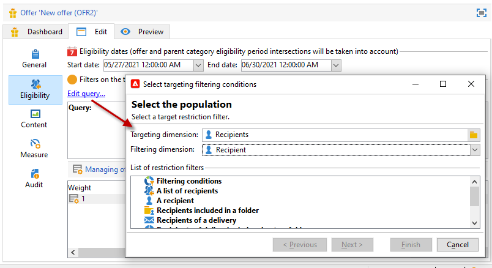

# Een aanbieding maken

Volg onderstaande stappen om een voorstel te maken:

1. Bladeren naar de **[!UICONTROL Campaigns]** en klik op de knop **[!UICONTROL Offers]** koppeling.

1. Klik op de knop **[!UICONTROL Create]**.

1. Wijzig het label en selecteer de categorie waartoe de aanbieding moet behoren.

1. Klikken **[!UICONTROL Save]** om het voorstel te maken.

   De aanbieding is beschikbaar in het platform en zijn inhoud kan worden gevormd.

## Geschiktheidsinstellingen

U kunt nu de opdracht **[!UICONTROL Eligibility]** te definiëren tab:

* De subsidiabiliteitsperiode van de aanbieding. [Meer informatie](#eligibility-period)
* Filters op de doelpopulatie van de aanbieding. [Meer informatie](#filters-on-the-target)
* Het gewicht van het voorstel. [Meer informatie](#offer-weight)

### verkiesbaarheidsperiode voorstellen{#eligibility-period}

In de **[!UICONTROL Eligibility]** van de aanbieding, de subsidiabiliteitsperiode van de aanbieding bepalen. gebruikt u de vervolgkeuzelijsten om een begin- en een einddatum in de kalender te selecteren.


Buiten deze periode wordt het voorstel niet geselecteerd. Als u ook de toelatingsdata voor de categorie van aanbiedingen hebt gevormd, zal de meest beperkende periode van toepassing zijn.

### Filters toevoegen aan het doel {#filters-on-the-target}

In de **[!UICONTROL Eligibility]** van de aanbieding, pas filters op het aanbiedingsdoel toe.

Om dit te doen, klik **[!UICONTROL Edit query]** en selecteer het filter dat u wilt toepassen.



Als er al vooraf gedefinieerde filters zijn gemaakt, kunt u deze selecteren in de lijst met gebruikersfilters. [Meer informatie](interaction-predefined-filters.md)


### Het gewicht van de aanbieding instellen {#offer-weight}

Om de motor in staat te stellen tussen verscheidene aanbiedingen te beslissen dat het doel verkiesbaar is, moet u één of meerdere gewichten aan de aanbieding toewijzen. U kunt filters op het doel indien nodig ook toepassen of de aanbiedingsruimte beperken waarop het gewicht van toepassing is. Een aanbod met een groter gewicht krijgt de voorkeur boven een aanbod met minder gewicht.

U kunt veelvoudige gewichten voor de zelfde aanbieding vormen, bijvoorbeeld om sup-periodes, specifieke doelstellingen of zelfs een aanbiedingsruimte te onderscheiden.

Bijvoorbeeld, kan een aanbieding een gewicht van A voor contacten hebben tussen 18 en 25 jaar en een gewicht van B voor contacten boven dat gamma. Als een aanbieding de hele zomer in aanmerking komt, kan zij ook een gewicht van A in juli en een gewicht van B in augustus hebben.

>[!NOTE]
>
>Het toegewezen gewicht kan tijdelijk worden gewijzigd op basis van de parameters van de categorie waartoe de aanbieding behoort. [Meer informatie](interaction-offer-catalog.md#creating-offer-categories)

Voer de volgende stappen uit om een dikte in een aanbieding te maken:

1. In de **[!UICONTROL Eligibility]** tabblad van de aanbieding klikt u op **[!UICONTROL Add]**.

   

1. Wijzig het label en wijs een gewicht toe. De standaardwaarde is 1.

   

   >[!CAUTION]
   >
   >Indien geen gewicht wordt opgegeven (0), wordt het streefcijfer niet in aanmerking genomen voor de aanbieding.

1. Als u het gewicht gedurende een bepaalde periode wilt toepassen, definieert u de toelatingsdata.

   

1. Beperk zo nodig het gewicht tot een specifieke aanbiedingsruimte.

   

1. Pas een filter toe op een doel.

   

1. Klikken **[!UICONTROL OK]** om het gewicht te verlagen.

   

   >[!NOTE]
   >
   >Als een doel in aanmerking komt voor meerdere gewichten voor een geselecteerde aanbieding, behoudt de motor het beste (hoogste) gewicht. Bij het oproepen van de motor van de Aanbieding, wordt een voorstel geselecteerd maximaal eens per contact.

### Samenvatting van de regels inzake de subsidiabiliteit van aanbiedingen {#a-summary-of-offer-eligibility-rules}

Zodra de configuratie is voltooid, zal een samenvatting van de subsidiabiliteitsregels beschikbaar zijn op het biederdashboard.

Klik op de knop **[!UICONTROL Schedule and eligibility rules]** koppeling.


## De inhoud van het voorstel maken {#creating-the-offer-content}

Gebruik de **[!UICONTROL Content]** om de inhoud van de aanbieding te definiëren.


1. Definieer de verschillende parameters van de aanbiedingsinhoud.

   * **[!UICONTROL Title]** : Geef de titel op die je wilt maken en die je in je voorstel wilt opnemen. Waarschuwing: dit verwijst niet naar het label van de aanbieding , dat in het **[!UICONTROL General]** tab.
   * **[!UICONTROL Destination URL]** : Geef de URL van je voorstel op. Het moet beginnen met &quot;http://&quot; of &quot;https://&quot;.
   * **[!UICONTROL Image URL]** : Geef een URL of een toegangspad op naar de afbeelding van uw aanbieding.
   * **[!UICONTROL HTML content]** / **[!UICONTROL Text content]** : Voer de tekst van je voorstel in op het tabblad dat je wilt. Om het volgen te produceren, **[!UICONTROL HTML content]** moet bestaan uit HTML-elementen die kunnen worden ingesloten in een `<div>` type-element. Het resultaat van bijvoorbeeld een `<table>` Het element op de pagina HTML is als volgt:

   ```
      <div> 
       <table>
        <tr>
         <th>Month</th>
         <th>Savings</th>   
        </tr>   
        <tr>    
         <td>January</td>
         <td>$100</td>   
        </tr> 
       </table> 
      </div>
   ```

   Leer hoe u de acceptatie-URL definieert in [deze sectie](interaction-offer-spaces.md#configuring-the-status-when-the-proposition-is-accepted).

   

   Om de vereiste gebieden te vinden aangezien zij tijdens de configuratie van de aanbiedingsruimte werden bepaald, klik **[!UICONTROL Content definitions]** koppeling om de lijst weer te geven. [Meer informatie](interaction-offer-spaces.md)

   

   In dit voorbeeld moet de aanbieding een titel, een afbeelding, HTML-inhoud en een doel-URL bevatten.

## Voorbeeld van aanbieding bekijken {#previewing-the-offer}

Zodra de aanbiedingsinhoud wordt gevormd, kunt u voorproef de aanbieding zoals het voor zijn ontvanger zal verschijnen.

Dit doet u als volgt:

1. Klik op de knop **[!UICONTROL Preview]** tab.

   

1. Selecteer de representatie van het voorstel dat u wilt bekijken.

   

1. Als u de inhoud van de aanbieding hebt gepersonaliseerd, selecteer het doel van de aanbieding om personalisatie te bekijken.

<!--

## Create a hypothesis on an offer {#creating-a-hypothesis-on-an-offer}

You can create hypotheses on your offer propositions. This lets you determine the impact of your offers on purchases carried out for the product concerned.

>[!NOTE]
>
>These hypotheses are carried out via Response Manager. Please check your license agreement.

Hypotheses carried out on an offer proposition are referenced in their **[!UICONTROL Measure]** tab.

Creating hypotheses is detailed in [this page](../../campaign/using/about-response-manager.md).

-->

## Een aanbieding goedkeuren en activeren{#approve-offers}

U kunt het voorstel nu goedkeuren en activeren om het beschikbaar te maken in het dialoogvenster **Live** milieu.

 Raadpleeg voor meer informatie hierover [Campaign Classic v7-documentatie](https://experienceleague.adobe.com/docs/campaign-classic/using/managing-offers/managing-an-offer-catalog/approving-and-activating-an-offer.html?lang=en#approving-offer-content)

## Presentatie van aanbieding beheren{#offer-presentation}

Met Campagne kunt u de stroom van aanbiedingsvoorstellen bepalen aan de hand van presentatieregels. Deze regels, die specifiek zijn voor campagneinteractie, zijn: **typologieregels**. Hiermee kunt u aanbiedingen uitsluiten op basis van de geschiedenis van voorstellen die al aan een ontvanger zijn gedaan. Er wordt naar verwezen in de omgeving.

 Raadpleeg voor meer informatie hierover [Campaign Classic v7-documentatie](https://experienceleague.adobe.com/docs/campaign-classic/using/managing-offers/managing-an-offer-catalog/managing-offer-presentation.html?lang=en#managing-offers)

## Aanbiedingssimulatie

De **Simulatie** kunt u de distributie testen van aanbiedingen die tot een categorie of een omgeving behoren voordat u uw voorstel naar ontvangers verzendt.

Bij de simulatie wordt rekening gehouden met de context en de subsidiabiliteitsregels die eerder op de aanbiedingen van toepassing waren, en met hun presentatieregels. Dit laat u diverse versies van uw aanbiedingsvoorstel testen en verfijnen zonder eigenlijk een aanbieding of over/onder het eisen van een doel te gebruiken, aangezien de simulatie geen effect op de gerichte ontvangers heeft.

 Voor meer informatie over de simulatie van aanbiedingen raadpleegt u [Campaign Classic v7-documentatie](https://experienceleague.adobe.com/docs/campaign-classic/using/managing-offers/simulating-offers/about-offers-simulation.html?lang=en)
