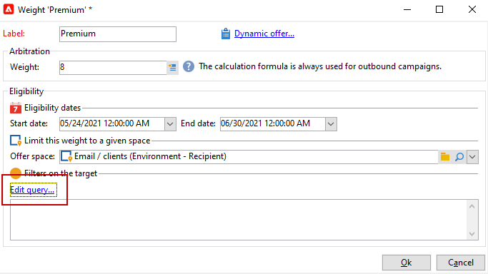

# Een aanbieding maken

To create an offer, follow the steps below:

1. Bladeren naar de **[!UICONTROL Campaigns]** en klik op de knop **[!UICONTROL Offers]** koppeling.

1. Klik op de knop **[!UICONTROL Create]**.

1. Wijzig het label en selecteer de categorie waartoe de aanbieding moet behoren.

1. Klikken **[!UICONTROL Save]** om het voorstel te maken.

   De aanbieding is beschikbaar in het platform en zijn inhoud kan worden gevormd.

## Geschiktheidsinstellingen

U kunt nu de opdracht **[!UICONTROL Eligibility]** te definiëren tab:

* The eligibility period of the offer. [Meer informatie](#eligibility-period)
* Filters on the offer target population. [Meer informatie](#filters-on-the-target)
* Het gewicht van het voorstel. [Meer informatie](#offer-weight)

### verkiesbaarheidsperiode voorstellen{#eligibility-period}

In the **[!UICONTROL Eligibility]** tab of the offer, define the eligibility period of the offer. gebruikt u de vervolgkeuzelijsten om een begin- en een einddatum in de kalender te selecteren.


Buiten deze periode wordt het voorstel niet geselecteerd. Als u ook de toelatingsdata voor de categorie van aanbiedingen hebt gevormd, zal de meest beperkende periode van toepassing zijn.

### Filters toevoegen aan het doel {#filters-on-the-target}

In de **[!UICONTROL Eligibility]** van de aanbieding, pas filters op het aanbiedingsdoel toe.

To do this, click the **[!UICONTROL Edit query]** link and select the filter you want to apply.


If pre-defined filters have been created already, you can select them from the list of user filters. [Meer informatie](interaction-predefined-filters.md)


### Het gewicht van de aanbieding instellen {#offer-weight}

To enable the engine to decide between several offers that the target is eligible for, you need to assign one or more weights to the offer. U kunt filters op het doel indien nodig ook toepassen of de aanbiedingsruimte beperken waarop het gewicht van toepassing is. An offer with a more significant weight will be preferred over an offer with less weight.

You can configure multiple weights for the same offer, for example to distinguish sup-periods, specific targets or even an offer space.

Bijvoorbeeld, kan een aanbieding een gewicht van A voor contacten hebben tussen 18 en 25 jaar en een gewicht van B voor contacten boven dat gamma. Als een aanbieding de hele zomer in aanmerking komt, kan zij ook een gewicht van A in juli en een gewicht van B in augustus hebben.

>[!NOTE]
>
>Het toegewezen gewicht kan tijdelijk worden gewijzigd op basis van de parameters van de categorie waartoe de aanbieding behoort. [Meer informatie](interaction-offer-catalog.md#creating-offer-categories)

Voer de volgende stappen uit om een dikte in een aanbieding te maken:

1. In de **[!UICONTROL Eligibility]** tabblad van de aanbieding klikt u op **[!UICONTROL Add]**.

   

1. Wijzig het label en wijs een gewicht toe. De standaardwaarde is 1.

   

   >[!CAUTION]
   >
   >If no weight is entered (0), the target will not be considered eligible for the offer.

1. Als u het gewicht gedurende een bepaalde periode wilt toepassen, definieert u de toelatingsdata.

   

1. If necessary, restrict the weight to a specific offer space.

   

1. Apply a filter to a target.

   

1. Click **[!UICONTROL OK]** to save the weight.

   

   >[!NOTE]
   >
   >If a target is eligible for multiple weights for a selected offer, the engine keeps the best (highest) weight. Bij het oproepen van de motor van de Aanbieding, wordt een voorstel geselecteerd maximaal eens per contact.

### Summary of offer eligibility rules {#a-summary-of-offer-eligibility-rules}

Once configuration is complete, a summary of the eligibility rules will be available on the offer dashboard.

Klik op de knop **[!UICONTROL Schedule and eligibility rules]** koppeling.


## De inhoud van het voorstel maken {#creating-the-offer-content}

Use the **[!UICONTROL Content]** tab to define the offer content.


1. Definieer de verschillende parameters van de aanbiedingsinhoud.

   * **[!UICONTROL Title]** : Geef de titel op die je wilt maken en die je in je voorstel wilt opnemen. Warning: this is not referring to the offer&#39;s label, which is defined in the **[!UICONTROL General]** tab.
   * **[!UICONTROL Destination URL]** : specify your offer&#39;s URL. It must start with &quot;http://&quot; or &quot;https://&quot;.
   * **[!UICONTROL Image URL]** : Geef een URL of een toegangspad op naar de afbeelding van uw aanbieding.
   * **[!UICONTROL HTML content]** / **[!UICONTROL Text content]** : enter the body of your offer in the tab you would like. To generate tracking, the **[!UICONTROL HTML content]** must be composed of HTML elements that can be enclosed in a `<div>` type element. Het resultaat van bijvoorbeeld een `<table>` Het element op de pagina HTML is als volgt:

   ```
      <div> 
       <table>
        <tr>
         <th>Month</th>
         <th>Savings</th>   
        </tr>   
        <tr>    
         <td>January</td>
         <td>$100</td>   
        </tr> 
       </table> 
      </div>
   ```

   Learn how to define the acceptance URL in [this section](interaction-offer-spaces.md#configuring-the-status-when-the-proposition-is-accepted).

   

   Om de vereiste gebieden te vinden aangezien zij tijdens de configuratie van de aanbiedingsruimte werden bepaald, klik **[!UICONTROL Content definitions]** koppeling om de lijst weer te geven. [Meer informatie](interaction-offer-spaces.md)

   

   In this example, the offer must include a title, an image, HTML content and a destination URL.

## Preview the offer {#previewing-the-offer}

Once the offer content is configured, you can preview the offer as it will appear for its recipient.

Dit doet u als volgt:

1. Click the **[!UICONTROL Preview]** tab.

   

1. Selecteer de representatie van het voorstel dat u wilt bekijken.

   

1. Als u de inhoud van de aanbieding hebt gepersonaliseerd, selecteer het doel van de aanbieding om personalisatie te bekijken.

<!--

## Create a hypothesis on an offer {#creating-a-hypothesis-on-an-offer}

You can create hypotheses on your offer propositions. This lets you determine the impact of your offers on purchases carried out for the product concerned.

>[!NOTE]
>
>These hypotheses are carried out via Response Manager. Please check your license agreement.

Hypotheses carried out on an offer proposition are referenced in their **[!UICONTROL Measure]** tab.

Creating hypotheses is detailed in [this page](../../campaign/using/about-response-manager.md).

-->

## Een aanbieding goedkeuren en activeren{#approve-offers}

You can now approve and activate the offer to make it available in the **Live** environment.

 Raadpleeg voor meer informatie hierover [Campaign Classic v7-documentatie](https://experienceleague.adobe.com/docs/campaign-classic/using/managing-offers/managing-an-offer-catalog/approving-and-activating-an-offer.html?lang=en#approving-offer-content)

## Presentatie van aanbieding beheren{#offer-presentation}

Campaign lets you control the flow of offer propositions using presentation rules. Deze regels, die specifiek zijn voor campagneinteractie, zijn: **typologieregels**. Hiermee kunt u aanbiedingen uitsluiten op basis van de geschiedenis van voorstellen die al aan een ontvanger zijn gedaan. Er wordt naar verwezen in de omgeving.

 Raadpleeg voor meer informatie hierover [Campaign Classic v7-documentatie](https://experienceleague.adobe.com/docs/campaign-classic/using/managing-offers/managing-an-offer-catalog/managing-offer-presentation.html?lang=en#managing-offers)

## Aanbiedingssimulatie

The **Simulation** module lets you test the distribution of offers belonging to a category or an environment before sending your proposition to recipients.

Bij de simulatie wordt rekening gehouden met de context en de subsidiabiliteitsregels die eerder op de aanbiedingen van toepassing waren, en met hun presentatieregels. Dit laat u diverse versies van uw aanbiedingsvoorstel testen en verfijnen zonder eigenlijk een aanbieding of over/onder het eisen van een doel te gebruiken, aangezien de simulatie geen effect op de gerichte ontvangers heeft.

 For more on Offer simulation, refer to [Campaign Classic v7 documentation](https://experienceleague.adobe.com/docs/campaign-classic/using/managing-offers/simulating-offers/about-offers-simulation.html?lang=en)
