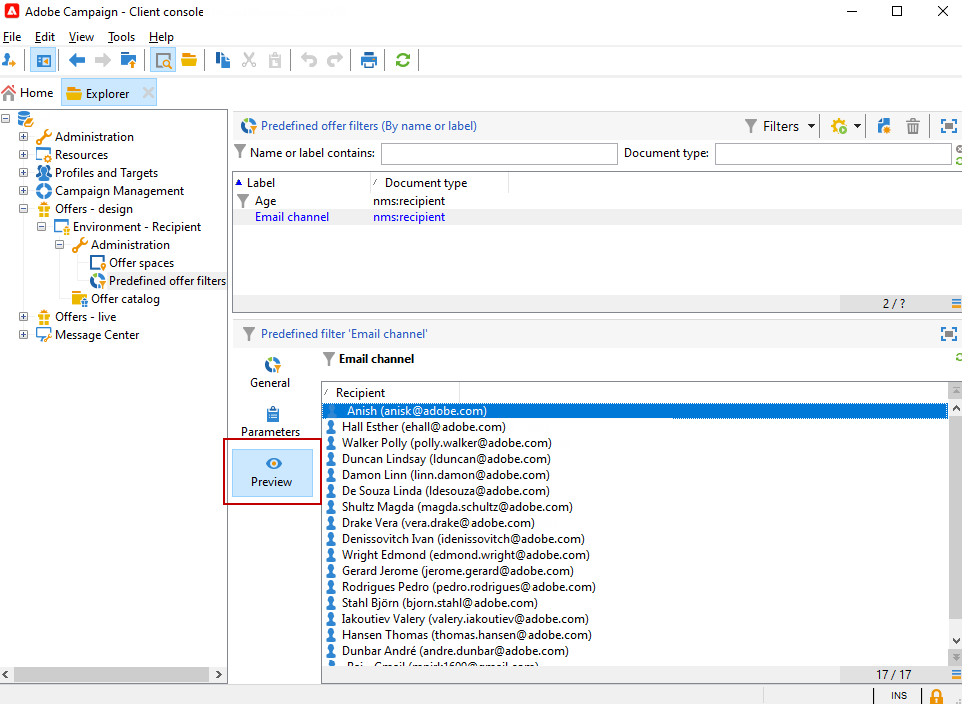

# Vooraf gedefinieerde filters maken{#creating-pre-defined-filters}

Vooraf gedefinieerde filters maken om de subsidiabiliteitsregels voor de doelpopulatie te definiëren die gemakkelijk opnieuw kunnen worden gebruikt tijdens het maken van aanbiedingen. Zij zijn specifiek voor elke milieu en houden rekening met de aanbiedingsparameters.

>[!NOTE]
>
>Adobe Campaign Web UI biedt u een gebruikersvriendelijke interface om vooraf bepaalde filters gemakkelijk te beheren en aan te passen om aan uw specifieke behoeften te voldoen. Maak één keer en sla dit op voor toekomstig gebruik. Meer over Vooraf bepaalde filters voor Web UI leren, gelieve te verwijzen naar de [ documentatie van het Web UI van Adobe Campaign ](https://experienceleague.adobe.com/nl/docs/campaign-web/v8/start/predefined-filters){target=_blank}.

Pas het volgende proces toe om een vooraf gedefinieerd filter te maken:

1. Blader naar de map **[!UICONTROL Administration]** en selecteer **[!UICONTROL Pre-defined offer filters]** .

   

1. Klik op **[!UICONTROL New]**.

   

1. Wijzig het label zodat het filter later kan worden geïdentificeerd.

   

1. Selecteer het gebied dat de het filtreren voorwaarde zal betreffen.

   

1. Selecteer indien nodig een operator en een waarde en sla de query op.

   

1. Klik op **[!UICONTROL Preview]** om het resultaat van het filter weer te geven.

   
