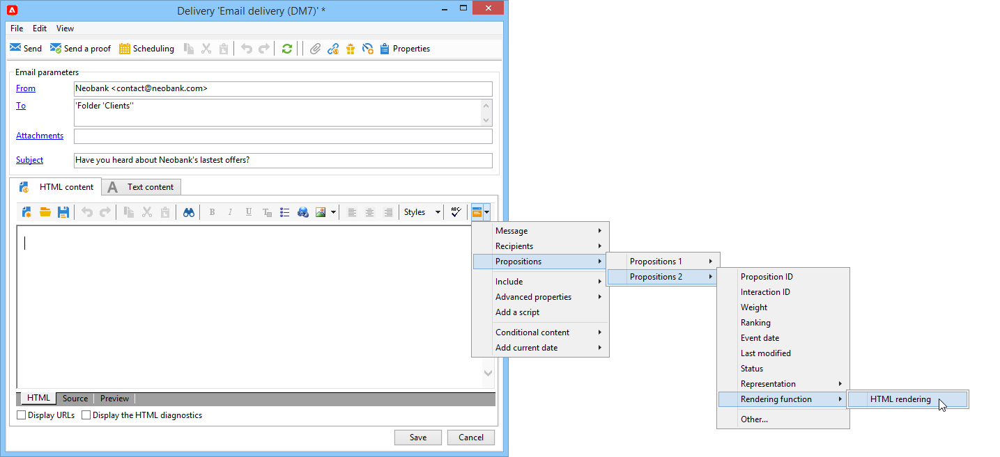

# Een voorstel verzenden

Om een voorstel door de motor van de Aanbieding te selecteren, heeft het goedgekeurd en beschikbaar in **Live** milieu. [Meer informatie](interaction-offer.md#approve-offers)

Aanbiedingspresentatie via een uitgaand communicatiekanaal wordt uitgevoerd via direct mail, e-mail of mobiele leveringen. U kunt de eenheidswijze met Transactieoverseinen (het Centrum van het Bericht) ook gebruiken.

## Een voorstel invoegen in een levering {#offer-into-a-delivery}

Volg onderstaande stappen om voorstellen voor aanbiedingen in te voegen in een levering:

1. Klik in het leveringsvenster op de knop **Aanbiedingen** pictogram.

   

1. Selecteer de ruimte die overeenkomt met uw aanbiedingsomgeving.

   

1. Als u de keuze van de motor van de aanbiedingen wilt verfijnen, selecteert u de categorie waaruit de aan te bieden aanbieding(en) deel uitmaakt of een of meer thema&#39;s. We raden u aan slechts één van deze velden tegelijk te gebruiken om overbelasting van de beperkingen te voorkomen.

   

   

1. Geef het aantal voorstellen op dat u in de leveringstekst wilt invoegen.

   

1. Selecteer **[!UICONTROL Exclude non-eligible recipients]** indien nodig. [Meer informatie](#parameters-for-calling-offer-engine)

   

1. Selecteer indien nodig de **[!UICONTROL Do not display anything if no offers are selected]** optie. [Meer informatie](#parameters-for-calling-offer-engine)

   

1. Voeg de eigenschappen in de leveringsinhoud in met behulp van de samenvoegvelden. Het aantal beschikbare voorstellen hangt van de manier af de motorvraag wordt gevormd en hun orde hangt van de prioriteit van aanbiedingen af.

   

1. Voltooi de inhoud, test en verzend uw levering.

   

### Parameters van de Offertenmotor {#parameters-for-calling-offer-engine}

* **[!UICONTROL Space]** : ruimte van de aanbiedingsomgeving die moet worden geselecteerd om de engine voor voorstellen te activeren.
* **[!UICONTROL Category]** : specifieke map waarin aanbiedingen worden gesorteerd. Als er geen categorie is opgegeven, worden alle aanbiedingen in de omgeving in aanmerking genomen door de Offertenengine, tenzij er een thema is geselecteerd.
* **[!UICONTROL Themes]** : sleutelwoorden die stroomopwaarts in de categorieën worden gedefinieerd. Deze fungeren als een filter en u kunt het aantal aanbiedingen dat moet worden weergegeven, verfijnen door ze in een set categorieën te selecteren.
* **[!UICONTROL Number of propositions]** : het aantal aanbiedingen dat door de motor wordt geretourneerd en dat in de leveringsbak kan worden ingevoegd. Als zij niet in het bericht worden opgenomen, zullen de aanbiedingen nog worden geproduceerd, maar niet voorgesteld.
* **[!UICONTROL Exclude non-eligible recipients]** : Met deze optie kunt u de uitsluiting activeren of deactiveren van ontvangers voor wie onvoldoende geschikte voorstellen zijn. Het aantal in aanmerking komende voorstellen kan lager zijn dan het gevraagde aantal voorstellen. Als deze doos wordt gecontroleerd, zullen de ontvangers die niet genoeg voorstellen hebben van de levering worden uitgesloten. Als u deze optie niet selecteert, worden deze ontvangers niet uitgesloten, maar hebben ze niet het gewenste aantal voorstellen.
* **[!UICONTROL Do not display anything if no offer is selected]** : Met deze optie kunt u kiezen hoe het bericht wordt verwerkt als een van de voorstellen niet bestaat. Als dit selectievakje is ingeschakeld, wordt de representatie van het ontbrekende voorstel niet weergegeven en wordt er geen inhoud weergegeven in het bericht voor dit voorstel. Als de doos niet wordt gecontroleerd, wordt het bericht zelf geannuleerd tijdens het verzenden en de ontvangers zullen geen berichten meer ontvangen.

## Aanbiedingen verzenden in workflows{#offer-via-wf}

Met behulp van verschillende workflowactiviteiten kunt u bepalen hoe aanbiedingen worden weergegeven:

* Verrijking
* Aanbiedingsengine
* Aanbiedingen per cel

### Verrijking {#enrichment}

De **Verrijking** Met activiteiten kunt u voorstellen of koppelingen toevoegen aan aanbiedingen voor ontvangers van de levering.

 Voor meer informatie over de verrijkingsactiviteit raadpleegt u [Campaign Classic v7-documentatie](https://experienceleague.adobe.com/docs/campaign-classic/using/automating-with-workflows/targeting-activities/enrichment.html)

Bijvoorbeeld, kunt u de gegevens voor een ontvankelijke vraag vóór een levering verrijken.

Er zijn twee methoden om voorstellen voor aanbiedingen op te geven.

* Het specificeren van een aanbieding of een de motorvraag van de Aanbieding.
* Verwijzen naar een koppeling naar een aanbieding.

#### Geef een aanbieding of een oproep aan de Offertenmotor op {#specifying-an-offer-or-a-call-to-the-offer-engine}

Nadat u uw **Query** activiteit:

1. Een **Verrijking** activiteit.
1. Selecteer op het tabblad **[!UICONTROL Enrichment]** de optie **[!UICONTROL Add data]**.
1. Selecteren **[!UICONTROL An offer proposition]** in de typen gegevens die moeten worden toegevoegd.

   

1. Geef een id en een label op voor het voorstel dat wordt toegevoegd.
1. Geef de selectie van de aanbieding op. Hiervoor zijn twee mogelijkheden:

   * **[!UICONTROL Search for the best offer in a category]** : controleert deze optie en specificeert de parameters van de de motorvraag van de Aanbieding (aanbieding ruimte, categorie of thema(s), contactdatum, aantal aan te houden aanbiedingen). De motor berekent automatisch de aanbieding(en) die volgens deze parameters moet worden toegevoegd. We raden u aan om de **[!UICONTROL Category]** of de **[!UICONTROL Theme]** in plaats van beide.

      

   * **[!UICONTROL A pre-defined offer]** : controleer deze optie en specificeer een aanbiedingsruimte, een specifieke aanbieding, en een contactdatum om de aanbieding direct te vormen die u, zonder de motor van de Aanbieding te roepen wilt toevoegen.

      

1. Dan vorm een leveringsactiviteit die aan uw gekozen kanaal beantwoordt. [Meer informatie](#offer-into-a-delivery)

   >[!NOTE]
   >
   >Het aantal voorstellen dat beschikbaar is voor de voorvertoning is afhankelijk van de configuratie die wordt uitgevoerd in de verrijkingsactiviteit in plaats van een mogelijke configuratie die rechtstreeks in de levering wordt uitgevoerd.

#### Verwijzen naar een link naar een aanbieding {#referencing-a-link-to-an-offer}

U kunt ook verwijzen naar een koppeling naar een voorstel in een **Verrijking** activiteit.

Volg de onderstaande stappen om dit te doen:

1. Selecteren **[!UICONTROL Add data]** in de activiteit **[!UICONTROL Enrichment]** tab.
1. Selecteer in het venster waarin u het type gegevens kiest dat u wilt toevoegen **[!UICONTROL A link]**.
1. Selecteer het type koppeling dat u wilt maken en het doel ervan. In dit geval is het doel het aanbiedingsschema.

   

1. Specificeer zich tussen de binnenkomende lijstgegevens in de verrijkingsactiviteit (hier de ontvankelijke lijst) en de aanbiedingstabel aan. U kunt bijvoorbeeld een aanbiedingscode koppelen aan een ontvanger.

   

1. Dan vorm een leveringsactiviteit die aan uw gekozen kanaal beantwoordt. [Meer informatie](#offer-into-a-delivery)

   >[!NOTE]
   >
   >Het aantal voorvertoningen dat beschikbaar is voor de voorvertoning, is afhankelijk van de configuratie die in de levering wordt uitgevoerd.

#### Opslagaanbiedingen en -gewichten {#storing-offer-rankings-and-weights}

Standaard, wanneer een **Verrijking** de activiteit wordt gebruikt om aanbiedingen te leveren, worden hun rangschikkingen en hun gewichten niet opgeslagen in de propositietabel.

>[!NOTE]
>
>De **[!UICONTROL Offer engine]** Deze informatie wordt standaard opgeslagen door de activiteit.

U kunt deze gegevens echter als volgt opslaan:

1. Creeer een vraag aan de motor van de Aanbieding in een verrijkingsactiviteit die na een vraag en vóór een leveringsactiviteit wordt geplaatst. [Meer informatie](#specifying-an-offer-or-a-call-to-the-offer-engine)
1. Selecteer in het hoofdvenster van de activiteit de optie **[!UICONTROL Edit additional data...]**.

   

1. Voeg de **[!UICONTROL @rank]** kolommen voor de rangorde en **[!UICONTROL @weight]** voor het aanbiedingsgewicht.

   

1. Bevestig uw toevoeging en sla uw workflow op.

De levering slaat automatisch de rangschikking en het gewicht van de aanbiedingen op. Deze informatie is zichtbaar in de levering **[!UICONTROL Offers]** tab.

### Aanbiedingsengine {#offer-engine}

De **[!UICONTROL Offer engine]** De activiteit laat u ook een vraag aan de motor van de Aanbieding vóór de levering specificeren.

 Voor meer informatie over **Aanbiedingsengine** activiteit, zie [Campaign Classic v7-documentatie](https://experienceleague.adobe.com/docs/campaign-classic/using/automating-with-workflows/targeting-activities/offer-engine.html)

Deze activiteit werkt volgens hetzelfde principe als de **Verrijking** activiteit met een motoraanroep, door de binnenkomende bevolkingsgegevens te verrijken met een aanbod dat door de motor wordt berekend, vóór de levering.

Nadat u uw **Query** activiteit:

1. Een **[!UICONTROL Offer engine]** activiteit.
1. Vul de verschillende beschikbare velden in om de oproep tot het indienen van voorstellen voor motorparameters op te geven (ruimte, categorie of thema(&#39;s), contactdatum, aantal aanbiedingen dat u wilt behouden). De motor berekent automatisch de aanbieding(en) die volgens deze parameters moet worden toegevoegd.

   >[!CAUTION]
   >
   >Als u deze activiteit gebruikt, zullen slechts de aanbiedingsvoorstellen die in de levering worden gebruikt worden opgeslagen.

   

1. Dan vorm een leveringsactiviteit die aan uw gekozen kanaal beantwoordt. [Meer informatie](#inserting-an-offer-proposition-into-a-delivery)

### Aanbiedingen per cel {#offers-by-cell}

De **[!UICONTROL Offers by cell]** de activiteit laat u de binnenkomende bevolking (van een vraag bijvoorbeeld) in verscheidene segmenten verdelen en een aanbieding specificeren om voor elk van deze segmenten voor te stellen.

 Voor meer informatie over **Aanbieden per cel** activiteit, zie [Campaign Classic v7-documentatie](https://experienceleague.adobe.com/docs/campaign-classic/using/automating-with-workflows/targeting-activities/offers-by-cell.html)

Hiervoor gebruikt u het volgende proces:

1. Voeg de **[!UICONTROL Offers by cell]** activiteit zodra u de doelpopulatie hebt gespecificeerd, dan open het.
1. In de **[!UICONTROL General]** selecteert u de aanbiedingsruimte waarop u de voorstellen wilt weergeven.
1. In de **[!UICONTROL Cells]** , geeft u de verschillende subsets op met de **[!UICONTROL Add]** knop:

   * Geef de subsetpopulatie op met behulp van de beschikbare regels voor filteren en beperken.
   * Selecteer vervolgens het voorstel dat u aan de subset wilt presenteren. De beschikbare aanbiedingen zijn die welke in aanmerking komen op het aanbiedingsmilieu dat in de vorige stap werd geselecteerd.

      

1. Dan vorm een leveringsactiviteit die aan uw gekozen kanaal beantwoordt.

<!--

## Delivering with delivery outlines {#delivering-with-delivery-outlines}

You can also present offers in a delivery using delivery outlines.

For more information on delivery outlines, refer to the Campaign - MRM guide.

1. Create a new campaign or access an existing campaign.
1. Access the delivery outlines via the campaign's **[!UICONTROL Edit]** > **[!UICONTROL Documents]** tab.
1. Add an outline then insert as many offers as you like into it by right-clicking on the outline and selecting **[!UICONTROL New]** > **[!UICONTROL Offer]**, then save the campaign.

1. Create a delivery whose delivery outlines you have access to (for example, a direct mail delivery).
1. When editing the delivery, click **[!UICONTROL Select a delivery outline]**.

   >[!NOTE]
   >
   >Depending on the type of delivery, this option can be found in the **[!UICONTROL Properties]** > **[!UICONTROL Advanced]** menu (for email deliveries for example).

1. Using the **[!UICONTROL Offers]** button, you can then configure the offer space as well as the number of offers to present in the delivery.

1. Add the propositions into the delivery body using the personalization fields (for more on this, refer to the [Inserting an offer proposition into a delivery](#inserting-an-offer-proposition-into-a-delivery) section), or in the case of a direct mail delivery, by editing the extraction file format.

   Propositions will be selected from the offers referenced in the delivery outline.

   >[!NOTE]
   >
   >Information regarding the offer rankings and weights is only saved in the proposition table if the offers are generated directly in the delivery.
-->
