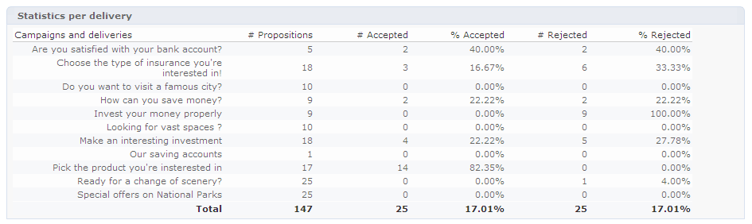

# Realtime interactiegeschiedenis en rapportage

>[!NOTE]
>
>Deze functies zijn alleen online zichtbaar en alleen voor de **Leveringsmanagers**.

## Geschiedenis van aanbiedingsvoorstellen{#offer-proposition-history}

Zodra je voorstellen hebt gedaan, kun je de presentatiegeschiedenis bekijken.

* Op het niveau van het aanbod, in de **[!UICONTROL Edit]** tabblad, klikt u op **[!UICONTROL Propositions]**.

   

* Klik vanuit het profiel van een ontvanger op de knop **[!UICONTROL Propositions]** tab.

   

* Klik op het niveau van de aanbiedingsruimte op de knop **[!UICONTROL Propositions]** tab.

   

## Analyserapport van aanbiedingen{#offer-analysis-report}

De **[!UICONTROL Offer analysis]** bevat een overzicht van het aantal geaccepteerde of afgewezen voorstellen.

Statistieken worden gesorteerd op basis van drie criteria:

* Op datum:

   

* Op spatie:

   

* Per levering:

   

Gegevens kunnen worden gefilterd op basis van de verschillende criteria die beschikbaar zijn in de bovenste sectie van het rapport. Als u de gewenste criteria hebt geselecteerd, klikt u op de knop **[!UICONTROL Refresh]** koppeling om deze op het rapport toe te passen.
