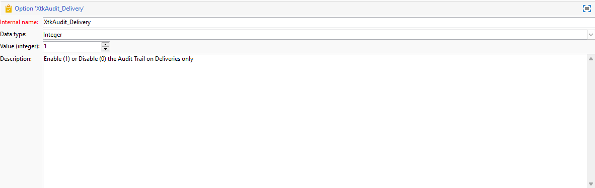

# Audit trail{#audit-trail}

De **[!UICONTROL Audit trail]** De functionaliteit in Adobe Campaign biedt een gedetailleerd overzicht van alle wijzigingen die zijn aangebracht aan belangrijke entiteiten in uw instantie, meestal entiteiten die een vlotte werking van de instantie aanzienlijk beïnvloeden. Als logboek in real time, vangt het een gedetailleerde lijst van acties en gebeurtenissen aangezien zij voorkomen.

>[!NOTE]
>
>Adobe Campaign controleert geen wijzigingen die zijn aangebracht in gebruikersrechten, sjablonen, personalisatie of campagnes.\
>Het spoor van de controle kan slechts door beheerders van de instantie worden beheerd.

+++ Meer informatie over beschikbare entiteiten van het audittrail

* **Schema audit trail**: staat u toe om de veranderingen te onderzoeken die aan uw schema&#39;s worden aangebracht, evenals te identificeren wie deze wijzigingen en toen zij voorkwamen.

  Raadpleeg voor meer informatie over schema&#39;s [page](../dev/schemas.md).

* **Workflowaudittrail** Hiermee worden alle handelingen bijgehouden die betrekking hebben op uw workflows, waaronder:

   * Starten
   * Pauzeren
   * Stoppen
   * Opnieuw starten
   * Opschonen wat overeenkomt met de handeling Historie leegmaken
   * Simuleer wat aan de actieBegin op simulatiemodus evenaart
   * Wakeup die gelijk is aan de handeling Voer taken uit die in behandeling zijn.
   * Onvoorwaardelijk stoppen

  Raadpleeg deze voor meer informatie over workflows [page](../../automation/workflow/about-workflows.md).

  Raadpleeg voor meer informatie over het controleren van workflows de [speciale sectie](../../automation/workflow/monitor-workflow-execution.md).

* **Optie audittrail** staat u toe om activiteiten en laatste wijzigingen te controleren die aan uw opties worden gedaan.

  Raadpleeg deze voor meer informatie over opties [page](https://experienceleague.adobe.com/nl/docs/campaign-classic/using/installing-campaign-classic/appendices/configuring-campaign-options).

* **Afleveringsaudittrail** kunt u de activiteiten en de laatste wijzigingen die u hebt aangebracht in uw leveringen controleren.

  Raadpleeg de volgende secties voor meer informatie over leveringen [page](../start/create-message.md).

* **Externe account** kunt u wijzigingen controleren die in externe rekeningen worden aangebracht, die door technische processen zoals technische werkschema&#39;s of campagnewerkschema&#39;s worden gebruikt.

  Voor meer informatie over externe account raadpleegt u deze [page](../config/external-accounts.md).

* **Aflevering toewijzen** laat u toe om activiteiten en recente wijzigingen te controleren die aan uw Toewijzingen van de Levering worden aangebracht.

  Raadpleeg deze voor meer informatie over leveringstoewijzing [page](../audiences/target-mappings.md).

* **Webtoepassing** Hiermee kunt u wijzigingen controleren die in webformulieren zijn aangebracht in Campagne V8 waarmee pagina&#39;s met invoer- en selectievelden worden gemaakt en die gegevens uit de database kunnen bevatten.

  Raadpleeg deze voor meer informatie over webtoepassingen [page](../dev/webapps.md).

* **Voorstel** Hiermee kunt u de activiteiten en de laatste wijzigingen in uw voorstellen controleren.

  Raadpleeg voor meer informatie over aanbiedingen deze [page](../interaction/interaction.md).

* **Operator** laat u toe om activiteiten en recente wijzigingen te controleren die aan uw Operatoren worden aangebracht.

  Raadpleeg de volgende secties voor meer informatie over operatoren [page](../interaction/interaction-operators.md).

+++

## Audittrail openen {#accessing-audit-trail}

Toegang krijgen tot de **[!UICONTROL Audit trail]**:

1. Toegang krijgen tot de **[!UICONTROL Explorer]** van uw instantie.

1. Onder de **[!UICONTROL Administration]** menu, selecteert u **[!UICONTROL Audit]** dan **[!UICONTROL Audit Trail]**.

   

1. De **[!UICONTROL Audit trail]** wordt geopend met de lijst van uw entiteiten. Adobe Campaign controleert het maken, bewerken en verwijderen van acties voor uw verschillende entiteiten.

   Selecteer een van de entiteiten voor meer informatie over de laatste wijzigingen.

1. De **[!UICONTROL Audit entity]** het venster geeft u meer gedetailleerde informatie over de gekozen entiteit zoals:

   * **[!UICONTROL Type]**: Workflow, opties, leveringen of schema&#39;s.
   * **[!UICONTROL Entity]**: Interne naam van uw activiteiten.
   * **[!UICONTROL Modified by]**: Gebruikersnaam van de laatste persoon die deze entiteit als laatste heeft gewijzigd.
   * **[!UICONTROL Action]**: De laatste actie die op deze entiteit is uitgevoerd, is gemaakt, gewijzigd of verwijderd.
   * **[!UICONTROL Modification date]**: Datum van de laatste actie die op deze entiteit is uitgevoerd.

   

>[!NOTE]
>
>De bewaarperiode is standaard ingesteld op 180 dagen voor **[!UICONTROL Audit logs]**. Deze waarde kan in de plaatsingstovenaar worden gewijzigd.

## Audittrail in-/uitschakelen {#enable-disable-audit-trail}

Het audittrail kan gemakkelijk voor een specifieke activiteit worden geactiveerd of worden gedeactiveerd als, bijvoorbeeld, u wat ruimte op het gegevensbestand wilt bewaren.

Dit doet u als volgt:

1. Toegang krijgen tot de **[!UICONTROL Explorer]** van uw instantie.

1. Onder de **[!UICONTROL Administration]** menu, selecteert u **[!UICONTROL Platform]** dan **[!UICONTROL Options]**.

1. Selecteer een van de volgende opties, afhankelijk van de entiteit die u wilt activeren/deactiveren:

   * Voor workflow: **[!UICONTROL XtkAudit_Workflows]**
   * Voor schema&#39;s: **[!UICONTROL XtkAudit_DataSchema]**
   * Voor opties: **[!UICONTROL XtkAudit_Option]**
   * Voor leveringen: **[!UICONTROL XtkAudit_Delivery]**
   * Voor externe account: **[!UICONTROL XtkAudit_ExtAccount]**
   * Voor leveringstoewijzing: **[!UICONTROL XtkAudit_DeliveryMapping]**
   * Voor webtoepassing: **[!UICONTROL XtkAudit_WebApp]**
   * Voor voorstel: **[!UICONTROL XtkAudit_Offer]**
   * Voor operator: **[!UICONTROL XtkAudit_Operator]**
   * Voor elke entiteit: **[!UICONTROL XtkAudit_Enable_All]**

   

1. Wijzig de **[!UICONTROL Value]** tot 1 als u de entiteit wilt toelaten of aan 0 als u het wilt onbruikbaar maken.

   

1. Klik op **[!UICONTROL Save]**.
