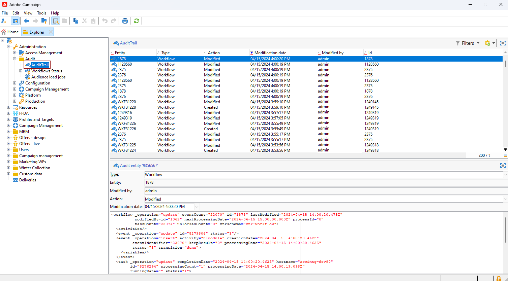

# Audit trail{#audit-trail}

De **[!UICONTROL Audit trail]** -functionaliteit in Adobe Campaign biedt een gedetailleerd overzicht van alle wijzigingen die zijn aangebracht aan belangrijke entiteiten in uw instantie, meestal entiteiten die een vloeiende bewerking van de instantie aanzienlijk beïnvloeden. Als logboek in real time, vangt het een gedetailleerde lijst van acties en gebeurtenissen aangezien zij voorkomen.

>[!NOTE]
>
>Adobe Campaign controleert geen wijzigingen die zijn aangebracht in gebruikersrechten, sjablonen, personalisatie of campagnes.\
>Het spoor van de controle kan slechts door beheerders van de instantie worden beheerd.

+++ Meer informatie over beschikbare entiteiten van het audittrail

* **de auditspoor van het Schema**: staat u toe om de veranderingen te onderzoeken die aan uw schema&#39;s worden aangebracht, evenals te identificeren wie deze wijzigingen maakte en wanneer zij voorkwamen.

  Voor gedetailleerde informatie over schema&#39;s, verwijs naar [ pagina ](../dev/schemas.md).

* **sporen van het de controlespoor van het 0&rbrace; Werkschema alle acties met betrekking tot uw werkschema&#39;s, met inbegrip van:**

   * Starten
   * Pauzeren
   * Stoppen
   * Opnieuw starten
   * Opschonen wat overeenkomt met de handeling Historie leegmaken
   * Simuleer wat aan de actieBegin op simulatiemodus evenaart
   * Wakeup die gelijk is aan de handeling Voer taken uit die in behandeling zijn.
   * Onvoorwaardelijk stoppen

  Voor meer informatie over werkschema&#39;s, verwijs naar deze [ pagina ](../../automation/workflow/about-workflows.md).

  Voor meer op hoe te om werkschema&#39;s te controleren, verwijs naar de [ specifieke sectie ](../../automation/workflow/monitor-workflow-execution.md).

* **de controlespoor van de Optie** staat u toe om activiteiten en laatste wijzigingen te controleren die aan uw opties worden gedaan.

  Voor meer informatie over opties, verwijs naar deze [ pagina ](https://experienceleague.adobe.com/en/docs/campaign-classic/using/installing-campaign-classic/appendices/configuring-campaign-options).

* **de controletrail van de Levering** staat u toe om de activiteiten en de laatste wijzigingen te controleren die aan uw leveringen worden gedaan.

  Voor meer informatie over leveringen, verwijs naar deze [ pagina ](../start/create-message.md).

* **Externe Rekening** staat u toe om wijzigingen te controleren die aan externe rekeningen worden aangebracht, die door technische processen zoals technische werkschema&#39;s of campagnewerkschema&#39;s worden gebruikt.

  Voor meer informatie over externe rekening, verwijs naar deze [ pagina ](../config/external-accounts.md).

* **Afbeelding van de Levering** laat u toe om activiteiten en recente wijzigingen te controleren die aan uw Toewijzingen van de Levering worden aangebracht.

  Voor meer informatie over leveringsafbeelding, verwijs naar deze [ pagina ](../audiences/target-mappings.md).

* **Toepassing van het Web** staat u toe om wijzigingen te controleren die aan de vormen van het Web in Campagne V8 worden aangebracht om pagina&#39;s met input en selectievelden tot stand te brengen, en die gegevens van het gegevensbestand kunnen omvatten.

  Voor meer informatie over Webtoepassing, verwijs naar deze [ pagina ](../dev/webapps.md).

* **Aanbieding** staat u toe om de activiteiten en de laatste wijzigingen te controleren die aan uw aanbiedingen worden gedaan.

  Voor meer informatie over aanbieding, verwijs naar deze [ pagina ](../interaction/interaction.md).

* **Exploitant** laat u toe om activiteiten en recente wijzigingen te controleren die aan uw Operatoren worden aangebracht.

  Voor meer informatie over exploitanten, verwijs naar deze [ pagina ](../interaction/interaction-operators.md).

+++

## Audittrail openen {#accessing-audit-trail}

Ga als volgt te werk om het exemplaar **[!UICONTROL Audit trail]** te openen:

1. Open het menu **[!UICONTROL Explorer]** van uw instantie.

1. Selecteer **[!UICONTROL Audit]** then **[!UICONTROL Audit Trail]** onder het menu **[!UICONTROL Administration]** .

   

1. Het venster **[!UICONTROL Audit trail]** wordt geopend met de lijst met entiteiten. Adobe Campaign controleert het maken, bewerken en verwijderen van acties voor uw verschillende entiteiten.

   Selecteer een van de entiteiten voor meer informatie over de laatste wijzigingen.

1. In het venster **[!UICONTROL Audit entity]** vindt u gedetailleerdere informatie over de gekozen entiteit, zoals:

   * **[!UICONTROL Type]**: Workflow, opties, leveringen of schema&#39;s.
   * **[!UICONTROL Entity]**: interne naam van uw activiteiten.
   * **[!UICONTROL Modified by]**: Gebruikersnaam van de laatste persoon die deze entiteit als laatste heeft gewijzigd.
   * **[!UICONTROL Action]**: De laatste actie die op deze entiteit is uitgevoerd, is gemaakt, gewijzigd of verwijderd.
   * **[!UICONTROL Modification date]**: Datum van de laatste actie die op deze entiteit is uitgevoerd.

   

>[!NOTE]
>
>De retentieperiode is standaard ingesteld op 180 dagen voor **[!UICONTROL Audit logs]** . Deze waarde kan in de plaatsingstovenaar worden gewijzigd.

## Audittrail in-/uitschakelen {#enable-disable-audit-trail}

Het audittrail kan gemakkelijk voor een specifieke activiteit worden geactiveerd of worden gedeactiveerd als, bijvoorbeeld, u wat ruimte op het gegevensbestand wilt bewaren.

Dit doet u als volgt:

1. Open het menu **[!UICONTROL Explorer]** van uw instantie.

1. Selecteer **[!UICONTROL Platform]** then **[!UICONTROL Options]** onder het menu **[!UICONTROL Administration]** .

1. Selecteer een van de volgende opties, afhankelijk van de entiteit die u wilt activeren/deactiveren:

   * Voor workflow: **[!UICONTROL XtkAudit_Workflows]**
   * Voor schema&#39;s: **[!UICONTROL XtkAudit_DataSchema]**
   * Voor opties: **[!UICONTROL XtkAudit_Option]**
   * Voor leveringen: **[!UICONTROL XtkAudit_Delivery]**
   * Voor externe account: **[!UICONTROL XtkAudit_ExtAccount]**
   * Voor levering toewijzen: **[!UICONTROL XtkAudit_DeliveryMapping]**
   * Voor webtoepassing: **[!UICONTROL XtkAudit_WebApp]**
   * Voor voorstel: **[!UICONTROL XtkAudit_Offer]**
   * Voor operator: **[!UICONTROL XtkAudit_Operator]**
   * Voor elke entiteit: **[!UICONTROL XtkAudit_Enable_All]**

   

1. Wijzig **[!UICONTROL Value]** in 1 als u de entiteit wilt inschakelen of in 0 als u deze wilt uitschakelen.

   

1. Klik op **[!UICONTROL Save]**.
