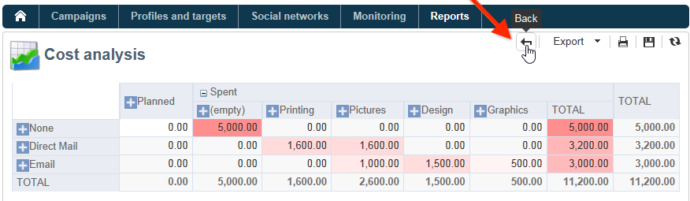

# Geïntegreerde Adobe Campaign-rapporten {#ootb-reports}

Deze pagina bevat een lijst met ingebouwde Adobe Campaign-rapporten, hun inhoud en hun context. Adobe Campaign biedt een reeks ingebouwde rapporten die toegankelijk zijn met de clientconsole of een internetbrowser.

De volgende typen rapporten zijn beschikbaar:

* Rapporten over het hele platform. [Meer informatie](global-reports.md).
* Leveringsrapporten. [Meer informatie](delivery-reports.md).

U kunt tot ingebouwde rapporten van de homepage van de Campagne, het specifieke rapportdashboard of de leveringslijst toegang hebben. De manier het rapport in UI toont hangt van zijn context af.

Een lijst van zeer belangrijke rapporten is beschikbaar op de homepage en laat u tot leveringsgegevens snel toegang hebben. U kunt deze lijst naar wens wijzigen. U kunt ook leren hoe u uw eigen rapporten aan het tabblad **[!UICONTROL Reports]** kunt toevoegen.

Voor meer informatie over deze douaneconfiguraties, verwijs naar deze [ Campaign Classic v7 documentatie ](https://experienceleague.adobe.com/docs/campaign-classic/using/reporting/creating-new-reports/configuring-access-to-the-report.html){target="_blank"}.

## Ingebouwde rapporten openen {#access-ootb-reports}

Voor toegang tot geïntegreerde campagnerapporten:

1. Selecteer het tabblad **[!UICONTROL Reports]** van de Adobe Campaign-interface.

   

1. Gebruik de onderzoeksgebieden om de getoonde rapporten te filtreren.

1. Klik vervolgens op het rapport dat u wilt weergeven.

   

1. Klik op de koppeling **[!UICONTROL Back]** boven in het scherm om terug te keren naar de lijst met rapporten.

   

Rapporten die specifiek zijn voor een campagne of levering zijn toegankelijk via hun respectieve dashboards.

Dit beginsel geldt ook voor lijsten, diensten, aanbiedingen, enz. zoals hieronder weergegeven:

## Verslagen over leveringen {#reports-on-deliveries}

De ingebouwde rapporten van Adobe Campaign zijn te vinden in de onderstaande tabel.

Voor meer op de inhoud van deze rapporten, verwijs naar [ deze sectie ](delivery-reports.md).

<table> 
 <tbody> 
  <tr> 
   <td> <strong> Etiket en Interne naam </strong>  </td> 
   <td> <strong>Beschrijving</strong>  </td> 
   <td> <strong> Schema </strong>  </td> 
  </tr> 
  <tr> 
   <td> Gebruikersactiviteiten (receivingActivity)   </td> 
   <td> Uitsplitsing van opent, klikt en transacties door tijdspanne.  </td> 
   <td> nms:delivery  </td> 
  </tr> 
  <tr> 
   <td> De productie van de levering (productie)   </td> 
   <td> De grafieken van de productie van de levering, in berichten/uur en Mbits/s.  </td> 
   <td> nms:delivery  </td> 
  </tr> 
  <tr> 
   <td> De mislukkingen en de stuitingen (fouten)   </td> 
   <td> Stuitingen en niet-te leveren posten door oorzaak en domein.  </td> 
   <td> nms:delivery  </td> 
  </tr> 
  <tr> 
   <td> Trackingindicatoren (deliveryFeedback)   </td> 
   <td> Samenvatting van zeer belangrijke indicatoren voor het volgen van ontvankelijk gedrag.  </td> 
   <td> nms:delivery  </td> 
  </tr> 
  <tr> 
   <td> Trackingindicatoren (mobileAppDeliveryFeedback)   </td> 
   <td> Het volgen indicatoren van een levering aan een mobiele toepassing.  </td> 
   <td> nms:delivery  </td> 
  </tr> 
  <tr> 
   <td> Browsers (browserStatistics)   </td> 
   <td> Statistieken over browsers die door ontvangers worden gebruikt die in berichten klikten.  </td> 
   <td> xtk:none  </td> 
  </tr> 
  <tr> 
   <td> Het delen aan sociale netwerken (deliveryForward)   </td> 
   <td> Het delen van activiteit en post open statistieken.  </td> 
   <td> nms:delivery  </td> 
  </tr> 
  <tr> 
   <td> Hete kliks (hoeken)   </td> 
   <td> Toont het bericht en de overlappende kliktarieven.  </td> 
   <td> nms:delivery  </td> 
  </tr> 
  <tr> 
   <td> Het rapport van de hypothese (deliveryHypothesis)   </td> 
   <td> Toont de samenvatting van maatregelen op leveringshypothesen.  </td> 
   <td> nms:delivery  </td> 
  </tr> 
  <tr> 
   <td> Statistieken van de levering (statisticsPerDelivery)   </td> 
   <td> Statistieken (verwerkte berichten, geleverde berichten, harde stuitingen, zachte stuiters, kliks, unsubscriptions) per e-maildomein.  </td> 
   <td> nms:delivery  </td> 
  </tr> 
  <tr> 
   <td> Het delen van activiteitenstatistieken (forwardActivity)   </td> 
   <td> Analyse van het delen van activiteiten, opent en abonnementen per tijdspanne.  </td> 
   <td> nms:delivery  </td> 
  </tr> 
  <tr> 
   <td> Het volgen statistieken (trackingStatistics)   </td> 
   <td> Open, klik en het rapport van de transactietarieven.  </td> 
   <td> nms:delivery  </td> 
  </tr> 
  <tr> 
   <td> Overzicht van de levering (deliverySending)   </td> 
   <td> Samenvatting van leveringsindicatoren: doel, uitsluiting en verzonden berichten.  </td> 
   <td> nms:delivery  </td> 
  </tr> 
  <tr> 
   <td> Overzicht van de levering (deliveryStatistics)   </td> 
   <td> Summiere lijst voor geselecteerde leveringen: Doelen, Uitsluitingen en Verzonden Berichten.  </td> 
   <td> nms:delivery  </td> 
  </tr> 
  <tr> 
   <td> De werkende systemen (osStatistics)   </td> 
   <td> Statistieken over de werkende systemen die door ontvangers worden gebruikt die in een bericht klikte.  </td> 
   <td> xtk:none  </td> 
  </tr> 
  <tr> 
   <td> Reactivity rate (deliveryFeedbackSocial)   </td> 
   <td> Uitsplitsing naar reactiviteit en reactie van de aflevering.  </td> 
   <td> nms:delivery  </td> 
  </tr> 
  <tr> 
   <td> URLs en klik productie (topUrlDelivery)   </td> 
   <td> Meest reactieve URLs en bijbehorende klikstromen.  </td> 
   <td> nms:delivery  </td> 
  </tr> 
 </tbody> 
</table>

## Verslagen over campagnes {#reports-on-campaigns}

De rapporten over campagnes betreffen de gegevens in **nms:verrichting** lijst.

<table> 
 <tbody> 
  <tr> 
   <td> <strong> Etiket en Interne naam </strong>  </td> 
   <td> <strong>Beschrijving</strong>  </td> 
  </tr> 
  <tr> 
   <td> Gebruikersactiviteiten (operationRecipientActivity)   </td> 
   <td> De onderverdeling van opent, klikt en transacties door tijdspanne, hangt van Campagne af.  </td> 
  </tr> 
  <tr> 
   <td> De productie van de levering (operationThroughput)   </td> 
   <td> De grafieken van de productie van de levering, in post/uur en Mbits/s, hangt van Campagne af.  </td> 
  </tr> 
  <tr> 
   <td> Campagneuitgaven (budgetOperationExpenses)   </td> 
   <td> Toont de punten van de campagnelijn in detail, hangt van Campagne af.  </td> 
  </tr> 
  <tr> 
   <td> Mislukkingen en stuitingen (operationErrors)   </td> 
   <td> Stuitingen en niet-te leveren zijn door oorzaak en domein, afhankelijk van Campagne.  </td> 
  </tr> 
  <tr> 
   <td> Het onderzoeken van kostenlijnen (budgetExplorerOperation)   </td> 
   <td> De beschrijvende analyse van kostenlijnen, hangt van MRM af.  </td> 
  </tr> 
  <tr> 
   <td> Trackingindicatoren (operationFeedback)   </td> 
   <td> Overzicht van zeer belangrijke volgende indicatoren: opent, klikt en Transacties, hangt van Campagne af.  </td> 
  </tr> 
  <tr> 
   <td> Het delen aan sociale netwerken (operationForward)   </td> 
   <td> Het delen van activiteit en post open statistieken, hangt van Campagne af.  </td> 
  </tr> 
  <tr> 
   <td> Het rapport van de hypothese (operationHypothesis)   </td> 
   <td> Toont de samenvatting van hypothesemetingen voor de campagneleveringen, hangt van Campagne af.  </td> 
  </tr> 
  <tr> 
   <td> Het delen van activiteitenstatistieken (forwardActivityOpt)   </td> 
   <td> De analyse van het delen van activiteiten, opent en abonnementen per tijdspanne, hangt van Campagne af.  </td> 
  </tr> 
  <tr> 
   <td> Overzicht van de levering (operationStatistics)   </td> 
   <td> Summiere grafiek van de campagneleveringen: Doelen, Uitsluitingen en Verzonden Berichten.  </td> 
  </tr> 
  <tr> 
   <td> URLs en klik productie (operationTopUrlDelivery)   </td> 
   <td> De meeste reactieve URLs en bijbehorende klikstromen, hangt van Campagne af.  </td> 
  </tr> 
 </tbody> 
</table>

## Rapporten over diensten {#reports-on-services}

De rapporten over de diensten betreffen de gegevens in **nms:de dienst** lijst.

<table> 
 <tbody> 
  <tr> 
   <td> <strong> Etiket en Interne naam </strong>  </td> 
   <td> <strong>Beschrijving</strong>  </td> 
  </tr> 
  <tr> 
   <td> De verwervingen van de waaier (socialAcquisitionsByWebapp)   </td> 
   <td> Welke Webtoepassingen lieten de perspectiefverwervingen toe? Afhankelijk van sociale marketing toe:voegen-aan.  </td> 
  </tr> 
  <tr> 
   <td> Uitsplitsing van abonnementen (mobileAppDistribution)   </td> 
   <td> De uitsplitsing van actieve abonnementen per mobiele toepassing is afhankelijk van de add-on voor het kanaal van de mobiele app.  </td> 
  </tr> 
  <tr> 
   <td> Het volgen van het abonnement (subscriptionsProgress)   </td> 
   <td> Evolutie van de abonnementen op informatiediensten   </td> 
  </tr> 
  <tr> 
   <td> Reactivity rate (socialReactionRate)   </td> 
   <td> Wat zijn de reactiviteitspercentages voor de meest recente leveringen? Afhankelijk van sociale marketing toe:voegen-aan.  </td> 
  </tr> 
  <tr> 
   <td> Reactivity rate (mobileAppReactivityRate)   </td> 
   <td> De mate van reactiviteit voor de meest recente leveringen is afhankelijk van de add-on voor het kanaal van de mobiele app.  </td> 
  </tr> 
 </tbody> 
</table>

## Begrotingsverslagen {#budget-reports}

De ingebouwde rapporten van Adobe Campaign zijn te vinden in de onderstaande tabel.

<table> 
 <tbody> 
  <tr> 
   <td> <strong> Etiket en Interne naam </strong>  </td> 
   <td> <strong>Beschrijving</strong>  </td> 
   <td> <strong> Schema </strong>  </td> 
  </tr> 
  <tr> 
   <td> Kosten in verband met programma(s) (budgetProgramCost)   </td> 
   <td> Uitsplitsing van programmakosten.  </td> 
   <td> nms:program  </td> 
  </tr> 
  <tr> 
   <td> De evolutie van de begroting (budgetEvolution)   </td> 
   <td> Ontwikkeling van de begrotingskosten per vastleggingsniveau.  </td> 
   <td> nms:budget  </td> 
  </tr> 
  <tr> 
   <td> Cumulatieve ontwikkeling van de begroting (budgetCumulativeEvolution)   </td> 
   <td> Evolutie van de gecumuleerde begrotingskosten, uitgesplitst naar komma   - niveau. </td> 
   <td> nms:budget  </td> 
  </tr> 
  <tr> 
   <td> Het onderzoeken van kostenlijnen (budgetExplorerBudget)   </td> 
   <td> Beschrijvende analyse van kostenlijnen.  </td> 
   <td> nms:budget  </td> 
  </tr> 
  <tr> 
   <td> Het onderzoeken van kostenlijnen (budgetExplorer)   </td> 
   <td> Beschrijvende analyse van kostenlijnen.  </td> 
   <td> nms:costLine   </td> 
  </tr> 
  <tr> 
   <td> Het onderzoeken van kostenlijnen (budgetExplorerPlan)   </td> 
   <td> Beschrijvende analyse van kostenlijnen.  </td> 
   <td> nms:plan  </td> 
  </tr> 
  <tr> 
   <td> Het onderzoeken van kostenlijnen (budgetExplorerProgram)   </td> 
   <td> Beschrijvende analyse van kostenlijnen.  </td> 
   <td> nms:program  </td> 
  </tr> 
  <tr> 
   <td> Samenvatting van de begroting(en) (begroting)   </td> 
   <td> Momentopname van de belangrijkste kosten, uitgavencategorieën en begrotingen.  </td> 
   <td> nms:budget  </td> 
  </tr> 
 </tbody> 
</table>

## Rapporten over simulaties {#reports-on-simulations}

De rapporten over simulaties betreffen de gegevens in **nms:simulatie** lijst.

<table> 
 <tbody> 
  <tr> 
   <td> <strong> Etiket en Interne naam </strong>  </td> 
   <td> <strong>Beschrijving</strong>  </td> 
  </tr> 
  <tr> 
   <td> Detail van simulatieuitsluitingen (dlvSimuLossesDetail)   </td> 
   <td> Gedetailleerde lijst van alle oorzaken van uitsluiting.  </td> 
  </tr> 
  <tr> 
   <td> Uitsplitsing van aanbiedingen door rang (offerSimulationRanking)   </td> 
   <td> Uitsplitsing van aanbiedingen in de simulatie, door rang.  </td> 
  </tr> 
  <tr> 
   <td> Samenvatting van de simulatie (dlvSimuLossesSummary)   </td> 
   <td> Samenvatting van simulatievolumes en uitsluitingen.  </td> 
  </tr> 
  <tr> 
   <td> Statistieken overlappen (dlvSimuOverlapping)   </td> 
   <td> Het doel van de levering overlapt volumes.  </td> 
  </tr> 
  <tr> 
   <td> Samenvatting van uitsluitingen toe te schrijven aan de simulatie (dlvSimuLossesSimu)   </td> 
   <td> Lijst van uitsluitingen toe te schrijven aan de simulatie.  </td> 
  </tr> 
 </tbody> 
</table>

## Rapporten over webtoepassingen {#reports-on-web-applications}

De rapporten over de toepassingen van het Web betreffen de gegevens in **nms:WebApp** lijst.

<table> 
 <tbody> 
  <tr> 
   <td> <strong> Etiket en Interne naam </strong>  </td> 
   <td> <strong>Beschrijving</strong>  </td> 
  </tr> 
  <tr> 
   <td> Documentatie (surveyDictionary)   </td> 
   <td> De beschrijving van de onderzoeksstructuur, hangt van de toe:voegen-op van de Manager van het Onderzoek af.  </td> 
  </tr> 
  <tr> 
   <td> Hoofd (surveyProperties)   </td> 
   <td> Eigenschappen van enquêtes   </td> 
  </tr> 
  <tr> 
   <td> Uitsplitsing van reacties (surveyDistribution)   </td> 
   <td> Uitsplitsing van antwoorden op vragen.  </td> 
  </tr> 
 </tbody> 
</table>

## Overige taakrapporten {#other-ootb-reports}

De volgende rapporten worden ook ingebouwd verstrekt. Raadpleeg voor meer informatie het desbetreffende document over de functionaliteit.

<table> 
 <tbody> 
  <tr> 
   <td> <strong> Etiket en Interne naam </strong>  </td> 
   <td> <strong>Beschrijving</strong>  </td> 
   <td> <strong> Schema </strong>  </td> 
  </tr> 
  <tr> 
   <td> De analyse van het aanbod (offerAnalysis)   </td> 
   <td> De analyse van het aanbod per datum en kanaal, hangt van toe:voegen-aan de Interactie af.  </td> 
   <td> nms:aanbieding  </td> 
  </tr> 
  <tr> 
   <td> Efficiëntie van hermarketing (remarketingEffect)   </td> 
   <td> Meting van de efficiëntie van het opnieuw in de handel brengen   </td> 
   <td> nms:webEvent   </td> 
  </tr> 
  <tr> 
   <td> Geschiedenis van sociale perspectiefverwervingen (socialVisitorStatistics)   </td> 
   <td> De geschiedenis van X (voorheen bekend als Twitter) en de perspectiefverwervingen van Facebook, hangt van de sociale marketing toe:voegen-op.  </td> 
   <td> nms:bezoeker   </td> 
  </tr> 
  <tr> 
   <td> Recente voorstel het volgen (recentProposities)   </td> 
   <td> Real-time proposition tracking   </td> 
   <td> nms:propositionRcp   </td> 
  </tr> 
 </tbody> 
</table>
