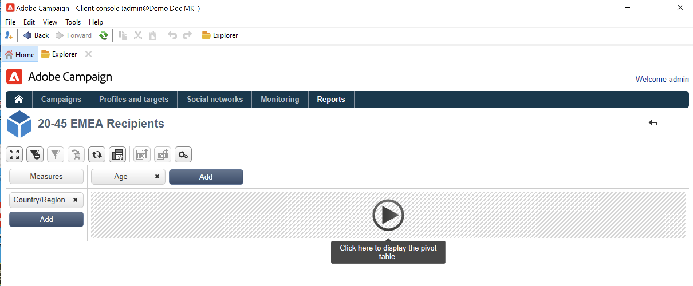
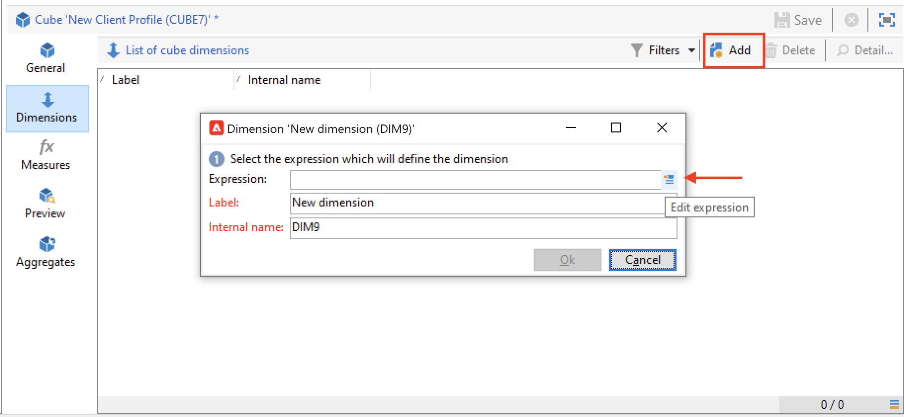

# Een kubus maken{#create-a-cube}

## De werkruimte Kubus {#cube-workspace}

Blader vanuit Campagneverkenner naar **[!UICONTROL Administration > Configuration > Cubes]** om toegang te krijgen tot kubussen.

Met kubussen kunt u:

* Exporteer gegevens rechtstreeks in een rapport dat is ontworpen op het tabblad **[!UICONTROL Reports]** van het Adobe Campaign-platform.

  Hiertoe maakt u een nieuw rapport en selecteert u de kubus die u wilt gebruiken.

  

  De kubussen verschijnen als malplaatjes die op welke rapporten worden gebaseerd worden gecreeerd. Zodra u een malplaatje hebt gekozen, klik **[!UICONTROL Create]** om het nieuwe rapport te vormen en te bekijken.

  U kunt maatregelen aanpassen, de vertoningswijze veranderen of de lijst vormen, dan het rapport tonen gebruikend de belangrijkste knoop.

  

* Verwijs naar een kubus in het **[!UICONTROL Query]** vakje van een rapport om zijn indicatoren te gebruiken, zoals hieronder getoond:

  

* Voeg een draaientabel die op een kubus is gebaseerd in een pagina van een rapport in. Hiervoor verwijst u naar de kubus die u wilt gebruiken op het tabblad **[!UICONTROL Data]** van de draaitabel op de betreffende pagina.

  

  Voor meer op dit, verwijs naar [ de gegevens in een rapport ](cube-tables.md#explore-the-data-in-a-report) ontdekken.

>[!CAUTION]
>
>Beheerdersmachtigingen zijn vereist voor het maken van kubussen.
>

## Een kubus maken{#cube-create}

Voordat u begint met het bouwen van een kubutrapport, identificeert u de relevante afmetingen en maatregelen en maakt u deze in de kubus.

Voer de volgende stappen uit om een kubus te maken:

1. Selecteer de werktabel. [Meer informatie](#select-the-work-table).
1. Definieer de afmetingen. [Meer informatie](#define-dimensions).
1. Bepaal maatregelen. [Meer informatie](#build-indicators).
1. Maak aggregaten (optioneel). [Meer informatie](customize-cubes.md#calculate-and-use-aggregates).

In het onderstaande voorbeeld leert u hoe u snel een eenvoudige kubus maakt in een rapport om de bijbehorende maatregelen te exporteren.

### De werktabel selecteren {#select-the-work-table}

Voer de volgende stappen uit om een kubus te maken:

1. Klik op de knop **[!UICONTROL New]** boven de lijst met kubussen.

   

1. Selecteer het schema dat de elementen bevat u wilt onderzoeken (ook genoemd het &quot;feitenschema&quot;). In dit voorbeeld, selecteer de standaard **Ontvanger** lijst.
1. Klik op **[!UICONTROL Save]** om de kubus te maken: deze wordt toegevoegd aan de lijst met kubussen. U kunt de lusjes nu gebruiken om het te vormen.

1. Klik op de koppeling **[!UICONTROL Filter the source data...]** om de berekeningen van deze kubus toe te passen op de gegevens in de database.

   

### Afmetingen definiëren {#define-dimensions}

Wanneer de kubus is gemaakt, definieert u de afmetingen ervan. De afmetingen zijn de analysegassen die voor elke kubus worden bepaald die op hun verwant feitenschema worden gebaseerd. Dit zijn de dimensies die in de analyse worden onderzocht, zoals tijd (jaar, maand, datum), een classificatie van producten of contracten (familie, referentie, enz.), een bevolkingssegment (per stad, leeftijdsgroep, status, enz.).

Voer de volgende stappen uit om afmetingen te maken:

1. Blader naar het tabblad **[!UICONTROL Dimension]** van de kubus en klik op de knop **[!UICONTROL Add]** om een nieuwe dimensie te maken.
1. Klik in **[!UICONTROL Expression field]** op het pictogram **[!UICONTROL Edit expression]** om het veld te selecteren dat de betrokken gegevens bevat.

   

1. In dit voorbeeld, selecteren wij de ontvankelijke **Leeftijd**. Voor dit gebied, kunt u het binden aan groepspagina&#39;s bepalen en informatie het lezen gemakkelijker maken. We raden u aan binden te gebruiken wanneer er meerdere afzonderlijke waarden mogelijk zijn.

Schakel de optie **[!UICONTROL Enable binning]** in om dit te doen. [Meer informatie](customize-cubes.md#data-binning).

1. Voeg de dimensie van het a **type van de Datum** {toe. Hier willen we datums weergeven waarop het ontvangende profiel is gemaakt. Klik hiertoe op **[!UICONTROL Add]** en selecteer het veld **[!UICONTROL Creation date]** in de tabel met ontvangers.
U kunt de modus voor datumweergave aanpassen. Selecteer hiervoor de hiërarchie die u wilt gebruiken en de niveaus die u wilt genereren:

In ons voorbeeld willen we alleen jaren, maanden en dagen weergeven. Merk op dat u niet met weken en semesters/maanden tezelfdertijd kunt werken: deze niveaus zijn niet compatibel.

1. Maak een andere dimensie voor het analyseren van gegevens ten opzichte van de stad van de ontvanger. Hiervoor voegt u een nieuwe dimensie toe en selecteert u de plaats in het knooppunt **[!UICONTROL Location]** van het ontvangende schema.

U kunt het binden toelaten om informatie het lezen gemakkelijker te maken en de waarden aan een [ opsomming ](../config/enumerations.md) te verbinden.

Selecteer de opsomming in de vervolgkeuzelijst. Deze opsomming moet worden gedefinieerd als **[!UICONTROL Reserved for binning]** .

Alleen de waarden in de opsomming worden weergegeven. De overige worden gegroepeerd onder het label dat is gedefinieerd in het veld **[!UICONTROL Label of the other values]** .

Raadpleeg [deze sectie](customize-cubes.md#dynamically-manage-bins) voor meer informatie.

### Indicatoren samenstellen {#build-indicators}

Wanneer de afmetingen zijn gedefinieerd, geeft u een berekeningsmodus op voor de waarden die in de cellen moeten worden weergegeven.

Hiertoe maakt u de indicatoren op het tabblad **[!UICONTROL Measures]** . Maak zoveel maatregelen als er kolommen moeten worden weergegeven in de rapporten die op deze kubus zijn gebaseerd.

Volg onderstaande stappen om indicatoren te maken:

1. Blader naar het tabblad **[!UICONTROL Measures]** en klik op de knop **[!UICONTROL Add]** .
1. Selecteer het type maatregel en de formule die u wilt toepassen. In dit voorbeeld tellen we het aantal vrouwen onder de ontvangers. Onze maatregel is gebaseerd op het feitenschema en gebruikt de **[!UICONTROL Count]** exploitant.

   

   Gebruik de koppeling **[!UICONTROL Filter the measure data...]** om alleen vrouwen te selecteren. [Meer informatie](customize-cubes.md#define-measures).

   

1. Voer het label van de maatregel in en sla deze op.

   

1. Sla de kubus op.

U kunt nu een rapport maken op basis van deze kubus. [Meer informatie](cube-tables.md).
