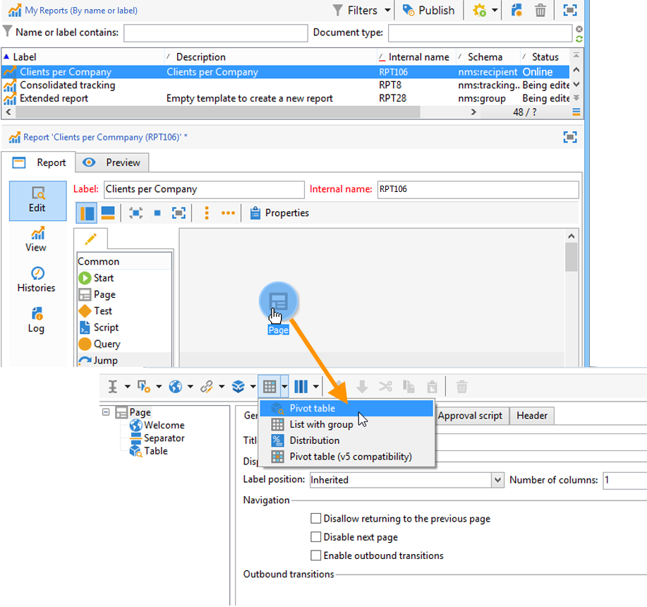

# Kubussen gebruiken om data gegevens te verkennen{#use-cubes-to-create-reports}

Gebruik kubussen om rapporten te maken en om gegevens in de database te identificeren en te selecteren. U kunt:

* Maak rapporten op basis van kubussen. [Meer informatie](#explore-the-data-in-a-report).
* Verzamel de gegevens in het gegevensbestand en groepeer het in lijsten, bijvoorbeeld om doelstellingen en leveringen te identificeren en te bouwen. [Meer informatie](#build-a-target-population).
* Voeg een draaitabel in een rapport in en verwijs naar een bestaande kubus in het rapport. [Meer informatie](#insert-a-pivot-table-into-a-report).

## De gegevens in een rapport verkennen {#explore-the-data-in-a-report}

### Stap 1 - creeer een rapport dat op een kubus wordt gebaseerd {#step-1---create-a-report-based-on-a-cube}

Wanneer de [kubus is geconfigureerd](cube-indicators.md), kan het als malplaatje voor het creëren van een nieuw rapport worden gebruikt.

Voer de volgende stappen uit om een rapport te maken op basis van een bestaande kubus:

1. Klik op de knop **[!UICONTROL Create]** van de **[!UICONTROL Reports]** en selecteert u de kubus die u zojuist hebt gemaakt.

   

1. Klik op de knop **[!UICONTROL Create]** ter bevestiging: dit zal u aan de rapportconfiguratie en het bekijken pagina brengen.

   Standaard worden de eerste twee beschikbare afmetingen aangeboden in lijnen en kolommen, maar er wordt geen waarde weergegeven in de tabel. Klik op het hoofdpictogram om de tabel te genereren:

   

1. U kunt de assen van de dimensie veranderen, hen schrappen, nieuwe maatregelen toevoegen, etc. Gebruik hiervoor de juiste pictogrammen.

   

   Deze transacties worden hieronder beschreven.

### Stap 2 - selecteer lijnen en kolommen {#step-2---select-lines-and-columns}

In de standaardweergave worden de eerste twee afmetingen van de kubus (in dit geval leeftijd en stad) weergegeven.

De **[!UICONTROL Add]** met de knoppen op elke as kunt u dimensies toevoegen.

1. Selecteer de afmetingen die u wilt weergeven in de lijnen en kolommen van de tabel. U doet dit door de beschikbare afmetingen te slepen en neer te zetten.
1. Selecteer in de lijst de afmetingen die u aan de tabel wilt toevoegen:
   

1. Selecteer vervolgens de parameters van deze dimensie.

   

   Deze parameters zijn afhankelijk van het gegevenstype van de geselecteerde dimensie.

   Voor datums kunnen bijvoorbeeld verschillende niveaus beschikbaar zijn. Raadpleeg voor meer informatie hierover [Weergavemetingen](customize-cubes.md#display-measures).

   In dat geval zijn de volgende opties beschikbaar:

   

   U kunt:

   * Gegevens uitbreiden tijdens laden: de waarden zullen door gebrek worden getoond telkens als het rapport wordt bijgewerkt (standaardwaarde: neen).
   * Het totaal aan het einde van de regel weergeven: wanneer de gegevens in kolommen worden weergegeven, kunt u het totaal aan het einde van de regel weergeven met een extra optie: er wordt een kolom aan de tabel toegevoegd (standaardwaarde): ja).
   * Een sortering toepassen: de waarden van de kolom kunnen worden gesorteerd op waarde, label of op basis van een maat (standaardwaarde: op waarde).
   * Geef de waarden weer in oplopende (a-z, 0-9) of aflopende (z-a, 9-0) volgorde.
   * Het aantal kolommen wijzigen dat bij het laden moet worden weergegeven (standaard: 200).

1. Klikken **[!UICONTROL Ok]** ter bevestiging: de dimensie wordt toegevoegd aan de bestaande afmetingen.

   De gele banner boven de tabel geeft aan dat u wijzigingen hebt aangebracht: klik op **[!UICONTROL Save]** om ze op te slaan.

   

### Stap 3 - Vorm de maatregelen om te tonen {#step-3---configure-the-measures-to-display}

Wanneer de lijnen en kolommen zijn gedefinieerd, selecteert u welke maatstaven u wilt weergeven. Standaard wordt slechts één maat weergegeven.

Volg onderstaande stappen om maatregelen toe te voegen en te configureren:

1. Klik op de knop **[!UICONTROL Measures]**.

   

1. Met de **[!UICONTROL Use a measure]** selecteert u een van de bestaande maatregelen.

   

   Kies de informatie die u wilt weergeven en de opmaakopties. De lijst met opties is afhankelijk van het type maatregel.

   

   De algemene maatconfiguratie is ook beschikbaar via de **[!UICONTROL Edit the configuration of the pivot table]** in de koptekst.

   

   Vervolgens kunt u kiezen of u maatlabels wilt weergeven of niet. [Meer informatie](customize-cubes.md#configure-the-display).

1. U kunt nieuwe maatregelen bouwen die op bestaande worden gebaseerd. Klik op **[!UICONTROL Create a measure]** en configureren.

   

   De volgende soorten maatregelen zijn beschikbaar:

   * Combinatie van maatregelen: met dit type maatregel kunt u de nieuwe maatregel bouwen met behulp van bestaande maatregelen :

      De beschikbare operatoren zijn: som, verschil, vermenigvuldiging en frequentie.

   * Verhouding: met dit type maatregel kunt u het aantal records berekenen dat voor een bepaalde dimensie wordt gemeten. U kunt de evenredigheid berekenen op basis van een dimensie of subdimensie.
   * Variatie: met deze maatregel kunt u de variatie in waarden van een niveau berekenen.
   * Standaardafwijking: met dit type meting kunt u afwijkingen binnen elke groep cellen berekenen in vergelijking met het gemiddelde van de waarden . U kunt bijvoorbeeld het aankoopvolume voor alle bestaande segmenten vergelijken.

   Nadat de maatregel is gemaakt, wordt deze aan het rapport toegevoegd.

   

   Nadat u een maatregel hebt gemaakt, kunt u deze bewerken en de configuratie ervan wijzigen. Om dit te doen, klik **[!UICONTROL Measures]** en bladert u naar het tabblad van de maatregel die u wilt bewerken.

   Klik vervolgens op **[!UICONTROL Edit the dynamic measure]** om het instellingenmenu te openen.

## Een doelpopulatie maken {#build-a-target-population}

De rapporten bouwen gebruikend kubussen laten u toe om gegevens van de lijst te verzamelen en het te bewaren in een lijst.

Voer de onderstaande stappen uit om een populatie in een lijst te groeperen:

1. Klik op de cellen die de te verzamelen populatie bevatten en selecteer deze. Klik vervolgens op de knop **[!UICONTROL Add to cart]** pictogram.

   

   Om dit zo vaak nodig te doen om diverse profielen te verzamelen

1. Klik op de knop **[!UICONTROL Show cart]** om de inhoud weer te geven voordat u het exporteren uitvoert.

   

1. Gebruik de **[!UICONTROL Export]** om de items in het winkelwagentje in een lijst te groeperen.

   Voer de naam van de lijst in en selecteer het type export dat u wilt uitvoeren.

   

   Klikken **[!UICONTROL Start]** om het exporteren uit te voeren.

1. Zodra de uitvoer volledig is, bevestigt een bericht zijn uitvoering en het aantal verslagen die zijn verwerkt.

   

   U kunt de inhoud van het winkelwagentje opslaan of leeg maken.

   De nieuwe lijst is beschikbaar via de **[!UICONTROL Profiles and targets]** tab.

   

## Een draaientabel invoegen in een rapport {#insert-a-pivot-table-into-a-report}

Volg onderstaande stappen om een tabel te maken en de gegevens in een kubus te verkennen:

1. Maak een nieuw rapport met één pagina en voeg er een draaitabel in.

   

1. In de **[!UICONTROL Data]** op de pagina selecteert u een kubus om de afmetingen ervan te verwerken en berekende metingen weer te geven.

   

   Dit laat u het rapport bouwen dat moet worden getoond. Raadpleeg voor meer informatie hierover [Stap 2 - selecteer lijnen en kolommen](#step-2---select-lines-and-columns).
