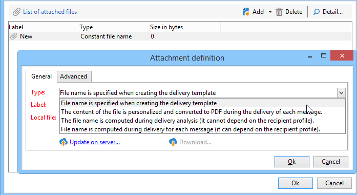
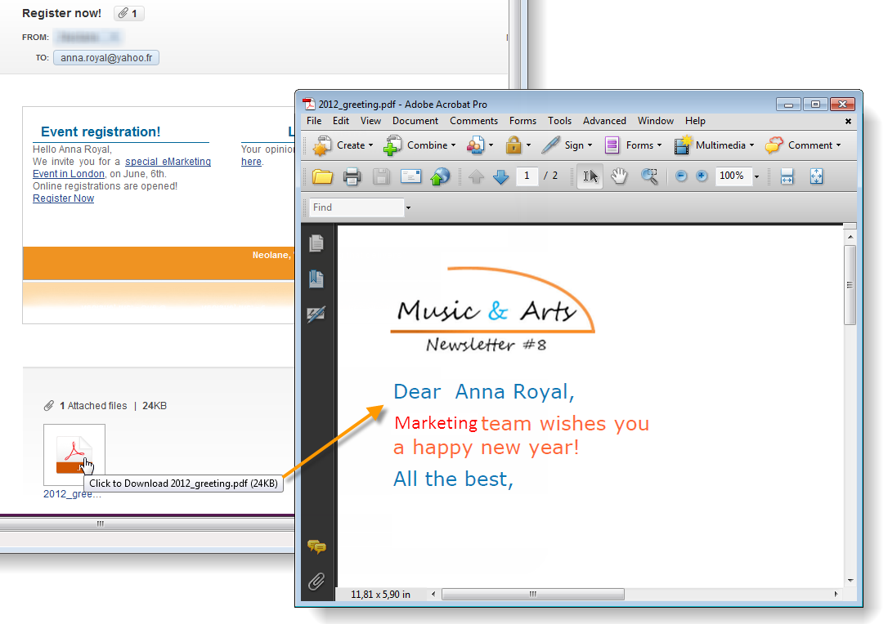

# Bestanden bijvoegen bij een e-mail{#attaching-files}

## E-mailbijlagen {#about-email-attachments}

U kunt een of meer bestanden bijvoegen bij een e-maillevering.

>[!NOTE]
>
>Om prestatieproblemen te voorkomen, wordt aanbevolen niet meer dan één bijlage per e-mail op te nemen. De aanbevolen drempelwaarde kan worden geconfigureerd in de lijst met campagneopties. Verwijs naar de [ documentatie van Campaign Classic ](https://experienceleague.adobe.com/docs/campaign-classic/using/installing-campaign-classic/appendices/configuring-campaign-options.html?lang=nl-NL#delivery).

Er zijn twee mogelijke gevallen:

* Selecteer een bestand en koppel het op dezelfde manier aan de levering.
* Pas de inhoud van de bijlage aan voor elke ontvanger. In dit geval, moet u a **berekende gehechtheid** tot stand brengen: de naam van de gehechtheid wordt gegevens verwerkt op het tijdstip van levering voor elk bericht afhankelijk van de ontvanger. De inhoud kan ook in formaat van PDF op het tijdstip van levering worden gepersonaliseerd en worden omgezet, als u de **Variabele Digitale Drukkerij** optie hebt.

>[!NOTE]
>
>Dit type van configuratie wordt over het algemeen uitgevoerd in de leveringsmalplaatjes. Voor meer op dit, verwijs naar de [ documentatie van Campaign Classic ](https://experienceleague.adobe.com/docs/campaign-classic/using/sending-messages/using-delivery-templates/about-templates.html?lang=nl-NL).

## Guardrails {#attachments-guardrails}

Om prestatieproblemen te voorkomen, mogen afbeeldingen in e-mailberichten niet groter zijn dan 100 kB. Deze standaard ingestelde limiet kan worden gewijzigd met de optie `NmsDelivery_MaxDownloadedImageSize` . Adobe raadt echter sterk aan om grote afbeeldingen in uw e-mailleveringen te voorkomen.

Adobe raadt ook aan de grootte en het aantal bijgevoegde bestanden te beperken. Standaard kunt u slechts één bestand als bijlage aan een e-mailbericht toevoegen. Deze drempel kan worden geconfigureerd via de optie `NmsDelivery_MaxRecommendedAttachments` .

Leer meer in de lijst van de opties van de Campagne in de [ documentatie van Campaign Classic ](https://experienceleague.adobe.com/docs/campaign-classic/using/installing-campaign-classic/appendices/configuring-campaign-options.html?lang=nl-NL#delivery).

## Een lokaal bestand bijvoegen {#attaching-a-local-file}

Volg onderstaande stappen om een lokaal bestand aan een levering te koppelen.

>[!NOTE]
>
>U kunt meerdere bestanden aan een levering koppelen. Bijlagen kunnen elke indeling hebben, inclusief de zipped-indeling.

1. Klik op de koppeling **[!UICONTROL Attachments]**.
1. Klik op de knop **[!UICONTROL Add]**.
1. Klik op **[!UICONTROL File...]** om het bestand te selecteren dat aan de levering moet worden gekoppeld.

   

U kunt het bestand ook rechtstreeks slepen en neerzetten in het bezorgveld **[!UICONTROL Attachments]** of het pictogram **[!UICONTROL Attach]** gebruiken op de werkbalk van de assistent voor levering.

Als het bestand is geselecteerd, wordt het direct naar de server geüpload om beschikbaar te zijn op het moment van levering. De naam wordt weergegeven in het veld **[!UICONTROL Attachments]** .

## Een berekende bijlage maken {#creating-a-calculated-attachment}

Wanneer u een berekende gehechtheid creeert, kan de naam van de gehechtheid tijdens analyse of levering van elk bericht worden berekend en kan van de ontvanger afhangen. Het kan ook worden gepersonaliseerd en in PDF worden omgezet.

Voer de volgende stappen uit om een gepersonaliseerde bijlage te maken:

1. Klik op de koppeling **[!UICONTROL Attachments]**.
1. Klik op de knop **[!UICONTROL Add]** en selecteer vervolgens **[!UICONTROL Calculated attachment]** .
1. Selecteer het type berekening in de vervolgkeuzelijst **[!UICONTROL Type]** :

De volgende opties zijn beschikbaar:

* **de naam van het Dossier wordt gespecificeerd wanneer het creëren van het leveringsmalplaatje**
* **de inhoud van het dossier wordt gepersonaliseerd en in PDF omgezet tijdens de levering van elk bericht**
* **het dossier - de naam wordt gegevens verwerkt tijdens leveringsanalyse (het kan niet van het ontvankelijke profiel afhangen)**
* **de naam van het Dossier wordt gegevens verwerkt op het tijdstip van levering voor elke ontvanger (het kan van de ontvanger afhangen)**

### Een lokaal bestand bijvoegen {#attach-a-local-file}

Als de bijlage een lokaal bestand is, selecteert u de optie: **[!UICONTROL File name is specified when creating the delivery template]** . Het bestand wordt lokaal geselecteerd en geüpload naar de server. Volg de onderstaande stappen:

1. Selecteer in het veld **[!UICONTROL Local file]** het bestand dat u wilt uploaden.
1. Geef zo nodig het label op. Het label vervangt de bestandsnaam bij weergave in een berichtensysteem. Als er niets is opgegeven, wordt standaard de bestandsnaam gebruikt.

   

1. Selecteer indien nodig **[!UICONTROL Upload file on the server]** en klik vervolgens op **[!UICONTROL Update on server]** om de overdracht te starten.

   

Het bestand is vervolgens beschikbaar op de server die moet worden gekoppeld aan de verschillende leveringen die op basis van deze sjabloon zijn gemaakt.

### Een gepersonaliseerd bericht bijvoegen {#attach-a-personalized-message}

Met de optie **[!UICONTROL The file content is personalized and converted into PDF format at the time of delivery for each message]** kunt u een bestand met verpersoonlijkingsvelden selecteren, zoals de achternaam en voornaam van de bedoelde ontvanger.

Voor dit type van gehechtheid, pas de volgende configuratiestappen toe:

1. Selecteer het bestand dat u wilt uploaden.
1. Geef zo nodig het label op.
1. Selecteer **[!UICONTROL Upload file on the server]** en klik op **[!UICONTROL Update on server]** om de overdracht te starten.
1. U kunt een voorvertoning weergeven. Selecteer een ontvanger om dit te doen.

   

1. Analyseer uw levering en begin het.

   Elke ontvanger ontvangt een gepersonaliseerde PDF die aan de levering is gekoppeld.

   

### Een berekend bestand bijvoegen {#attach-a-calculated-file}

U kunt de naam van de bijlage berekenen tijdens de voorbereiding van de levering. Selecteer de optie **[!UICONTROL The file name is calculated during delivery analysis (it cannot depend on the recipient)]** om dit te doen.

>[!NOTE]
>
>Deze optie wordt alleen gebruikt wanneer de levering wordt verzonden door een extern proces of een workflow.

1. Geef het label op dat u op de bijlage wilt toepassen.
1. Geef het toegangspad van het bestand en de exacte naam ervan op in het definitievenster.

   >[!IMPORTANT]
   >
   >Het bestand moet aanwezig zijn op de server.

   

1. Analyseer en start de levering.

   De berekening van de bestandsnaam kan worden weergegeven in het analyselogbestand.

   

### Een gepersonaliseerd bestand bijvoegen {#attach-a-personalized-file}

Als u de bijlage selecteert, kunt u de optie **[!UICONTROL The file name is calculated during delivery for each recipient (it can depend on the recipient)]** kiezen. Vervolgens kunt u persoonlijke gegevens van ontvangers toewijzen met de naam van het bestand dat u wilt verzenden.

>[!NOTE]
>
>Deze optie wordt alleen gebruikt wanneer de levering wordt verzonden door een extern proces of een workflow.

1. Geef het label op dat u op de bijlage wilt toepassen.
1. Geef het toegangspad van het bestand en de exacte naam ervan op in het definitievenster. Als de bestandsnaam gepersonaliseerd is, kunt u de velden Aanpassing gebruiken voor de relevante waarden.

   

   >[!IMPORTANT]
   >
   >Het bestand moet aanwezig zijn op de server.

1. Analyseer en start de levering.

   In het onderstaande voorbeeld is de naam van het bijgevoegde bestand zoals gedefinieerd met de samenvoegvelden.

   

### Bijlageinstellingen {#attachment-settings}

Voor de eerste twee opties kunt u **[!UICONTROL Upload file on the server]** kiezen door de juiste optie te selecteren. Met de koppeling **[!UICONTROL Update the file on the server]** kunt u beginnen met uploaden.

Een bericht geeft aan dat het bestand naar de server is geüpload:

Voor een wijziging van het bestand wordt een waarschuwingsbericht weergegeven:

Op het tabblad **[!UICONTROL Advanced]** kunt u geavanceerde opties definiëren voor bijgevoegde bestanden:

* U kunt filteropties definiëren om te voorkomen dat het bijgevoegde bestand naar alle ontvangers wordt verzonden. Met de optie **[!UICONTROL Enable filtering of recipients who will receive the attachment]** activeert u een invoerveld dat wordt gebruikt voor het definiëren van een script voor de selectie van ontvangers, dat moet worden ingevoerd in JavaScript.
* U kunt de naam van het bestand in een script opnemen om het bestand aan te passen.

  Voer uw tekst in het venster in en gebruik de velden voor personalisatie die beschikbaar zijn in de vervolgkeuzelijst. In het volgende voorbeeld, wordt filename gepersonaliseerd om de datum van vandaag en de naam van de ontvanger te bevatten.

  
