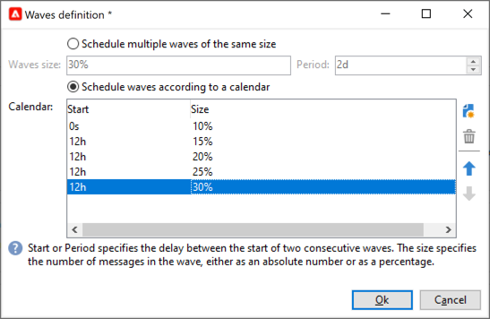

# De levering configureren en verzenden {#configure-delivery}

Heb toegang tot de leveringsparameters om meer montages te vormen en te bepalen hoe te om uw berichten te verzenden. U kunt de levering definiëren [prioriteit](#delivery-priority), instellen [golven](#sending-using-multiple-waves)en test het verzenden van de levering. Zodra deze configuratie wordt gedaan, kunt u het verzenden bevestigen zoals die in wordt beschreven [deze sectie](#confirm-delivery). De berichten worden dan verzonden onmiddellijk, of gebaseerd op de levering [schema](#schedule-delivery-sending).

## Aanvullende parameters instellen {#delivery-additional-parameters}

Voordat u de levering verzendt, kunt u de verzendende parameters in de leveringseigenschappen definiëren via de **[!UICONTROL Delivery]** tab.

### Leveringsprioriteit {#delivery-priority}

Gebruik de **[!UICONTROL Delivery priority]** optie om de verzendvolgorde voor uw leveringen te wijzigen door hun prioriteitsniveau in te stellen, van **[!UICONTROL Very low]** tot **[!UICONTROL Very high]** (de standaardwaarde is **[!UICONTROL Normal]**).

### Aantal partijen {#delivery-batch-quantity}

Gebruik de  **[!UICONTROL Message batch quantity]** Hiermee definieert u het aantal berichten dat is gegroepeerd binnen hetzelfde XML-leveringspakket. Als de parameter op 0 wordt geplaatst, worden de berichten automatisch gegroepeerd. De pakketgrootte wordt gedefinieerd door de berekening `<delivery size>/1024`, met minimaal 8 en maximaal 256 berichten per pakket.

>[!IMPORTANT]
>
>Wanneer de levering door bestaande wordt gecreeerd te dupliceren, wordt deze parameter teruggesteld.

### De verzending van de levering testen

Gebruik de  **[!UICONTROL Test SMTP delivery]** optie om het verzenden via SMTP te testen. De levering wordt verwerkt tot verbinding aan de server SMTP maar niet verzonden: voor elke ontvanger van de levering, verbindt de Campagne met de SMTP leverancierserver, voert SMTP RCPT aan bevel uit, en sluit de verbinding vóór het bevel SMTP DATA.

>[!NOTE]
>
>* Deze optie mag niet worden ingesteld in mid-sourcing.
>
>* Meer informatie over de SMTP-serverconfiguratie vindt u in [Campaign Classic v7-documentatie](https://experienceleague.adobe.com/docs/campaign-classic/using/installing-campaign-classic/additional-configurations/configure-delivery-settings.html#smtp-relay){target="_blank"}.

## Verzenden met meerdere golven {#sending-using-multiple-waves}

Als u de lading in evenwicht wilt brengen, kunt u leveringen in verscheidene partijen verdelen. Configureer het aantal partijen en hun verhouding ten opzichte van de volledige levering.

### Golven inschakelen {#enable-waves}

Ga als volgt te werk om golven te definiëren:

1. Open de leveringseigenschappen en blader aan **[!UICONTROL Delivery]** tab.
1. De optie **[!UICONTROL Send using multiple waves]** en klikt u op de knop **[!UICONTROL Define waves...]** koppeling.

   

### Golven configureren {#config-waves}

>[!NOTE]
>
>U kunt alleen de grootte en de vertraging tussen twee opeenvolgende golven definiëren. De ontvankelijke selectiecriteria voor elke golf kunnen niet worden gevormd.

U kunt de grootte van elke golf definiëren of toevoegen aan een kalender.

* **De grootte van elke golf definiëren**. Als u bijvoorbeeld **[!UICONTROL 30%]** op het overeenkomstige gebied, zal elke golf 30% van de berichten vertegenwoordigen inbegrepen in de levering, behalve laatste, die 10% van de berichten zal vertegenwoordigen.

  In de **[!UICONTROL Period]** geeft u de vertraging op tussen het begin van twee opeenvolgende golven. Als u bijvoorbeeld **[!UICONTROL 2d]** De eerste golf begint onmiddellijk, de tweede golf begint over twee dagen, de derde golf over vier dagen, enzovoort.

  

* **Een kalender definiëren voor het verzenden van elke golf**.  Bijvoorbeeld, vertegenwoordigt de eerste golf 25% van het totale aantal berichten inbegrepen in de levering en zal onmiddellijk beginnen. De volgende twee golven voltooien de levering en zijn geplaatst om met intervallen van zes uur te beginnen.

  In de **[!UICONTROL Start]** de vertraging tussen het begin van twee opeenvolgende golven opgeven. In de **[!UICONTROL Size]** Voer een vast getal of een percentage in.

  

### Wave-planningcontrole {#check-waves}

een specifieke typologieregel; **[!UICONTROL Wave scheduling check]**, zorgt ervoor dat de laatste golf vóór de grens van de leveringsgeldigheid wordt gepland. De typologieën van de campagne en hun regels, die in **[!UICONTROL Typology]** tabblad van de leveringseigenschappen, worden weergegeven in [deze sectie](../../automation/campaign-opt/campaign-typologies.md#typology-rules)<!--ref TBC-->.

>[!IMPORTANT]
>
>Zorg ervoor dat de laatste golven de leveringstermijn niet overschrijden, die in het dialoogvenster **[!UICONTROL Validity]** tab. Anders kunnen sommige berichten niet worden verzonden. Meer informatie over de geldigheidsperiode van een levering in [deze sectie](delivery-failures.md#valid-period).
>
>U moet ook voldoende tijd instellen voor nieuwe pogingen wanneer u de laatste golven configureert. Meer informatie over nieuwe pogingen in [deze sectie](delivery-failures.md#retries).

### Monitorgolven {#monitor-waves}

Blader naar de leveringslogboeken om uw verzendingen te controleren. Zie [deze pagina](send.md)

De leveringen die al zijn verzonden in de verwerkte golven (**[!UICONTROL Sent]** status) en de in de resterende golven te verzenden leveringen (**[!UICONTROL Pending]** status).

### Golfmonsters {#samples-waves}

De twee onderstaande voorbeelden zijn de meest gebruikte voorbeelden voor het gebruik van meerdere golven.

* **Tijdens het opvoerproces**

  Wanneer e-mails met een nieuw platform worden verzonden, zijn internetproviders (ISP&#39;s) verdacht van IP-adressen die niet worden herkend. Als er plotseling grote hoeveelheden e-mails worden verzonden, markeren de ISP&#39;s deze vaak als spam.

  Als u wilt voorkomen dat spam wordt gemarkeerd, kunt u het verzonden volume progressief verhogen met golven. Dit zou een vlotte ontwikkeling van de startfase moeten verzekeren en u toelaten om het algemene tarief van ongeldige adressen te verminderen.

  Gebruik hiervoor de opdracht **[!UICONTROL Schedule waves according to a calendar]** -optie. Stel bijvoorbeeld de eerste golf in op 10%, de tweede op 15% enzovoort.

  

* **Campagnes met een callcenter**

  Wanneer het leiden van een loyaliteitscampagne telefonisch, heeft uw organisatie een beperkte capaciteit om het aantal vraag te verwerken om abonnees te contacteren.

  Gebruikend golven, kunt u het aantal berichten tot 20 per dag beperken, bijvoorbeeld, gezien de dagelijkse verwerkingscapaciteit van een vraagcentrum.

  Selecteer de optie **[!UICONTROL Schedule multiple waves of the same size]** -optie. Enter **[!UICONTROL 20]** als de grootte van de golf en **[!UICONTROL 1d]** in de **[!UICONTROL Period]** veld.

  

## Bevestig de levering {#confirm-delivery}

Wanneer de levering wordt gevormd en klaar om worden verzonden, zorg ervoor u de leveringsanalyse in werking hebt gesteld alvorens het verzenden te bevestigen.

Volg de onderstaande stappen om dit te doen.

1. Klikken **[!UICONTROL Send]** selecteert u de gewenste actie.

   * Selecteer [**Zo snel mogelijk leveren**].
   * Als u het verzenden naar een latere datum wilt plannen, selecteert u **[!UICONTROL Postpone the delivery]**. [Meer informatie](#schedule-delivery-sending)

1. Klik op **[!UICONTROL Analyze]**. Zie [deze sectie](delivery-analysis.md)voor meer informatie.

   

1. Klik op **[!UICONTROL Confirm delivery]** om de levering van berichten te starten.

   

1. U kunt de leveringstovenaar sluiten en de uitvoering van de levering volgen van **[!UICONTROL Delivery]** , toegankelijk via de details van deze levering of via de lijst van leveringen.

   Raadpleeg de volgende secties voor meer informatie:

   * [Een levering controleren](send.md)
   * [Leveringsfouten begrijpen](delivery-failures.md)

<!--About message tracking-->

## De verzending van de levering plannen {#schedule-delivery-sending}

U kunt de levering van berichten uitstellen om de levering te plannen of om de salesdruk te beheren en te voorkomen dat een populatie overbevraagd wordt.

1. Klik op de knop **[!UICONTROL Send]** en selecteert u de **[!UICONTROL Postpone delivery]** -optie.

1. Geef een begindatum op in het dialoogvenster **[!UICONTROL Contact date]** veld.

   

1. Start de leveringsanalyse en bevestig de verzending van de levering. De verzending van de levering begint echter pas op de in het **[!UICONTROL Contact date]** veld.

   >[!IMPORTANT]
   >
   >Wanneer u met de analyse bent begonnen, is de contactdatum die u hebt bepaald vast. Als u deze datum wijzigt, moet u de analyse opnieuw starten, zodat rekening wordt gehouden met uw wijzigingen.

   

In de leveringslijst wordt de levering weergegeven met de **[!UICONTROL Pending]** status.

De planning kan ook upstream via **[!UICONTROL Scheduling]** van de levering.

U kunt de levering uitstellen tot een latere datum of de levering opslaan in de voorlopige kalender.

* De **[!UICONTROL Schedule delivery (no automatic execution)]** Met deze optie kunt u een voorlopige analyse van de levering plannen.

  Wanneer deze configuratie wordt opgeslagen, verandert de levering in **[!UICONTROL Targeting pending]** status. De analyse wordt op de opgegeven datum gestart.

* De **[!UICONTROL Schedule delivery (automatic execution on planned date)]** kunt u de leveringsdatum opgeven.

  Klikken **[!UICONTROL Send]** en selecteert u **[!UICONTROL Postpone delivery]** start vervolgens de analyse en bevestig de levering . Wanneer de analyse volledig is, is het leveringsdoel klaar en de berichten zullen automatisch worden verzonden op de gespecificeerde datum.

Datums en tijden worden uitgedrukt in de tijdzone van de huidige operator. De **[!UICONTROL Time zone]** Met de vervolgkeuzelijst onder het invoerveld voor de contactdatum kunt u de ingevoerde datum en tijd automatisch omzetten in de geselecteerde tijdzone.

Bijvoorbeeld, als u een levering plant die automatisch om 8 uur de tijd van Londen moet worden uitgevoerd, wordt de tijd automatisch omgezet in de geselecteerde tijdzone:

<!--
## Adjust delivery failure management {#delivery-failure-management}

### Configure retries {#configure-retries}

Temporarily undelivered messages due to a **Soft** or **Ignored** error are subject to an automatic retry. The delivery failure types and reasons are presented in this [section](../../delivery/using/understanding-delivery-failures.md#delivery-failure-types-and-reasons).

>[!IMPORTANT]
>
>For hosted or hybrid installations, if you have upgraded to the [Enhanced MTA](../../delivery/using/sending-with-enhanced-mta.md), the retry settings in the delivery are no longer used by Campaign. Soft bounce retries and the length of time between them are determined by the Enhanced MTA based on the type and severity of the bounce responses coming back from the message's email domain.

For on-premise installations and hosted/hybrid installations using the legacy Campaign MTA, the central section of the **[!UICONTROL Delivery]** tab for delivery parameters indicates how many retries should be performed the day after the delivery and the minimum delay between retries.

By default, five retries are scheduled for the first day of the delivery with a minimum interval of one hour spread out over the 24 hours of the day. One retry per day is programmed after that and until the delivery deadline, which is defined in the **[!UICONTROL Validity]** tab (see [Defining validity period](#defining-validity-period)).

### Define the validity period {#define-validity-period}

When the delivery has been launched, the messages (and any retries) can be sent until the delivery deadline. This is indicated in the delivery properties, via the **[!UICONTROL Validity]** tab.

* The **[!UICONTROL Delivery duration]** field lets you enter the limit for global delivery retries. This means that Adobe Campaign sends the messages beginning on the start date, and then, for messages returning an error only, regular, configurable retries are performed until the validity limit is reached.

  You can also choose to specify dates. To do this, select **[!UICONTROL Explicitly set validity dates]**. In this case, the delivery and validity limit dates also let you specify the time. The current time is used by default, but you can modify this directly in the input field.

  >[!IMPORTANT]
  >
  >For hosted or hybrid installations, if you have upgraded to the [Enhanced MTA](../../delivery/using/sending-with-enhanced-mta.md), the **[!UICONTROL Delivery duration]** setting in your Campaign email deliveries will be used only if set to **3.5 days or less**. If you define a value higher than 3.5 days, it will not be taken into account.

* **Validity limit of resources**: The **[!UICONTROL Validity limit]** field is used for uploaded resources, mainly for the mirror page and images. The resources on this page are valid for a limited time (to save disk space).

  The values in this field can be expressed in the units listed in [this section](../../platform/using/adobe-campaign-workspace.md#default-units).
-->
