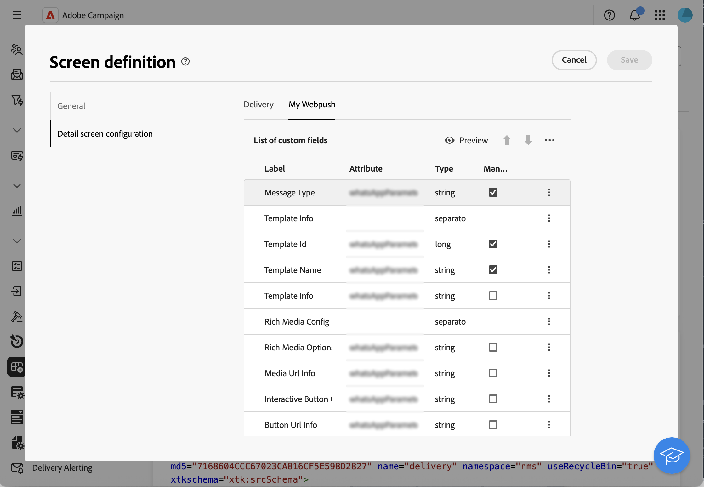

# Aan de slag met aangepaste kanalen {#gs-custom-channel}

Met Adobe Campaign kunt u aangepaste externe of API-kanalen maken die zijn geïntegreerd met derden. Vervolgens kunt u op basis van deze kanalen leveringen ordenen en uitvoeren.

De levering en het verzenden kunnen zowel in de Console van de Cliënt als in het Web UI worden uitgevoerd. De aangepaste kanaalconfiguratie wordt echter alleen uitgevoerd in de clientconsole.

Leren hoe te om een levering tot stand te brengen en te verzenden die op een douanekanaal wordt gebaseerd, verwijs naar deze [ pagina ](https://experienceleague.adobe.com/docs/campaign-web/v8/msg/gs-custom-channel.html){target="_blank"}.

Hier volgen de stappen voor het configureren van een nieuw aangepast kanaal in de clientconsole. Deze stappen worden gebruikt voor aangepaste externe en API-kanalen:

1. Vorm het schema, [ lees meer ](#configure-schema)
1. Creeer een nieuwe externe rekening, [ lees meer ](#create-ext-account)
1. Creeer een nieuw leveringsmalplaatje, [ lees meer ](#create-template)

Aangepaste API-kanalen vereisen een extra configuratie. [Meer informatie](#api-additional)

## Het schema configureren{#configure-schema}

Eerst, moet u het schema vormen om het nieuwe kanaal aan de lijst van beschikbare kanalen toe te voegen.

1. Van de Ontdekkingsreiziger van de Campagne, uitgezochte **Beleid** > **Configuratie** > **schema&#39;s van Gegevens**.

1. Creeer een schemauitbreiding om **messageType** [ opsomming ](../config/enumerations.md) met het nieuwe kanaal uit te breiden.

   Bijvoorbeeld:

   ```
   <enumeration basetype="byte" default="mail" label="Channel" name="messageType">
   <value desc="My Webpush" img="ncm:channels.png" label="My Webpush" name="webpush"
          value="122"/>
   </enumeration>
   ```

   {zoomable="yes"}

## Een nieuwe externe account maken{#create-ext-account}

Dan, moet u een nieuwe verpletterende externe rekening tot stand brengen.

1. Van de Ontdekkingsreiziger van de Campagne, uitgezochte **Beleid** > **Platform** > **Externe rekeningen**.

1. Maak een nieuwe externe account.

1. Selecteer het kanaal en wijzig de leveringsmodus. Kies **Extern** voor douane externe kanalen, en **Bulk** voor de kanalen van douaneAPI.

   {zoomable="yes"}

## Een nieuwe leveringssjabloon maken{#create-template}

Nu, creëren de nieuwe malplaatje verbonden aan het nieuwe kanaal.

1. Van de Ontdekkingsreiziger van de Campagne, uitgezochte **Middelen** > **Malplaatjes** > **de malplaatjes van de Levering**.

1. Maak een nieuwe sjabloon.

1. Klik op **Eigenschappen** en selecteer de juiste omslag en het verpletteren.

   {zoomable="yes"}

Het nieuwe kanaal is nu beschikbaar. Op basis van dit kanaal kunt u leveringen maken en uitvoeren.

## Aanvullende configuratie voor aangepaste API{#api-additional}

Hier volgen de belangrijkste aanvullende stappen voor het configureren van aangepaste API-kanalen.

### Het schema uitbreiden{#api-additional-schema}

Van de Console van de Cliënt, breid het **Schema van de Levering** met alle extra eigenschappen uit die voor het douanekanaal worden vereist.

Voor meer informatie over schemauitbreiding, verwijs naar deze [ pagina ](../dev/extend-schema.md).

### De aangepaste schermdefinitie instellen{#api-additional-screen}

Van het Web UI van de Campagne, opstelling de definitie van het douanescherm:

1. Open het **schema van de Levering** en klik **de uitgave van het Scherm**.

   {zoomable="yes"}

1. Selecteer de tab die overeenkomt met uw kanaal en bepaal hoe de velden worden weergegeven in het inhoudsscherm van de levering. Voor meer informatie over het schermuitgave, verwijs naar deze [ pagina ](https://experienceleague.adobe.com/docs/campaign-web/v8/conf/schemas.html#fields){target="_blank"}.

   {zoomable="yes"}

1. In de **Voorproef voor simuleert inhoud** sectie, selecteer specifieke JSPP. Dit is optioneel. Hiermee wordt de voorvertoning geactiveerd in het scherm met de leveringssimulatie. [Meer informatie](#api-additional-preview)

### De voorvertoning configureren{#api-additional-preview}

Deze configuratie is optioneel. Als u de voorproef in het Web UI, in het scherm van de leveringssimulatie wilt activeren, moet u specifieke JSSP in de Console van de Cliënt vormen.

Wanneer u op **Open voorproef** in het scherm van de leveringssimulatie in het Web UI klikt, worden de volgende parameters overgegaan in URL:

`https://adobe.campaign.adobe.com/cus/webPushMessagePreview.jssp?deliveryId=%40ToPzTurO9aGzQxYcMArBbA%3D%3D&id=%40oF8Fi17txuLmtiOFj4OIjQ%3D%3D`

* `deliveryId`: de leverings-id
* `id`: de profiel-id

In de Console van de Cliënt, uitgezochte **Beleid** > **Configuratie** > **Dynamische JavaScript pagina&#39;s** en creeer een nieuwe JSSP. Hier is een voorbeeld met de parameters die moeten worden teruggewonnen.

```
<%@ page import="xtk:shared/nl.js"
%><%
  NL.require("/nl/core/shared/core.js")
    .require('/nl/core/jsspcontext.js')
    .require('/nl/core/shared/dataTypes.js')
    .require('/nl/core/schema.js');
    
  //response.setContentType("text/plain");
  var parameters = request.parameters;
  var deliveryId = decryptString(parameters.deliveryId);
  var oldUserContext = logonEscalation("neolane")
  
   var delivery = xtk.queryDef.create(<queryDef schema="nms:delivery" operation="getIfExists">
                                         <select>
                                           <node expr="[WebpushParameters/@richMediaOptions]" alias="@richMediaOptions"/>
                                           <node expr="[WebpushParameters/@mediaUrlInfo]" alias="@mediaUrlInfo"/>
                                           <node expr="[WebpushParameters/@WebpushMessageType]"/>
                                         </select>
                                         <where>
                                           <condition expr={"@id = " + NL.XTK.toXTKString(deliveryId)}/>
                                         </where>
                                       </queryDef>).ExecuteQuery();

  // Restore previous context
  logonWithContext(oldUserContext)
%>

<!DOCTYPE html ...
```

### Technische uitvoering{#api-additional-technical}

Afhankelijk van het aangepaste kanaal moet u andere onderdelen van de toepassing configureren, zoals: externe accounts, doeltoewijzing, Javascript-code voor API, enz.

