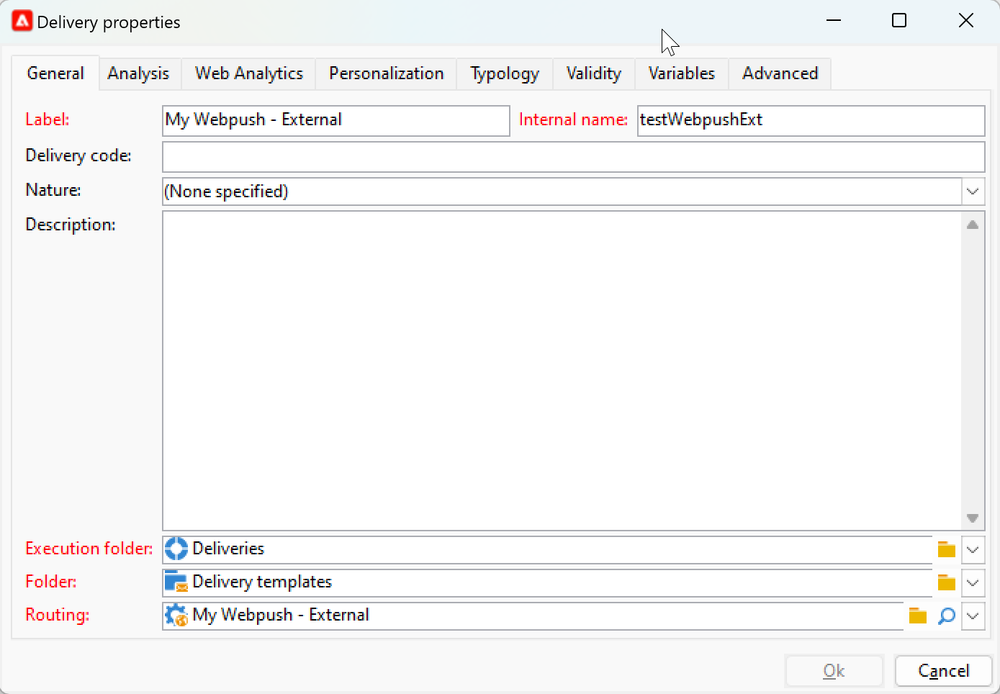

# Aan de slag met aangepaste externe kanalen {#gs-custom-channel}

Met Adobe Campaign kunt u aangepaste externe kanalen maken die zijn geïntegreerd met derden. Vervolgens kunt u leveringen op basis van deze kanalen ordenen en uitvoeren.

De levering en het verzenden kunnen zowel in de Console van de Cliënt als in het Web UI worden uitgevoerd. Het aangepaste externe kanaal wordt echter alleen uitgevoerd in de clientconsole.

Leren hoe te om een levering tot stand te brengen en te verzenden die op een douane extern kanaal wordt gebaseerd, verwijs naar deze [ pagina ](https://experienceleague.adobe.com/docs/campaign-web/v8/msg/gs-custom-channel.html?lang=nl-NL).

Hier volgen de stappen voor het maken van een nieuw extern aangepast kanaal in de clientconsole:

1. Vorm het schema, [ lees meer ](#configure-schema)
1. Creeer een nieuwe externe rekening, [ lees meer ](#create-ext-account)
1. Creeer een nieuw leveringsmalplaatje, [ lees meer ](#create-template)

## Het schema configureren{#configure-schema}

Eerst, moet u het schema vormen om het nieuwe kanaal aan de lijst van beschikbare kanalen toe te voegen.

1. Van de Ontdekkingsreiziger van de Campagne, uitgezochte **Beleid** > **Configuratie** > **schema&#39;s van Gegevens**.

1. Creeer een schemauitbreiding om de opsomming messageType met het nieuwe kanaal uit te breiden.

   Bijvoorbeeld:

   ```
   <enumeration basetype="byte" default="mail" label="Channel" name="messageType">
   <value desc="My Webpush" img="ncm:channels.png" label="My Webpush" name="webpush"
          value="122"/>
   </enumeration>
   ```

   {zoomable="yes"}

## Een nieuwe externe account maken{#create-ext-account}

Dan, moet u een nieuwe verpletterende externe rekening tot stand brengen.

1. Van de Ontdekkingsreiziger van de Campagne, uitgezochte **Beleid** > **Platform** > **Externe rekeningen**.

1. Maak een nieuwe externe account.

1. Selecteer het kanaal en verander de leveringswijze in **Extern**.

   {zoomable="yes"}

## Een nieuwe leveringssjabloon maken{#create-template}

Nu, creëren de nieuwe malplaatje verbonden aan het nieuwe kanaal.

1. Van de Ontdekkingsreiziger van de Campagne, uitgezochte **Middelen** > **Malplaatjes** > **de malplaatjes van de Levering**.

1. Maak een nieuwe sjabloon.

1. Klik op **Eigenschappen** en selecteer de juiste omslag en het verpletteren.

   {zoomable="yes"}

Het nieuwe kanaal is nu beschikbaar. Op basis van dit kanaal kunt u leveringen maken en uitvoeren.


