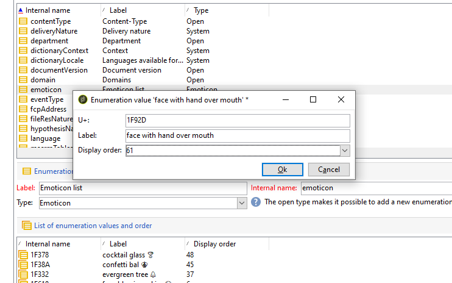

# De lijst met emoticons aanpassen {#customize-emoticons}

De emoticonlijst die in pop-up wordt getoond wordt bepaald door een opsomming die u toestaat om waarden in een lijst te tonen om de keuzen te beperken die de gebruiker voor een bepaald gebied heeft.
U kunt de volgorde van de emoticonlijst aanpassen en u kunt ook andere emoticons aan uw lijst toevoegen.

emoticons zijn alleen beschikbaar voor e-mail en push. Voor meer op dit verwijs naar deze [ sectie ](defining-the-email-content.md#inserting-emoticons).

## Een nieuw emoticon toevoegen {#add-new-emoticon}

>[!CAUTION]
>
>De emoticonlijst kan niet meer dan 81 items weergeven.

1. Kies uw nieuw emoticon om van deze [ pagina ](https://unicode.org/emoji/charts/full-emoji-list.html) toe te voegen. Let op: deze moet compatibel zijn met de verschillende platforms, zoals de browser en het besturingssysteem.

1. Selecteer in de lijst **[!UICONTROL Explorer]** de optie **[!UICONTROL Administration]** > **[!UICONTROL Platform]** > **[!UICONTROL Enumerations]** en klik op de opsomming **[!UICONTROL Emoticon list]** out-of-the-box.

   >[!NOTE]
   >
   >De opsommingen buiten de doos kunnen slechts door een beheerder van uw console van Adobe Campaign Classic worden beheerd.

   

1. Klik op **[!UICONTROL Add]**.

1. Vul de velden in:

   * **[!UICONTROL U+]**: Code van uw nieuwe emoticon. U kunt de lijst van emoticons&#39; codes in deze [ pagina ](https://unicode.org/emoji/charts/full-emoji-list.html) vinden.
Om compatibiliteitsproblemen te voorkomen, raden we u aan emoticons te kiezen die worden ondersteund door browsers en op elk besturingssysteem.

   * **[!UICONTROL Label]**: Label van het nieuwe emoticon.

   

1. Klik op **[!UICONTROL Ok]** en **[!UICONTROL Save]** wanneer de configuratie is voltooid.
Uw nieuwe emoticon wordt automatisch in de winkel geplaatst.

1. Als u het element wilt weergeven in het venster **[!UICONTROL Insert emoticon]** van uw leveringen, selecteert u het nieuwe emoticon door erop te dubbelklikken.

1. Kies in de vervolgkeuzelijst **[!UICONTROL Display order]** in welke volgorde het nieuwe emoticon wordt weergegeven. Door een reeds toegewezen weergavevolgorde te selecteren, wordt het bestaande emoticon automatisch naar de winkel verplaatst.

     In dit voorbeeld, kozen wij het aantal van de vertoningsorde 61 wat betekent dat als een ingang reeds deze orde had het automatisch zal worden verplaatst naar de opslag en onze nieuwe ingang zal zijn plaats in de opsommingslijst nemen.

   

1. Het nieuwe emoticon is nu toegevoegd aan de opsomming **[!UICONTROL Insert emoticon list]** out-of-the-box. U kunt de **[!UICONTROL Display order]** altijd wijzigen of naar de winkel verplaatsen als u deze niet meer nodig hebt.

1. Als u rekening wilt houden met uw wijzigingen, verbreekt u de verbinding en maakt u opnieuw verbinding met Adobe Campaign Classic. Als het nieuwe emoticon nog steeds niet in het pop-upvenster van **[!UICONTROL Insert emoticon]** wordt weergegeven, moet u mogelijk de cache wissen. Gebruik hiervoor het menu **[!UICONTROL File > Clear the local cache]** .

1. Het nieuwe emoticon bevindt zich nu op de 61ste positie in het pop-upvenster van **[!UICONTROL Insert emoticon]** zoals geconfigureerd in de vorige stappen. Voor meer informatie over hoe te om emoticons in uw leveringen te gebruiken, verwijs naar deze [ sectie ](defining-the-email-content.md#inserting-emoticons).

   

1. Als de volgende emoticons in uw **[!UICONTROL Insert emoticon]** pop-upvenster worden weergegeven, betekent dit dat ze niet correct zijn geconfigureerd. Controleer of de **[!UICONTROL U+]** code of **[!UICONTROL Display order]** correct is in de **[!UICONTROL Emoticon list]** .

   
