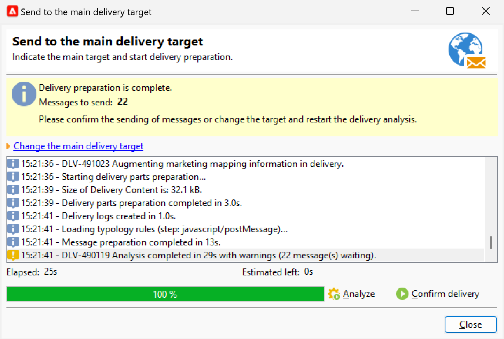

# Leveringsanalyse {#analyze-delivery}

De analyse is de voorbereidende fase van de levering. Deze kan worden gestart zodra het doelpubliek is gedefinieerd en de inhoud van het bericht gereed en getest is. Tijdens de afleveringsanalyse wordt de doelpopulatie berekend en wordt de afleverinhoud voorbereid. Zodra het volledig is, is de levering klaar om worden verzonden.

## De analyse starten {#start-the-analysis}

Als u de levering wilt voorbereiden, moet u controleren of de inhoud en het doel van de levering zijn gedefinieerd en onderstaande stappen volgen:

1. Klik in de leveringsvensters op de knop **[!UICONTROL Send]** .
1. Selecteer **[!UICONTROL Deliver as soon as possible]** om de publieksberekening en de inhoudsvoorbereiding voor direct verzenden uit te voeren. U kunt de levering ook uitstellen tot een latere datum, of een schatting van de bevolking krijgen zonder de inhoud voor te bereiden.

   

1. Klik op **[!UICONTROL Analyze]** om de analyse handmatig te starten. Op de voortgangsbalk ziet u de voortgang van de analyse.

   Tijdens de leveringsanalyse worden een aantal controleregels toegepast. Deze regels worden bepaald in a **typologie**, die in het **[!UICONTROL Typology]** lusje in de leveringseigenschappen wordt geselecteerd. Leer meer over typologieën in [&#x200B; deze sectie &#x200B;](../../automation/campaign-opt/campaign-typologies.md).

   Voor e-mails worden standaard de volgende punten in de analyse behandeld:

   * Het object goedkeuren
   * URL&#39;s en afbeeldingen goedkeuren
   * De URL-labels goedkeuren
   * De koppeling voor annuleren goedkeuren
   * De grootte van proefdrukken controleren
   * De geldigheidsperiode controleren
   * De planning van golven controleren

1. U kunt de analyse op elk gewenst moment stoppen door op de knop **[!UICONTROL Stop]** te klikken.

   Tijdens de voorbereidingsfase worden geen berichten verzonden. U kunt de analyse daarom zonder risico starten of annuleren.

   >[!IMPORTANT]
   >
   >Wanneer de analyse loopt, bevriest de levering (of het bewijs). Elke wijziging in de levering (of het bewijs) moet worden gevolgd door een andere analyse voordat zij van toepassing wordt.

   Wanneer de analyse is voltooid, geeft de bovenste sectie van het venster aan of de voorbereiding van de levering is voltooid of dat er fouten zijn opgetreden. Alle validatiestappen, waarschuwingen en fouten worden weergegeven. De gekleurde pictogrammen tonen het berichttype:

   * Een blauw pictogram geeft een informatief bericht aan.
   * Een geel pictogram geeft een niet-kritieke verwerkingsfout aan.
   * Een rood pictogram geeft een kritieke fout aan die het verzenden van de levering verhindert.

   {width="800" align="left"}

1. Klik op **[!UICONTROL Close]** om de eventuele fouten te corrigeren. Nadat u de wijzigingen hebt aangebracht, klikt u opnieuw op de analyse **[!UICONTROL Analyze]** .

   >[!NOTE]
   >
   >Klik op de koppeling **[!UICONTROL Change the main delivery target]** als het aantal berichten dat u wilt verzenden niet overeenkomt met uw verwachtingen. Met deze optie kunt u de definitie van de doelpopulatie wijzigen en de analyse opnieuw starten.
   >

1. Nadat u het resultaat van de analyse hebt gecontroleerd, klikt u op **[!UICONTROL Confirm delivery]** om het bericht naar het hoofddoel te verzenden.

## Analyse-instellingen {#analysis-settings}

Blader naar het tabblad **[!UICONTROL Analysis]** van de leveringseigenschappen om instellingen voor de berichtvoorbereiding tijdens de analysefase te definiëren.

{width="800" align="left"}

Op dit tabblad hebt u toegang tot de volgende opties:

* **[!UICONTROL Label and code of the delivery]**: de opties in deze sectie worden gebruikt om de waarden van deze gebieden tijdens de fase van de leveringsanalyse te berekenen. In het veld **[!UICONTROL Compute the execution folder during the delivery analysis]** wordt de naam berekend van de map die deze leveringsactie tijdens de analysefase zal bevatten.

* **[!UICONTROL Approval mode]**: in dit veld kunt u handmatig of automatisch afleveren definiëren wanneer de analyse is voltooid.

  Als tijdens de analyse waarschuwingen worden gegenereerd (bijvoorbeeld als bepaalde tekens worden geaccentueerd in het onderwerp van de levering, enz.), kunt u de levering zodanig configureren dat wordt bepaald of deze nog moet worden uitgevoerd. Door gebrek, moet de gebruiker het verzenden van berichten aan het eind van de analysefase bevestigen: dit is **handmatige** bevestiging.

  Selecteer een andere goedkeuringsmodus in de vervolgkeuzelijst in het desbetreffende veld.

  De volgende goedkeuringsmodi zijn beschikbaar:

   * **[!UICONTROL Manual]**: Aan het einde van de analysefase moet de gebruiker de levering bevestigen om te beginnen met verzenden. Klik hiertoe op de knop **[!UICONTROL Start]** om de levering te starten.
   * **[!UICONTROL Semi-automatic]**: het verzenden begint automatisch als de analysefase geen waarschuwingsberichten genereert.
   * **[!UICONTROL Automatic]**: het verzenden begint automatisch aan het einde van de analysefase, ongeacht het resultaat.

* **[!UICONTROL Start job in a detached process]** : met deze optie kunt u de afleveringsanalyse in een afzonderlijk proces starten. De analysefunctie gebruikt standaard het Adobe Campaign-toepassingsserverproces (webserver). Als u deze optie selecteert, zorgt u ervoor dat de analyse ook wordt voltooid wanneer de toepassingsserver uitvalt.
* **[!UICONTROL Log SQL queries generated during the analysis in the journal]**: deze optie voegt de SQL vraaglogboeken aan het leveringsdagboek tijdens de analysefase toe.
* **[!UICONTROL Ignore personalization scripts during sending]** : hiermee kunt u de interpretatie van JavaScript-instructies in HTML-inhoud omzeilen. Ze worden op dezelfde manier weergegeven als in de geleverde inhoud. Deze instructies worden geïntroduceerd met de tag `<%=` .
