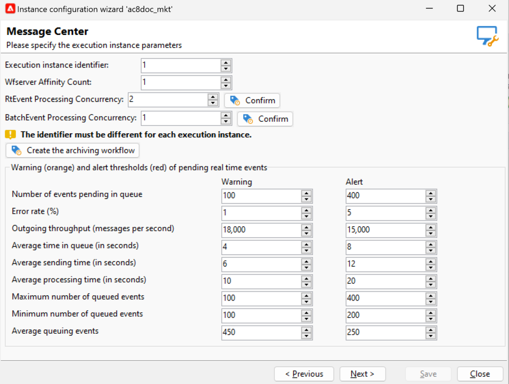

# Transactieberichten verzenden en controleren {#delivery-execution}

## Berichten verzenden{#send-transactional-msg}

Zodra de verrijking volledig is en een leveringsmalplaatje met de gebeurtenis verbonden is, wordt de levering verzonden van de uitvoeringsinstantie.

>[!NOTE]
>
>De transactieberichten worden voorrang gegeven boven om het even welke andere levering.

Alle leveringen worden gegroepeerd in de map **[!UICONTROL Administration > Production > Message Center > Default > Deliveries]** .

Standaard worden ze in submappen gesorteerd op leveringsmaand. Dit kan in de eigenschappen van het berichtmalplaatje worden veranderd.

## Monitorberichten {#monitor-transactional-msg}

Om uw transactionele berichten te controleren, controleer de [ leveringslogboeken ](send.md).

De transactionele leveringen die van de uitvoeringsinstantie worden verzonden worden gesynchroniseerd terug naar de controleinstantie door een technisch werkschema (**[!UICONTROL Message Center execution instance]**) dat elk uur in werking stelt.

>[!NOTE]
>
>De leveringenwekelijkse accumulatie van de gebeurtenissen op basis van de meest recente update van de gebeurtenis en niet op de aanmaakdatum van de gebeurtenis. Daarom wanneer het halen van transactioneel overseinenleveringslogboeken van de controleinstantie, levert identiteitskaart verbonden aan elke identiteitskaart van het leveringslogboek kan in tijd veranderen aangezien het logboek wordt bijgewerkt (bijvoorbeeld, wanneer een binnenkomende stuit voor de gebeurtenis wordt ontvangen).

<!--
To monitor the activity and running of the execution instance(s), see [Transactional messaging reports](transactional-messaging-reports.md).-->

## Rapportage{#reporting-transactional-msg}

Adobe Campaign biedt verschillende rapporten waarmee u de activiteit en het vloeiend functioneren van uitvoeringsinstanties kunt beheren.

Deze rapporten van het Centrum van Bericht kunnen van het **[!UICONTROL Reports]** lusje van de **controleinstantie** worden betreden.

### Gebeurtenisgeschiedenis van Message Center {#history-events}

Het **[!UICONTROL Message Center event history]** rapport toont een overzicht van de de moduleactiviteit van het Centrum van het Bericht, d.w.z. het aantal gebeurtenissen die als transactionele berichten worden verwerkt en geleverd.

Wanneer het rapport wordt geopend, valt de informatie die door gebrek wordt getoond met het tarief van met succes verzonden transactieberichten. Als u meer niveaus wilt weergeven, kunt u de verschillende knooppunten openen en de cursor op het juiste niveau plaatsen om deze te selecteren.

U kunt de gegevens voor elk gebeurtenistype, per tijdsperiode bekijken. De kolom **[!UICONTROL Events]** komt overeen met het aantal gebeurtenissen dat per besturingsinstantie is ontvangen. Het aantal gebeurtenissen dat is getransformeerd in gepersonaliseerde transactionele berichten wordt in detail beschreven in de **[!UICONTROL Sent]** kolom.

### Verwerkingstijd van het Berichtencentrum {#processing-time}

Het **[!UICONTROL Message Center processing time]** -rapport geeft de belangrijkste indicatoren weer die betrekking hebben op de real-time wachtrij. Dit rapport is ook toegankelijk via de tab **[!UICONTROL Monitoring]** op de besturingsinstantie.

U kunt ervoor kiezen om algemene statistieken of statistieken met betrekking tot een bepaalde uitvoeringsinstantie weer te geven. U kunt de gegevens ook filteren op kanaal en over een bepaalde periode.

De indicatoren die in de sectie **[!UICONTROL Indicators over the period]** worden weergegeven, worden berekend over de geselecteerde periode:

* **[!UICONTROL Average queuing time]**: de gemiddelde tijd die met succes in het Centrum van het Bericht doorgebrachte gebeurtenissen verwerkte. Alleen de verwerkingstijd wordt in aanmerking genomen.
* **[!UICONTROL Average message sending time (s)]**: de gemiddelde tijd die met succes in het Centrum van het Bericht doorgebrachte gebeurtenissen verwerkte. Alleen de levertijd van de mta wordt in aanmerking genomen.
* **[!UICONTROL Average processing time (s)]**: de gemiddelde tijd die met succes in het Centrum van het Bericht doorgebrachte gebeurtenissen verwerkte. De berekening neemt de verwerkingstijd in aanmerking en de tijd die de gegevens verzenden.
* **[!UICONTROL Maximum number of queued events]**: maximumaantal gebeurtenissen aanwezig in de wachtrij van het Berichtencentrum op een bepaald moment.
* **[!UICONTROL Minimum number of queued events]**: minimumaantal gebeurtenissen aanwezig in de wachtrij van het Berichtencentrum op een bepaald moment.
* **[!UICONTROL Average number of queued events]**: het gemiddelde aantal gebeurtenissen dat op een bepaald moment in de wachtrij van het Berichtencentrum aanwezig is.

>[!NOTE]
>
>De drempelwaarden voor de waarschuwings- (oranje) en waarschuwingsindicator (rood) kunnen worden geconfigureerd in de implementatiewizard van Adobe Campaign. Verwijs naar [ drempels van de Monitor ](#thresholds).

### Serviceniveau van het Berichtencentrum {#service-level}

Het **[!UICONTROL Message Center service level]** -rapport geeft de leveringsstatistieken weer met betrekking tot transactieberichten en de uitsplitsing van fouten. U kunt op een fouttype klikken om de details ervan weer te geven.

Dit rapport is ook toegankelijk via de tab **[!UICONTROL Monitoring]** op de besturingsinstantie.

U kunt ervoor kiezen om algemene statistieken of statistieken met betrekking tot een bepaalde uitvoeringsinstantie weer te geven. U kunt de gegevens ook filteren op kanaal en over een bepaalde periode.

De indicatoren die in de sectie **[!UICONTROL Indicators over the period]** worden weergegeven, worden berekend over de geselecteerde periode:

* **[!UICONTROL Incoming (throughput event/h)]**: gemiddeld aantal gebeurtenissen per uur dat is ingevoerd in de wachtrij voor Bericht centreren.
* **[!UICONTROL Incoming (event vol)]**: aantal gebeurtenissen dat is ingevoerd in de wachtrij van het Berichtencentrum.
* **[!UICONTROL Outgoing (throughput msg/h)]**: gemiddeld uuraantal succesvolle uitgaande gebeurtenissen van het Centrum van het Bericht (verzonden door een levering).
* **[!UICONTROL Outgoing (msg vol)]**: aantal succesvolle uitgaande gebeurtenissen van het Centrum van het Bericht (verzonden door een levering).
* **[!UICONTROL Average sending time (seconds)]**: gemiddelde tijd die in het Centrum van het Bericht voor met succes verwerkte gebeurtenissen wordt doorgebracht. De berekening neemt de verwerkingstijd in aanmerking en de tijd die de gegevens verzenden.
* **[!UICONTROL Error rate]**: aantal gebeurtenissen met fouten in vergelijking met het aantal gebeurtenissen dat de wachtrij van het Message Center is binnengekomen. Met de volgende fouten wordt rekening gehouden: het verpletteren van fout, verlopen gebeurtenis (gebeurtenis die in de rij te lang is geweest), leveringsfout, die door de levering (quarantaine, enz.) wordt genegeerd.

>[!NOTE]
>
>De drempelwaarden voor de waarschuwings- (oranje) en waarschuwingsindicator (rood) kunnen worden geconfigureerd in de implementatiewizard van Adobe Campaign. Verwijs naar [ drempels van de Monitor ](#thresholds).

### Drempels controleren {#thresholds}

U kunt de waarschuwing (oranje) en waakzame (rode) drempels van de indicatoren vormen die in het **de dienstniveau van het Centrum van het Bericht** en **de verwerkingstijd van het Centrum van het Bericht** rapporten verschijnen.

Hiervoor voert u de volgende stappen uit:

1. Open de plaatsingstovenaar op de **uitvoeringsinstantie**, en doorblader aan de **[!UICONTROL Message Center]** pagina.
1. Gebruik de pijlen om de drempels te veranderen.

   
