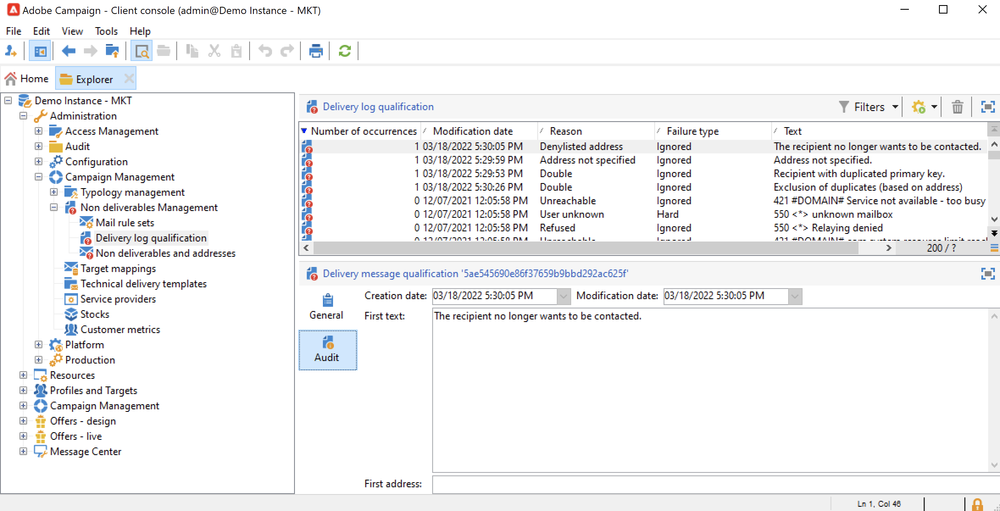

# Leveringsfouten begrijpen{#delivery-failures}

De grenzen zijn het resultaat van een leveringspoging en mislukking waar ISP achtermislukkingsberichten verstrekt. De verwerking van de stuitbehandeling is een kritiek deel van lijsthygiëne. Nadat een bepaalde e-mail meerdere keren achter elkaar is teruggestuurd, wordt deze tijdens dit proces gemarkeerd voor onderdrukking. Hierdoor wordt voorkomen dat systemen ongeldige e-mailadressen blijven verzenden. De grenzen zijn één van de belangrijkste stukken van gegevens die ISPs gebruikt om IP reputatie te bepalen. Het is belangrijk om deze maatstaf in de gaten te houden. &quot;Geleverd&quot; versus &quot;teruggestort&quot; is waarschijnlijk de meest gebruikelijke manier om de levering van marketingberichten te meten: hoe hoger het geleverde percentage is , hoe beter .

Als een bericht niet naar een profiel kan worden verzonden, verzendt de externe server automatisch een foutbericht naar Adobe Campaign. Deze fout is gekwalificeerd om te bepalen of het e-mailadres, het telefoonnummer of het apparaat in quarantaine moet worden geplaatst. Zie [Bounce mail management](#bounce-mail-qualification).

Zodra een bericht wordt verzonden, kunt u de leveringsstatus voor elk profiel en het bijbehorende mislukkingstype en de reden in de leveringslogboeken bekijken.

Wanneer een e-mailadres in quarantaine wordt geplaatst, of als een profiel op lijst van gewezen personen is, wordt de ontvanger uitgesloten bij de stap van de leveringsvoorbereiding. Uitgesloten berichten worden vermeld in het leveringsdashboard.

## Waarom is de berichtlevering mislukt {#delivery-failure-reasons}

Er zijn twee typen fouten wanneer een bericht mislukt. Elk fouttype bepaalt of een adres wordt verzonden naar [quarantaine](quarantines.md#quarantine-reason) of niet.


* **Harde vlekken**
De harde stegels zijn permanente mislukkingen die worden geproduceerd nadat ISP een postingspoging aan een abonneeadres als niet te leveren niet bepaalt. In Adobe Campaign worden harde golven die als niet-leverbaar zijn gecategoriseerd, aan de quarantaine toegevoegd, wat betekent dat ze niet opnieuw zouden worden geplaatst. In sommige gevallen wordt een harde stuit genegeerd als de oorzaak van de fout onbekend is.

   Hier volgen enkele voorbeelden van harde grenzen: Adres bestaat niet, Account uitgeschakeld, onjuiste syntaxis, onjuist domein


* **Zachte golven**
De zachte grenzen zijn tijdelijke mislukkingen die ISPs produceert wanneer zij moeilijkheden hebben leverend post. Zachte mislukkingen zullen veelvoudige tijden (met variantie afhankelijk van gebruik van douane of uit-van-doos leveringsmontages) opnieuw proberen om een succesvolle levering te proberen. Adressen dat voortdurend zachte stuit niet aan quarantaine zal worden toegevoegd tot het maximumaantal herpogingen is geprobeerd (die opnieuw afhankelijk van montages) variëren.

   Tot de meest voorkomende oorzaken van zachte grenzen behoren: Brievenbus volledig, Ontvangend e-mailserver neer, de kwesties van de de reputatie van de Afzender


De  **Genegeerd** Het type fout is bekend als tijdelijk, zoals &quot;Buiten kantoor&quot;, of een technische fout, bijvoorbeeld als het type afzender &quot;postmaster&quot; is.


### Kwalificatie van niet-bezorgde e-mails {#bounce-mail-qualification}

De regels die door Campagne worden gebruikt om leveringsmislukkingen te kwalificeren zijn vermeld in **[!UICONTROL Administration > Campaign Management > Non deliverables Management > Delivery log qualification]** knooppunt. Het is niet-limitatief en wordt regelmatig door Adobe Campaign bijgewerkt en kan ook door de gebruiker worden beheerd.


De stuiterende kwalificaties in de **[!UICONTROL Delivery log qualification]** tabel wordt niet gebruikt voor **synchroon** foutberichten over leveringsfout. Momentum bepaalt het stuitertype en de kwalificatie, en stuurt die informatie terug naar Campaign.

**Asynchroon** De grenzen worden gekwalificeerd door het inMail proces door **[!UICONTROL Inbound email]** regels.

Het bericht dat door de externe server wordt geretourneerd bij de eerste instantie van dit fouttype, wordt weergegeven in het dialoogvenster **[!UICONTROL First text]** kolom van de **[!UICONTROL Audit]** tab.



Adobe Campaign filtert dit bericht om de variabele inhoud (zoals id&#39;s, datums, e-mailadressen, telefoonnummers, enz.) te verwijderen. en geeft het gefilterde resultaat weer in de **[!UICONTROL Text]** kolom. De variabelen worden vervangen door **`#xxx#`**, behalve adressen die worden vervangen door **`*`**.

Dit proces staat toe om alle mislukkingen van het zelfde type samen te brengen en veelvoudige ingangen voor gelijkaardige fouten in de de kwalificatielijst van het Logboek van de Levering te vermijden.

>[!NOTE]
>
>De **[!UICONTROL Number of occurrences]** wordt het aantal exemplaren van het bericht in de lijst weergegeven. Het is beperkt tot 100 000 voorvallen. U kunt het veld bewerken als u het bijvoorbeeld opnieuw wilt instellen.

Stuitberichten kunnen de volgende kwalificatiestatus hebben:

* **[!UICONTROL To qualify]** : de stuiterende post kon niet worden gekwalificeerd. De kwalificatie moet aan het leveringsteam worden toegewezen om efficiënte platformleverantie te waarborgen. Zolang het niet wordt gekwalificeerd, wordt de stuiterende post niet gebruikt om de lijst van e-mailbeheerregels te verrijken.
* **[!UICONTROL Keep]** : de stuiterende post werd gekwalificeerd en zal door **Vernieuwen voor leverbaarheid** te vergelijken met de bestaande regels voor e-mailbeheer en de lijst te verrijken.
* **[!UICONTROL Ignore]** : de stuiterende post wordt genegeerd, betekenend dat deze stuit nooit het adres van de ontvanger zal veroorzaken om in quarantined te zijn. Het wordt niet gebruikt door de **Vernieuwen voor leverbaarheid** en wordt niet naar clientinstanties verzonden.


>[!NOTE]
>
>In het geval van een stroomonderbreking van ISP, zullen de e-mails die door Campaign worden verzonden verkeerd als stegels worden gemerkt. U moet de stuiterkwalificatie bijwerken om dit te corrigeren.


## Opnieuw beheren {#retries}

Als de berichtlevering mislukt na een tijdelijke fout (**Zacht** of **Genegeerd**), probeert CAmpaign opnieuw te verzenden. Deze pogingen kunnen tot het eind aan de leveringsduur worden uitgevoerd. Het aantal en de frequentie van pogingen worden opstelling door Momentum, die op het type en de strengheid van de stuiteringsreacties wordt gebaseerd die terug van ISP van het bericht komen.

In de standaardconfiguratie worden vijf pogingen gedefinieerd met een interval van een uur, gevolgd door één poging per dag gedurende vier dagen. Het aantal pogingen kan globaal of voor elke levering of leveringsmalplaatje worden veranderd. Neem contact op met de Adobe Support als u de leveringsduur en het opnieuw proberen wilt aanpassen.

## Synchrone en asynchrone fouten {#synchronous-and-asynchronous-errors}

Een berichtlevering kan onmiddellijk ontbreken, in dat geval kwalificeren wij dit als synchrone fout. Als het verzenden van het bericht mislukt of later, nadat het is verzonden, is de fout asynchroon.

Deze soorten fouten worden als volgt beheerd:

* **Synchrone fout**: Als de externe server waarmee contact is opgenomen door de Adobe Campaign-leveringsserver onmiddellijk een foutbericht retourneert, mag de levering niet naar de server van het profiel worden verzonden. Adobe Campaign kwalificeert elke fout om te bepalen of de e-mailadressen in kwestie quarantined zouden moeten zijn. Zie [Kwalificatie van niet-bezorgde e-mails](#bounce-mail-qualification).

* **Asynchrone fout**: een stuiterende post of een SR wordt teruggestuurd later door de ontvangende server. Deze fout is gekwalificeerd met een label dat gerelateerd is aan de fout. Asynchrone fouten kunnen optreden tot een week nadat een levering is verzonden.

   >[!NOTE]
   >
   >Als gebruiker van Managed Services, wordt de configuratie van de stuiterende brievenbus uitgevoerd door Adobe.

   De feedbacklus werkt als stuiterende e-mails: wanneer een gebruiker een e-mail als spam kwalificeert, kunt u e-mailregels in Adobe Campaign configureren om alle leveringen aan deze gebruiker te blokkeren. De adressen van deze gebruikers zijn op lijst van gewezen personen alhoewel zij niet de unsubscription verbinding klikten. De adressen zijn in lijst van gewezen personen in (**NmsAddress**) quarantainetabel en niet in de (**NmsRecipient**) tabel met ontvangers. Meer informatie over feedbacklusmechanismen vindt u in [Adobe Handleiding voor beste praktijken voor aflevering](https://experienceleague.adobe.com/docs/deliverability-learn/deliverability-best-practice-guide/transition-process/infrastructure.html#feedback-loops).


## Typen e-mailfouten {#email-error-types}

Voor het e-mailkanaal worden hieronder mogelijke oorzaken van een leveringsfout vermeld.

<table> 
 <tbody> 
  <tr> 
   <td> Foutlabel </td> 
   <td> Fouttype </td> 
   <td> Technische waarde </td> 
   <td> Beschrijving </td> 
  </tr> 
  <tr> 
   <td> Account uitgeschakeld </td> 
   <td> Zacht/Hard </td> 
   <td> 4 </td> 
   <td> De account die aan het adres is gekoppeld, is niet meer actief. Wanneer de Internet Access Provider (IAP) een lange periode van inactiviteit detecteert, kan deze de account van de gebruiker sluiten. Leveringen aan het adres van de gebruiker zijn dan onmogelijk. Als de account tijdelijk is uitgeschakeld vanwege een inactiviteit van zes maanden en nog steeds kan worden geactiveerd, wordt de status Met fouten toegewezen en wordt de account opnieuw geprobeerd tot de foutenteller 5 bereikt. Als de fout aangeeft dat de account permanent is gedeactiveerd, wordt deze rechtstreeks ingesteld op Quarantine.<br /> </td> 
  </tr> 
  <tr> 
   <td> Adres in quarantaine </td> 
   <td> Hard </td> 
   <td> 9 </td> 
   <td> Het adres is in quarantaine geplaatst.<br /> </td> 
  </tr> 
  <tr> 
   <td> Adres niet opgegeven </td> 
   <td> Hard </td> 
   <td> 7 </td> 
   <td> Geen adres wordt gegeven voor de ontvanger.<br /> </td> 
  </tr> 
  <tr> 
   <td> Adres van slechte kwaliteit </td> 
   <td> Genegeerd </td> 
   <td> 14 </td> 
   <td> De kwaliteitsbeoordeling voor dit adres is te laag.<br /> </td> 
  </tr> 
  <tr> 
   <td> Op de lijst met ongewenste personen staan adres </td> 
   <td> Hard </td> 
   <td> 8 </td> 
   <td> Het adres werd toegevoegd aan de lijst van gewezen personen toen het verzenden. Deze status wordt gebruikt voor het importeren van gegevens van externe lijsten en systemen naar de Adobe Campaign Quarantine-lijst.<br /> </td> 
  </tr> 
  <tr> 
   <td> Besturingsadres </td> 
   <td> Genegeerd </td> 
   <td> 127 </td> 
   <td> Het adres van de ontvanger maakt deel uit van de controlegroep.<br /> </td> 
  </tr> 
  <tr> 
   <td> Dubbel </td> 
   <td> Genegeerd </td> 
   <td> 10 </td> 
   <td> Het adres van de ontvanger was reeds in deze levering.<br /> </td> 
  </tr> 
  <tr> 
   <td> Fout genegeerd </td> 
   <td> Genegeerd </td> 
   <td> 25 </td> 
   <td> Het adres staat op de lijst van gewenste personen. De fout wordt daarom genegeerd en er wordt een e-mail verzonden.<br /> </td> 
  </tr> 
  <tr> 
   <td> Uitgesloten na arbitrage </td> 
   <td> Genegeerd </td> 
   <td> 12 </td> 
   <td> De ontvanger werd uitgesloten door een typologische regel van het type "arbitrage".<br /> </td> 
  </tr> 
  <tr> 
   <td> Uitgesloten door een SQL-regel </td> 
   <td> Genegeerd </td> 
   <td> 11 </td> 
   <td> De ontvanger werd uitgesloten door een "SQL"regel van de campagnetypologie.<br /> </td> 
  </tr> 
  <tr> 
   <td> Ongeldig domein </td> 
   <td> Zacht </td> 
   <td> 2 </td> 
   <td> Het domein van het e-mailadres is onjuist of bestaat niet meer. Dit profiel wordt opnieuw geactiveerd tot het aantal fouten 5 is. Hierna wordt de record ingesteld op de status Quarantaine en wordt de levering niet opnieuw geprobeerd.<br /> </td> 
  </tr> 
  <tr> 
   <td> Postbus vol </td> 
   <td> Zacht </td> 
   <td> 5 </td> 
   <td> De brievenbus van deze gebruiker is volledig en kan niet meer berichten goedkeuren. Dit profiel wordt opnieuw geactiveerd tot het aantal fouten 5 is. Hierna wordt de record ingesteld op de status Quarantaine en wordt de levering niet opnieuw geprobeerd.<br /> Dit type fout wordt beheerd door een schoonmaakproces, het adres wordt geplaatst aan een geldige status na 30 dagen.<br /> Waarschuwing: voor het adres dat automatisch uit de lijst van quarantined adressen moet worden verwijderd, moet het technische werkschema van de schoonmaakbeurt van het Gegevensbestand zijn begonnen.<br /> </td> 
  </tr> 
  <tr> 
   <td> Niet verbonden </td> 
   <td> Genegeerd </td> 
   <td> 6 </td> 
   <td> De mobiele telefoon van de ontvanger is uitgeschakeld of is niet verbonden met het netwerk wanneer het bericht wordt verzonden.<br /> </td> 
  </tr> 
  <tr> 
   <td> Niet gedefinieerd </td> 
   <td> Niet gedefinieerd </td> 
   <td> 0 </td> 
   <td> Het adres is in kwalificatie omdat de fout nog niet is verhoogd. Dit type fout treedt op wanneer een nieuw foutbericht wordt verzonden door de server: het kan een geïsoleerde fout zijn, maar als deze opnieuw voorkomt, zal de foutenteller stijgen en worden de technische teams gewaarschuwd. Vervolgens kunnen ze een berichtenanalyse uitvoeren en deze fout kwalificeren via de <span class="uicontrol">Beheer</span> / <span class="uicontrol">Campagnebeheer</span> / <span class="uicontrol">Beheer van niet-te leveren items</span> knooppunt in de boomstructuur.<br /> </td> 
  </tr> 
  <tr> 
   <td> Niet in aanmerking komend voor de voorstellen </td> 
   <td> Genegeerd </td> 
   <td> 16 </td> 
   <td> De begunstigde kwam bij de levering niet in aanmerking voor de aanbiedingen.<br /> </td> 
  </tr> 
  <tr> 
   <td> Geweigerd </td> 
   <td> Zacht/Hard </td> 
   <td> 20 </td> 
   <td> Het adres is in quarantaine geplaatst toe te schrijven aan een veiligheid terugkoppelt als spamrapport. Volgens de fout, zal het adres opnieuw worden geprobeerd tot de foutenteller 5 bereikt, of het zal direct naar quarantines worden verzonden.<br /> </td> 
  </tr> 
  <tr> 
   <td> Beperkte doelgrootte </td> 
   <td> Genegeerd </td> 
   <td> 17 </td> 
   <td> De maximale leveringsgrootte is bereikt voor de ontvanger.<br /> </td> 
  </tr> 
  <tr> 
   <td> Onbevoegd adres </td> 
   <td> Genegeerd </td> 
   <td> 15 </td> 
   <td> Het postadres is niet gekwalificeerd.<br /> </td> 
  </tr> 
  <tr> 
   <td> Onbereikbaar </td> 
   <td> Zacht/Hard </td> 
   <td> 3 </td> 
   <td> Er is een fout opgetreden in de berichtleveringsketen. Het zou een incident op het relais SMTP, een domein kunnen zijn dat tijdelijk onbereikbaar is, etc. Volgens de fout, zal het adres opnieuw worden geprobeerd tot de foutenteller 5 bereikt, of het zal direct naar quarantines worden verzonden.<br /> </td> 
  </tr> 
  <tr> 
   <td> Gebruiker onbekend </td> 
   <td> Hard </td> 
   <td> 1 </td> 
   <td> Het adres bestaat niet. Voor dit profiel worden geen verdere leveringen uitgevoerd.<br /> </td> 
  </tr> 
 </tbody> 
</table>


## Typen fouten in pushmeldingen {#push-error-types}

Voor het mobiele app-kanaal worden de mogelijke oorzaken van een leveringsfout hieronder vermeld.

### iOS quarantaine {#ios-quarantine}

Met het HTTP/V2-protocol kunt u rechtstreeks feedback geven en de status van elke push-levering bepalen. Als de HTTP/V2 protocolschakelaar wordt gebruikt, koppelt de dienst niet meer wordt geroepen door **[!UICONTROL mobileAppOptOutMgt]** workflow. Een token wordt als niet-geregistreerd beschouwd wanneer een mobiele toepassing wordt verwijderd of opnieuw wordt geïnstalleerd.

Synchroon, als APNs een &quot;unregistered&quot;status voor een bericht terugkeert, zal het doelteken onmiddellijk in quarantaine worden geplaatst.

<table> 
 <tbody> 
  <tr> 
   <td> <strong>Scenario</strong><br /> </td> 
   <td> <strong>Status</strong><br /> </td> 
   <td> <strong>Foutbericht</strong><br /> </td> 
   <td> <strong>Type fout</strong><br /> </td> 
   <td> <strong>Mislukt</strong><br /> </td> 
   <td> <strong>Opnieuw</strong><br /> </td> 
  </tr> 
  <tr> 
   <td> Gericht apparaat ingeschakeld<br /> </td> 
   <td> OK<br /> </td> 
   <td> </td> 
   <td> </td> 
   <td> </td> 
   <td> </td> 
  </tr> 
  <tr> 
   <td> Gericht apparaat uitgeschakeld<br /> </td> 
   <td> OK<br /> </td> 
   <td> </td> 
   <td> </td> 
   <td> </td> 
   <td> </td> 
  </tr> 
  <tr> 
   <td> Gebruiker schakelt meldingen voor de toepassing uit<br /> </td> 
   <td> OK<br /> </td> 
   <td> </td> 
   <td> </td> 
   <td> </td> 
   <td> </td> 
  </tr> 
  <tr> 
   <td> Berichtontwerp/analysefase - lading te groot<br /> </td> 
   <td> Mislukt<br /> </td> 
   <td> Payload te lang<br /> </td> 
   <td> Zacht<br /> </td> 
   <td> Geweigerd<br /> </td> 
   <td> Nee<br /> </td> 
  </tr> 
  <tr> 
   <td> Berichtaanmaak/analysefase - onverwachte inhoudsopmaakkwestie<br /> </td> 
   <td> Mislukt<br /> </td> 
   <td> Verschillende foutberichten op basis van de fout<br /> </td> 
   <td> Zacht<br /> </td> 
   <td> Ongedefinieerd<br /> </td> 
   <td> Nee<br /> </td> 
  </tr> 
  <tr> 
   <td> Certificaatafgifte (wachtwoord, beschadiging, enz.) en testverbinding met APNs-probleem<br /> </td> 
   <td> Mislukt<br /> </td> 
   <td> Verschillende foutberichten op basis van de fout<br /> </td> 
   <td> Zacht<br /> </td> 
   <td> Geweigerd<br /> </td> 
   <td> Nee<br /> </td> 
  </tr> 
  <tr> 
   <td> Netwerkverbinding verloren tijdens verzenden<br /> </td> 
   <td> Mislukt<br /> </td> 
   <td> Verbindingsfout<br /> </td> 
   <td> Ongedefinieerd<br /> </td> 
   <td> Onbereikbaar<br /> </td> 
   <td> Ja<br /> </td> 
  </tr> 
  <tr> 
   <td> APNs-berichtafwijzing: Registratie ongedaan maken<br /> de gebruiker de toepassing heeft verwijderd of het token is verlopen<br /> </td> 
   <td> Mislukt<br /> </td> 
   <td> Niet geregistreerd<br /> </td> 
   <td> Hard<br /> </td> 
   <td> Gebruiker onbekend<br /> </td> 
   <td> Nee<br /> </td> 
  </tr> 
  <tr> 
   <td> APNs-berichtafwijzing: alle andere fouten<br /> </td> 
   <td> Mislukt<br /> </td> 
   <td> De oorzaak van de fout-afwijzing komt voor in het foutbericht<br /> </td> 
   <td> Zacht<br /> </td> 
   <td> Geweigerd<br /> </td> 
   <td> Nee<br /> </td> 
  </tr> 
 </tbody> 
</table>

### Android-quarantaine {#android-quarantine}

**Voor Android V1**

Voor elke melding ontvangt Adobe Campaign de synchrone fouten rechtstreeks van de FCM-server. Adobe Campaign verwerkt deze bestanden direct en genereert harde of zachte fouten op basis van de ernst van de fout. U kunt het opnieuw proberen:

* Lengte van lading overschreden, verbindingskwestie, de kwestie van de de dienstbeschikbaarheid: opnieuw uitgevoerd, soft error, failure reason **[!UICONTROL Refused]**.
* Apparaatquota overschreden: niet opnieuw proberen, soft error, error reason is **[!UICONTROL Refused]**.
* Ongeldige of niet-geregistreerde token, onverwachte fout, probleem met afzenderaccount: niet opnieuw proberen, harde fout, mislukkingsreden is **[!UICONTROL Refused]**.

De **[!UICONTROL mobileAppOptOutMgt]** werkstroom wordt elke 6 uur uitgevoerd om de **AppSubscriptionRcp** tabel. Voor tokens die niet zijn geregistreerd of niet meer geldig zijn, wordt het veld **Uitgeschakeld** is ingesteld op **Waar** en het abonnement op dat apparaattoken wordt automatisch uitgesloten van toekomstige leveringen.

Tijdens de leveringsanalyse, worden alle apparaten die van het doel worden uitgesloten automatisch toegevoegd aan **excludeLogAppSubRcp** tabel.

>[!NOTE]
>
>Voor klanten die de schakelaar Baidu gebruiken, zijn hier de verschillende soorten fouten:
>
>* Verbindingsprobleem aan het begin van de levering: fouttype **[!UICONTROL Undefined]**, reden van fout **[!UICONTROL Unreachable]**, wordt opnieuw geprobeerd.
>* Verbinding verloren tijdens een levering: soft error, error reason **[!UICONTROL Refused]**, wordt opnieuw geprobeerd.
>* Synchrone fout die door Baidu tijdens het verzenden is geretourneerd: harde fout, reden van fout **[!UICONTROL Refused]**, wordt het opnieuw proberen niet uitgevoerd.
>
>Adobe Campaign neemt om de 10 minuten contact op met de Baidu-server om de status van het verzonden bericht op te halen en werkt de weblogs bij. Als een bericht wordt verklaard zoals verzonden, wordt het statuut van het bericht in de uitzendingen geplaatst aan **[!UICONTROL Received]**. Als Baidu een fout declareert, wordt de status ingesteld op **[!UICONTROL Failed]**.

**Voor Android V2**

Het Android V2-quarantainemechanisme gebruikt hetzelfde proces als Android V1. Hetzelfde geldt voor de update voor abonnementen en uitsluitingen. Zie voor meer informatie de [Android V1](#android-quarantine) sectie.

<table> 
 <tbody> 
  <tr> 
   <td> <strong>Scenario</strong><br /> </td> 
   <td> <strong>Status</strong><br /> </td> 
   <td> <strong>Foutbericht</strong><br /> </td> 
   <td> <strong>Type fout</strong><br /> </td> 
   <td> <strong>Mislukt</strong><br /> </td> 
   <td> <strong>Opnieuw</strong><br /> </td> 
  </tr> 
  <tr> 
   <td> Berichtenaanmaak/analyse fase: ongeldige trefwoorden gebruikt in aangepaste velden<br /> </td> 
   <td> Mislukt<br /> </td> 
   <td> De volgende trefwoorden kunnen niet worden gebruikt: {1}<br /> </td> 
   <td> Zacht<br /> </td> 
   <td> </td> 
   <td> Nee<br /> </td> 
  </tr> 
  <tr> 
   <td> Berichtenaanmaak/analyse fase: lading te groot<br /> </td> 
   <td> Mislukt<br /> </td> 
   <td> De aanmelding is te zwaar: {1} bits, while only {2} are authorised<br /> </td> 
   <td> Zacht<br /> </td> 
   <td> Geweigerd<br /> </td> 
   <td> Nee<br /> </td> 
  </tr> 
  <tr> 
   <td> Netwerkverbinding verloren tijdens verzenden<br /> </td> 
   <td> Mislukt<br /> </td> 
   <td> Geen reactie van de Firebase Cloud Messaging-service op het adres: {1}<br /> </td> 
   <td> Zacht<br /> </td> 
   <td> Onbereikbaar<br /> </td> 
   <td> Ja<br /> </td> 
  </tr> 
  <tr> 
   <td> Afkeuring van FCM-berichten: De FCM-server is tijdelijk niet beschikbaar (bijvoorbeeld met time-outs). <br /> </td> 
   <td> Mislukt<br /> </td> 
   <td> De Firebase Cloud Messaging-service is tijdelijk niet beschikbaar<br /> </td> 
   <td> Zacht<br /> </td> 
   <td> Onbereikbaar<br /> </td> 
   <td> Ja<br /> </td> 
  </tr> 
  <tr> 
   <td> Afkeuring van FCM-berichten: Fout bij verifiëren van senderaccount<br /> </td> 
   <td> Mislukt<br /> </td> 
   <td> Kan de ontwikkelaarsaccount niet identificeren. Controleer uw id en wachtwoord<br /> </td> 
   <td> Zacht<br /> </td> 
   <td> Geweigerd<br /> </td> 
   <td> Nee<br /> </td> 
  </tr> 
  <tr> 
   <td> Afkeuring van FCM-berichten: Apparaatquota overschreden<br /> </td> 
   <td> Mislukt<br /> </td> 
   <td> </td> 
   <td> Zacht<br /> </td> 
   <td> Geweigerd<br /> </td> 
   <td> Ja<br /> </td> 
  </tr> 
  <tr> 
   <td> Afkeuring van FCM-berichten: Ongeldige registratie / niet geregistreerd<br /> </td> 
   <td> Mislukt<br /> </td> 
   <td> </td> 
   <td> Hard<br /> </td> 
   <td> Gebruiker onbekend<br /> </td> 
   <td> Nee<br /> </td> 
  </tr> 
  <tr> 
   <td> Afkeuring van FCM-berichten: Alle andere fouten<br /> </td> 
   <td> Mislukt<br /> </td> 
   <td> De Firebase Cloud Messaging-server heeft een onverwachte foutcode geretourneerd: {1} </td> 
   <td> </td> 
   <td> Geweigerd<br /> </td> 
   <td> Nee<br /> </td> 
  </tr> 
    <tr> 
   <td> Afkeuring van FCM-berichten: Ongeldig argument<br /> </td> 
   <td> Mislukt<br /> </td> 
   <td> INVALID_ARGUMENT </td> 
   <td> Genegeerd</td> 
   <td> Ongedefinieerd<br /> </td> 
   <td> Nee<br /> </td> 
  </tr>
    <tr> 
   <td> Afkeuring van FCM-berichten: Verificatiefout van derden<br /> </td> 
   <td> Mislukt<br /> </td> 
   <td> THIRD_PARTY_AUTH_ERROR </td> 
   <td> Genegeerd</td>
   <td> Geweigerd<br /> </td> 
   <td> Ja<br /> </td> 
  </tr>
    <tr> 
   <td> Afkeuring van FCM-berichten: Afzender-id komt niet overeen<br /> </td> 
   <td> Mislukt<br /> </td> 
   <td> SENDER_ID_MISMATCH </td> 
   <td> Zacht</td>
   <td> Gebruiker onbekend<br /> </td> 
   <td> Nee<br /> </td> 
  </tr>
    <tr> 
   <td> Afkeuring van FCM-berichten: Niet geregistreerd<br /> </td> 
   <td> Mislukt<br /> </td>
   <td> ONGEREGISTREERD </td> 
   <td> Hard</td> 
   <td> Gebruiker onbekend<br /> </td> 
   <td> Nee<br /> </td> 
  </tr>
    <tr> 
   <td> Afkeuring van FCM-berichten: Intern<br /> </td> 
   <td> Mislukt<br /> </td> 
   <td> INTERN </td> 
   <td> Genegeerd</td> 
   <td> Geweigerd<br /> </td> 
   <td> Ja<br /> </td> 
  </tr>
    <tr> 
   <td> Afkeuring van FCM-berichten: Niet beschikbaar<br /> </td> 
   <td> Mislukt<br /> </td> 
   <td> NIET BESCHIKBAAR</td> 
   <td> Genegeerd</td> 
   <td> Geweigerd<br /> </td> 
   <td> Ja<br /> </td> 
  </tr>
    <tr> 
   <td> Afkeuring van FCM-berichten: onverwachte foutcode<br /> </td> 
   <td> Mislukt<br /> </td> 
   <td> onverwachte foutcode</td> 
   <td> Genegeerd</td> 
   <td> Geweigerd<br /> </td> 
   <td> Nee<br /> </td> 
  </tr>
  <tr> 
   <td> Verificatie: Verbindingsprobleem<br /> </td> 
   <td> Mislukt<br /> </td> 
   <td> Kan geen verbinding maken met verificatieserver </td> 
   <td> Genegeerd</td>
   <td> Geweigerd<br /> </td> 
   <td> Ja<br /> </td> 
  </tr>
    <tr> 
   <td> Verificatie: Niet-geautoriseerde client of bereik in aanvraag.<br /> </td> 
   <td> Mislukt<br /> </td> 
   <td> onbevoegd_client </td> 
   <td> Genegeerd</td>
   <td> Geweigerd<br /> </td> 
   <td> Nee<br /> </td> 
  </tr>
    <tr> 
   <td> Verificatie: De cliënt is onbevoegd om toegangstokens terug te winnen gebruikend deze methode, of cliënt geautoriseerd niet voor om het even welk gevraagd werkingsgebied.<br /> </td> 
   <td> Mislukt<br /> </td> 
   <td> onbevoegd_client </td> 
   <td> Genegeerd</td>
   <td> Geweigerd<br /> </td> 
   <td> Nee<br /> </td> 
  </tr>
    <tr> 
   <td> Verificatie: Toegang geweigerd<br /> </td> 
   <td> Mislukt<br /> </td>
   <td> access_deny</td> 
   <td> Genegeerd</td>
   <td> Geweigerd<br /> </td> 
   <td> Nee<br /> </td> 
  </tr>
    <tr> 
   <td> Verificatie: Ongeldig e-mailadres<br /> </td> 
   <td> Mislukt<br /> </td> 
   <td> invalid_Grant </td> 
   <td> Genegeerd</td> 
   <td> Geweigerd<br /> </td> 
   <td> Nee<br /> </td> 
  </tr>
    <tr> 
   <td> Verificatie: Ongeldige JWT<br /> </td> 
   <td> Mislukt<br /> </td> 
   <td> invalid_Grant </td> 
   <td> Genegeerd</td> 
   <td> Geweigerd<br /> </td> 
   <td> Nee<br /> </td> 
  </tr>
    <tr> 
   <td> Verificatie: Ongeldige JWT-handtekening<br /> </td> 
   <td> Mislukt<br /> </td> 
   <td> invalid_Grant </td> 
   <td> Genegeerd</td> 
   <td> Geweigerd<br /> </td> 
   <td> Nee<br /> </td> 
  </tr>
    <tr> 
   <td> Verificatie: Ongeldig OAuth-bereik of publiek voor ID-token opgegeven<br /> </td> 
   <td> Mislukt<br /> </td> 
   <td> onbevoegd_client</td> 
   <td> Genegeerd</td> 
   <td> Geweigerd<br /> </td> 
   <td> Nee<br /> </td> 
  </tr>
    <tr> 
   <td> Verificatie: OAuth-client uitgeschakeld<br /> </td> 
   <td> Mislukt<br /> </td> 
   <td> disabled_client</td> 
   <td> Genegeerd</td> 
   <td> Geweigerd<br /> </td> 
   <td> Nee<br /> </td> 
  </tr>
 </tbody> 
</table>

## SMS-quarantines {#sms-quarantines}

**Voor standaardconnectors**

De specifieke kenmerken van SMS-kanalen worden hieronder vermeld.

>[!NOTE]
>
>De **[!UICONTROL Delivery log qualification]** de tabel is niet van toepassing op **Uitgebreide algemene SMPP** -aansluiting.

<table> 
 <tbody> 
  <tr> 
   <td> <strong>Scenario</strong><br /> </td> 
   <td> <strong>Status</strong><br /> </td> 
   <td> <strong>Foutbericht</strong><br /> </td> 
   <td> <strong>Type fout</strong><br /> </td> 
   <td> <strong>Mislukt</strong><br /> </td> 
  </tr> 
  <tr> 
   <td> Verzonden naar de provider<br /> </td> 
   <td> Verzonden<br /> </td> 
   <td> </td> 
   <td> </td> 
   <td> </td> 
  </tr> 
  <tr> 
   <td> Ontvangen op de mobiele telefoon<br /> </td> 
   <td> Ontvangen<br /> </td> 
   <td> </td> 
   <td> </td> 
   <td> </td> 
  </tr> 
  <tr> 
   <td> Fout geretourneerd door provider<br /> </td> 
   <td> Mislukt<br /> </td> 
   <td> Fout bij het ontvangen van gegevens (SR of MO)<br /> </td> 
   <td> Zacht<br /> </td> 
   <td> Onbereikbaar<br /> </td> 
  </tr> 
  <tr> 
   <td> Ongeldige MT-bevestiging<br /> </td> 
   <td> Mislukt<br /> </td> 
   <td> Fout '{1}' tijdens het verwerken van het bevestigingsframe voor het verzenden van de query<br /> </td> 
   <td> Zacht<br /> </td> 
   <td> Onbereikbaar<br /> </td> 
  </tr> 
  <tr> 
   <td> Fout tijdens het verzenden van de MT<br /> </td> 
   <td> Mislukt<br /> </td> 
   <td> Fout tijdens verzenden van berichten<br /> </td> 
   <td> Zacht<br /> </td> 
   <td> Onbereikbaar<br /> </td> 
  </tr> 
 </tbody> 
</table>

**Voor de Uitgebreide generische schakelaar SMPP**

Wanneer het gebruiken van het protocol SMPP om de berichten van SMS te verzenden, wordt het foutenbeheer verschillend behandeld.

De schakelaar SMPP wint gegevens van het bericht van SR (Status Report) terug dat gebruikend regelmatige uitdrukkingen (regexes) is teruggekeerd om zijn inhoud te filtreren. Deze gegevens worden vervolgens vergeleken met de gegevens in het dialoogvenster **[!UICONTROL Delivery log qualification]** tabel (beschikbaar via **[!UICONTROL Administration]** > **[!UICONTROL Campaign Management]** > **[!UICONTROL Non deliverables Management]** ).

Voordat een nieuw type fout wordt gekwalificeerd, is de reden van de fout altijd ingesteld op **Geweigerd** standaard.

>[!NOTE]
>
>De fouttypen en -redenen zijn gelijk aan die voor e-mailberichten.
>
>Vraag uw leverancier om een lijst van status en foutencodes om juiste mislukkingstypes en redenen voor mislukking in de de kwalificatielijst van het Logboek van de Levering te plaatsen.

Voorbeeld van een gegenereerd bericht:

```
SR Generic DELIVRD 000|#MESSAGE#
```

* Alle foutberichten beginnen met **SR** om SMS-foutcodes te onderscheiden van e-mailfoutcodes.
* Het tweede deel (**Algemeen** in dit voorbeeld) van het foutbericht verwijst naar de naam van de SMSC-implementatie, zoals gedefinieerd in de **[!UICONTROL SMSC implementation name]** veld van de externe SMS-rekening.

   Omdat dezelfde foutcode voor elke provider een andere betekenis kan hebben, kunt u in dit veld weten welke provider de foutcode heeft gegenereerd. U kunt de fout dan vinden in de relevante documentatie van de leverancier.

* Het derde deel (**LEVERING** in dit voorbeeld) van het foutbericht komt overeen met de statuscode die uit de SR is opgehaald met behulp van het statusextractieoverzicht dat in de externe SMS-account is gedefinieerd.

   Deze regex wordt gespecificeerd in **[!UICONTROL SMSC specificities]** tabblad van de externe account.
Standaard extraheert de regex de **Status:** veld zoals gedefinieerd door de **Aanhangsel B** van de **SMPP 3.4-specificatie**.

* Het vierde deel (**000** in dit voorbeeld) van het foutbericht komt overeen met de foutcode die uit de SR is geëxtraheerd met behulp van het extraheren van de foutcode die in de externe SMS-account is gedefinieerd.

   Deze regex wordt gespecificeerd in **[!UICONTROL SMSC specificities]** tabblad van de externe account.

   Standaard extraheert de regex de **fout:** veld zoals gedefinieerd door de **Aanhangsel B** van de **SMPP 3.4-specificatie**.

* Alles wat na het buissymbool (|) komt wordt slechts getoond in **[!UICONTROL First text]** kolom van de **[!UICONTROL Delivery log qualification]** tabel. Deze inhoud wordt altijd vervangen door **#MESSAGE#** nadat het bericht is genormaliseerd. Dit proces voorkomt het hebben van veelvoudige ingangen voor gelijkaardige fouten en is het zelfde als voor e-mail.

De uitgebreide generische schakelaar SMPP past heuristisch toe om verstandige standaardwaarden te vinden: als de status begint met **DELIV**, wordt het als een succes beschouwd omdat het overeenkomt met de gemeenschappelijke status **LEVERING** of **AFGELEVERD** door de meeste aanbieders worden gebruikt. Elke andere status leidt tot een harde fout.
