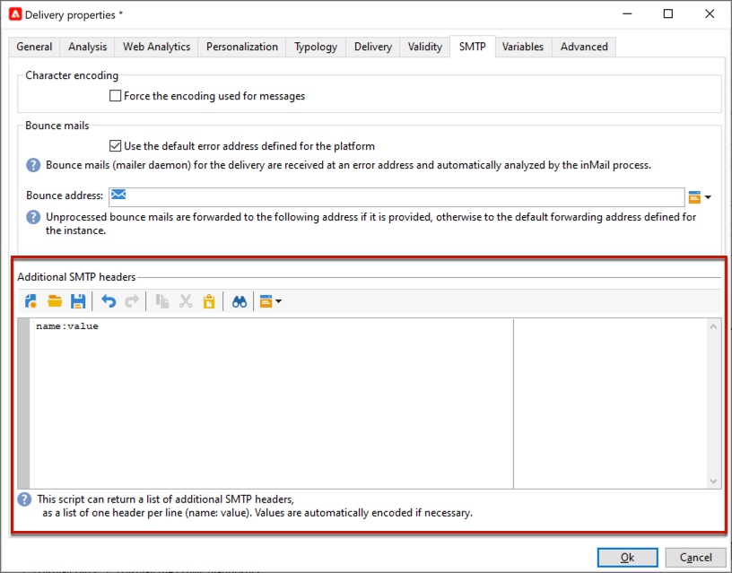

# E-mailparameters {#email-parameters}

In deze sectie worden de opties en parameters weergegeven die beschikbaar zijn in de leveringseigenschappen die specifiek zijn voor e-maillevering.

## E-mail BCC gebruiken {#email-bcc}

U kunt Adobe Campaign zo configureren dat een kopie van de e-mails die u van uw platform hebt ontvangen, bewaard blijft. Deze optie wordt gedetailleerd in [&#x200B; deze pagina &#x200B;](email-bcc.md).

## Berichtindelingen selecteren {#selecting-message-formats}

U kunt de indeling van verzonden e-mailberichten wijzigen. Hiervoor bewerkt u de leveringseigenschappen en klikt u op het tabblad **[!UICONTROL Delivery]** .

Selecteer de indeling van de e-mail in de onderste sectie van het venster:

* **[!UICONTROL Use recipient preferences]** (standaardmodus)

  De berichtindeling wordt gedefinieerd op basis van de gegevens die zijn opgeslagen in het ontvangende profiel en wordt standaard opgeslagen in het veld **[!UICONTROL email format]** (@emailFormat). Als een ontvanger berichten in een bepaalde indeling wenst te ontvangen, wordt deze indeling gebruikt. Als het veld niet is ingevuld, wordt een meerdelig alternatief bericht verzonden (zie hieronder).

* **[!UICONTROL Let recipient mail client choose the most appropriate format]**

  Het bericht bevat beide indelingen: tekst en HTML. Het formaat dat op ontvangst wordt getoond hangt van de configuratie van de de postsoftware van de ontvanger (multipart-alternatief) af.

  >[!IMPORTANT]
  >
  >Deze optie omvat beide versies van het document. Het vermindert daarom de leveringsproductie, omdat de berichtgrootte groter is.

* **[!UICONTROL Send all messages in text format]**

  Het bericht wordt verzonden in tekstformaat. De HTML-indeling wordt niet verzonden, maar wordt alleen voor de spiegel gebruikt wanneer de ontvanger op het bericht klikt.

<!--
>[!NOTE]
>
>For more on defining the email content, see [this section]().-->

## Tekencodering instellen {#character-encoding}

Op het tabblad **[!UICONTROL SMTP]** van de leveringsparameters kunt u in de sectie **[!UICONTROL Character encoding]** een specifieke codering instellen.

De standaardcodering is UTF-8. Als sommige e-mailproviders van uw ontvangers de standaardcodering UTF-8 niet ondersteunen, kunt u een specifieke codering instellen om de speciale tekens correct weer te geven aan de ontvangers van uw e-mail.

U wilt bijvoorbeeld een e-mail verzenden met Japanse tekens. Om ervoor te zorgen dat alle tekens correct worden weergegeven aan ontvangers in Japan, kunt u een codering gebruiken die de Japanse tekens ondersteunt in plaats van de standaard UTF-8.

Hiervoor selecteert u de optie **[!UICONTROL Force the encoding used for messages]** in de sectie **[!UICONTROL Character encoding]** en kiest u een codering in de vervolgkeuzelijst die wordt weergegeven.

## Bounce-e-mails beheren {#managing-bounce-emails}

Op het tabblad **[!UICONTROL SMTP]** van de leveringseigenschappen kunt u ook het beheer van stuiterende berichten configureren.

* **[!UICONTROL Errors-to-address]**: Standaard worden teruggestuurde e-mails ontvangen in het standaardfoutvak van het platform, maar u kunt een specifiek foutadres voor een levering definiëren.

* **[!UICONTROL Bounce address]**: U kunt ook een ander adres definiëren waarnaar de onverwerkte teruggestuurde e-mails worden doorgestuurd. Met dit adres kunt u de redenen voor het stuiteren onderzoeken wanneer e-mails niet automatisch kunnen worden gekwalificeerd door de toepassing.

Elk van deze velden kan worden gepersonaliseerd met behulp van het toegewezen pictogram. Leer meer op verpersoonlijkingsgebieden in [&#x200B; deze sectie &#x200B;](personalization-fields.md).

Voor meer bij stuiteren postbeheer, zie [&#x200B; deze sectie &#x200B;](delivery-failures.md#bounce-mail-management).

## Enable One-click List-unsubscribe {#one-click-list-unsubscribe}

De één-klik lijst-unsubscribe URL is een verbinding of knoop die naast de e-mailzenderinformatie wordt getoond die ontvangers onmiddellijk om uit uw het posten lijsten met één enkele klik laat kiezen. <!--[Learn more](https://experienceleague.adobe.com/docs/deliverability-learn/deliverability-best-practice-guide/additional-resources/campaign/acc-technical-recommendations.html?lang=nl-NL#list-unsubscribe){target="_blank"}-->

Het toont als **Unsubscribe** verbinding in de ISPs&#39; e-mailinterfaces. Bijvoorbeeld:

Het toevoegen van een kopbal SMTP genoemd lijst-Unsubscribe is verplicht om optimaal leveringsbaarheidsbeheer te verzekeren, en kan als alternatief aan het &quot;Rapport als SPAM&quot;pictogram worden gebruikt. Het gebruik van deze functie verlaagt de klachtenkosten en helpt uw reputatie te beschermen.

>[!IMPORTANT]
>
>Als u één klik wilt weergeven, klikt u op de URL voor afmelden in de e-mailheader, moet de e-mailclient van de ontvangers deze functie ondersteunen.

Selecteer de optie **[!UICONTROL Addition of One-click List-Unsubscription Header]** op het tabblad **[!UICONTROL SMTP]** van de leveringseigenschappen om deze functionaliteit in te schakelen.

>[!NOTE]
>
>Deze optie is standaard ingeschakeld.

<!--
>[!WARNING]
>
>If you uncheck this option in the delivery template, it will still be enabled by default in the deliveries created from this template. You need to enable the option again at the delivery level.-->

Afhankelijk van de e-mailcliënt en de methode zij gebruiken om opt-out uit uit te voeren, kan het klikken van de **Unsubscribe** verbinding in de e-mailkopbal de volgende gevolgen hebben:

* Als de e-mailcliënt **één-Klik** lijst-opheft methode gebruikt, wordt de ontvanger direct uit geopteerd.

  >[!NOTE]
  >
  >Belangrijke ISP&#39;s zoals Google en Yahoo! Vereisen afzenders om **te voldoen één-Klik lijst-Unsubscribe**.

* Als de e-mailcliënt niet één-Klik lijst-Unsubscribe steunt, kunnen zij nog **&quot;mailto&quot;** lijst-opzeggen methode gebruiken, die een vooraf ingevulde e-mail naar het afmeldingsadres verzendt dat in de e-mailkopbal wordt gespecificeerd.

  U kunt het adres expliciet instellen in de koptekst of een dynamisch adres gebruiken (bijvoorbeeld met &lt;%=errorAddress%> of de optie &#39;NmsEmail_DefaultErrorAddr&#39;) die kan worden ingesteld via de implementatietovenaar.

>[!NOTE]
>
>U kunt [&#x200B; ook plaatsen één-Klik lijst-Unsubscribe &#x200B;](https://experienceleague.adobe.com/nl/docs/deliverability-learn/deliverability-best-practice-guide/additional-resources/campaign/acc-technical-recommendations?lang=en#one-click-list-unsubscribe){target="_blank"} en [&#x200B; &quot;mailto&quot;lijst-Unsubscribe &#x200B;](https://experienceleague.adobe.com/nl/docs/deliverability-learn/deliverability-best-practice-guide/additional-resources/campaign/acc-technical-recommendations?lang=en#mailto-list-unsubscribe){target="_blank"} methodes manueel. De gedetailleerde stappen worden beschreven in de Gids van de Beste praktijken van de Levering van Experience Cloud [&#x200B; &#x200B;](https://experienceleague.adobe.com/docs/deliverability-learn/deliverability-best-practice-guide/additional-resources/campaign/acc-technical-recommendations.html?lang=nl-NL#list-unsubscribe){target="_blank"}.

## SMTP-koppen toevoegen {#adding-smtp-headers}

Het is mogelijk om kopballen SMTP aan uw leveringen toe te voegen. Hiervoor gebruikt u de desbetreffende sectie van het tabblad **[!UICONTROL SMTP]** in de levering.

Het manuscript ingegaan in dit venster moet één kopbal per lijn in de volgende vorm van verwijzingen voorzien: **naam:value**.

Waarden worden indien nodig automatisch gecodeerd.

>[!IMPORTANT]
>
>Het toevoegen van een manuscript voor het opnemen van extra kopballen SMTP is gereserveerd voor gevorderde gebruikers.
>
>De syntaxis van dit script moet voldoen aan de vereisten van dit type content: geen ongebruikte ruimte, geen lege regel, enz.

## Spiegelpagina genereren {#generating-mirror-page}

De spiegelpagina is een HTML-pagina die online toegankelijk is via een webbrowser. De inhoud is identiek aan de e-mail. Het kan handig zijn als uw ontvangers problemen ondervinden met het renderen of als ze uw e-mail proberen weer te geven in hun Postvak IN.

Leer hoe te om een verbinding aan de spiegelpagina in te voegen [&#x200B; deze sectie &#x200B;](mirror-page.md)
