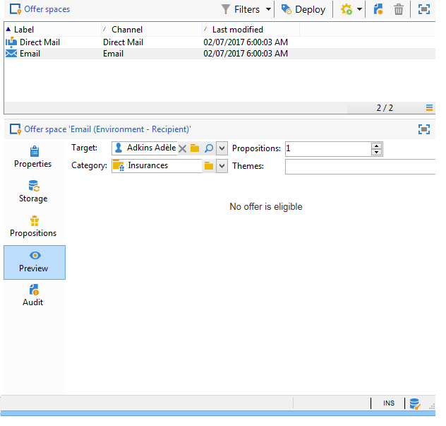

# Aanbiedingsplaatsingen maken{#creating-offer-spaces}

De inhoud van de aanbiedingscatalogus wordt geconfigureerd in aanbiedingsruimten. Standaard kan de inhoud de volgende velden bevatten: **[!UICONTROL Title]**, **[!UICONTROL Destination URL]**, **[!UICONTROL Image URL]**, **[!UICONTROL HTML content]** en **[!UICONTROL Text content]**. De gebiedsopeenvolging wordt gevormd in de aanbiedingsruimte.

Als **technische beheerder**, kunt u aanbiedingsruimten in het milieu van het Ontwerp tot stand brengen. U moet toegang hebben tot de submap voor de aanbiedingsruimte. Nadat deze aanbiedingsruimten zijn gemaakt, worden deze automatisch gedupliceerd naar de live omgeving tijdens de goedkeuring van de aanbieding.

De HTML-rendering wordt gemaakt via een renderfunctie. De volgorde van de velden die in de renderfunctie zijn gedefinieerd, moet gelijk zijn aan de volgorde die in de inhoud is geconfigureerd.


Volg onderstaande stappen om een nieuwe aanbiedingsruimte te maken:

1. Klik in de lijst met aanbiedingsruimten op **[!UICONTROL New]**.

   

1. Selecteer het kanaal u wilt gebruiken en het etiket van de aanbiedingsruimte veranderen.

   

1. Schakel de optie **[!UICONTROL Enable unitary mode]** in

1. Ga naar het **[!UICONTROL Content field]** venster en klik **[!UICONTROL Add]**.

   

1. Ga naar **[!UICONTROL Content]** knoop en selecteer de gebieden in de volgende orde: **[!UICONTROL Title]**, dan **[!UICONTROL Image URL]**, dan **[!UICONTROL HTML content]**, dan **[!UICONTROL Destination URL]**.

   

1. Schakel de optie **[!UICONTROL Required]** in om elk veld verplicht te maken.

   >[!NOTE]
   >
   >Deze optie wordt gebruikt bij de voorvertoning en maakt de aanbiedingsruimten ongeldig wanneer u publiceert als een van de verplichte velden in de aanbieding ontbreekt. Als een aanbieding echter al live is op een aanbiedingsruimte, worden deze criteria niet in aanmerking genomen.

   

1. Klik op **[!UICONTROL Edit functions]** om een renderfunctie te maken.

   Deze functies worden gebruikt om aanbiedingsvertegenwoordiging op een aanbiedingsruimte te produceren. Er zijn verschillende mogelijke indelingen: HTML of tekst.

   **Opmerking** : XML-indeling is beperkt tot binnenkomende interacties die niet beschikbaar zijn in deze versie van het product. [Meer informatie](../start/capability-matrix.md#gs-unavailable-features)

   _

1. Ga naar de **[!UICONTROL HTML rendering]** tabel en selecteer **[!UICONTROL Overload the HTML rendering function]**.
1. Voeg uw renderfunctie in.

   

## De status van de aanbieding {#offer-proposition-statuses}

De status van het voorstel varieert afhankelijk van de interactie met de doelpopulatie. De module van de Interactie van de campagne komt met een reeks waarden die op het aanbiedingsvoorstel tijdens zijn levenscyclus kunnen worden toegepast. U moet het platform vormen zodat de status verandert wanneer het aanbiedingsvoorstel wordt gecreeerd en wordt goedgekeurd.

>[!NOTE]
>
>De update van de status is een **asynchroon** proces. Deze wordt uitgevoerd door de workflow voor het bijhouden van gegevens, die elk uur wordt geactiveerd.

### Statuslijst aanbod {#status-list}

De volgende statussen zijn beschikbaar voor aanbiedingen:

* **[!UICONTROL Accepted]**
* **[!UICONTROL Scheduled]**
* **[!UICONTROL Generated]**
* **[!UICONTROL Interested]**
* **[!UICONTROL Presented]**
* **[!UICONTROL Rejected]**

Deze waarden worden niet standaard toegepast: zij moeten worden gevormd.

>[!NOTE]
>
>De status van een aanbiedingsvoorstel wordt automatisch gewijzigd in &quot;Presenteerd&quot; als de aanbieding gekoppeld is aan een levering met de status &quot;Verzonden&quot;.

### De status van de aanbieding wanneer het voorstel {#configuring-the-status-when-the-proposition-is-created} wordt gecreeerd

Wanneer een aanbiedingsvoorstel **gecreeerd** is, wordt zijn status bijgewerkt.

In het **[!UICONTROL Design]** milieu, voor elke aanbiedingsruimte, vorm de status om toe te passen wanneer een voorstel wordt gecreeerd, afhankelijk van de informatie u in de aanbiedingsrapporten wilt tonen.

Volg de onderstaande stappen om dit te doen:

1. Ga naar het **[!UICONTROL Storage]** lusje van de gewenste ruimte.
1. Selecteer de status die u wilt toepassen op het voorstel wanneer het wordt gemaakt.

   

### De status van de aanbieding wanneer het voorstel {#configuring-the-status-when-the-proposition-is-accepted} wordt goedgekeurd

Zodra een aanbiedingsvoorstel **toegelaten** is, gebruik één van de waarden die door gebrek worden verstrekt om de nieuwe status van het voorstel te vormen. De update wordt toegepast wanneer een ontvanger op een koppeling in de aanbieding klikt.

Volg de onderstaande stappen om dit te doen:

1. Ga naar het **[!UICONTROL Storage]** lusje van de gewenste ruimte.
1. Selecteer de status die u op het voorstel wilt toepassen wanneer het wordt goedgekeurd.

   

<!--
**Inbound interaction**

The **[!UICONTROL Storage]** tab lets you define statuses for **proposed** and **accepted** offer propositions only. For inbound interaction, the status of offer propositions should be specified directly in the URL for calling the offer engine, rather than through the interface. This way, you will be able to specify which status to apply in other cases, for example if an offer proposition is rejected.

```
<BASE_URL>?a=UpdateStatus&p=<PRIMARY_KEY_OF_THE_PROPOSITION>&st=<NEW_STATUS_OF_THE_PROPOSITION>&r=<REDIRECT_URL>
```

For instance, the proposition (identifier **40004**) that matches the **Home insurance** offer displayed on the **Neobank** site contains the following URL:

```
<BASE_URL>?a=UpdateStatus&p=<40004>&st=<3>&r=<"http://www.neobank.com/insurance/subscribe.html">
```

As soon as a visitor clicks the offer, and therefore the URL, the **[!UICONTROL Accepted]** status (value **3**) is applied to the proposition and the visitor is redirected to a new page of the **Neobank** site to take out the insurance contract.

>[!NOTE]
>
>If you want to specify another status in the url (for example if an offer proposition is rejected), use the value corresponding to the desired status. Example: **[!UICONTROL Rejected]** = "5", **[!UICONTROL Presented]** = "1" and so on.
>
>Statuses and their values can be retrieved in the **[!UICONTROL Offer propositions (nms)]** data schema. For more on this, refer to [this page](../../configuration/using/data-schemas.md).

**Outbound interaction**
-->

U kunt de status **[!UICONTROL Interested]** automatisch toepassen op een aanbiedingsvoorstel wanneer de levering een koppeling bevat. Voeg eenvoudig de **_urlType=&quot;11&quot;** waarde aan de verbinding toe:

```
<a _urlType="11" href="<DEST_URL>">Link inserted into the delivery</a>
```

## Voorvertoning per spatie {#offer-preview-per-space}

Op het tabblad **[!UICONTROL Preview]** kunt u de aanbiedingen bekijken waarvoor de ontvanger in aanmerking komt via een gekozen methode. In het onderstaande voorbeeld komt de begunstigde in aanmerking voor drie voorstellen per post.


Als een ontvanger niet in aanmerking komt voor een voorstel, wordt dit weergegeven in de voorvertoning.



<!--
The preview can ignore contexts when they are restricted to a space. This is the case when the interaction schema has been extended to add fields referenced in a space using an inbound channel (for more on this, refer to Extension example.
-->
