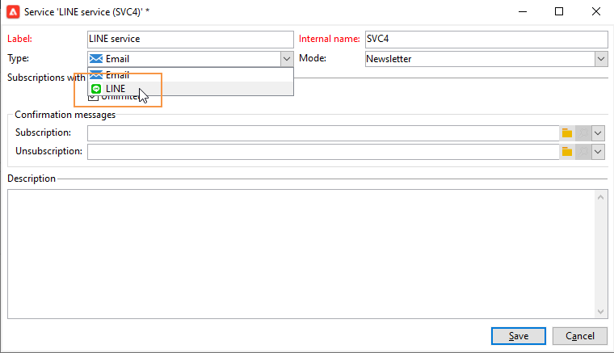
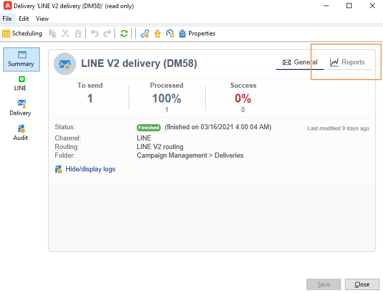
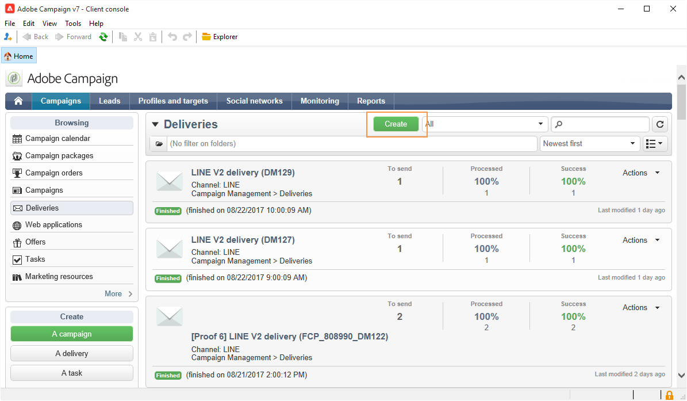

# Regelleveringen maken

De LIJN is een toepassing voor vrij Onmiddellijk overseinen, stem en videovraag, beschikbaar op alle mobiele apparaten en op PC. U kunt Adobe Campaign gebruiken om LIJNberichten te verzenden.

[!DNL LINE] kan ook worden gecombineerd met de module Transactiebericht om realtime berichten te verzenden via de [!DNL LINE] -app die is geïnstalleerd in mobiele apparaten voor consumenten. Voor meer op dit, verwijs naar deze [&#x200B; pagina &#x200B;](https://experienceleague.adobe.com/en/docs/campaign-classic/using/transactional-messaging/configure-transactional-messaging/transactional-messaging-architecture#transactional-messaging-and-line) in de documentatie van Campaign Classic v7.

De stappen voor het gebruik van het kanaal [!DNL LINE] zijn:

1. [LINE-kanaal instellen](#setting-up-line-channel)
1. [Een levering maken](#creating-the-delivery)
1. [Het inhoudstype configureren](#defining-the-content)
1. [Bewaking van de aflevering (volgen, quarantining, rapporten, enz.)](#accessing-reports)

## LINE-kanaal instellen {#setting-up-line-channel}

Voordat u een [!DNL LINE] -account en een externe account maakt, moet het LINE-pakket op uw exemplaar worden geïnstalleerd. Neem contact op met uw Adobe-vertegenwoordiger.

U moet eerst een [!DNL LINE] -account maken, zodat u deze aan Adobe Campaign kunt koppelen. Vervolgens kunt u [!DNL LINE] -berichten verzenden naar gebruikers die uw [!DNL LINE] -account in hun mobiele toepassing hebben toegevoegd. Externe accounts en [!DNL LINE] -account kunnen alleen worden beheerd door de functionele beheerder van het platform.

Om a [!DNL LINE] rekening tot stand te brengen en te vormen, zie [&#x200B; documentatie van de ontwikkelaars van de LIJN &#x200B;](https://developers.line.me/).

### Creeer en vorm de dienst van de LIJN {#configure-line-service}

Uw [!DNL LINE] -service maken:

1. Selecteer in de Adobe Campaign Classic-startpagina de tab **[!UICONTROL Profiles and Targets]** .

1. Selecteer **[!UICONTROL Services and Subscriptions]** in het linkermenu en klik op **[!UICONTROL Create]** .

   

1. Voeg een **[!UICONTROL Label]** en **[!UICONTROL Internal name]** toe aan uw nieuwe service.

1. Selecteer **[!UICONTROL LINE]** in de vervolgkeuzelijst **[!UICONTROL Type]** .

   

1. Klik op **[!UICONTROL Save]**.

Voor meer informatie over abonnementen en de diensten, zie [&#x200B; het Leiden abonnementen &#x200B;](../../start/subscriptions.md).

### Externe LINE-account configureren {#configure-line-external}

Nadat u de [!DNL LINE] -service hebt gemaakt, moet u de [!DNL LINE] externe account op Adobe Campaign configureren:

1. Klik in de boomstructuur **[!UICONTROL Administration]** > **[!UICONTROL Platform]** op de tab **[!UICONTROL External Accounts]** .

1. Selecteer de ingebouwde **[!UICONTROL LINE V2 routing]** externe account.

   

1. Klik op het tabblad **[!UICONTROL LINE]** van uw externe account om uw externe account te configureren. Vul de volgende velden in:

   

   * **[!UICONTROL Channel Alias]**: wordt via uw [!DNL LINE] -account aangeboden op het tabblad **[!UICONTROL Channels]** > **[!UICONTROL Technical configuration]** .
   * **[!UICONTROL Channel ID]**: wordt via uw [!DNL LINE] -account aangeboden op het tabblad **[!UICONTROL Channels]** > **[!UICONTROL Basic Information panel]** .
   * **[!UICONTROL Channel secret key]**: wordt via uw [!DNL LINE] -account aangeboden op het tabblad **[!UICONTROL Channels]** > **[!UICONTROL Basic Information panel]** .
   * **[!UICONTROL Access token]**: wordt geleverd via uw [!DNL LINE] -account in de ontwikkelaarportal of door op de knop **[!UICONTROL Get access token]** te klikken.
   * **[!UICONTROL Access token expiration date]**: hiermee kunt u de vervaldatum van het toegangstoken opgeven.
   * **[!UICONTROL LINE subscription service]**: hiermee kunt u opgeven op welke services de gebruikers zich moeten abonneren.

1. Zodra uw configuratie gereed is, klikt u op **[!UICONTROL Save]**.

1. Selecteer in het menu **[!UICONTROL Explorer]** **[!UICONTROL Administration]** > **[!UICONTROL Production]** > **[!UICONTROL Technical workflows]** > **[!UICONTROL LINE workflows]** om te controleren of de **[!UICONTROL LINE V2 access token update (updateLineAccessToken)]** - en **[!UICONTROL Delete blocked LINE users (deleteBlockedLineUsers)]** -workflows zijn gestart.

[!DNL LINE] is nu geconfigureerd in Adobe Campaign. U kunt lijnleveringen maken en naar abonnees verzenden.

## LINE-levering maken {#creating-the-delivery}

>[!NOTE]
>
>Wanneer u een [!DNL LINE] -levering voor het eerst naar een nieuwe ontvanger verzendt, moet u het officiële lijnbericht met betrekking tot de gebruiksvoorwaarden en de toestemming in de levering toevoegen. Het officiële bericht is beschikbaar bij [&#x200B; volgende verbinding &#x200B;](https://terms.line.me/OA_privacy/).

Voer de volgende stappen uit om een levering van [!DNL LINE] te maken:

1. Selecteer op het tabblad **[!UICONTROL Campaigns]** de optie **[!UICONTROL Deliveries]** en klik op de knop **[!UICONTROL Create]** .

   

1. Selecteer **[!UICONTROL LINE V2 delivery]** leveringssjabloon.

   

1. Geef uw levering aan met een lus **[!UICONTROL Label]** , **[!UICONTROL Delivery code]** en **[!UICONTROL Description]** . Raadpleeg [deze sectie](../../start/create-message.md#create-the-delivery) voor meer informatie.

1. Klik op **[!UICONTROL Continue]** om de levering te maken.

1. Selecteer **[!UICONTROL To]** in de leveringseditor om de ontvangers van de [!DNL LINE] -levering als doel in te stellen. Het richten wordt uitgevoerd op **[!UICONTROL Visitor subscriptions (nms:visitorSub)]**.

   Raadpleeg [deze sectie](../../audiences/target-mappings.md) voor meer informatie.

   

1. Klik op **[!UICONTROL Add]** om uw **[!UICONTROL Delivery target population]** te selecteren.

   

1. Kies of u [!DNL LINE] -abonnees rechtstreeks als doel wilt instellen of dat u gebruikers wilt instellen, afhankelijk van hun [!DNL LINE] -abonnement en klik op **[!UICONTROL Next]** . In dit voorbeeld hebben we **[!UICONTROL By LINE V2 subscription]** geselecteerd.

1. Selecteer **[!UICONTROL Line-V2]** in de vervolgkeuzelijst **[!UICONTROL Folder]** en vervolgens de service [!DNL LINE] . Klik op **[!UICONTROL Finish]** en vervolgens op **[!UICONTROL Ok]** om de levering aan te passen.

   

1. Klik in de leveringseditor op **[!UICONTROL Add]** om een of meerdere berichten toe te voegen en selecteer **[!UICONTROL Content type]** .

   Voor meer informatie over verschillende **[!UICONTROL Content type]** beschikbaar, verwijs naar [&#x200B; bepaal het inhoudstype &#x200B;](#defining-the-content).

   

1. Wanneer uw levering correct wordt gecreeerd en gevormd, kunt u het naar het vroeger bepaalde doel verzenden.

   Voor meer informatie bij het verzenden van een levering, verwijs naar [&#x200B; verzenden berichten &#x200B;](../configure-and-send.md).

1. Na het verzenden van uw bericht, heb toegang tot uw rapport om de doeltreffendheid van uw levering te meten.

   Voor meer informatie over [!DNL LINE] rapporten, verwijs naar [&#x200B; de rapporten van de Toegang &#x200B;](#accessing-reports).

## Het inhoudstype definiëren {#defining-the-content}

Als u de inhoud van een [!DNL LINE] -levering wilt definiëren, moet u eerst het berichttype aan uw levering toevoegen. Elke [!DNL LINE] -levering kan maximaal 5 berichten bevatten.

U kunt kiezen uit drie berichttypen:

* [Tekstbericht](#configuring-a-text-message-delivery)
* [Afbeelding en koppeling](#configuring-an-image-and-link-delivery)
* [Video-bericht](#configuring-a-video-message-delivery)

### De levering van een tekstbericht configureren {#configuring-a-text-message-delivery}

>[!NOTE]
>
>Met de syntaxis van `<%@ include option='NmsServer_URL' %>/webApp/APP3?id=<%=escapeUrl(cryptString(visitor.id))%>` kunt u een koppeling naar een web-app opnemen in een LINE-bericht.

Een **[!UICONTROL Text message]** [!DNL LINE] -levering is een bericht dat in tekstvorm naar ontvangers wordt verzonden.

De configuratie voor dit type berichten is vergelijkbaar met de configuratie van de **[!UICONTROL Text]** in een e-mail. Voor meer informatie, verwijs naar deze [&#x200B; pagina &#x200B;](../defining-the-email-content.md#message-content).

### Afbeelding en koppelingslevering configureren {#configuring-an-image-and-link-delivery}

Een **[!UICONTROL Image and link]** [!DNL LINE] -levering is een bericht dat naar ontvangers wordt verzonden in de vorm van een afbeelding die een of meer URL&#39;s kan bevatten.

U kunt het volgende gebruiken:

* a **[!UICONTROL Personalized image]** ,

  >[!NOTE]
  >
  >U kunt de variabele **%SIZE%** gebruiken om de weergave van de afbeelding te optimaliseren op basis van de schermgrootte van het mobiele apparaat van de ontvanger.

  

* een **[!UICONTROL Image URL]** per apparaatschermgrootte,

  

  Met de optie **[!UICONTROL Define images per device screen size]** kunt u verschillende afbeeldingsresoluties gebruiken om de zichtbaarheid van de levering op mobiele apparaten te optimaliseren. Alleen afbeeldingen met dezelfde hoogte en breedte worden ondersteund.

  Afbeeldingen kunnen worden gedefinieerd op basis van de schermgrootte:

   * 1040 px
   * 700 px
   * 460 px
   * 300 px
   * 240 px

  >[!CAUTION]
  >
  >De grootte van 1040 x 1040 px is verplicht voor elke lijnafbeelding met koppeling.

  Vervolgens moet u alternatieve tekst toevoegen die op het mobiele apparaat van de ontvanger verschijnt.

* en **[!UICONTROL Links]** .

  In de sectie **[!UICONTROL Links]** kunt u kiezen tussen verschillende lay-outs waarmee de afbeelding wordt verdeeld in meerdere gebieden waarop kan worden geklikt. Vervolgens kunt u aan elk element een toegewezen **[!UICONTROL Link URL]** toewijzen.

  

### Een videoboodschap configureren {#configuring-a-video-message-delivery}

Een **[!UICONTROL Video message]** [!DNL LINE] -levering is een bericht dat naar ontvangers wordt verzonden in de vorm van een video die een URL kan bevatten.

In het veld **[!UICONTROL Preview Image URL]** kunt u de URL toevoegen van een voorvertoning met een tekenlimiet van 1000. JPEG en PNG worden ondersteund met een maximale bestandsgrootte van 1 MB.

In het veld **[!UICONTROL Video Image URL]** kunt u de URL van het videobestand toevoegen met een tekenlimiet van 1000. Alleen MP4-indeling wordt ondersteund met een maximale bestandsgrootte van 200 MB.

Brede of lange video&#39;s kunnen worden bijgesneden wanneer deze op bepaalde apparaten worden afgespeeld.

## Toegang tot rapporten {#accessing-reports}

Nadat u de levering hebt verzonden, kunt u de [!DNL LINE] -rapporten weergeven via het menu **[!UICONTROL Campaign Management]** > **[!UICONTROL Deliveries]** in het dialoogvenster **[!UICONTROL Explorer]** .

>[!NOTE]
>
>De het volgen rapporten wijzen op het klikthrough tarief. [!DNL LINE] houdt geen rekening met de open snelheid.

Voor [!DNL LINE] -servicerapporten opent u het menu **[!UICONTROL Profiles and Targets]** > **[!UICONTROL Services and Subscriptions]** > **[!UICONTROL LINE-V2]** op het tabblad **[!UICONTROL Explorer]** . Klik vervolgens op het pictogram **[!UICONTROL Reports]** in de service [!DNL LINE] .

## Voorbeeld: een gepersonaliseerd lijnbericht maken en verzenden {#example--create-and-send-a-personalized-line-message}

In dit voorbeeld, gaan wij een tekstbericht en een beeld tot stand brengen en vormen die gegevens bevatten die volgens de ontvanger zullen worden gepersonaliseerd.

1. Maak de levering van [!DNL LINE] door op de knop **[!UICONTROL Create]** op de tab **[!UICONTROL Campaign]** te klikken.

   

1. Selecteer de leveringssjabloon van **[!UICONTROL LINE V2 delivery]** en geef uw levering een naam.

   

1. Selecteer in het configuratievenster van uw levering de doelpopulatie.

   Voor meer informatie, verwijs naar [&#x200B; identificerend doelpopulaties &#x200B;](../../start/create-message.md#target-population).

   

1. Klik op **[!UICONTROL Add]** om uw bericht te maken en selecteer de **[!UICONTROL Content type]** .

   Hier willen we eerst een **[!UICONTROL Text message]** maken.

   

1. Plaats de cursor op de plaats waar u de gepersonaliseerde tekst wilt invoegen en klik op het vervolgkeuzepictogram en selecteer vervolgens **[!UICONTROL Visitor]** > **[!UICONTROL First name]** .

   

1. Volg dezelfde procedure om een afbeelding toe te voegen door **[!UICONTROL Image and links]** te selecteren in de vervolgkeuzelijst **[!UICONTROL Message type]** .

   Voeg uw **[!UICONTROL Image URL]** toe.

   

1. Selecteer in de sectie **[!UICONTROL Links]** de lay-out waarmee de afbeelding wordt verdeeld in meerdere gebieden waarop kan worden geklikt.

1. Wijs een URL toe aan elk gebied van uw afbeelding.

   

1. Sla de levering op en klik op **[!UICONTROL Send]** om de levering te analyseren en naar het doel te verzenden.

   De levering wordt verzonden naar het doel.

   

