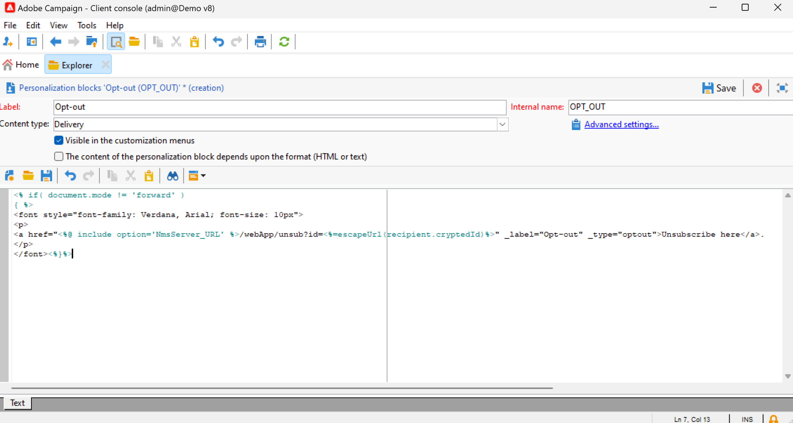

# Verpersoonlijkingsblokken gebruiken{#personalization-blocks}

Personalisatieblokken zijn dynamische inhoud die een specifieke rendering bevat die u in uw leveringen kunt invoegen. U kunt bijvoorbeeld een logo, een begroetingsbericht of een koppeling naar een spiegelpagina toevoegen.

Blader naar de **[!UICONTROL Resources > Campaign Management > Personalization blocks]** knooppunt van de verkenner. De ingebouwde verpersoonlijkingsblokken worden vermeld in [deze sectie](#ootb-personalization-blocks).

U kunt ook nieuwe blokken definiëren om uw leveringen te optimaliseren. [Meer informatie](#create-custom-personalization-blocks).

## Verpersoonlijkingsblokken invoegen {#insert-personalization-blocks}

Volg onderstaande stappen om een verpersoonlijkingsblok in te voegen in een bericht:

1. Klik in de inhoudseditor van de wizard voor levering op het pictogram voor de aanpassing van de inhoud en selecteer de knop **[!UICONTROL Include]** -menu.
1. Selecteer een verpersoonlijkingsblok in de lijst of klik op de knop **[!UICONTROL Other...]** voor toegang tot de volledige lijst.

   

1. Het verpersoonlijkingsblok wordt dan opgenomen als manuscript. Het wordt automatisch aangepast aan het ontvankelijke profiel wanneer de verpersoonlijking wordt geproduceerd.
1. Bladeren naar de **[!UICONTROL Preview]** en selecteert u een ontvanger om de inhoud van dit blok voor een specifieke ontvanger weer te geven.

U kunt de broncode van een verpersoonlijkingsblok in de leveringsinhoud omvatten. Selecteer **[!UICONTROL Include the HTML source code of the block]** wanneer u het selecteert.

## Ingebouwde verpersoonlijkingsblokken {#ootb-personalization-blocks}

Ingebouwde verpersoonlijkingsblokken zijn:

* **[!UICONTROL Enabled by Adobe Campaign]**: voegt het logo &quot;Enabled by Adobe Campaign&quot; in.
* **[!UICONTROL Formatting function for proper nouns]**: genereert de **[!UICONTROL toSmartCase]** De functie Javascript, die de eerste letter van elk woord in hoofdletters verandert.
* **[!UICONTROL Greetings]**: voegt begroetingen met de volledige naam van de ontvanger in, gevolgd door een komma. Voorbeeld: &quot;Hallo JanDoe,&quot;.
* **[!UICONTROL Insert logo]**: voegt een logo in dat in de instantie-instellingen is gedefinieerd.
* **[!UICONTROL Link to mirror page]**: voegt een koppeling in naar de [spiegelpagina](mirror-page.md). Standaardindeling is: &quot;Klik hier als je dit bericht niet juist kunt weergeven.&quot;
* **[!UICONTROL Mirror page URL]**: voegt de URL van de spiegelpagina in, waardoor de leveringsontwerpers de koppeling kunnen controleren.
* **[!UICONTROL Offer acceptance URL in unitary mode]**: voegt een URL in waarmee een aanbieding kan worden ingesteld op **[!UICONTROL Accepted]**. (Dit blok is beschikbaar als de module van de Interactie wordt toegelaten)
* **[!UICONTROL Registration confirmation]**: voegt een koppeling in waarmee u het abonnement kunt bevestigen.
* **[!UICONTROL Registration link]**: voegt een abonnementkoppeling in. Deze koppeling wordt gedefinieerd in de instantie-instellingen. De standaardinhoud is: &quot;Klik hier om te registreren.&quot;
* **[!UICONTROL Registration link (with referrer)]**: voegt een abonnementkoppeling in, waarmee de bezoeker en de levering kunnen worden geïdentificeerd. Deze koppeling wordt gedefinieerd in de instantie-instellingen.
* **[!UICONTROL Registration page URL]**: voegt een abonnement-URL in
* **[!UICONTROL Style of content emails]** en **[!UICONTROL Notification style]**: genereren code waarmee een e-mailbericht wordt opgemaakt met vooraf gedefinieerde HTML-stijlen.
* **[!UICONTROL Unsubscription link]**: voegt een koppeling in waarmee u zich kunt afmelden bij alle leveringen (lijst van gewezen personen). De standaard gekoppelde inhoud is: &quot;U ontvangt dit bericht omdat u contact hebt gehad met ***uw organisatienaam*** of een gelieerde. Als u geen berichten meer wilt ontvangen van ***uw organisatienaam*** klik hier.&quot;

## Aangepaste personalisatieblokken maken {#create-custom-personalization-blocks}

U kunt nieuwe gepersonaliseerde inhoudsblokken bepalen die van het verpersoonlijkingspictogram moeten worden opgenomen.

Volg onderstaande stappen om een aanpassingsblok te maken:

1. Bladeren naar de **[!UICONTROL Resources > Campaign Management > Personalization blocks]** map van Campaign Explorer.
1. Klik boven de lijst met ingebouwde blokken op **[!UICONTROL New]**.

   

1. Vul de instellingen van het verpersoonlijkingsblok in:

   

   * Voer het label van het blok in. Dit label wordt weergegeven in het invoegvenster van het aanpassingsveld.
   * Selecteer een **Aflevering** inhoudstype.
   * De optie **[!UICONTROL Visible in the customization menus]** optie om dit blok toegankelijk te maken vanaf het invoegpictogram van het verpersoonlijkingsveld.
   * Schakel indien nodig de **[!UICONTROL The content of the personalization block depends upon the format]** -optie, om twee verschillende blokken voor e-mails met HTML en tekst te definiëren.
   * Voer de inhoud in (in HTML, tekst, JavaScript, enz.) van het verpersoonlijkingsblok en klik op **[!UICONTROL Save]**.

Zodra bewaard, is het nieuwe verpersoonlijkingsblok beschikbaar in de leveringsredacteur.

## Video over zelfstudie {#personalization-blocks-video}

Leer hoe u dynamische inhoudsblokken maakt en hoe u deze kunt gebruiken om de inhoud van uw e-maillevering aan te passen in de volgende video.

>[!VIDEO](https://video.tv.adobe.com/v/342088?quality=12)

