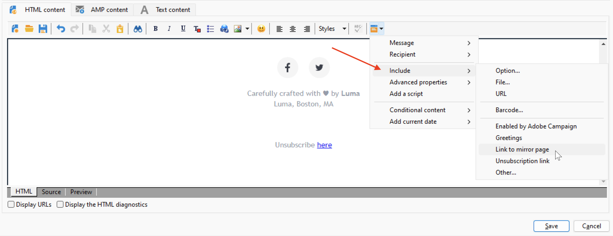

# Verpersoonlijkingsblokken gebruiken{#personalization-blocks}

Personalisatieblokken zijn dynamische inhoud die een specifieke rendering bevat die u in uw leveringen kunt invoegen. U kunt bijvoorbeeld een logo, een begroetingsbericht of een koppeling naar een spiegelpagina toevoegen.

Blader naar het knooppunt **[!UICONTROL Resources > Campaign Management > Personalization blocks]** van de verkenner om toegang te krijgen tot gepersonaliseerde inhoudsblokken. De ingebouwde verpersoonlijkingsblokken zijn vermeld in [&#x200B; deze sectie &#x200B;](#ootb-personalization-blocks).

U kunt ook nieuwe blokken definiëren om uw leveringen te optimaliseren. [Meer informatie](#create-custom-personalization-blocks).

## Verpersoonlijkingsblokken invoegen {#insert-personalization-blocks}

Volg onderstaande stappen om een verpersoonlijkingsblok in te voegen in een bericht:

1. Klik in de inhoudseditor van de wizard voor levering op het pictogram voor aanpassen en selecteer het menu **[!UICONTROL Include]** .
1. Selecteer een aanpassingsblok in de lijst of klik op het menu **[!UICONTROL Other...]** om de volledige lijst te openen.

   

1. Het verpersoonlijkingsblok wordt dan opgenomen als manuscript. Het wordt automatisch aangepast aan het ontvankelijke profiel wanneer de verpersoonlijking wordt geproduceerd.
1. Blader naar het tabblad **[!UICONTROL Preview]** en selecteer een ontvanger om de inhoud van dit blok voor een specifieke ontvanger weer te geven.

U kunt de broncode van een verpersoonlijkingsblok in de leveringsinhoud omvatten. Selecteer **[!UICONTROL Include the HTML source code of the block]** wanneer u dit wilt doen.

## Ingebouwde verpersoonlijkingsblokken {#ootb-personalization-blocks}

Ingebouwde verpersoonlijkingsblokken zijn:

* **[!UICONTROL Enabled by Adobe Campaign]**: voegt het logo &quot;Enabled by Adobe Campaign&quot; in.
* **[!UICONTROL Formatting function for proper nouns]**: genereert de functie **[!UICONTROL toSmartCase]** Javascript, die de eerste letter van elk woord in hoofdletters wijzigt.
* **[!UICONTROL Greetings]** : voegt begroetingen in met de volledige naam van de ontvanger, gevolgd door een komma. Voorbeeld: &quot;Hello John Doe,&quot;.
* **[!UICONTROL Insert logo]** : voegt een logo in dat is gedefinieerd in de instantie-instellingen.
* **[!UICONTROL Link to mirror page]**: neemt een verbinding aan de [&#x200B; spiegelpagina &#x200B;](mirror-page.md) op. De standaardnotatie is: &quot;Als u dit bericht niet correct kunt weergeven, klikt u hier&quot;.
* **[!UICONTROL Mirror page URL]**: voegt de URL van de spiegelpagina in, waardoor de leveringsontwerpers de koppeling kunnen controleren.
* **[!UICONTROL Offer acceptance URL in unitary mode]** : voegt een URL in waarmee een aanbieding kan worden ingesteld op **[!UICONTROL Accepted]** . (Dit blok is beschikbaar als de module van de Interactie wordt toegelaten)
* **[!UICONTROL Registration confirmation]** : voegt een koppeling in waarmee u uw abonnement kunt bevestigen.
* **[!UICONTROL Registration link]**: voegt een abonnementkoppeling in. Deze koppeling wordt gedefinieerd in de instantie-instellingen. De standaardinhoud is: &quot;Klik hier om te registreren.&quot;
* **[!UICONTROL Registration link (with referrer)]**: voegt een abonnementkoppeling in, waarmee de bezoeker en de levering kunnen worden geïdentificeerd. Deze koppeling wordt gedefinieerd in de instantie-instellingen.
* **[!UICONTROL Registration page URL]**: voegt een abonnement-URL in
* **[!UICONTROL Style of content emails]** en **[!UICONTROL Notification style]** : genereer code die een e-mailbericht opmaakt met vooraf gedefinieerde HTML-stijlen.
* **[!UICONTROL Unsubscription link]**: voegt een koppeling in waarmee u zich kunt afmelden bij alle leveringen (lijst van gewezen personen). De gebrek bijbehorende inhoud is: &quot;U ontvangt dit bericht omdat u in contact met ***uw organisatienaam*** of een filiaal bent geweest. Om berichten van ***niet meer te ontvangen uw organisatienaam*** hier klikt.&quot;

## Aangepaste verpersoonlijkingsblokken maken {#create-custom-personalization-blocks}

U kunt nieuwe gepersonaliseerde inhoudsblokken bepalen die van het verpersoonlijkingspictogram moeten worden opgenomen.

Volg onderstaande stappen om een aanpassingsblok te maken:

1. Blader naar de map **[!UICONTROL Resources > Campaign Management > Personalization blocks]** van de Campagneverkenner.
1. Klik op **[!UICONTROL New]** boven de lijst met ingebouwde blokken.

   

1. Vul de instellingen van het verpersoonlijkingsblok in:

   

   * Voer het label van het blok in. Dit label wordt weergegeven in het invoegvenster van het aanpassingsveld.
   * Selecteer het inhoudstype van de a **Levering**.
   * Schakel de optie **[!UICONTROL Visible in the customization menus]** in om dit blok toegankelijk te maken via het invoegpictogram voor het aanpassingsveld.
   * Schakel indien nodig de optie **[!UICONTROL The content of the personalization block depends upon the format]** in om twee verschillende blokken voor e-mails met HTML en Text te definiëren.
   * Voer de inhoud (in HTML, tekst, JavaScript, enzovoort) van het aanpassingsblok in en klik op **[!UICONTROL Save]** .

Zodra bewaard, is het nieuwe verpersoonlijkingsblok beschikbaar in de leveringsredacteur.

## Video over zelfstudie {#personalization-blocks-video}

Leer hoe u dynamische inhoudsblokken maakt en hoe u deze kunt gebruiken om de inhoud van uw e-maillevering aan te passen in de volgende video.

>[!VIDEO](https://video.tv.adobe.com/v/342088?quality=12)
