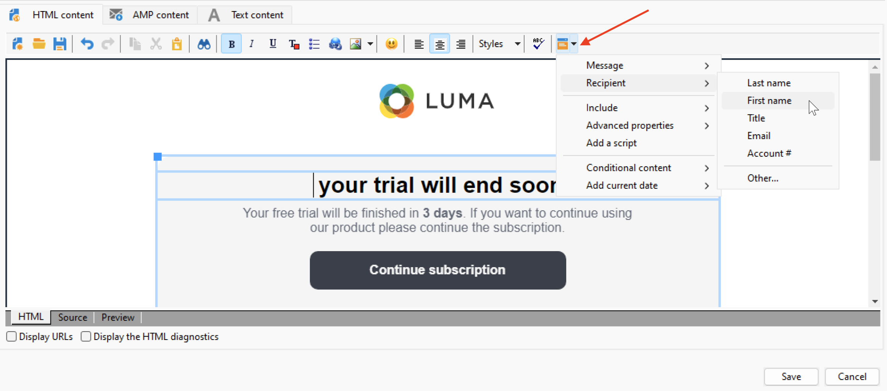

# Personalisatievelden{#personalization-fields}

De gebieden van de verpersoonlijking van het gebruik om gepersonaliseerde inhoud op een één-aan-één basis te leveren, die op de regels wordt gebaseerd u voor elke ontvanger plaatst.

Een verpersoonlijkingsgebied is één enkele verwijzing van het gegevensgebied die wanneer het personaliseren van een levering voor een specifieke ontvanger wordt gebruikt. De werkelijke gegevenswaarde wordt ingevoegd tijdens de fase van de leveringsanalyse.

## Syntaxis

Voor een personalisatietag wordt altijd de volgende syntaxis gebruikt: `<%=table.field%>`.

Bijvoorbeeld, om de naam van de ontvanger op te nemen, die in de ontvankelijke lijst wordt opgeslagen, gebruikt het verpersoonlijkingsgebied `<%= recipient.lastName %>` syntaxis.

>[!CAUTION]
>
>Inhoud van aanpassingsvelden mag niet langer zijn dan 1024 tekens.

## Insert a personalization field {#insert-a-personalization-field}

Als u verpersoonlijkingsvelden wilt invoegen, klikt u op het vervolgkeuzepictogram dat toegankelijk is vanuit een veld voor de koptekst, het onderwerp of de berichttekst.

De verpersoonlijkingsgebieden worden opgenomen, en klaar om door Adobe Campaign te worden geïnterpreteerd: tijdens de voorbereiding van berichten worden de velden vervangen door hun waarde voor een bepaalde ontvanger.

Deze vervanging kan dan in **[!UICONTROL Preview]** tab.

<!--Learn more about message preview in [this page]().-->

## Hoofdlettergebruik: e-mailonderwerp personaliseren {#personalization-fields-uc}

Leer in het onderstaande gebruiksgeval hoe u het onderwerp en de inhoud van een e-mail kunt aanpassen aan de gegevens van de ontvanger:

1. Maak een nieuwe levering of open een bestaande e-maillevering.
1. Bladeren naar de **[!UICONTROL Subject]** koppeling om het onderwerp van het bericht te bewerken.
1. Voer &quot; **Speciale aanbieding voor** &quot; en gebruik de knop op de werkbalk om een verpersoonlijkingsveld in te voegen. Selecteer **[!UICONTROL Recipients>Title]**.
1. Herhaal de bewerking om de naam van de ontvanger in te voegen. Voeg spaties in tussen alle verpersoonlijkingsvelden.
1. Klikken **[!UICONTROL OK]** om te valideren.
1. Voeg de personalisatie in de berichttekst in. Klik hiertoe in de inhoud van het bericht en klik op de knop voor het invoegen van het veld.
1. Selecteer **[!UICONTROL Recipient>Other...]**.
1. Selecteer het veld met de informatie die u wilt weergeven en klik op **[!UICONTROL OK]**.
1. Klik op de knop **[!UICONTROL Preview]** om het verpersoonlijkingsresultaat weer te geven. U moet een ontvanger selecteren om het bericht van die ontvanger te tonen.

## Video over zelfstudie {#personalization-field-video}

Leer hoe u een verpersoonlijkingsveld toevoegt aan de onderwerpregel en de inhoud van een e-maillevering in de volgende video.

>[!VIDEO](https://video.tv.adobe.com/v/24925?quality=12)

