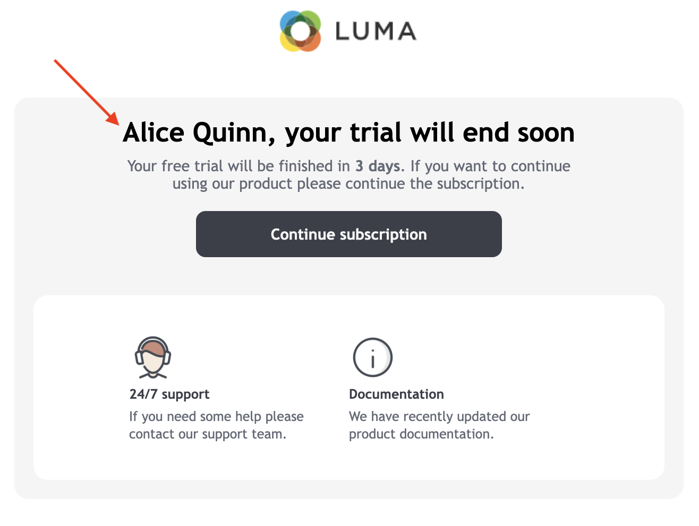
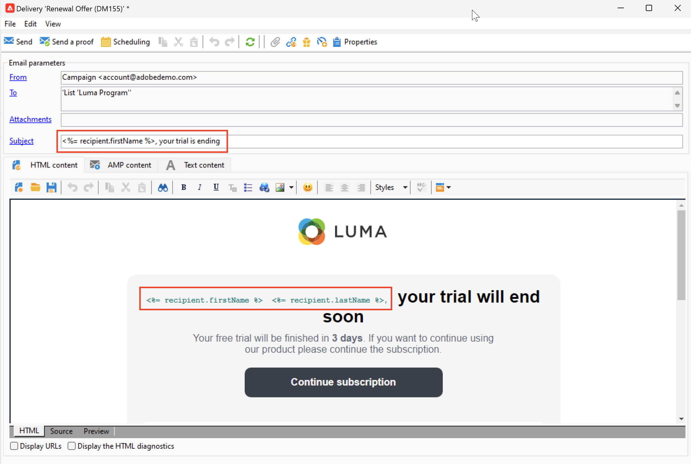

# Aanpassingsvelden toevoegen{#personalization-fields}

Gebruik verpersoonlijkingsgebieden om gepersonaliseerde inhoud op een één-aan-één basis te leveren, die op de regels wordt gebaseerd u voor elke ontvanger plaatst.

Een verpersoonlijkingsgebied is één enkele verwijzing van het gegevensgebied die wanneer het personaliseren van een levering voor een specifieke ontvanger wordt gebruikt. De werkelijke gegevenswaarde wordt ingevoegd tijdens de fase van de leveringsanalyse.

## Syntaxis

Een personalisatiemarkering gebruikt altijd de volgende syntaxis: `<%=table.field%>`.

Als u bijvoorbeeld de naam van de ontvanger wilt invoegen, die is opgeslagen in de tabel met ontvangers, gebruikt het veld voor de personalisatie de syntaxis `<%= recipient.lastName %>` .

>[!CAUTION]
>
>Inhoud van aanpassingsvelden mag niet langer zijn dan 1024 tekens.

## Een verpersoonlijkingsveld invoegen {#insert-a-personalization-field}

Als u verpersoonlijkingsvelden wilt invoegen, klikt u op het vervolgkeuzepictogram dat toegankelijk is vanuit een veld voor de koptekst, het onderwerp of de berichttekst.

 op

De verpersoonlijkingsgebieden worden opgenomen, en klaar om door Adobe Campaign te worden geïnterpreteerd: tijdens berichtvoorbereiding, worden de gebieden vervangen door hun waarde voor een bepaalde ontvanger.

Deze vervanging kan vervolgens worden getest op het tabblad **[!UICONTROL Preview]** .

<!--Learn more about message preview in [this page]().-->

## Hoofdlettergebruik: onderwerp van e-mail aanpassen {#personalization-fields-uc}

Leer in het onderstaande gebruiksgeval hoe u het onderwerp en de inhoud van een e-mail kunt aanpassen aan de gegevens van de ontvanger:

1. Maak een nieuwe levering of open een bestaande e-maillevering.
1. Blader naar de koppeling **[!UICONTROL Subject]** om het onderwerp van het bericht te bewerken.
1. Ga &quot; **Speciale aanbieding voor** &quot; in en gebruik de knoop in de toolbar om een verpersoonlijkingsgebied op te nemen. Selecteer **[!UICONTROL Recipients>Title]**.
1. Herhaal de bewerking om de naam van de ontvanger in te voegen. Voeg spaties in tussen alle verpersoonlijkingsvelden.
1. Klik op **[!UICONTROL OK]** om te valideren.
1. Voeg de personalisatie in de berichttekst in. Klik hiertoe in de berichtinhoud en klik op de knop voor het invoegen van het veld.
1. Selecteer **[!UICONTROL Recipient>Other...]**.
1. Selecteer het veld met de informatie die u wilt weergeven en klik op **[!UICONTROL OK]** .
1. Klik op het tabblad **[!UICONTROL Preview]** om het resultaat van de aanpassing weer te geven. U moet een ontvanger selecteren om het bericht van die ontvanger te tonen.

## Video over zelfstudie {#personalization-field-video}

Leer hoe u een verpersoonlijkingsveld toevoegt aan de onderwerpregel en de inhoud van een e-maillevering in de volgende video.

>[!VIDEO](https://video.tv.adobe.com/v/24925?quality=12)
