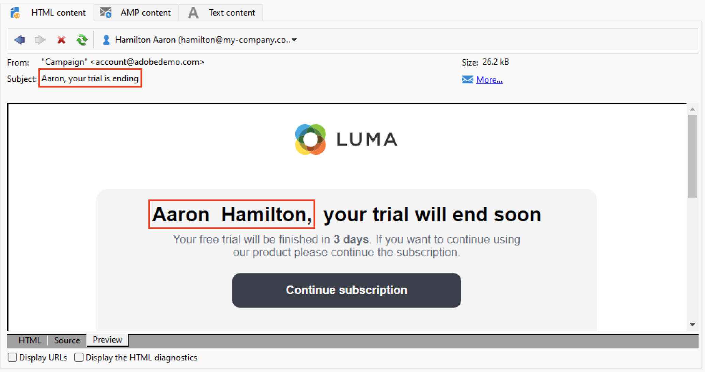

# Uw e-mail voorvertonen en testen {#preview-test}

Nadat de inhoud van uw bericht is gedefinieerd, kunt u testprofielen gebruiken om een voorbeeld van de inhoud weer te geven en deze te testen. Als u [persoonlijke inhoud](personalize.md)kunt u met testprofielgegevens controleren hoe deze inhoud in het bericht wordt weergegeven. Als u bovendien mogelijke fouten in de inhoud van het bericht of de instellingen voor personalisatie wilt detecteren, verzendt u proefdrukken naar testprofielen. Telkens wanneer een wijziging wordt aangebracht, moet een bewijs worden verzonden om de meest recente inhoud te valideren.

## Voorvertoning van inhoud{#preview-content}

Voordat u proefdrukken verzendt, kunt u het beste de inhoud van het bericht controleren in de voorbeeldsectie van het leveringsvenster.

Volg onderstaande stappen om een voorvertoning van de inhoud van het bericht weer te geven:

1. Bladeren naar de **Voorvertoning** tabblad van de levering.
1. Klik op de knop **[!UICONTROL Test personalization]** om een profiel te selecteren om aanpassingsgegevens te vullen. U kunt een specifieke ontvanger in het gegevensbestand, een zaadadres kiezen, of een profiel van de doelbevolking selecteren - als het reeds is bepaald. U kunt de inhoud ook controleren zonder personalisatie.

   

1. De voorvertoning wordt gegenereerd zodat u de berichtweergave kunt controleren. In de voorvertoning van het bericht worden gepersonaliseerde elementen vervangen door de geselecteerde gegevens van het testprofiel.

   

1. Selecteer andere testprofielen voor een voorvertoning van de e-mailrendering voor elke variant van uw bericht.

## Verzend proeven {#send-proofs}

Voor e-mailleveringen kunt u proefdrukken verzenden om de inhoud van uw bericht te valideren. Door proefdrukken te verzenden, kunt u de koppeling om te weigeren controleren, de pagina spiegelen en andere koppelingen controleren, het bericht valideren, controleren of afbeeldingen worden weergegeven, mogelijke fouten opsporen, enz. Mogelijk wilt u ook uw ontwerp en rendering op verschillende apparaten controleren.

Een proef is een specifiek bericht dat u toestaat om een bericht te testen alvorens het naar het belangrijkste publiek te verzenden. Ontvangers van het bewijs zijn belast met de goedkeuring van het bericht: renderen, inhoud, instellingen voor personalisatie, configuratie.

### Ontvangers proefdrukken {#proofs-recipients}

Het proefdrukdoel kan in het leveringsmalplaatje, of specifiek voor een levering worden bepaald. Blader in beide gevallen vanuit het **[!UICONTROL To]** en selecteert u de **[!UICONTROL Target of the proofs]** tab.

Het type proefdrukdoel is geselecteerd in het menu **[!UICONTROL Targeting mode]** vervolgkeuzelijst.

* Gebruik de **[!UICONTROL Definition of a specific proof target]** om ontvangers in de database te selecteren als het proefdrukdoel.
* Gebruik de **[!UICONTROL Substitution of the address]** e-mailadressen invoeren en de gegevens van de ontvanger gebruiken om de inhoud te valideren. U kunt de vervangende adressen handmatig invoeren of selecteren in de vervolgkeuzelijst. De bijbehorende opsomming is het adres van de Vervanging (rcpAddress).
Standaard wordt de vervanging willekeurig uitgevoerd, maar u kunt een specifieke ontvanger van het hoofddoel selecteren via de  **[!UICONTROL Detail]** pictogram.

   {width="800" align="left"}

   Kies de optie **[!UICONTROL Select a profile (must be included in the target)]** en selecteert u een ontvanger.

   {width="800" align="left"}

* Gebruik de **[!UICONTROL Seed addresses]**  optie om zaadadressen als proefdrukdoel te gebruiken. Deze adressen kunnen uit een dossier worden ingevoerd of manueel ingegaan.

   >[!NOTE]
   >
   >De zaadadressen behoren niet tot de standaard ontvankelijke lijst (nms:ontvanger), zij worden gecreeerd in een afzonderlijke lijst. Als u de lijst van ontvangers met nieuwe gegevens uitbreidt, moet u de lijst van zaadadressen evenals met de zelfde gegevens uitbreiden.

   Meer informatie over adressen in [Campaign Classic v7-documentatie](https://experienceleague.adobe.com/docs/campaign-classic/using/sending-messages/using-seed-addresses/about-seed-addresses.html){target="_blank"}.

* Gebruik de **[!UICONTROL Specific target and Seed addresses]** optie om zaadadressen en specifieke e-mailadressen te combineren. De gerelateerde configuraties worden vervolgens in twee aparte subtabbladen gedefinieerd.

### Een proef verzenden{#proofs-send}

Volg onderstaande stappen om proefdrukken van berichten te verzenden:

1. Klik in het scherm voor de berichtdefinitie op de knop **[!UICONTROL Send a proof]** knop.
1. Van de **[!UICONTROL Send a proof]** , controleert u de ontvangers van de proefdrukken.
1. Klikken **[!UICONTROL Analyze]** om de voorbereiding van het proefdrukbericht te starten.

   {width="800" align="left"}

1. Wanneer de bereiding van de aflevering is voltooid, gebruikt u de **[!UICONTROL Confirm delivery]** om te beginnen met het verzenden van proefdrukberichten.

Bladeren naar de **[!UICONTROL Audit]** tabblad van de levering voor de controle op de levering van exemplaren van de bewijsstukken.

Het wordt aanbevolen om na elke wijziging proefdrukken naar de inhoud van het bericht te verzenden.

>[!NOTE]
>
>In de verzonden proefdruk is de verbinding aan de spiegelpagina niet actief. Deze wordt alleen geactiveerd in de laatste berichten.

### Eigenschappen van proefdrukken{#proofs-properties}

Eigenschappen van proefdrukken worden ingesteld in het dialoogvenster **[!UICONTROL Advanced]** tabblad van de leveringseigenschappen van vensters. Bladeren naar de **[!UICONTROL Proof properties...]** koppeling om de parameters en het label van de proefdrukken te definiëren. U kunt ervoor kiezen om:

* Dubbele adressen in de proefdruk
* Gevoegde op lijst van gewenste personen adressen in de proef
* Gekwantificeerde adressen in de proefdruk

Standaard worden de proefdrukberichten geïdentificeerd door de `Proof #N` in het onderwerp vermelden, waar `N` is het proefnummer. Dit aantal wordt verhoogd bij elke analyse van de bewijslevering. U kunt de `proof` gebruiken.

{width="800" align="left"}

## Hoe kan ik-video {#video-proof}

Leer hoe u een proef voor een e-maillevering verzendt en valideert.

>[!VIDEO](https://video.tv.adobe.com/v/333404)
