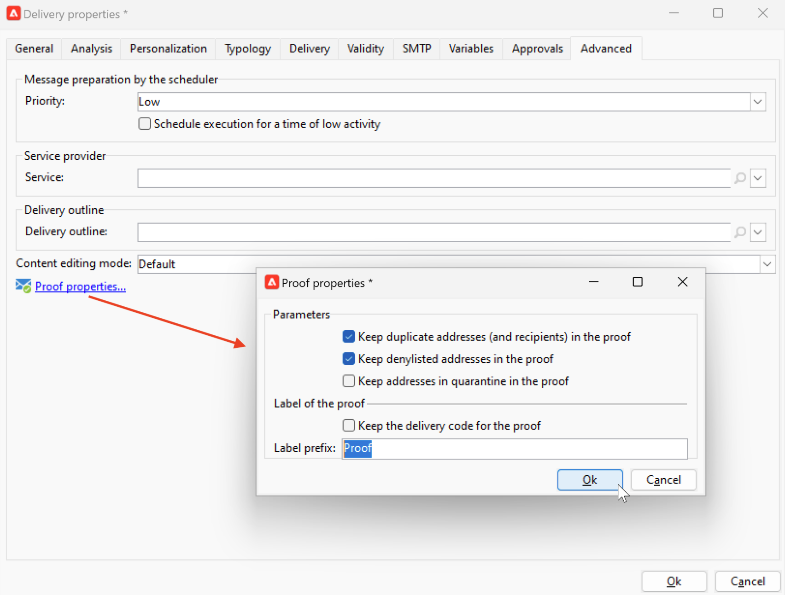

# Uw e-mail voorvertonen en testen {#preview-test}

Nadat de inhoud van uw bericht is gedefinieerd, kunt u testprofielen gebruiken om een voorbeeld van de inhoud weer te geven en deze te testen. Als u [ gepersonaliseerde inhoud ](personalize.md) opnam, kunt u controleren hoe deze inhoud in het bericht wordt getoond, gebruikend de gegevens van het testprofiel. Als u bovendien mogelijke fouten in de inhoud van het bericht of de instellingen voor personalisatie wilt detecteren, verzendt u proefdrukken naar testprofielen. Telkens wanneer een wijziging wordt aangebracht, moet een bewijs worden verzonden om de meest recente inhoud te valideren.

## Voorvertoning van inhoud {#preview-content}

Voordat u proefdrukken verzendt, kunt u het beste de inhoud van het bericht controleren in de voorbeeldsectie van het leveringsvenster.

Volg onderstaande stappen om een voorvertoning van de inhoud van het bericht weer te geven:

1. Blader naar het **lusje van de Voorproef** van de levering.
1. Klik op de knop **[!UICONTROL Test personalization]** om een profiel te selecteren om aanpassingsgegevens te vullen. U kunt een specifieke ontvanger in het gegevensbestand, een zaadadres kiezen, of een profiel van de doelbevolking selecteren - als het reeds is bepaald. U kunt de inhoud ook controleren zonder personalisatie.

   

1. De voorvertoning wordt gegenereerd zodat u de berichtweergave kunt controleren. In de berichtvoorvertoning worden gepersonaliseerde elementen vervangen door de geselecteerde gegevens van het testprofiel.

   

1. Selecteer andere testprofielen voor een voorvertoning van de e-mailrendering voor elke variant van uw bericht.

## Proefdrukken verzenden {#send-proofs}

Voor e-mailleveringen kunt u proefdrukken verzenden om uw berichtinhoud te valideren. Door proefdrukken te verzenden, kunt u de koppeling om te weigeren controleren, de pagina spiegelen en andere koppelingen controleren, het bericht valideren, controleren of afbeeldingen worden weergegeven, mogelijke fouten opsporen, enz. Mogelijk wilt u ook uw ontwerp en rendering op verschillende apparaten controleren.

Een proef is een specifiek bericht dat u toestaat om een bericht te testen alvorens het naar het belangrijkste publiek te verzenden. Ontvangers van de proefdruk zijn verantwoordelijk voor het goedkeuren van het bericht: rendering, content, personalisatie-instellingen, configuratie.

### Ontvangers proefdrukken {#proofs-recipients}

Het proefdrukdoel kan in het leveringsmalplaatje, of specifiek voor een levering worden bepaald. In beide gevallen bladert u vanuit de koppeling **[!UICONTROL To]** naar het scherm met doeldefinitie en selecteert u de tab **[!UICONTROL Target of the proofs]** .

Het type proefdrukdoel wordt geselecteerd in de vervolgkeuzelijst **[!UICONTROL Targeting mode]** .

* Gebruik de optie **[!UICONTROL Definition of a specific proof target]** om ontvangers in de database als proefdrukdoel te selecteren.
* Gebruik de optie **[!UICONTROL Substitution of the address]** om e-mailadressen in te voeren en de gegevens van de ontvanger te gebruiken om de inhoud te valideren. U kunt de vervangende adressen handmatig invoeren of selecteren in de vervolgkeuzelijst. De bijbehorende opsomming is het adres van de Vervanging (rcpAddress).
Standaard wordt vervanging willekeurig uitgevoerd, maar u kunt een specifieke ontvanger selecteren in het hoofddoel via het pictogram **[!UICONTROL Detail]** .

  {width="800" align="left"}

  Kies de optie **[!UICONTROL Select a profile (must be included in the target)]** en selecteer een ontvanger.

  {width="800" align="left"}

* Gebruik de optie **[!UICONTROL Seed addresses]** om zaadadressen als proefdrukdoel te gebruiken. Deze adressen kunnen uit een dossier worden ingevoerd of manueel ingegaan.

  >[!NOTE]
  >
  >De zaadadressen behoren niet tot de standaard ontvankelijke lijst (nms:ontvanger), zij worden gecreeerd in een afzonderlijke lijst. Als u de lijst van ontvangers met nieuwe gegevens uitbreidt, moet u de lijst van zaadadressen evenals met de zelfde gegevens uitbreiden.

  Leer meer over zaadadressen in [ deze sectie ](../audiences/test-profiles.md).

* Gebruik de optie **[!UICONTROL Specific target and Seed addresses]** om zaadadressen en specifieke e-mailadressen te combineren. De gerelateerde configuraties worden vervolgens in twee aparte subtabbladen gedefinieerd.

### Een proef verzenden {#proofs-send}

Volg onderstaande stappen om proefdrukken van berichten te verzenden:

1. Klik op de knop **[!UICONTROL Send a proof]** in het scherm voor de berichtdefinitie.
1. Controleer de proefontvangers in het venster **[!UICONTROL Send a proof]** .
1. Klik op **[!UICONTROL Analyze]** om het voorbereiden van een proefdrukbericht te starten.

   {width="800" align="left"}

1. Zodra de voorbereiding van de levering is voltooid, gebruikt u **[!UICONTROL Confirm delivery]** om proefdrukberichten te verzenden.

Blader naar het tabblad **[!UICONTROL Audit]** van de levering om de levering van proefexemplaren te controleren.

Het wordt aanbevolen om na elke wijziging proefdrukken naar de inhoud van het bericht te verzenden.

>[!NOTE]
>
>In de verzonden proefdruk is de verbinding aan de spiegelpagina niet actief. Deze wordt alleen geactiveerd in de laatste berichten.

### Eigenschappen van proefdrukken {#proofs-properties}

Eigenschappen voor proefdrukken worden ingesteld op het tabblad **[!UICONTROL Advanced]** van de vensters met leveringseigenschappen. Blader naar de koppeling **[!UICONTROL Proof properties...]** om de parameters en het label van de proefdrukken te definiëren. U kunt ervoor kiezen om:

* Dubbele adressen in de proefdruk
* Gevoegde op lijst van gewenste personen adressen in de proef
* Gekwantificeerde adressen in de proefdruk

Standaard worden proefdrukberichten aangegeven met de vermelding `Proof #N` in het onderwerp, waarbij `N` het proefdruknummer is. Dit aantal wordt verhoogd bij elke analyse van de bewijslevering. U kunt het voorvoegsel van `proof` naar wens wijzigen.

{width="800" align="left"}

## Hoe kan ik-video {#video-proof}

Leer hoe u een proef voor een e-maillevering verzendt en valideert.

>[!VIDEO](https://video.tv.adobe.com/v/333404)
