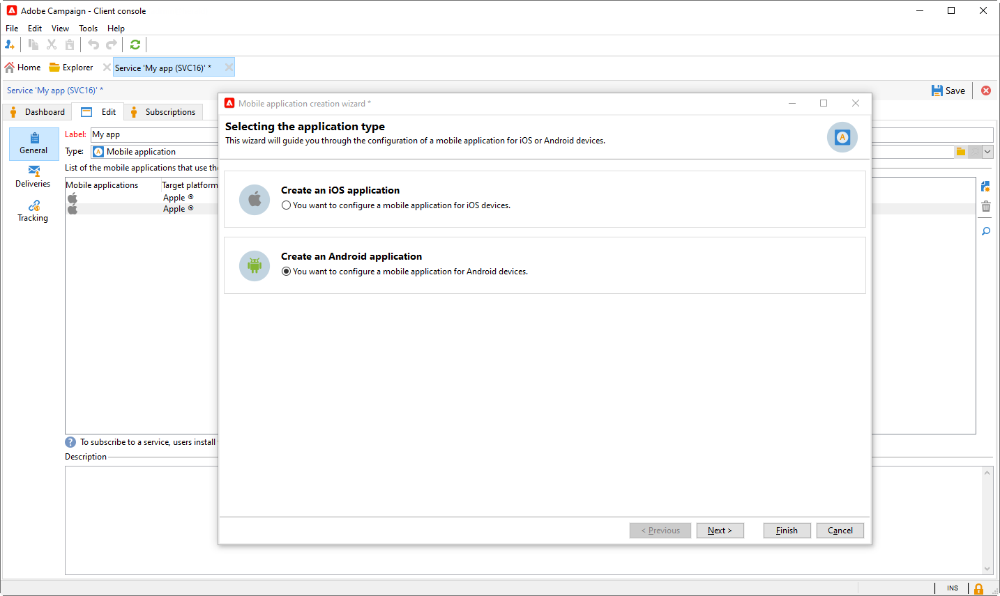

# Gereviseerde configuratie voor pushmeldingen {#push-notifications-config}

Campaign v8.5 introduceert onze nieuwste pushmeldingsservice, aangedreven door een robuust raamwerk dat is gebaseerd op een moderne, geavanceerde technologie. Deze service is ontworpen om nieuwe schaalbaarheidsniveaus te ontgrendelen, zodat uw meldingen een groter publiek met naadloze efficiëntie kunnen bereiken. Met onze verbeterde infrastructuur en geoptimaliseerde processen kunt u een hogere schaal en betrouwbaarheid verwachten, zodat u uw mobiele App-gebruikers net als nooit tevoren kunt gebruiken en er verbinding mee kunt maken.

>[!AVAILABILITY]
>
> Deze functie is uitsluitend toegankelijk voor nieuwe klanten vanaf Campagne v8.5 en wordt geleidelijk aan doorgestuurd naar een aantal geselecteerde klanten. Als uw omgeving is ingericht vóór juni 2023, is deze pagina niet op u van toepassing en moet u de gedetailleerde procedures volgen [op deze pagina](push-settings.md).

Voer in het kader van deze bijgewerkte implementatie de volgende stappen uit om pushberichten te verzenden naar Adobe Campaign:

1. [App-oppervlak maken in Adobe Experience Platform-gegevensverzameling](#create-app-surface)

1. [Toepassingsinstellingen configureren in Adobe Campaign](#push-config-campaign)

1. [Een mobiele eigenschap maken en configureren in de gegevensverzameling van Adobe Experience Platform](#create-mobile-property)

1. [Adobe Adobe Experience Platform Assurance-extensie toevoegen](https://developer.adobe.com/client-sdks/documentation/platform-assurance-sdk/){target="_blank"}(aanbevolen)

1. [Campaign Classic toevoegen aan uw mobiele toepassing](#campaign-mobile-ap)

1. [Een levering maken voor zowel iOS als Android](##push-create)

>[!NOTE]
>
> Verouderde FCM en APNS p12 worden niet ondersteund bij Gegevensverzameling.

## App-oppervlak maken in Adobe Experience Platform-gegevensverzameling {#create-app-surface}

U moet uw pushgegevens voor mobiele toepassingen toevoegen in [!DNL Adobe Experience Platform Data Collection].

De registratie van de pushreferenties voor de mobiele app is vereist om Adobe te machtigen pushberichten namens u te verzenden. Raadpleeg de onderstaande stappen:

1. Van [!DNL Adobe Experience Platform Data Collection], selecteert u de **[!UICONTROL App Surfaces]** in het linkerdeelvenster.

1. Klikken **[!UICONTROL Create App Surface]** om een nieuwe configuratie te creëren.

   

1. Voer een **[!UICONTROL Name]** voor de configuratie.

1. Van **[!UICONTROL Mobile Application Configuration]** selecteert u het besturingssysteem:

   * **Voor iOS**

     

      1. Voer de mobiele app in **Bundel-id** in de **[!UICONTROL App ID (iOS Bundle ID)]** veld.

         De bundel-id van de app vindt u in het gedeelte **Algemeen** tabblad van het primaire doel in **XCode** van uw Apple-ontwikkelaarsaccount.

      1. Overschakelen **[!UICONTROL Push Credentials]** om uw referenties toe te voegen.

      1. Sleep het .p8 Apple Push Notification Authentication Key-bestand naar het bestand.

         Deze sleutel kan worden opgehaald uit de **Certificaten**, **Id&#39;s** en **Profielen** pagina van uw Apple-ontwikkelaarsaccount.

      1. Geef de **Sleutel-id**. Dit is een tekenreeks van 10 tekens die wordt toegewezen tijdens het maken van de p8-auttoets.

         Het is te vinden onder **Toetsen** tab in **Certificaten**, **Id&#39;s** en **Profielen** pagina van uw Apple-ontwikkelaarsaccount.

      1. Geef de **Team-id**. Dit is een tekenreekswaarde die onder de **Lidmaatschap** tab.

   * **Voor Android**

     

      1. Geef de **[!UICONTROL App ID (Android package name)]**. Gewoonlijk is de pakketnaam de toepassings-id in uw `build.gradle` bestand.

      1. Overschakelen **[!UICONTROL Push Credentials]** om uw referenties toe te voegen.

      1. Sleep de FCM-pushgegevens en zet deze neer. Raadpleeg voor meer informatie over hoe u de pushreferenties kunt ophalen [Google-documentatie](https://firebase.google.com/docs/admin/setup#initialize-sdk){target="_blank"}.

1. Klikken **[!UICONTROL Save]** om uw toepassingsconfiguratie te maken.

## Toepassingsinstellingen configureren in Adobe Campaign{#push-config-campaign}

### Een service maken {#create-service}

Voordat u pushmeldingen verzendt, moet u de instellingen voor iOS- en Android-apps in Adobe Campaign definiëren.

Pushberichten worden via een speciale service naar gebruikers van de app verzonden. Wanneer gebruikers uw app installeren, abonneren zij zich op deze service: Adobe Campaign vertrouwt op deze service om alleen de abonnees van uw app als doel in te stellen. In deze service moet u uw iOS- en Android-apps toevoegen om op iOS- en Android-apparaten te verzenden.

Voer de onderstaande stappen uit om een service te maken voor het verzenden van pushberichten:

1. Bladeren naar **[!UICONTROL Profiles and Targets > Services and Subscriptions]** en klikt u op **[!UICONTROL Create]**.

   {width="800" align="left"}

1. Voer een **[!UICONTROL Label]** en **[!UICONTROL Internal name]** en selecteert u een **[!UICONTROL Mobile application]** type.

   >[!NOTE]
   >
   >De standaardwaarde **[!UICONTROL Subscriber applications (nms:appSubscriptionRcp)]** doeltoewijzing is gekoppeld aan de tabel met ontvangers. Als u een andere doelafbeelding wilt gebruiken, moet u een nieuwe doeltoewijzing maken en deze invoeren in het dialoogvenster **[!UICONTROL Target mapping]** van de dienst. Meer informatie over doeltoewijzingen in [deze pagina](../audiences/target-mappings.md).

1. Gebruik vervolgens de **[!UICONTROL Add]** pictogram aan de rechterkant om de mobiele toepassingen te definiëren die deze service gebruiken.

   

### Een mobiele toepassing maken {#create-sapp}

Nadat u de service hebt gemaakt, moet u nu de mobiele toepassingen definiëren die deze service zullen gebruiken.

>[!BEGINTABS]

>[!TAB iOS]

Ga als volgt te werk om een app voor iOS-apparaten te maken:

1. Van uw Dienst, klik **[!UICONTROL Add]** Selecteer vervolgens **[!UICONTROL Create an iOS application]**. Klik op **[!UICONTROL Next]**.

   

1. Van de **[!UICONTROL Launch app configurations list]** selecteert u het oppervlak van de app dat eerder in deze sectie is gemaakt. Klik op **[!UICONTROL Next]**.

   

1. (optioneel) U kunt de inhoud van een pushbericht verrijken met wat **[!UICONTROL Application variables]**. Deze zijn volledig aanpasbaar en een deel van de berichtlading wordt verzonden naar het mobiele apparaat.

   In het onderstaande voorbeeld wordt **mediaURl** en **mediaExt** variabelen worden toegevoegd om uitgebreide pushmeldingen te maken en geven de toepassing de afbeelding die binnen het bericht moet worden weergegeven.

   

1. Bladeren naar de **[!UICONTROL Subscription parameters]** tabblad om de toewijzing te definiëren met een extensie van de optie **[!UICONTROL Subscriber applications (nms:appsubscriptionRcp)]** schema.

1. Bladeren naar de **[!UICONTROL Sounds]** om het af te spelen geluid te definiëren. Klikken **[!UICONTROL Add]** en vullen **[!UICONTROL Internal name]** veld dat de naam moet bevatten van het bestand dat is ingesloten in de toepassing of de naam van het systeemgeluid.

1. Klikken **[!UICONTROL Next]** om de ontwikkeltoepassing te configureren.

1. De **[!UICONTROL Integration key]** is specifiek voor elke toepassing. De mobiele toepassing wordt gekoppeld aan Adobe Campaign en wordt gebruikt bij het configureren van de extensie Campagne.

   Controleer of hetzelfde **[!UICONTROL Integration key]** wordt gedefinieerd in Adobe Campaign en in de toepassingscode via de SDK.

   Meer informatie in [de documentatie voor ontwikkelaars](https://developer.adobe.com/client-sdks/documentation/adobe-campaign-classic/#configuration-keys){target="_blank"}

   >[!NOTE]
   >
   > De **[!UICONTROL Integration key]** is volledig aanpasbaar met tekenreekswaarde, maar moet exact hetzelfde zijn als de waarde die in de SDK is opgegeven.
   >
   > U kunt niet hetzelfde certificaat gebruiken voor de ontwikkelingsversie (sandbox) en de productieversie van de toepassing.

   

1. Selecteer het pictogram in het menu **[!UICONTROL Application icon]** om de mobiele toepassing in uw service aan te passen.

1. Klikken **[!UICONTROL Next]** om de productietoepassing te configureren en dezelfde stappen uit te voeren als hierboven beschreven. U kunt niet hetzelfde gebruiken **[!UICONTROL Integration key]** voor de ontwikkelingsversie (sandbox) en de productieversie van de toepassing.

1. Klik op **[!UICONTROL Finish]**.

Uw iOS-toepassing kan nu worden gebruikt in Campagne.

>[!TAB Android]

Voer de volgende stappen uit om een app voor Android-apparaten te maken:

1. Van uw Dienst, klik **[!UICONTROL Add]** Selecteer vervolgens **[!UICONTROL Create an Android application]**. Klik op **[!UICONTROL Next]**.

   

1. Van de **[!UICONTROL Launch app configurations list]** het venster, selecteert de oppervlakte van de App die in deze sectie wordt gecreeerd en klikt **[!UICONTROL Next]**.

   

1. De integratiesleutel is specifiek voor elke toepassing. De mobiele toepassing wordt gekoppeld aan Adobe Campaign en wordt gebruikt bij het configureren van de extensie Campagne.

   Controleer of hetzelfde **[!UICONTROL Integration key]** wordt gedefinieerd in Adobe Campaign en in de toepassingscode via de SDK.

   Meer informatie in [de documentatie voor ontwikkelaars](https://developer.adobe.com/client-sdks/documentation/adobe-campaign-classic/#configuration-keys){target="_blank"}

   >[!NOTE]
   >
   > De **[!UICONTROL Integration key]** is volledig aanpasbaar met tekenreekswaarde, maar moet exact hetzelfde zijn als de waarde die in de SDK is opgegeven.

   

1. Selecteer het pictogram in het menu **[!UICONTROL Application icon]** om de mobiele toepassing in uw service aan te passen.

1. (optioneel) U kunt de inhoud van een pushbericht verrijken met wat **[!UICONTROL Application variables]** indien nodig. Deze zijn volledig aanpasbaar en een deel van de berichtlading wordt verzonden naar het mobiele apparaat.

1. Bladeren naar de **[!UICONTROL Subscription parameters]** tabblad om de toewijzing te definiëren met een extensie van de optie **[!UICONTROL Subscriber applications (nms:appsubscriptionRcp)]** schema.

1. Klik op **[!UICONTROL Finish]** en vervolgens op **[!UICONTROL Save]**.

Uw Android-toepassing kan nu worden gebruikt in Campagne.

>[!ENDTABS]

Hieronder vindt u de namen van FCM-ladingen om uw pushmelding verder aan te passen:

| Berichttype | Configureerbaar berichtelement (FCM-ladenaam) | Configureerbare opties (FCM-ladenaam) |
|:-:|:-:|:-:|
| gegevensbericht | N.v.t. | validate_only |
| meldingsbericht | title, body, android_channel_id, icon, sound, tag, color, click_action, image, ticker, sticky, visibility, notification_priority, notification_count   | validate_only |

## Een mobiele eigenschap configureren in Adobe Experience Platform-gegevensverzameling {#create-mobile-property}

1. Via de startpagina voor gegevensverzameling opent u het menu Codes.

1. Klik op **[!UICONTROL New Property]**.

   

1. Typ een naam voor de eigenschap en selecteer **[!UICONTROL Mobile]** als platform.

   

1. Klikken **[!UICONTROL Save]** om de eigenschap mobile te maken.

1. Open de nieuwe mobiele eigenschap.

1. Via het dashboard voor mobiele eigenschappen **[!UICONTROL Extensions]** dan het menu **[!UICONTROL Catalog]** tab.

   

1. Installeer de **[!DNL Adobe Campaign Classic]** extensie. [Meer informatie over de extensie Campagne](https://developer.adobe.com/client-sdks/documentation/adobe-campaign-classic/#configure-campaign-classic-extension)

   

1. Voer de instantiedetails in:

   * **[!UICONTROL Registration endpoint]** of **[!UICONTROL Tracking endpoint]** URL&#39;s vindt u in het dialoogvenster **[!UICONTROL Tools]** > **[!UICONTROL Advanced]** > **[!UICONTROL Deployment wizard]** in Campagne.
   * **[!UICONTROL Integration keys]** kunt u vinden in de mobiele toepassing die is geconfigureerd in [deze sectie](#create-app).

   

1. Klik op **[!UICONTROL Save]**.

1. U moet nu de configuratie publiceren vanuit de **[!UICONTROL Publishing flow]** -menu. [Meer informatie](https://developer.adobe.com/client-sdks/documentation/getting-started/create-a-mobile-property/#publish-the-configuration)

Uw mobiele eigenschap wordt nu automatisch gesynchroniseerd met de **[!UICONTROL Adobe Experience Platform Data Collection]** technische workflow. [Meer informatie](../../automation/workflow/technical-workflows.md#list-technical-workflows)

## Campaign Classic toevoegen aan uw mobiele toepassing {#campaign-mobile-app}

De Adobe Experience Platform Mobile SDK helpt Adobe Experience Cloud-oplossingen en -services aan te schaffen in uw mobiele apps. De configuratie SDKs wordt beheerd door de Inzameling UI van Gegevens voor flexibele configuratie en verlengbare, op regels-gebaseerde integratie.

[Meer informatie in de documentatie van Adobe Developer](https://developer.adobe.com/client-sdks/documentation/adobe-campaign-classic/#add-campaign-classic-to-your-app){target="_blank"}.

## Uw pushmelding maken{#push-create}

Zodra u de mobiele toepassing hebt geconfigureerd in Gegevensverzameling, kunt u nu pushmeldingen maken en verzenden in Adobe Campaign.

Zie [deze pagina](push.md#push-create) voor de gedetailleerde elementen die specifiek zijn voor de levering van iOS- en Android-berichten.
