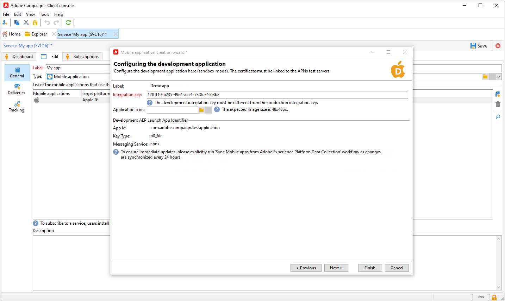

# Gereviseerde configuratie voor pushmeldingen {#push-notifications-config}

Campaign v8.5 introduceert onze nieuwste pushmeldingsservice, aangedreven door een robuust raamwerk dat is gebaseerd op een moderne, geavanceerde technologie. Deze service is ontworpen om nieuwe schaalbaarheidsniveaus te ontgrendelen, zodat uw meldingen een groter publiek met naadloze efficiëntie kunnen bereiken. Met onze verbeterde infrastructuur en geoptimaliseerde processen kunt u een hogere schaal en betrouwbaarheid verwachten, zodat u uw mobiele App-gebruikers net als nooit tevoren kunt gebruiken en er verbinding mee kunt maken.

>[!AVAILABILITY]
>
> Deze functie is uitsluitend toegankelijk voor nieuwe klanten vanaf Campagne v8.5 en wordt geleidelijk aan doorgestuurd naar een aantal geselecteerde klanten. Als uw milieu vóór Juni 2023 werd provisioned, is deze pagina niet op u van toepassing, en u moet de procedures volgen die [ in deze pagina ](push-settings.md) worden gedetailleerd.

Voer in het kader van deze bijgewerkte implementatie de volgende stappen uit om pushberichten te verzenden naar Adobe Campaign:

1. [App-oppervlak maken in Adobe Experience Platform-gegevensverzameling](#create-app-surface)

1. [Toepassingsinstellingen configureren in Adobe Campaign](#push-config-campaign)

1. [Een mobiele eigenschap maken en configureren in de gegevensverzameling van Adobe Experience Platform](#create-mobile-property)

1. [ voegt de uitbreiding van Adobe Adobe Experience Platform Assurance ](https://developer.adobe.com/client-sdks/documentation/platform-assurance-sdk/){target="_blank"} (geadviseerd) toe

1. [Campaign Classic toevoegen aan uw mobiele toepassing](#campaign-mobile-ap)

1. [Een levering maken voor zowel iOS als Android](##push-create)

>[!NOTE]
>
> Verouderde FCM en APNS p12 worden niet ondersteund bij Gegevensverzameling.

## App-oppervlak maken in Adobe Experience Platform-gegevensverzameling {#create-app-surface}

U moet uw pushgegevens voor mobiele toepassingen toevoegen in [!DNL Adobe Experience Platform Data Collection] .

De registratie van de pushreferenties voor de mobiele app is vereist om Adobe te machtigen pushberichten namens u te verzenden. Raadpleeg de onderstaande stappen:

1. Selecteer in [!DNL Adobe Experience Platform Data Collection] de tab **[!UICONTROL App Surfaces]** in het linkerdeelvenster.

1. Klik op **[!UICONTROL Create App Surface]** om een nieuwe configuratie te maken.

   

1. Voer een **[!UICONTROL Name]** in voor de configuratie.

1. Selecteer in **[!UICONTROL Mobile Application Configuration]** het besturingssysteem:

>[!BEGINTABS]

>[!TAB  iOS ]

1. Ga mobiele app **BundelIdentiteitskaart** op het **[!UICONTROL App ID (iOS Bundle ID)]** gebied in.

   Identiteitskaart van de app Bundel kan in het **Algemene** lusje van het primaire doel in **XCode** van uw Apple ontwikkelaarsrekening worden gevonden.

1. Schakel **[!UICONTROL Push Credentials]** in om uw referenties toe te voegen.

1. Sleep het .p8 Apple Push Notification Authentication Key-bestand naar het bestand.

   Deze sleutel kan van de **Certificaten** worden verkregen, **Herkenningstekens** en **Profielen** pagina van uw de ontwikkelaarsrekening van Apple.

1. Verstrek **Zeer belangrijke identiteitskaart**. Dit is een tekenreeks van 10 tekens die wordt toegewezen tijdens het maken van de p8-auttoets.

        het kan onder **Sleutels** lusje in **Certificates*, **Identifiers** en **Profiles** pagina van uw Apple ontwikkelaarsrekening worden gevonden.
   
1. Verstrek **identiteitskaart van het Team**. Dit is een koordwaarde die onder het **Lidmaatschap** tabel kan worden gevonden.

1. Klik op **[!UICONTROL Save]** om uw toepassingsconfiguratie te maken.

>[!TAB  Android ]

1. Geef de **[!UICONTROL App ID (Android package name)]** op. Meestal is de pakketnaam de toepassings-id in het `build.gradle` -bestand.

1. Schakel **[!UICONTROL Push Credentials]** in om uw referenties toe te voegen.

1. Sleep de FCM-pushgegevens en zet deze neer. Voor meer details op hoe te om de dupgeloofsbrieven te krijgen verwijs naar [ Documentatie van Google ](https://firebase.google.com/docs/admin/setup#initialize-sdk){target="_blank"}.

1. Klik op **[!UICONTROL Save]** om uw toepassingsconfiguratie te maken.

>[!ENDTABS]

## Toepassingsinstellingen configureren in Adobe Campaign{#push-config-campaign}

### Een service maken {#create-service}

Voordat u pushmeldingen verzendt, moet u de iOS- en Android-apps definiëren in Adobe Campaign.

Pushberichten worden via een speciale service naar gebruikers van de app verzonden. Wanneer gebruikers uw app installeren, abonneren zij zich op deze service: Adobe Campaign vertrouwt op deze service om alleen de abonnees van uw app als doel in te stellen. In deze service moet u iOS- en Android-apps toevoegen om op iOS- en Android-apparaten te verzenden.

Voer de onderstaande stappen uit om een service te maken voor het verzenden van pushberichten:

1. Blader naar de tab **[!UICONTROL Profiles and Targets > Services and Subscriptions]** en klik op **[!UICONTROL Create]** .

   {width="800" align="left"}

1. Voer een **[!UICONTROL Label]** en een **[!UICONTROL Internal name]** in en selecteer een **[!UICONTROL Mobile application]** -type.

   >[!NOTE]
   >
   >Het gebrek **[!UICONTROL Subscriber applications (nms:appSubscriptionRcp)]** doelafbeelding is verbonden met de ontvankelijkheidstabel. Als u een andere doelafbeelding wilt gebruiken, moet u een nieuwe doeltoewijzing maken en deze invoeren in het veld **[!UICONTROL Target mapping]** van de service. Leer meer over doelafbeeldingen in [ deze pagina ](../audiences/target-mappings.md).

1. Vervolgens gebruikt u het pictogram **[!UICONTROL Add]** rechts in het scherm om de mobiele toepassingen te definiëren die deze service gebruiken.

   

### Een mobiele toepassing maken {#create-sapp}

Nadat u de service hebt gemaakt, moet u nu de mobiele toepassingen definiëren die deze service zullen gebruiken.

>[!BEGINTABS]

>[!TAB  iOS ]

Ga als volgt te werk om een app voor iOS-apparaten te maken:

1. Klik in uw service op **[!UICONTROL Add]** en selecteer **[!UICONTROL Create an iOS application]** . Klik op **[!UICONTROL Next]**.

   

1. Selecteer in het venster **[!UICONTROL Launch app configurations list]** het oppervlak van de app dat eerder in deze sectie is gemaakt. Klik op **[!UICONTROL Next]**.

   

1. (optioneel) U kunt inhoud van een pushbericht verrijken met wat **[!UICONTROL Application variables]** . Deze zijn volledig aanpasbaar en een deel van de berichtlading wordt verzonden naar het mobiele apparaat.

   In het voorbeeld hieronder, worden **mediaURl** en **mediaExt** variabelen toegevoegd om rijke pushmelding tot stand te brengen en dan de toepassing van het beeld te voorzien om binnen het bericht te tonen.

   

1. Blader naar het **[!UICONTROL Subscription parameters]** lusje om de afbeelding met een uitbreiding van het **[!UICONTROL Subscriber applications (nms:appsubscriptionRcpte bepalen)]** schema.

1. Blader naar het tabblad **[!UICONTROL Sounds]** om het af te spelen geluid te definiëren. Klik op **[!UICONTROL Add]** en vul **[!UICONTROL Internal name]** veld in dat de naam moet bevatten van het bestand dat is ingesloten in de toepassing of de naam van het systeemgeluid.

1. Klik op **[!UICONTROL Next]** om de ontwikkeltoepassing te configureren.

1. **[!UICONTROL Integration key]** is specifiek voor elke toepassing. De mobiele toepassing wordt gekoppeld aan Adobe Campaign en wordt gebruikt bij het configureren van de extensie Campagne.

   Zorg ervoor dat dezelfde **[!UICONTROL Integration key]** is gedefinieerd in Adobe Campaign en in de toepassingscode via de SDK.

   Leer meer in [ de documentatie van de Ontwikkelaar ](https://developer.adobe.com/client-sdks/documentation/adobe-campaign-classic/#configuration-keys){target="_blank"}

   >[!NOTE]
   >
   > **[!UICONTROL Integration key]** is volledig aanpasbaar met tekenreekswaarde, maar moet precies hetzelfde zijn als de waarde die in de SDK is opgegeven.
   >
   > U kunt niet hetzelfde certificaat gebruiken voor de ontwikkelingsversie (sandbox) en de productieversie van de toepassing.

   

1. Selecteer het pictogram in het veld **[!UICONTROL Application icon]** om de mobiele toepassing in uw service aan te passen.

1. Klik op **[!UICONTROL Next]** om de productietoepassing te configureren en dezelfde stappen uit te voeren als hierboven beschreven. U kunt niet dezelfde **[!UICONTROL Integration key]** gebruiken voor de ontwikkelingsversie (sandbox) en de productieversie van de toepassing.

1. Klik op **[!UICONTROL Finish]**.

Uw iOS-toepassing kan nu worden gebruikt in Campagne.

>[!TAB  Android ]

Ga als volgt te werk om een app voor Android-apparaten te maken:

1. Klik in uw service op **[!UICONTROL Add]** en selecteer **[!UICONTROL Create an Android application]** . Klik op **[!UICONTROL Next]**.

   

1. Selecteer in het venster **[!UICONTROL Launch app configurations list]** het oppervlak van de app dat in deze sectie is gemaakt en klik op **[!UICONTROL Next]** .

   

1. De integratiesleutel is specifiek voor elke toepassing. De mobiele toepassing wordt gekoppeld aan Adobe Campaign en wordt gebruikt bij het configureren van de extensie Campagne.

   Zorg ervoor dat dezelfde **[!UICONTROL Integration key]** is gedefinieerd in Adobe Campaign en in de toepassingscode via de SDK.

   Leer meer in [ de documentatie van de Ontwikkelaar ](https://developer.adobe.com/client-sdks/documentation/adobe-campaign-classic/#configuration-keys){target="_blank"}

   >[!NOTE]
   >
   > **[!UICONTROL Integration key]** is volledig aanpasbaar met tekenreekswaarde, maar moet precies hetzelfde zijn als de waarde die in de SDK is opgegeven.

   

1. Selecteer het pictogram in het veld **[!UICONTROL Application icon]** om de mobiele toepassing in uw service aan te passen.

1. (optioneel) U kunt desgewenst de inhoud van een pushbericht verrijken met wat **[!UICONTROL Application variables]** . Deze zijn volledig aanpasbaar en een deel van de berichtlading wordt verzonden naar het mobiele apparaat.

1. Blader naar het **[!UICONTROL Subscription parameters]** lusje om de afbeelding met een uitbreiding van het **[!UICONTROL Subscriber applications (nms:appsubscriptionRcpte bepalen)]** schema.

1. Klik op **[!UICONTROL Finish]** en vervolgens op **[!UICONTROL Save]**.

Uw Android-toepassing kan nu worden gebruikt in Campagne.

>[!ENDTABS]

Hieronder vindt u de namen van FCM-ladingen om uw pushmelding verder aan te passen:

| Berichttype | Configureerbaar berichtelement (FCM-ladenaam) | Configureerbare opties (FCM-ladenaam) |
|:-:|:-:|:-:|
| gegevensbericht | N.v.t. | validate_only |
| meldingsbericht | title, body, android_channel_id, icon, sound, tag, color, click_action, image, ticker, sticky, visibility, notification_priority, notification_count   | validate_only |

## Een mobiele eigenschap configureren in Adobe Experience Platform-gegevensverzameling {#create-mobile-property}

1. Via de startpagina voor gegevensverzameling opent u het menu Codes.

1. Klik op **[!UICONTROL New Property]**.

   

1. Typ een naam voor de eigenschap en selecteer **[!UICONTROL Mobile]** als het platform.

   

1. Klik op **[!UICONTROL Save]** om de eigenschap mobile te maken.

1. Open de nieuwe mobiele eigenschap.

1. Open via het dashboard voor mobiele eigenschappen het menu **[!UICONTROL Extensions]** en vervolgens het tabblad **[!UICONTROL Catalog]** .

   

1. Installeer de extensie **[!DNL Adobe Campaign Classic]** . [ Leer meer op de uitbreiding van de Campagne ](https://developer.adobe.com/client-sdks/documentation/adobe-campaign-classic/#configure-campaign-classic-extension)

   

1. Voer de instantiedetails in:

   * **[!UICONTROL Registration endpoint]** of **[!UICONTROL Tracking endpoint]** URL&#39;s vindt u in het menu **[!UICONTROL Tools]** > **[!UICONTROL Advanced]** > **[!UICONTROL Deployment wizard]** in Campagne.
   * **[!UICONTROL Integration keys]** kan in mobiele toepassing worden gevonden die in [ wordt gevormd deze sectie ](#create-app).

   

1. Klik op **[!UICONTROL Save]**.

1. U moet de configuratie nu publiceren vanuit het menu **[!UICONTROL Publishing flow]** . [Meer informatie](https://developer.adobe.com/client-sdks/documentation/getting-started/create-a-mobile-property/#publish-the-configuration)

Uw mobiele eigenschap wordt nu automatisch gesynchroniseerd met de technische workflow van **[!UICONTROL Adobe Experience Platform Data Collection]** . [Meer informatie](../../automation/workflow/technical-workflows.md#list-technical-workflows)

## Campaign Classic toevoegen aan uw mobiele toepassing {#campaign-mobile-app}

De Adobe Experience Platform Mobile-SDK maakt de Experience Cloud-oplossingen en -services van Adobe in uw mobiele apps mogelijk. De configuratie SDKs wordt beheerd door de Inzameling UI van Gegevens voor flexibele configuratie en verlengbare, op regels-gebaseerde integratie.

[ leer meer in de documentatie van Adobe Developer ](https://developer.adobe.com/client-sdks/documentation/adobe-campaign-classic/#add-campaign-classic-to-your-app){target="_blank"}.

## Uw pushmelding maken{#push-create}

Zodra u de mobiele toepassing hebt geconfigureerd in Gegevensverzameling, kunt u nu pushmeldingen maken en verzenden in Adobe Campaign.

Verwijs naar [ deze pagina ](push.md#push-create) voor de gedetailleerde elementen specifiek voor de levering van de berichten van iOS en van Android.
