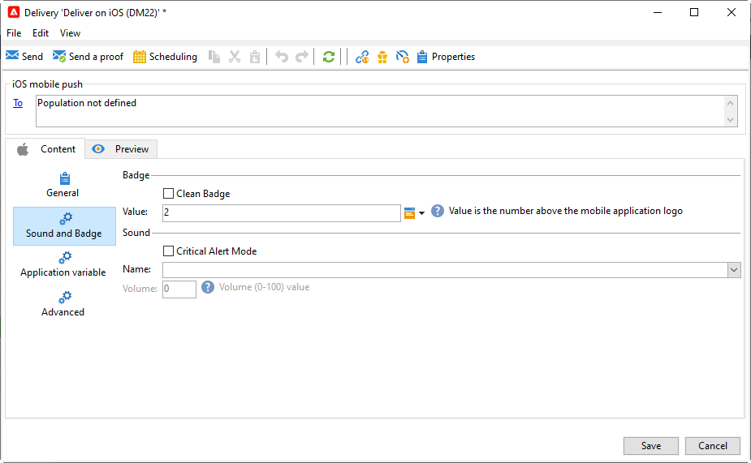

# Create and send push notifications

Met de levering van mobiele apps kunt u meldingen verzenden naar iOS- en Android-systemen.

Als u pushberichten wilt verzenden in Adobe Campaign, moet u:

1. Configure your Campaign environment
1. Maak een informatieservice voor mobiele toepassingen van het type Mobiele toepassing.
1. Add the iOS and Android versions of the application to this service.
1. Create a delivery for both iOS and Android.

 Leer hoe u aan de slag kunt met de mobiele app in [Campaign Classic v7-documentatie](https://experienceleague.adobe.com/docs/campaign-classic/using/sending-messages/sending-push-notifications/about-mobile-app-channel.html){target=&quot;_blank&quot;}

## Campagne SDK integreren

Campaign SDK facilitates the integration of your mobile application into the Adobe Campaign platform.

Compatible SDK versions are listed in [Campaign Compatibility matrix](../start/compatibility-matrix.md#MobileSDK).

 Leer hoe u de SDK&#39;s van Campagne Android en iOS kunt integreren met uw app in [deze sectie](../config/push-config.md)

<!--
### Configure Campaign Extension in Launch

You can integrate Adobe Experience Platorm Launch SDK with Campaign, by leveraging Campaign Classic extension.

 Learn more in [Adobe Mobile SDK documentation](https://aep-sdks.gitbook.io/docs/using-mobile-extensions/adobe-campaignclassic){target="_blank"}

-->

## Configure your app settings in Campaign

U moet de instellingen voor uw iOS- en Android-apps definiëren in Adobe Campaign.

 De configuratierichtlijnen voor iOS worden beschreven in [Campaign Classic v7-documentatie](https://experienceleague.adobe.com/docs/campaign-classic/using/sending-messages/sending-push-notifications/configure-the-mobile-app/configuring-the-mobile-application.html?lang=en#sending-messages){target=&quot;_blank&quot;}

 Configuration guidelines for Anddroid are detailed in [Campaign Classic v7 documentation](https://experienceleague.adobe.com/docs/campaign-classic/using/sending-messages/sending-push-notifications/configure-the-mobile-app/configuring-the-mobile-application-android.html?lang=en#sending-messages){target=&quot;_blank&quot;}

## Create your first push notification

In deze sectie worden de elementen beschreven die specifiek zijn voor de levering van iOS- en Android-berichten.

>[!CAUTION]
>
>In the context of an [Enterprise (FFDA) deployment](../architecture/enterprise-deployment.md), mobile registration is now **asynchronous**. [Meer informatie](../architecture/staging.md)

Blader naar de **[!UICONTROL Campaigns]** tabblad, klikt u op **[!UICONTROL Deliveries]** en klik op de knop **[!UICONTROL Create]** boven de lijst met bestaande leveringen.

 For global information on how to create a delivery, refer to [Campaign Classic v7 documentation](https://experienceleague.adobe.com/docs/campaign-classic/using/sending-messages/key-steps-when-creating-a-delivery/steps-about-delivery-creation-steps.html?lang=en#sending-messages){target=&quot;_blank&quot;}

### Meldingen verzenden op iOS {#send-notifications-on-ios}

>[!NOTE]
>
>This capability is available starting Campaign v8.3. To check your version, refer to [this section](../start/compatibility-matrix.md#how-to-check-your-campaign-version-and-buildversion)

1. Select the **[!UICONTROL Deliver on iOS]** delivery template.

   

1. Als u het doel van het bericht wilt definiëren, klikt u op de knop **[!UICONTROL To]** koppeling en klik vervolgens op **[!UICONTROL Add]**.

   

1. Selecteren **[!UICONTROL Subscribers of an iOS mobile application (iPhone, iPad)]** Selecteer eerst de service die relevant is voor uw mobiele toepassing en selecteer vervolgens de iOS-versie van de toepassing.

   

1. Kies uw **[!UICONTROL Notification type]** Tussen **[!UICONTROL General notification (Alert, Sound, Badge)]** of **[!UICONTROL Silent notification]**.

   

   >[!NOTE]
   >
   >De **Silent Push** in de modus kan een melding &quot;stil&quot; naar een mobiele toepassing worden verzonden. De gebruiker wordt niet op de hoogte gebracht van de aankomst van de melding. Deze wordt rechtstreeks naar de toepassing overgedragen.

1. In de **[!UICONTROL Title]** Voer in het veld het label in van de titel die u wilt weergeven in de lijst met meldingen die beschikbaar is in het meldingscentrum.

   In dit veld kunt u de waarde van de optie **titel** parameter van de iOS-berichtlading.

1. U kunt een **[!UICONTROL Subtitle]**, waarde van de **ondertitel** parameter van de iOS-berichtlading.

1. Voer de inhoud van het bericht in het dialoogvenster **[!UICONTROL Message content]** van de wizard.

1. Van de **[!UICONTROL Sound and Badge]** kunt u de volgende opties bewerken:

   * **[!UICONTROL Clean Badge]**: enable this options to refresh the badge value.

   * **[!UICONTROL Value]**: Stel een nummer in dat wordt gebruikt om het aantal nieuwe ongelezen gegevens direct op het toepassingspictogram weer te geven.

   * **[!UICONTROL Critical alert mode]**: Schakel deze optie in om geluid toe te voegen aan uw melding, zelfs als de telefoon van de gebruiker is ingesteld op de focusmodus of als de iPhone is gedempt.

   * **[!UICONTROL Name]**: Selecteer het geluid dat door de mobiele terminal moet worden afgespeeld wanneer het bericht wordt ontvangen.

   * **[!UICONTROL Volume]**: volume of your sound from 0 to 100.

      >[!NOTE]
      > 
      >Geluiden moeten in de toepassing worden opgenomen en worden gedefinieerd wanneer de service wordt gemaakt.
      >
      >De configuratierichtlijnen voor iOS worden beschreven in [Campaign Classic v7-documentatie](https://experienceleague.adobe.com/docs/campaign-classic/using/sending-messages/sending-push-notifications/configure-the-mobile-app/configuring-the-mobile-application.html?lang=en).
   

1. Van de **[!UICONTROL Application variables]** tab, uw **[!UICONTROL Application variables]** automatisch worden toegevoegd. Met deze instructies kunt u bijvoorbeeld het berichtgedrag definiëren. U kunt dan een specifiek toepassingsscherm configureren dat wordt weergegeven wanneer de gebruiker het bericht activeert.

   Raadpleeg [deze sectie](https://experienceleague.adobe.com/docs/campaign-classic/using/sending-messages/sending-push-notifications/configure-the-mobile-app/configuring-the-mobile-application.html?lang=en) voor meer informatie.

1. From the **[!UICONTROL Advanced]** tab, you can edit the following general options:

   * **[!UICONTROL Mutable content]**: enable this option to allow the mobile application to download media content.

   * **[!UICONTROL Thread-id]**: identifier used to group related notifications together.

   * **[!UICONTROL Category]**: naam van de rubriek-id die knoppen voor handelingen weergeeft. Met deze meldingen kan de gebruiker sneller verschillende taken uitvoeren als reactie op een melding zonder de applicatie te openen of erin te moeten navigeren.

   

1. For time sensitive notification, you can specify the following options:

   * **[!UICONTROL Target content ID]**: identifier die wordt gebruikt om aan te geven welk toepassingsvenster moet worden verzonden wanneer de melding wordt geopend.

   * **[!UICONTROL Launch image]**: name of the launch image file to display. Als de gebruiker ervoor kiest de toepassing te starten, wordt de geselecteerde afbeelding weergegeven in plaats van het startscherm van de toepassing.

   * **[!UICONTROL Interruption level]**:

      * **[!UICONTROL Active]**: Set by default, the system presents the notification immediately, lights up the screen, and can play a sound. Meldingen doorbreken niet door de focusmodi.

      * **[!UICONTROL Passive]**: Het systeem voegt het bericht toe aan de meldingslijst zonder het scherm te belichten of een geluid af te spelen. Notifications do not break through Focus modes.

      * **[!UICONTROL Time sensitive]** Het systeem presenteert de melding onmiddellijk, licht het scherm op, kan een geluid afspelen en door de modus Focus breken. Voor dit niveau is geen speciale toestemming van Apple vereist.

      * **[!UICONTROL Critical]** Het systeem presenteert onmiddellijk het bericht, licht omhoog het scherm, en mijdt de demtschakelaar of nadrukwijzen. Note that this level requires a special permission from Apple.
   * **[!UICONTROL Relevance score]**: een relevantiescore instellen van 0 tot 100. The system uses this to sort the notifications in the notification summary.

   

1. Zodra het bericht wordt gevormd, klik **[!UICONTROL Preview]** om een voorvertoning van de melding weer te geven.

   

### Meldingen verzenden op Android {#send-notifications-on-android}

1. Selecteer **[!UICONTROL Deliver on Android (android)]** leveringssjabloon.

   

1. To define the target of the notification, click the **[!UICONTROL To]** link, then click **[!UICONTROL Add]**.

   

1. Selecteren **[!UICONTROL Subscribers of an Android mobile application]** kiest u de service die relevant is voor uw mobiele toepassing (in dit geval Neotrips) en selecteert u vervolgens de Android-versie van de toepassing.

   

1. Voer vervolgens de inhoud voor het bericht in.

   

1. Klik op de knop **[!UICONTROL Insert emoticon]** pictogram om emoticons in te voegen in uw pushmelding.

1. In de **[!UICONTROL Application variables]** Voer de waarde van elke variabele in. U kunt bijvoorbeeld een specifiek toepassingsscherm configureren dat wordt weergegeven wanneer de gebruiker het bericht activeert.

1. Zodra het bericht wordt gevormd, klik **[!UICONTROL Preview]** om een voorvertoning van de melding weer te geven.

   <!---->

## Uw pushmeldingen testen, verzenden en controleren

Als u een bewijs wilt verzenden en de uiteindelijke levering wilt verzenden, gebruikt u hetzelfde proces als voor e-mailleveringen. Meer informatie in de Campaign Classic v7-documentatie:

* Een levering valideren en proefdrukken verzenden
    [Learn key steps to validate a delivery](https://experienceleague.adobe.com/docs/campaign-classic/using/sending-messages/key-steps-when-creating-a-delivery/steps-validating-the-delivery.html){target=&quot;_blank&quot;}

* Confirm and send the delivery
    [Learn key steps to send a delivery](https://experienceleague.adobe.com/docs/campaign-classic/using/sending-messages/key-steps-when-creating-a-delivery/steps-sending-the-delivery.html?lang=en){target=&quot;_blank&quot;}

Nadat u berichten hebt verzonden, kunt u de leveringen controleren en volgen. Meer informatie in de Campaign Classic v7-documentatie:

* Push notification quarantines
    [Learn more about push notification quarantines](https://experienceleague.adobe.com/docs/campaign-classic/using/sending-messages/monitoring-deliveries/understanding-quarantine-management.html?lang=en#push-notification-quarantines){target=&quot;_blank&quot;}

* Problemen oplossen
    [Leer hoe u problemen met uw pushmeldingen kunt oplossen](https://experienceleague.adobe.com/docs/campaign-classic/using/sending-messages/sending-push-notifications/troubleshooting.html?lang=en){target=&quot;_blank&quot;}
