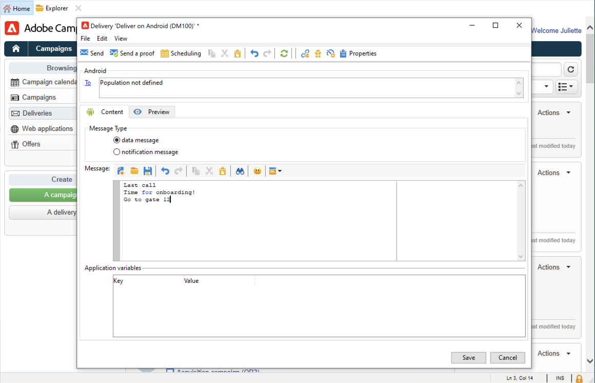

# Pushmeldingen maken en verzenden

Met de levering van mobiele apps kunt u meldingen verzenden naar iOS- en Android-systemen.

Als u pushberichten wilt verzenden in Adobe Campaign, moet u:

1. De Campagneomgeving configureren
1. Maak een informatieservice voor mobiele toepassingen van het type Mobiele toepassing.
1. Voeg de iOS- en Android-versies van de toepassing toe aan deze service.
1. Maak een levering voor zowel iOS als Android.

 Leer hoe u aan de slag gaat met de mobiele app in  [Campaign Classic v7-documentatie](https://experienceleague.adobe.com/docs/campaign-classic/using/sending-messages/sending-push-notifications/about-mobile-app-channel.html){target=&quot;_blank&quot;}

## Integreren met Adobe SDK

### Campagne SDK integreren

De campagne-SDK vereenvoudigt de integratie van uw mobiele toepassing in het Adobe Campaign-platform.

De compatibele versies van SDK zijn vermeld in [Matrix van de Verenigbaarheid van de campagne](../start/compatibility-matrix.md#MobileSDK).

 In  [deze sectie leert u hoe u de SDK&#39;s van Campagne Android en iOS kunt integreren met uw app](../config/push-config.md)

### Campagneextensie configureren in Launch

U kunt Adobe Experience Platform Launch SDK integreren met Campagne door de extensie Campaign Classic te gebruiken.

 Meer informatie in de  [Adobe Mobile SDK-documentatie](https://aep-sdks.gitbook.io/docs/using-mobile-extensions/adobe-campaignclassic){target=&quot;_blank&quot;}

## Uw toepassingsinstellingen configureren in Campagne

U moet de instellingen voor uw iOS- en Android-apps definiëren in Adobe Campaign.

 De configuratierichtlijnen voor iOS zijn gedetailleerd in de  [Campaign Classic v7-documentatie](https://experienceleague.adobe.com/docs/campaign-classic/using/sending-messages/sending-push-notifications/configure-the-mobile-app/configuring-the-mobile-application.html?lang=en#sending-messages){target=&quot;_blank&quot;}

 De configuratierichtlijnen voor Android worden beschreven in de  [Campaign Classic v7-documentatie](https://experienceleague.adobe.com/docs/campaign-classic/using/sending-messages/sending-push-notifications/configure-the-mobile-app/configuring-the-mobile-application-android.html?lang=en#sending-messages){target=&quot;_blank&quot;}

## Uw eerste pushmelding maken

In deze sectie worden de elementen beschreven die specifiek zijn voor de levering van iOS- en Android-berichten.

>[!CAUTION]
>
>Met Campagne v8 is mobiele registratie nu **asynchroon**. [Meer informatie](../dev/staging.md)

Als u een nieuwe levering wilt maken, bladert u naar het tabblad **[!UICONTROL Campaigns]**, klikt u op **[!UICONTROL Deliveries]** en klikt u op de knop **[!UICONTROL Create]** boven de lijst met bestaande leveringen.

 Raadpleeg de  [Campaign Classic v7-documentatie](https://experienceleague.adobe.com/docs/campaign-classic/using/sending-messages/key-steps-when-creating-a-delivery/steps-about-delivery-creation-steps.html?lang=en#sending-messages){target=&quot;_blank&quot; voor algemene informatie over het maken van een levering.

### Meldingen verzenden op iOS {#send-notifications-on-ios}

1. Selecteer de **[!UICONTROL Deliver on iOS]** leveringsmalplaatje en klik **[!UICONTROL Continue]**.

   

1. Als u het doel van de melding wilt definiëren, klikt u op de koppeling **[!UICONTROL To]** en vervolgens op **[!UICONTROL Add]**.

   

1. Selecteer **[!UICONTROL Subscribers of an iOS mobile application (iPhone, iPad)]**, selecteer de service die relevant is voor uw mobiele toepassing en selecteer vervolgens de iOS-versie van de toepassing.

   

1. Selecteer het berichttype: **[!UICONTROL Alert]**, **[!UICONTROL Badge]**, **[!UICONTROL Alert and badge]** of **[!UICONTROL Silent Push]**.

   

1. Voer in het veld **[!UICONTROL Title]** het label in van de titel die u in het bericht wilt weergeven.

1. Voer **[!UICONTROL Message]** en **[!UICONTROL Value of the badge]** in op basis van het gekozen berichttype.

1. U kunt ook de volgende elementen definiëren:

   * Met **[!UICONTROL Action button]** kunt u een label definiëren voor de actieknop die wordt weergegeven in de waarschuwingsberichten (**action_loc_key** veld van de payload).

   * Selecteer in het veld **[!UICONTROL Play a sound]** het geluid dat door de mobiele terminal moet worden afgespeeld wanneer het bericht wordt ontvangen.

   * Voer in het veld **[!UICONTROL Application variables]** de waarde van elke variabele in. U kunt bijvoorbeeld een specifiek toepassingsscherm configureren dat wordt weergegeven wanneer de gebruiker het bericht activeert.

1. Zodra het bericht wordt gevormd, klik **[!UICONTROL Preview]** lusje om voorproef de bericht.

   

### Meldingen verzenden op Android {#send-notifications-on-android}

1. Selecteer de leveringssjabloon **[!UICONTROL Deliver on Android (android)]**.

   

1. Als u het doel van de melding wilt definiëren, klikt u op de koppeling **[!UICONTROL To]** en vervolgens op **[!UICONTROL Add]**.

   

1. Selecteer **[!UICONTROL Subscribers of an Android mobile application]**, kies de dienst relevant voor uw mobiele toepassing (in dit geval Neotrips), dan selecteer de Android versie van de toepassing.

   

1. Voer vervolgens de inhoud voor het bericht in.

   

1. Klik op het pictogram **[!UICONTROL Insert emoticon]** om emoticons in te voegen bij uw pushmelding.

1. Voer in het veld **[!UICONTROL Application variables]** de waarde van elke variabele in. U kunt bijvoorbeeld een specifiek toepassingsscherm configureren dat wordt weergegeven wanneer de gebruiker het bericht activeert.

1. Zodra het bericht wordt gevormd, klik **[!UICONTROL Preview]** lusje om voorproef de bericht.

   <!---->

## Uw pushmeldingen testen, verzenden en controleren

Als u een bewijs wilt verzenden en de uiteindelijke levering wilt verzenden, gebruikt u hetzelfde proces als voor e-mailleveringen. Meer informatie in de Campaign Classic v7-documentatie:

* Een levering valideren en proefdrukken verzenden
    [Leer belangrijke stappen om een levering](https://experienceleague.adobe.com/docs/campaign-classic/using/sending-messages/key-steps-when-creating-a-delivery/steps-validating-the-delivery.html) te bevestigen {target=&quot;_blank&quot;}

* Bevestig en verzend de levering
    [Leer de belangrijkste stappen om een levering](https://experienceleague.adobe.com/docs/campaign-classic/using/sending-messages/key-steps-when-creating-a-delivery/steps-sending-the-delivery.html?lang=en) te verzenden {target=&quot;_blank&quot;}

Nadat u berichten hebt verzonden, kunt u de leveringen controleren en volgen. Meer informatie in de Campaign Classic v7-documentatie:

* Push notification quarantines
    [Meer informatie over quarantines voor pushmeldingen](https://experienceleague.adobe.com/docs/campaign-classic/using/sending-messages/monitoring-deliveries/understanding-quarantine-management.html?lang=en#push-notification-quarantines){target=&quot;_blank&quot;}

* Problemen oplossen
    [Leer hoe u problemen met uw pushmeldingen](https://experienceleague.adobe.com/docs/campaign-classic/using/sending-messages/sending-push-notifications/troubleshooting.html?lang=en) kunt oplossen {target=&quot;_blank&quot;}
