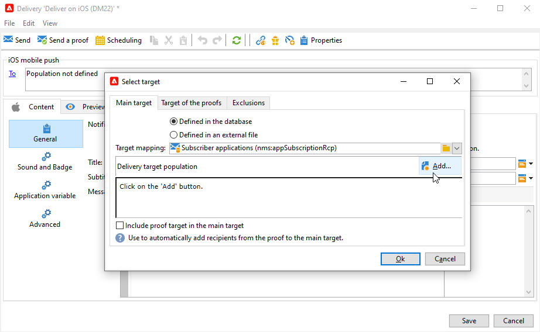
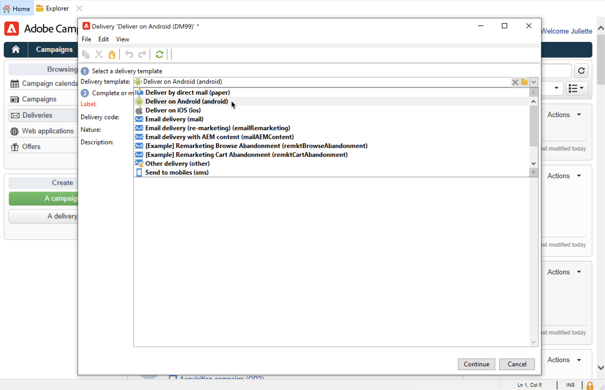

# Pushmeldingen maken en verzenden{#push-notifications-create}

Met de levering van mobiele apps kunt u meldingen verzenden naar iOS- en Android-apparaten.

Voordat u pushberichten met Adobe Campaign gaat verzenden, moet u ervoor zorgen dat er configuraties en integratie zijn in de mobiele app en voor tags in Adobe Experience Platform. [Meer informatie over de pushconfiguratie.](push-settings.md).

>[!CAUTION]
>
>Enkele belangrijke wijzigingen in de Android Firebase Cloud Messaging (FCM)-service worden in 2024 gepubliceerd en kunnen van invloed zijn op uw Adobe Campaign-implementatie. De configuratie van uw lidmaatschapsservices voor Android-pushberichten moet mogelijk worden bijgewerkt om deze wijziging te ondersteunen. U kunt al controleren en actie ondernemen. [Meer informatie](../../technotes/upgrades/push-technote.md).

## Uw eerste pushmelding maken {#push-create}

In deze sectie worden de specifieke elementen voor de levering van iOS- en Android-berichten beschreven.

>[!IMPORTANT]
>
>In de context van een [Implementatie in het kader van Enterprise (FFDA)](../architecture/enterprise-deployment.md), mobiele registratie is nu **asynchroon**. [Meer informatie](../architecture/staging.md)

Blader naar de **[!UICONTROL Campaigns]** tabblad, klikt u op **[!UICONTROL Deliveries]** en klik op de knop **[!UICONTROL Create]** boven de lijst met bestaande leveringen.

Adobe Campaign wordt standaard geleverd met twee leveringssjablonen: een voor iOS en een voor Android. U kunt deze dupliceren om uw eigen instellingen te definiëren. De stappen om een duplevering te vormen die op deze malplaatjes wordt gebaseerd zijn hieronder gedetailleerd.

>[!BEGINTABS]

>[!TAB iOS]

Voer de volgende stappen uit om berichten op iOS-apparaten te verzenden:

1. Selecteer de **[!UICONTROL Deliver on iOS]** leveringssjabloon.

   

1. Als u het doel van het bericht wilt definiëren, klikt u op de knop **[!UICONTROL To]** koppeling en klik vervolgens op **[!UICONTROL Add]**.

   

1. Selecteren **[!UICONTROL Subscribers of an iOS mobile application (iPhone, iPad)]** Selecteer eerst de service die relevant is voor uw mobiele toepassing en selecteer vervolgens de iOS-versie van de toepassing.

   

1. Kies uw **[!UICONTROL Notification type]** Tussen **[!UICONTROL General notification (Alert, Sound, Badge)]** of **[!UICONTROL Silent notification]**.

   

   >[!NOTE]
   >
   >De **Silent Push** in de modus kan een melding &quot;stil&quot; naar een mobiele toepassing worden verzonden. De gebruiker wordt niet op de hoogte gebracht van de aankomst van de melding. Deze wordt rechtstreeks naar de toepassing overgedragen.

1. In de **[!UICONTROL Title]** Voer in het veld het label in van de titel die u wilt weergeven in de lijst met meldingen die beschikbaar is in het meldingscentrum.

   In dit veld kunt u de waarde van de optie **titel** parameter van de iOS-berichtlading.

1. U kunt een **[!UICONTROL Subtitle]**, waarde van de **ondertitel** parameter van de iOS-berichtlading.

1. Voer de inhoud van het bericht in het dialoogvenster **[!UICONTROL Message content]** van de wizard.

1. Van de **[!UICONTROL Sound and Badge]** kunt u de volgende opties bewerken:

   * **[!UICONTROL Clean Badge]**: schakel deze opties in om de waarde van de badge te vernieuwen.

   * **[!UICONTROL Value]**: stel een getal in dat wordt gebruikt om het aantal nieuwe ongelezen gegevens direct op het toepassingspictogram weer te geven.

   * **[!UICONTROL Critical alert mode]**: schakel deze optie in om geluid toe te voegen aan uw melding, zelfs als de telefoon van de gebruiker is ingesteld op de focusmodus of als de iPhone is gedempt.

   * **[!UICONTROL Name]**: selecteer het geluid dat door de mobiele terminal moet worden afgespeeld wanneer het bericht wordt ontvangen.

   * **[!UICONTROL Volume]**: volume van uw geluid van 0 tot 100.

     >[!NOTE]
     > 
     >Geluiden moeten in de toepassing worden opgenomen en worden gedefinieerd wanneer de service wordt gemaakt.
     >

   

1. Van de **[!UICONTROL Application variables]** tab, uw **[!UICONTROL Application variables]** automatisch worden toegevoegd. Met deze instructies kunt u bijvoorbeeld het berichtgedrag definiëren. U kunt dan een specifiek toepassingsscherm configureren dat wordt weergegeven wanneer de gebruiker het bericht activeert.

1. Van de **[!UICONTROL Advanced]** kunt u de volgende algemene opties bewerken:

   * **[!UICONTROL Mutable content]**: schakel deze optie in zodat de mobiele toepassing media-inhoud kan downloaden.

   * **[!UICONTROL Thread-id]**: ID die wordt gebruikt om gerelateerde meldingen te groeperen.

   * **[!UICONTROL Category]**: naam van de rubriek-id waarin de knoppen voor handelingen worden weergegeven. Met deze meldingen kan de gebruiker sneller verschillende taken uitvoeren als reactie op een melding zonder de applicatie te openen of erin te moeten navigeren.

   

1. Voor meldingen met tijdgevoeligheid kunt u de volgende opties opgeven:

   * **[!UICONTROL Target content ID]**: id die wordt gebruikt om aan te geven welk toepassingsvenster moet worden verzonden wanneer de melding wordt geopend.

   * **[!UICONTROL Launch image]**: naam van het startafbeeldingsbestand dat moet worden weergegeven. Als de gebruiker ervoor kiest de toepassing te starten, wordt de geselecteerde afbeelding weergegeven in plaats van het startscherm van de toepassing.

   * **[!UICONTROL Interruption level]**:

      * **[!UICONTROL Active]**: Standaard ingesteld, geeft het systeem de melding direct weer, licht het scherm omhoog en kan een geluid worden afgespeeld. Meldingen doorbreken niet door de focusmodi.

      * **[!UICONTROL Passive]**: Het systeem voegt het bericht toe aan de meldingslijst zonder het scherm te belichten of een geluid af te spelen. Meldingen doorbreken niet door de focusmodi.

      * **[!UICONTROL Time sensitive]** Het systeem presenteert de melding onmiddellijk, licht het scherm op, kan een geluid afspelen en door de modus Focus breken. Voor dit niveau is geen speciale toestemming van Apple vereist.

      * **[!UICONTROL Critical]** Het systeem presenteert onmiddellijk het bericht, licht omhoog het scherm, en mijdt de demtschakelaar of nadrukwijzen. Voor dit niveau is een speciale machtiging van Apple vereist.

   * **[!UICONTROL Relevance score]**: stel een relevantiescore in van 0 tot 100. Het systeem gebruikt dit om de berichten in het berichtoverzicht te sorteren.

   

1. Zodra het bericht wordt gevormd, klik **[!UICONTROL Preview]** om een voorvertoning van de melding weer te geven.

   

>[!TAB Android]

Voer de volgende stappen uit om berichten op Android-apparaten te verzenden:

1. Selecteer de **[!UICONTROL Deliver on Android (android)]** leveringssjabloon.

   

   >[!NOTE]
   > 
   >Met de nieuwste FCM API&#39;s (HTTP v1) moet u uw **leveringssjablonen** voor Android-pushberichten om het aantal batchberichten te verhogen. Hiervoor bladert u naar de eigenschappen van uw Android-leveringssjabloon en gaat u naar de **Aflevering** tabblad, stelt u de [Aantal per berichtbatch](../../v8/send/configure-and-send.md#delivery-batch-quantity) tot **256**. Pas deze wijziging toe op alle leveringssjablonen die worden gebruikt voor uw Android-leveringen en op al uw bestaande Android-leveringen.

1. Als u het doel van het bericht wilt definiëren, klikt u op de knop **[!UICONTROL To]** koppeling en klik vervolgens op **[!UICONTROL Add]**.

   

1. Selecteren **[!UICONTROL Subscribers of an Android mobile application]** kiest u de service die relevant is voor uw mobiele toepassing (in dit geval Neotrips) en selecteert u vervolgens de Android-versie van de toepassing.

   

1. Voer vervolgens de inhoud voor het bericht in.

   

1. Klik op de knop **[!UICONTROL Insert emoticon]** pictogram om emoticons in te voegen in uw pushmelding.

1. In de **[!UICONTROL Application variables]** Voer de waarde van elke variabele in. U kunt bijvoorbeeld een specifiek toepassingsscherm configureren dat wordt weergegeven wanneer de gebruiker het bericht activeert.

1. Zodra het bericht wordt gevormd, klik **[!UICONTROL Preview]** om een voorvertoning van de melding weer te geven.

   <!---->

>[!ENDTABS]

## Uw pushmeldingen testen, verzenden en controleren {#push-test}

Om een bewijs te verzenden en de uiteindelijke levering te verzenden, gebruikt u hetzelfde proces als voor andere leveringen.

Leer hoe u een levering kunt valideren in [deze pagina](preview-and-proof.md).

Leer hoe u de levering kunt bevestigen en verzenden in [deze pagina](send.md)

Nadat u berichten hebt verzonden, kunt u de leveringen controleren en volgen. Meer informatie over de redenen voor het mislukken van pushberichten vindt u in [deze pagina](delivery-failures.md#push-error-types).

