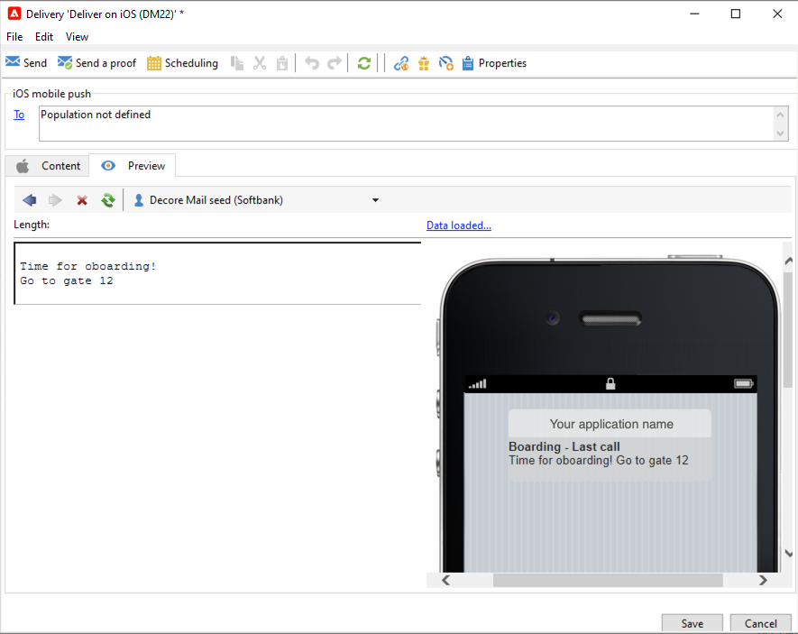
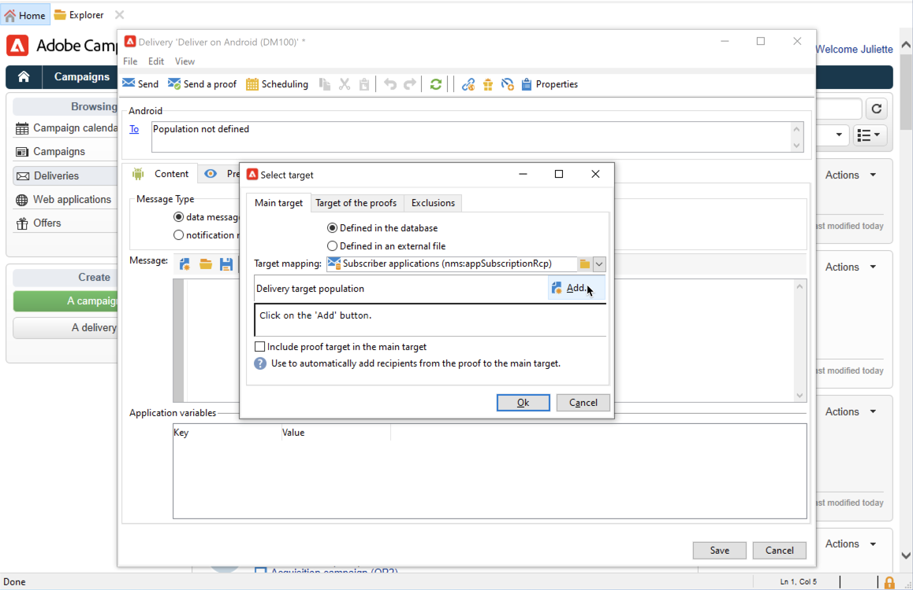

# Pushmeldingen maken en verzenden

Met de levering van mobiele apps kunt u meldingen verzenden naar iOS- en Android-systemen.

Als u pushberichten wilt verzenden in Adobe Campaign, moet u:

1. De Campagneomgeving configureren
1. Maak een informatieservice voor mobiele toepassingen van het type Mobiele toepassing.
1. Voeg de iOS- en Android-versies van de toepassing toe aan deze service.
1. Maak een levering voor zowel iOS als Android.

 Leer hoe u aan de slag kunt met de mobiele app in [Campaign Classic v7-documentatie](https://experienceleague.adobe.com/docs/campaign-classic/using/sending-messages/sending-push-notifications/about-mobile-app-channel.html){target=&quot;_blank&quot;}

## Campagne SDK integreren

De campagne-SDK vereenvoudigt de integratie van uw mobiele toepassing in het Adobe Campaign-platform.

Compatibele SDK-versies worden weergegeven in [Matrix voor campagnecompatibiliteit](../start/compatibility-matrix.md#MobileSDK).

 Leer hoe u de SDK&#39;s van Campagne Android en iOS kunt integreren met uw app in [deze sectie](../config/push-config.md)

<!--
### Configure Campaign Extension in Launch

You can integrate Adobe Experience Platorm Launch SDK with Campaign, by leveraging Campaign Classic extension.

 Learn more in [Adobe Mobile SDK documentation](https://aep-sdks.gitbook.io/docs/using-mobile-extensions/adobe-campaignclassic){target="_blank"}

-->

## Uw toepassingsinstellingen configureren in Campagne

U moet de instellingen voor uw iOS- en Android-apps definiëren in Adobe Campaign.

 De configuratierichtlijnen voor iOS worden beschreven in [Campaign Classic v7-documentatie](https://experienceleague.adobe.com/docs/campaign-classic/using/sending-messages/sending-push-notifications/configure-the-mobile-app/configuring-the-mobile-application.html?lang=en#sending-messages){target=&quot;_blank&quot;}

 De configuratierichtlijnen voor Android worden beschreven in [Campaign Classic v7-documentatie](https://experienceleague.adobe.com/docs/campaign-classic/using/sending-messages/sending-push-notifications/configure-the-mobile-app/configuring-the-mobile-application-android.html?lang=en#sending-messages){target=&quot;_blank&quot;}

## Uw eerste pushmelding maken

In deze sectie worden de elementen beschreven die specifiek zijn voor de levering van iOS- en Android-berichten.

>[!CAUTION]
>
>Met Campagne v8 is de mobiele registratie nu **asynchroon**. [Meer informatie](../dev/staging.md)

Blader naar de **[!UICONTROL Campaigns]** tabblad, klikt u op **[!UICONTROL Deliveries]** en klik op de knop **[!UICONTROL Create]** boven de lijst met bestaande leveringen.

 Voor globale informatie over hoe te om een levering tot stand te brengen, verwijs naar [Campaign Classic v7-documentatie](https://experienceleague.adobe.com/docs/campaign-classic/using/sending-messages/key-steps-when-creating-a-delivery/steps-about-delivery-creation-steps.html?lang=en#sending-messages){target=&quot;_blank&quot;}

### Meldingen verzenden op iOS {#send-notifications-on-ios}

1. Selecteer **[!UICONTROL Deliver on iOS]** leveringssjabloon en klik op **[!UICONTROL Continue]**.

   

1. Als u het doel van het bericht wilt definiëren, klikt u op de knop **[!UICONTROL To]** koppeling en klik vervolgens op **[!UICONTROL Add]**.

   

1. Selecteren **[!UICONTROL Subscribers of an iOS mobile application (iPhone, iPad)]** Selecteer eerst de service die relevant is voor uw mobiele toepassing en selecteer vervolgens de iOS-versie van de toepassing.

   

1. Selecteer het berichttype: **[!UICONTROL Alert]**, **[!UICONTROL Badge]**, **[!UICONTROL Alert and badge]** of **[!UICONTROL Silent Push]**.

   

1. In de **[!UICONTROL Title]** Voer het label in van de titel die u in het bericht wilt weergeven.

1. Voer de **[!UICONTROL Message]** en de **[!UICONTROL Value of the badge]** op basis van het gekozen meldingstype.

1. U kunt ook de volgende elementen definiëren:

   * De **[!UICONTROL Action button]** Hiermee kunt u een label definiëren voor de actieknop in de waarschuwingsmeldingen (**action_loc_key** veld van de lading).

   * In de **[!UICONTROL Play a sound]** veld, selecteert u het geluid dat door de mobiele terminal moet worden afgespeeld wanneer het bericht wordt ontvangen.

   * In de **[!UICONTROL Application variables]** Voer de waarde van elke variabele in. U kunt bijvoorbeeld een specifiek toepassingsscherm configureren dat wordt weergegeven wanneer de gebruiker het bericht activeert.

1. Zodra het bericht wordt gevormd, klik **[!UICONTROL Preview]** om een voorvertoning van de melding weer te geven.

   

### Meldingen verzenden op Android {#send-notifications-on-android}

1. Selecteer **[!UICONTROL Deliver on Android (android)]** leveringssjabloon.

   

1. Als u het doel van het bericht wilt definiëren, klikt u op de knop **[!UICONTROL To]** koppeling en klik vervolgens op **[!UICONTROL Add]**.

   

1. Selecteren **[!UICONTROL Subscribers of an Android mobile application]** kiest u de service die relevant is voor uw mobiele toepassing (in dit geval Neotrips) en selecteert u vervolgens de Android-versie van de toepassing.

   

1. Voer vervolgens de inhoud voor het bericht in.

   

1. Klik op de knop **[!UICONTROL Insert emoticon]** pictogram om emoticons in te voegen in uw pushmelding.

1. In de **[!UICONTROL Application variables]** Voer de waarde van elke variabele in. U kunt bijvoorbeeld een specifiek toepassingsscherm configureren dat wordt weergegeven wanneer de gebruiker het bericht activeert.

1. Zodra het bericht wordt gevormd, klik **[!UICONTROL Preview]** om een voorvertoning van de melding weer te geven.

   <!---->

## Uw pushmeldingen testen, verzenden en controleren

Als u een bewijs wilt verzenden en de uiteindelijke levering wilt verzenden, gebruikt u hetzelfde proces als voor e-mailleveringen. Meer informatie in de Campaign Classic v7-documentatie:

* Een levering valideren en proefdrukken verzenden
    [Belangrijke stappen om een levering te valideren](https://experienceleague.adobe.com/docs/campaign-classic/using/sending-messages/key-steps-when-creating-a-delivery/steps-validating-the-delivery.html){target=&quot;_blank&quot;}

* Bevestig en verzend de levering
    [Leer de belangrijkste stappen om een levering te verzenden](https://experienceleague.adobe.com/docs/campaign-classic/using/sending-messages/key-steps-when-creating-a-delivery/steps-sending-the-delivery.html?lang=en){target=&quot;_blank&quot;}

Nadat u berichten hebt verzonden, kunt u de leveringen controleren en volgen. Meer informatie in de Campaign Classic v7-documentatie:

* Push notification quarantines
    [Meer informatie over quarantines voor pushmeldingen](https://experienceleague.adobe.com/docs/campaign-classic/using/sending-messages/monitoring-deliveries/understanding-quarantine-management.html?lang=en#push-notification-quarantines){target=&quot;_blank&quot;}

* Problemen oplossen
    [Leer hoe u problemen met uw pushmeldingen kunt oplossen](https://experienceleague.adobe.com/docs/campaign-classic/using/sending-messages/sending-push-notifications/troubleshooting.html?lang=en){target=&quot;_blank&quot;}
