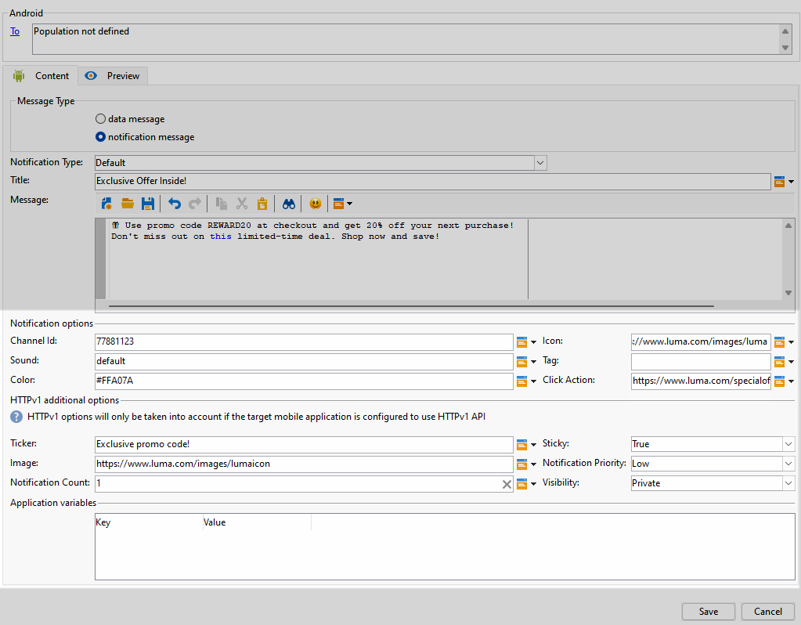
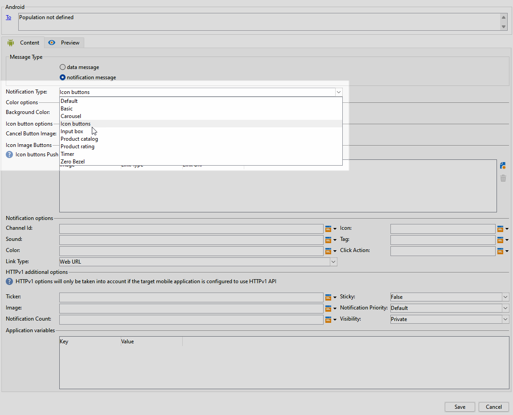
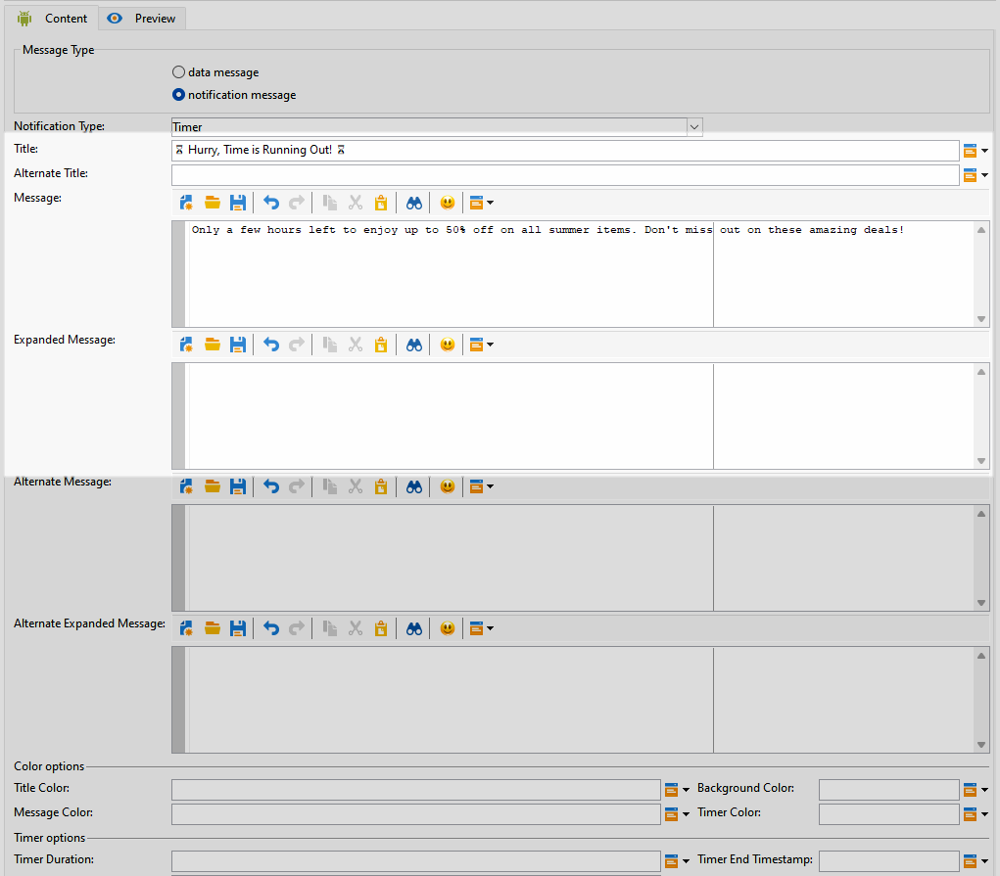

# Ontwerpen als een rijke push-service voor Android {#rich-push}

>[!IMPORTANT]
>
>Alvorens een Rich Push Bericht te ontwerpen, moet u eerst uw V2 schakelaar vormen. Verwijs naar [ deze pagina ](https://experienceleague.adobe.com/nl/docs/campaign-classic/using/sending-messages/sending-push-notifications/configure-the-mobile-app/configuring-the-mobile-application-android#configuring-external-account-android) voor de gedetailleerde procedure.

Met Firebase Cloud Messaging kunt u kiezen uit twee typen berichten:

* **[!UICONTROL Data message]** wordt afgehandeld door de clienttoepassing. Deze berichten worden rechtstreeks verzonden naar de mobiele toepassing, die een Android-melding op het apparaat genereert en weergeeft. Gegevensberichten bevatten alleen aangepaste toepassingsvariabelen.

* De **[!UICONTROL Notification message]** , die automatisch wordt afgehandeld door de FCM SDK. FCM geeft automatisch het bericht weer op de apparaten van uw gebruikers namens de client-app. Meldingsberichten bevatten een vooraf gedefinieerde set parameters en opties, maar kunnen nog steeds verder worden aangepast met aangepaste toepassingsvariabelen.

Als de schuifbalk op uw interface is uitgeschakeld, opent u **[!UICONTROL Administration]** `>` **[!UICONTROL Platform]** `>` **[!UICONTROL Options]** en stelt u de optie **[!UICONTROL XtkUseScrollBar]** in op 1.

## De inhoud van een Android-melding definiëren {#push-message}

Nadat u de pushservice hebt gemaakt, kunt u de inhoud definiëren met een van de volgende sjablonen:

* **Gebrek** staat u toe om berichten met een eenvoudig pictogram en een begeleidend beeld te verzenden.

* **Basis** kan tekst, beelden, en knopen in uw berichten omvatten.

* **Carrousel** laat u toe om berichten met tekst en veelvoudige beelden te verzenden die de gebruikers door kunnen vegen.

* **de knopen van het Pictogram** staat u toe om berichten met een pictogram en een overeenkomstig beeld te verzenden.

* **doos van de Input** verzamelt gebruikersinput en koppelt direct door het bericht terug.

* **de catalogus van het Product** toont een verscheidenheid van productbeelden.

* **de classificatie van het Product** staat gebruikers toe om terug te geven en producten te schatten.

* **Tijdopnemer** omvat een levende tellertijdopnemer in uw berichten.

* **Zero Bezel** gebruikt de volledige achtergrondoppervlakte voor een beeld, met tekst die foutloos wordt bedekt.

Navigeer door de lusjes hieronder om meer te leren over hoe te om deze malplaatjes aan te passen.

>[!BEGINTABS]

>[!TAB  Gebrek ]

1. Selecteer **[!UICONTROL Default]** in de vervolgkeuzelijst **[!UICONTROL Notification type]** .

   

1. Als u uw bericht wilt samenstellen, voert u de tekst in de velden **[!UICONTROL Title]** en **[!UICONTROL Message]** in.

   

1. Gebruik dynamische verpersoonlijkingsgebieden om inhoud te bepalen, gegevens te personaliseren en dynamische inhoud toe te voegen. [Meer informatie](../send/personalize.md)

1. Als u uw pushmelding verder wilt aanpassen, configureert u de **[!UICONTROL Notification options]** en **[!UICONTROL HTTPv1 additional options]** van uw pushmelding. [Meer informatie](#push-advanced)

   

Nadat u de inhoud van uw bericht hebt gedefinieerd, kunt u testabonnees gebruiken om het bericht voor te vertonen en te testen.

>[!TAB  Basis ]

1. Selecteer **[!UICONTROL Basic]** in de vervolgkeuzelijst **[!UICONTROL Notification Type]** .

   

1. Als u uw bericht wilt samenstellen, voert u de tekst in de velden **[!UICONTROL Title]** , **[!UICONTROL Message]** en **[!UICONTROL Expanded message]** in.

   De tekst **[!UICONTROL Message]** wordt weergegeven in de samengevouwen weergave terwijl de tekst **[!UICONTROL Expanded message]** wordt weergegeven wanneer het bericht wordt uitgevouwen.

   

1. Gebruik dynamische verpersoonlijkingsgebieden om inhoud te bepalen, gegevens te personaliseren en dynamische inhoud toe te voegen. [Meer informatie](../send/personalize.md)

1. Voer in het menu **[!UICONTROL Color options]** de hexadecimale kleurcodes in voor de **[!UICONTROL Title]** , **[!UICONTROL Message]** en **[!UICONTROL Background]** .

1. Voeg indien nodig een **[!UICONTROL Remind later button]** toe. Ga uw **[!UICONTROL Reminder Text]** en **Datum** op de overeenkomstige gebieden in.

   Het veld **[!UICONTROL Reminder Date]** verwacht een waarde die een tijdperk in seconden vertegenwoordigt.

1. Klik op **[!UICONTROL Add button]** en vul de volgende velden in:

   * **[!UICONTROL Label]**: Tekst die op de knop wordt weergegeven.
   * **[!UICONTROL Link URI]**: geef de URI op die moet worden uitgevoerd wanneer u op de knop klikt.

   U kunt maximaal drie knoppen opnemen in uw pushmelding. Als u voor **[!UICONTROL Remind later button]** kiest, kunt u slechts maximaal twee knoppen opnemen.

1. Selecteer de **[!UICONTROL Link type]** gekoppelde URL van uw knop:

   * **[!UICONTROL Web URL]**: URL&#39;s leiden gebruikers naar online-inhoud. Als ze klikken, wordt de standaardwebbrowser van het apparaat gevraagd om de opgegeven URL te openen en ernaar te navigeren.

   * **[!UICONTROL Deeplink]**: Diepe koppelingen zijn URL&#39;s die gebruikers naar specifieke secties in een app sturen, zelfs als de app is gesloten. Wanneer op deze knop wordt geklikt, wordt een dialoogvenster weergegeven waarin gebruikers kunnen kiezen uit verschillende apps waarmee de koppeling kan worden afgehandeld.

   * **[!UICONTROL Open App]**: Open App URL&#39;s waarmee u rechtstreeks verbinding kunt maken met inhoud binnen een toepassing. Het laat uw toepassing toe om zich als standaardmanager voor een specifiek type van verbinding te vestigen, die de dialoog overslaat.

   Voor meer informatie over hoe te om de Verbindingen van de Toepassing van Android te behandelen, verwijs naar {de documentatie van de Ontwikkelaars van 0} Android [&#128279;](https://developer.android.com/training/app-links).

   

1. Als u uw pushmelding verder wilt aanpassen, configureert u de **[!UICONTROL Notification options]** en **[!UICONTROL HTTPv1 additional options]** van uw pushmelding. [Meer informatie](#push-advanced)

   

Nadat u de inhoud van uw bericht hebt gedefinieerd, kunt u testabonnees gebruiken om het bericht voor te vertonen en te testen.

>[!TAB  Carousel ]

1. Selecteer **[!UICONTROL Carousel]** in de vervolgkeuzelijst **[!UICONTROL Notification Type]** .

   

1. Als u uw bericht wilt samenstellen, voert u de tekst in de velden **[!UICONTROL Title]** , **[!UICONTROL Message]** en **[!UICONTROL Expanded message]** in.

   De tekst **[!UICONTROL Message]** wordt weergegeven in de samengevouwen weergave terwijl de tekst **[!UICONTROL Expanded message]** wordt weergegeven wanneer het bericht wordt uitgevouwen.

   

1. Gebruik de uitdrukkingsredacteur om inhoud te bepalen, gegevens te personaliseren en dynamische inhoud toe te voegen. [Meer informatie](../send/personalize.md)

1. Voer in het menu **[!UICONTROL Color options]** de hexadecimale kleurcodes in voor de **[!UICONTROL Title]** , **[!UICONTROL Message]** en **[!UICONTROL Background]** .

1. Kies hoe de **[!UICONTROL Carousel]** wordt uitgevoerd:

   * **[!UICONTROL Auto]**: doorloopt afbeeldingen automatisch als dia&#39;s en gaat u met vooraf gedefinieerde intervallen verder.
   * **[!UICONTROL Manual]**: hiermee kunnen gebruikers handmatig tussen dia&#39;s vegen om door de afbeeldingen te navigeren.

1. Selecteer in de vervolgkeuzelijst **[!UICONTROL Layout]** de optie **[!UICONTROL Filmstrip]** om voorvertoningen van de vorige en volgende afbeeldingen naast de hoofddia op te nemen.

1. Klik op **[!UICONTROL Add image]** en voer de URL van de afbeelding, tekst en handeling in.

   Zorg ervoor dat u minimaal drie en maximaal vijf afbeeldingen opneemt.

   

1. Als u uw pushmelding verder wilt aanpassen, configureert u de **[!UICONTROL Notification options]** en **[!UICONTROL HTTPv1 additional options]** van uw pushmelding. [Meer informatie](#push-advanced)

   

Nadat u de inhoud van uw bericht hebt gedefinieerd, kunt u testabonnees gebruiken om het bericht voor te vertonen en te testen.

>[!TAB  de knopen van het Pictogram ]

1. Selecteer **[!UICONTROL Icon buttons]** in de vervolgkeuzelijst **[!UICONTROL Notification Type]** .

   

1. Voer in het menu **[!UICONTROL Color options]** de hexadecimale kleurcodes in voor de **[!UICONTROL Background]** .

   

1. Geef de URL voor de **[!UICONTROL Cancel button image]** op.

1. Klik onder **[!UICONTROL Icon image buttons]** op **[!UICONTROL Add image]** . Dan, ga het **Beeld URL** in, **het type van Verbinding**, en **Verbinding URI**.

   Zorg ervoor dat u minimaal drie afbeeldingen en maximaal vijf knoppen toevoegt.

   

1. Als u uw pushmelding verder wilt aanpassen, configureert u de **[!UICONTROL Notification options]** en **[!UICONTROL HTTPv1 additional options]** van uw pushmelding. [Meer informatie](#push-advanced)

   

Nadat u de inhoud van uw bericht hebt gedefinieerd, kunt u testabonnees gebruiken om het bericht voor te vertonen en te testen.

>[!TAB  doos van de Input ]

1. Selecteer **[!UICONTROL Input box]** in de vervolgkeuzelijst **[!UICONTROL Notification Type]** .

   

1. Als u uw bericht wilt samenstellen, voert u de tekst in de velden **[!UICONTROL Title]** , **[!UICONTROL Message]** en **[!UICONTROL Expanded message]** in.

   De tekst **[!UICONTROL Message]** wordt weergegeven in de samengevouwen weergave terwijl de tekst **[!UICONTROL Expanded message]** wordt weergegeven wanneer het bericht wordt uitgevouwen.

   

1. Voer in het menu **[!UICONTROL Color options]** de hexadecimale kleurcodes in voor de tekens **[!UICONTROL Title]** , **[!UICONTROL Message]** en **[!UICONTROL Background]** .

1. Vul in het menu **[!UICONTROL Input box options]** de volgende optie in:

   * **[!UICONTROL Input receiver name]**: voer de naam of id in voor de ontvanger van de invoer.
   * **[!UICONTROL Input text]**: Ga de tekst voor het **vakje van de Input** in.
   * **[!UICONTROL Feedback text]**: voer de tekst in die u na een antwoord wilt weergeven.
   * **[!UICONTROL Feedback image]**: voeg de URL toe voor de afbeelding die wordt weergegeven na een reactie.

   

1. Als u uw pushmelding verder wilt aanpassen, configureert u de **[!UICONTROL Notification options]** en **[!UICONTROL HTTPv1 additional options]** van uw pushmelding. [Meer informatie](#push-advanced)

   

Nadat u de inhoud van uw bericht hebt gedefinieerd, kunt u testabonnees gebruiken om het bericht voor te vertonen en te testen.

>[!TAB  Catalogus van het Product ]

1. Selecteer **[!UICONTROL Product catalog]** in de vervolgkeuzelijst **[!UICONTROL Notification Type]** .

   

1. Als u uw bericht wilt samenstellen, voert u de tekst in de velden **[!UICONTROL Title]** , **[!UICONTROL Message]** en **[!UICONTROL Expanded message]** in.

   De tekst **[!UICONTROL Message]** wordt weergegeven in de samengevouwen weergave terwijl de tekst **[!UICONTROL Expanded message]** wordt weergegeven wanneer het bericht wordt uitgevouwen.

   

1. Voer in het menu **[!UICONTROL Color options]** de hexadecimale kleurcodes in voor de **[!UICONTROL Title]** , **[!UICONTROL Message]** en **[!UICONTROL Background]** .

1. Vul onder **[!UICONTROL Product catalog options]** de volgende opties in:

   * **[!UICONTROL Action button text]**: Tekst die op de knop wordt weergegeven.
   * **[!UICONTROL Action button text color]**: kleur van de knoptekst Handeling.
   * **[!UICONTROL Action button color]** : kleur van de knop Handeling.
   * **[!UICONTROL Action button URI]**: geef de URI op die moet worden uitgevoerd wanneer u op de knop klikt.
   * **[!UICONTROL Display type]**: kies tussen verticale of horizontale weergave.

   

1. Klik in het menu **[!UICONTROL Product catalog items]** op **[!UICONTROL Add]** en voer de volgende gegevens voor elk item in:

   * **[!UICONTROL Title]**
   * **[!UICONTROL Description]**
   * **[!UICONTROL Image URL]**
   * **[!UICONTROL Price]**
   * **[!UICONTROL URI]**

   Zorg ervoor dat u maximaal drie items opneemt.

   

1. Als u uw pushmelding verder wilt aanpassen, configureert u de **[!UICONTROL Notification options]** en **[!UICONTROL HTTPv1 additional options]** van uw pushmelding. [Meer informatie](#push-advanced)

Nadat u de inhoud van uw bericht hebt gedefinieerd, kunt u testabonnees gebruiken om het bericht voor te vertonen en te testen.

>[!TAB  Classificatie van het Product ]

1. Selecteer **[!UICONTROL Product rating]** in de vervolgkeuzelijst **[!UICONTROL Notification Type]** .

   

1. Als u uw bericht wilt samenstellen, voert u de tekst in de velden **[!UICONTROL Title]** , **[!UICONTROL Message]** en **[!UICONTROL Expanded message]** in.

   De tekst **[!UICONTROL Message]** wordt weergegeven in de samengevouwen weergave terwijl de tekst **[!UICONTROL Expanded message]** wordt weergegeven wanneer het bericht wordt uitgevouwen.

   

1. Voer in het menu **[!UICONTROL Color options]** de hexadecimale kleurcodes in voor de **[!UICONTROL Title]** , **[!UICONTROL Message]** en **[!UICONTROL Background]** .

1. Voer in het menu **[!UICONTROL Product rating options]** de URL&#39;s voor de **[!UICONTROL Rating icon in unselected state]** en **[!UICONTROL Rating icon in selected state]** in.

   

1. Klik in het menu **[!UICONTROL Product rating items]** op **[!UICONTROL Add]** en voer de **[!UICONTROL Link URI]** in en kies de **[!UICONTROL Link type]** .

   * **[!UICONTROL Web URL]**: URL&#39;s leiden gebruikers naar online-inhoud. Als ze klikken, wordt de standaardwebbrowser van het apparaat gevraagd om de opgegeven URL te openen en ernaar te navigeren.

   * **[!UICONTROL Deeplink]**: Diepe koppelingen zijn URL&#39;s die gebruikers naar specifieke secties in een app sturen, zelfs als de app is gesloten. Wanneer op deze knop wordt geklikt, wordt een dialoogvenster weergegeven waarin gebruikers kunnen kiezen uit verschillende apps waarmee de koppeling kan worden afgehandeld.

   * **[!UICONTROL Open App]**: Open App URL&#39;s waarmee u rechtstreeks verbinding kunt maken met inhoud binnen een toepassing. Het laat uw toepassing toe om zich als standaardmanager voor een specifiek type van verbinding te vestigen, die de dialoog overslaat.

   * **[!UICONTROL Dismiss]**: Er is geen URL gekoppeld aan de knop. Als u gewoon klikt, wordt het dialoogvenster of de interface gesloten.

   Zorg ervoor dat u minimaal drie en maximaal vijf waarden opgeeft.

   

1. Als u uw pushmelding verder wilt aanpassen, configureert u de **[!UICONTROL Notification options]** en **[!UICONTROL HTTPv1 additional options]** van uw pushmelding. [Meer informatie](#push-advanced)

   

Nadat u de inhoud van uw bericht hebt gedefinieerd, kunt u testabonnees gebruiken om het bericht voor te vertonen en te testen.

>[!TAB  Tijdopnemer ]

1. Selecteer **[!UICONTROL Timer]** in de vervolgkeuzelijst **[!UICONTROL Notification Type]** .

   

1. Als u uw bericht wilt samenstellen, voert u de tekst in de velden **[!UICONTROL Title]** , **[!UICONTROL Message]** en **[!UICONTROL Expanded message]** in.

   De tekst **[!UICONTROL Message]** wordt weergegeven in de samengevouwen weergave terwijl de tekst **[!UICONTROL Expanded message]** wordt weergegeven wanneer het bericht wordt uitgevouwen.

   

1. Voer de tekst in die wordt weergegeven nadat de timer is verlopen in de velden **[!UICONTROL Alternate title]** , **[!UICONTROL Alternate message]** en **[!UICONTROL Alternate expanded message]** .

1. Voer in het menu **[!UICONTROL Color options]** de hexadecimale kleurcodes in voor de **[!UICONTROL Title]** , **[!UICONTROL Message]** , **[!UICONTROL Background]** en **[!UICONTROL Timer]** .

   

1. Stel de **[!UICONTROL Timer duration]** in seconden of de **[!UICONTROL Timer end timestamp]** in op een specifieke epoche-tijdstempel en voeg de **[!UICONTROL Alternate image]** -URL toe die wordt weergegeven nadat de timer is verlopen.

   

1. Als u uw pushmelding verder wilt aanpassen, configureert u de **[!UICONTROL Notification options]** en **[!UICONTROL HTTPv1 additional options]** van uw pushmelding. [Meer informatie](#push-advanced)

Nadat u de inhoud van uw bericht hebt gedefinieerd, kunt u testabonnees gebruiken om het bericht voor te vertonen en te testen.

>[!TAB  Zero Bezel ]

1. Selecteer **[!UICONTROL Zero bezel]** in de vervolgkeuzelijst **[!UICONTROL Notification Type]** .

   

1. Als u uw bericht wilt samenstellen, voert u de tekst in de velden **[!UICONTROL Title]** , **[!UICONTROL Message]** en **[!UICONTROL Expanded message]** in.

   De tekst **[!UICONTROL Message]** wordt weergegeven in de samengevouwen weergave terwijl de tekst **[!UICONTROL Expanded message]** wordt weergegeven wanneer het bericht wordt uitgevouwen.

   

1. Voer in het menu **[!UICONTROL Color options]** de hexadecimale kleurcodes in voor de **[!UICONTROL Title]** , **[!UICONTROL Message]** en **[!UICONTROL Background]** .

1. Voeg in het menu **[!UICONTROL Zero bezel options]** de afbeeldings-URL toe in het veld **[!UICONTROL Collapsed notification style]** .

   

1. Als u uw pushmelding verder wilt aanpassen, configureert u de **[!UICONTROL Notification options]** en **[!UICONTROL HTTPv1 additional options]** van uw pushmelding. [Meer informatie](#push-advanced)

Nadat u de inhoud van uw bericht hebt gedefinieerd, kunt u testabonnees gebruiken om het bericht voor te vertonen en te testen.

>[!ENDTABS]

## Geavanceerde instellingen voor pushmeldingen {#push-advanced}

### Meldingsopties {#notification-options}

| Parameter | Beschrijving |
|---------|---------|
| **[!UICONTROL Channel ID]** | Stel de kanaal-id van uw melding in. De app moet een kanaal met deze kanaal-id maken voordat meldingen met deze kanaal-id worden ontvangen. |
| **[!UICONTROL Icon]** | Stel het pictogram van het bericht in op weergave op de apparaten van uw profielen. |
| **[!UICONTROL Sound]** | Stel het geluid in dat moet worden afgespeeld wanneer het apparaat het bericht ontvangt. |
| **[!UICONTROL Tag]** | Stel een id in die wordt gebruikt om bestaande meldingen in de meldingslade te vervangen. Dit helpt de accumulatie van meerdere meldingen te voorkomen en zorgt ervoor dat alleen de meest recente relevante kennisgeving wordt weergegeven. |
| **[!UICONTROL Color]** | Stel de pictogramkleur van uw melding in met hexadecimale kleurcode. |
| **[!UICONTROL Click action]** | Stel de handeling in die aan een gebruiker is gekoppeld, en klik op het bericht. |
| **[!UICONTROL Notification background color]** | Stel de kleur van de achtergrond voor meldingen in met uw Hex-kleurcodes. |
| **[!UICONTROL Link type]** | <ul><li>URL: URL&#39;s leiden gebruikers rechtstreeks naar online-inhoud. Als ze klikken, wordt de standaardwebbrowser van het apparaat gevraagd om de opgegeven URL te openen en ernaar te navigeren.</li><li>Deplink: Diepe koppelingen zijn URL&#39;s die gebruikers naar specifieke secties in een app sturen, zelfs als de app is gesloten. Wanneer op deze knop wordt geklikt, wordt een dialoogvenster weergegeven waarin gebruikers kunnen kiezen uit verschillende apps waarmee de koppeling kan worden afgehandeld.</li><li> Open App: open app-URL&#39;s waarmee u rechtstreeks verbinding kunt maken met inhoud binnen een toepassing. Het laat uw toepassing toe om zich als standaardmanager voor een specifiek type van verbinding te vestigen, die de dialoog overslaat.</li></ul> |

### Extra opties voor HTTPv1 {#additional-options}

| Parameter | Beschrijving |
|---------|---------|
| **[!UICONTROL Ticker]** | Stel de tekst van de markering in voor uw melding. Alleen beschikbaar voor apparaten die zijn ingesteld op Android 5.0 Lollipop. |
| **[!UICONTROL Sticky]** | Wanneer geactiveerd, blijft het bericht zichtbaar zelfs nadat de gebruiker erop klikt.   als gedeactiveerd, wordt het bericht automatisch verworpen wanneer de gebruiker met het in wisselwerking staat. Dankzij het plakgedrag blijven belangrijke meldingen langer op het scherm staan. |
| **[!UICONTROL Image]** | Stel de URL van de afbeelding in die in uw melding moet worden weergegeven. |
| **[!UICONTROL Notification Priority]** | Stel het prioriteitsniveau van uw melding in. Dit kan standaard, minimaal, laag of hoog zijn. Het prioriteitsniveau bepaalt het belang en de urgentie van de melding, en beïnvloedt hoe deze wordt weergegeven en of bepaalde systeeminstellingen kunnen worden omzeild. Voor meer op dit, verwijs naar [ documentatie FCM ](https://firebase.google.com/docs/reference/fcm/rest/v1/projects.messages#notificationpriority). |
| **[!UICONTROL Notification Count]** | Stel het aantal nieuwe ongelezen gegevens in dat rechtstreeks op het toepassingspictogram moet worden weergegeven. Hierdoor kan de gebruiker snel zien hoeveel meldingen in behandeling zijn. |
| **[!UICONTROL Visibility]** | Stel het zichtbaarheidsniveau van uw melding in. Dit kan openbaar, privé of geheim zijn. Het zichtbaarheidsniveau bepaalt hoeveel van de inhoud van het bericht wordt weergegeven op het vergrendelingsscherm en andere gevoelige gebieden. Voor meer informatie, verwijs naar de [ documentatie FCM ](https://firebase.google.com/docs/reference/fcm/rest/v1/projects.messages#visibility). |
| **[!UICONTROL Application variables]** | Hiermee kunt u gedrag voor meldingen definiëren. Deze variabelen kunnen volledig worden aangepast en worden opgenomen in de berichtlading die naar het mobiele apparaat wordt verzonden. |
