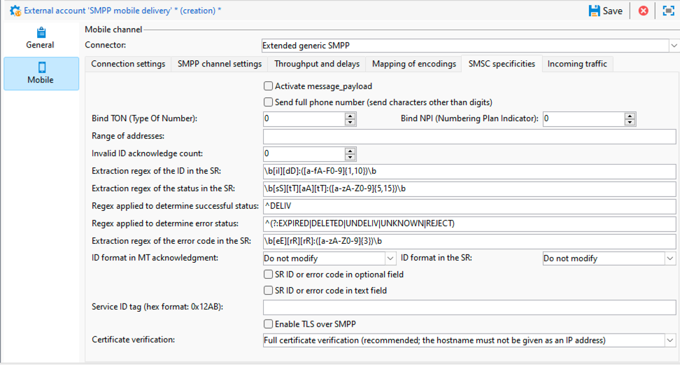

# SMPP-instellingen voor externe account {#smpp-external-account}

Adobe Campaign gebruikt het protocol SMPP om SMS naar een dienstverlener te verzenden.

>[!IMPORTANT]
>
>Adobe Campaign ondersteunt versie 3.4 van het SMPP-protocol.

De sms-connector in Adobe Campaign biedt veel mogelijkheden om zijn gedrag aan te passen om compatibel te zijn met de meeste SMPP-aanbieders, die geneigd zijn een beetje van de officiële specificatie af te wijken.

>[!IMPORTANT]
>
>De vestiging een verbinding aan een nieuwe leverancier kan sommige technische vaardigheden, kennis van TCP, binaire, hexadecimale vertegenwoordiging en tekstcoderingen vereisen. Het zal ook actieve samenwerking met de leverancier vereisen.

Het netwerkmateriaal op de dienstverlener van SMS wordt vaak genoemd SMSC.

## Verbindingsinstellingen {#smpp-connection-settings}

{zoomable="yes"}

Hier zijn de parameters en hun rol nodig om de verbinding te plaatsen:

* **SMSC implementatienaam**: plaatst de naam van de implementatie SMSC. Deze moet op de naam van uw provider worden ingesteld. De rol van dit gebied wordt beschreven in de sectie van het SMPP foutenbeheer.
* **Server**: De DNS naam of IP adres van de server om met te verbinden.
* **Haven**: De haven van TCP om met te verbinden.
* **Rekening**: De login van de verbinding. Wordt doorgegeven in het veld system_id van de PDU BIND.
* **Wachtwoord**: Wachtwoord van de verbinding SMPP. Wordt doorgegeven in het wachtwoordveld van de PDU BIND.
* **Type van Systeem**: Waarde die op het system_type gebied van de BIND PDU wordt overgegaan. Sommige providers hebben hier een specifieke waarde nodig.
* **Aantal MTA kindverbindingen**: Dit bepaalt hoeveel verbindingen per verzendende draad worden geopend.
Het totale aantal verbindingen kan worden berekend gebruikend deze formule:
  *Totale verbindingen = Aantal processen van SMS * aantal verzendende draden * aantal MTA kindverbindingen*

   * Het aantal SMS-processen is normaal 1. Bij sommige zeer hoge prestatiesinstanties, zouden de veelvoudige processen van SMS parallel kunnen zijn begonnen.
   * Het aantal verzendende threads wordt ingesteld in serverConf (sendingThreads setting). De standaardwaarde is 1.
   * Het aantal onderliggende MTA-verbindingen is deze instelling in de externe account.

  Met deze instelling wordt het aantal verbindingen rechtstreeks ingesteld.

Op **zendontvangerwijze**, is dit het totale aantal verbindingen.

In **transmitter+receiver wijze**, bepaalt dit het aantal paren transmitter+receiver (één paar = één zender + één ontvanger).
Het evenwicht tussen zenders en ontvangers kan niet worden gewijzigd.

* **verzendt berichten door een specifiek proces**:
Voor Adobe Campaign v8.7.2 en hoger moet deze optie altijd zijn ingeschakeld. Het heeft veel invloed op de manier waarop berichten worden verwerkt.
* **SMPP verbindingswijze**:
Stel de verbinding in in de transceivermodus of in de gescheiden zender+ontvanger-modus.
   * Transmitter+receiver (of TX+RX): er worden twee afzonderlijke TCP-verbindingen gebruikt voor het verzenden en ontvangen van berichten.
   * Transceiver (of TRX): één enkele verbinding van TCP wordt gebruikt voor het overbrengen van en het ontvangen van berichten.
* **Gebruik verschillende parameters voor ontvanger**:
Alleen beschikbaar in de modus zender+ontvanger.
Als het selectievakje is uitgeschakeld, worden dezelfde instellingen gebruikt voor zender en ontvanger. Als het selectievakje is ingeschakeld, zijn de standaardinstellingen alleen van toepassing op de zender, terwijl de ontvangerinstellingen alleen op de ontvanger van toepassing zijn.
* **Ontvangerserver, haven, rekening, wachtwoord, systeemtype**
Deze instellingen zijn van toepassing op de ontvanger in de modus zender+ontvanger. Zij werken als het zenderdeel, zie hierboven voor [ meer details ](#smpp-connection-settings).
* **laat uitgebreide sporen SMPP in het logboekdossier** toe
Als deze optie is ingeschakeld, worden extra logbestanden uitgevoerd naar het logbestand. Dit is zeer nuttig voor het oplossen van problemen, maar zou op hoge productievertoningen moeten worden onbruikbaar gemaakt als geen het oplossen van problemen wordt vereist.

## SMPP-kanaalinstellingen {#smpp-channel-settings}

{zoomable="yes"}

### Tekentransliteratie autoriseren

Transliteratie is het zoeken naar tekens die equivalent zijn aan ontbrekende tekens. Het Franse &quot;ê&quot;-teken (e met omstreeks accent) ontbreekt bijvoorbeeld in GSM-codering, maar kan worden vervangen door &quot;e&quot; zonder de leesbaarheid te veel te belemmeren.

Als dit selectievakje is uitgeschakeld, mislukt de tekstcodering als de tekenreeks niet exact zo kan worden gecodeerd.

Als dit selectievakje is ingeschakeld, probeert de tekstcodering de tekenreeks om te zetten in een versie die bij benadering overeenkomt in plaats van te mislukken. Als sommige tekens geen equivalent hebben in de doelcodering, mislukt de tekstcodering.

Zie [ een specifieke afbeelding van coderingen bepalen die ](#mapping-encodings) voor een meer algemene verklaring van het het coderen proces plaatsen.

### Source-nummer

Bepaalt het standaardbronadres voor berichten. Deze instelling is alleen van toepassing als het bronnummer leeg is gelaten in de levering. Het veld Bronnummer wordt standaard niet doorgegeven, zodat de provider dit veld vervangt door de korte code.

Dit laat de afzenderadres/oADC opheffingseigenschap toe.

### Source TON/NPI, TON/NPI bestemming

TON (type nummer) en NPI (indicator nummerplan) (beschreven in punt 5.2.5 van de specificatie SMPP 3.4). Deze waarden moeten worden ingesteld op wat de provider nodig heeft.

Zij worden overgebracht as-is in source_addr_ton, source_addr_npi, dest_addr_ton en dest_addr_npi gebieden van SUBMIT_SM PDU.

### Servicetype

Dit gebied wordt overgebracht as-is op het service_type gebied van SUBMIT_SM PDU. Stel dit in op wat de provider nodig heeft.

## Doorvoer en vertragingen {#smpp-delays}

{zoomable="yes"}

Deze montages controleren alle timingsaspecten van het kanaal SMPP. Sommige leveranciers vereisen zeer nauwkeurige controle van het berichttarief, venster en retry timings, zodat zouden deze montages aan waarden moeten worden geplaatst die de capaciteit van de leverancier en de voorwaarden aanpassen die in hun contract worden vermeld.

### Venster verzenden

Het venster is het aantal PDUs SUBMIT_SM die zonder het wachten op passende SUBMIT_SM_RESP kan worden verzonden.

Voorbeeld van een transmissie met een maximum venster van 4:

{zoomable="yes"}

Het venster helpt de productie te verhogen wanneer de netwerkverbinding een hoge latentie heeft. De waarde van het venster moet minstens het aantal SMS/s zijn die door de latentie van de verbinding (in seconden) wordt vermenigvuldigd zodat de schakelaar nooit op SUBMIT_SM_RESP wacht alvorens het volgende bericht te verzenden.

Als het venster te groot is, kunt u meer dubbele berichten verzenden in het geval van verbindingsproblemen (zeldzame gevallen). Bovendien hebben de meeste providers een zeer strikte limiet voor het venster en weigeren berichten die de limiet overschrijden.

Hoe te om de optimale verzendende vensterformule te berekenen:

Meet de maximumlatentie tussen SUBMIT_SM en SUBMIT_SM_RESP.
Vermenigvuldig deze waarde (in seconden) aan de maximum MT productie: dit zal de optimale verzendende vensterwaarde geven.
Voorbeeld: Als u 300 SMS/s in maximum MT productie en er is 100ms latentie tussen SUBMIT_SM en SUBMIT_SM_RESP gemiddeld, zou de optimale waarde 300×0.1 = 30 zijn.

In twijfel, verkies een groter venster om prestatiesproblemen te vermijden.

### Maximale MT-doorvoer

Maximum aantal MT per seconde en per verbinding. Deze instelling wordt strikt gehandhaafd, de MTA zal nooit berichten sneller dan deze grens duwen. Het is nuttig voor leveranciers die nauwkeurige vertraging vereisen.

Om de totale productielimiet te kennen, vermenigvuldig dit aantal met het totale aantal verbindingen (zie de bovenstaande formule).

0 betekent geen limiet, de MTA zal MT zo snel mogelijk verzenden.

Het wordt over het algemeen aanbevolen deze instelling onder de 1000 te houden, aangezien het onmogelijk is een exacte doorvoer boven dit aantal te garanderen, tenzij dit op de uiteindelijke architectuur is gebaseerd en specifiek om een SMPP-leverancier is verzocht. Het kan beter zijn om het aantal verbindingen te verhogen om boven 1000 MT/s te gaan.

### Tijd vóór opnieuw verbinden

Wanneer de verbinding van TCP wordt verloren, zal de schakelaar dit aantal seconden wachten alvorens te proberen om een verbinding te maken.

### Vervalperiode van de MT

Dit is de onderbreking tussen SUBMIT_SM en zijn overeenkomstige SUBMIT_SM_RESP. Als het RESP niet tijdig wordt ontvangen, zal het bericht als ontbroken worden beschouwd en zal het globale hertestbeleid van MTA van toepassing zijn.

### Time-out binden

De onderbreking tussen TCP verbindt poging en het BIND_*_RESP antwoord. Wanneer het uit tijden, wordt de verbinding gesloten door de schakelaar van de Campagne en het zal Tijd wachten alvorens opnieuw te verbinden alvorens opnieuw te proberen.

### request_link period

inquire_link is een speciaal soort PDU die wordt verzonden om de verbinding levend te houden. Deze periode is in seconden. De campagnector verzendt alleen inquire_link wanneer de verbinding inactief is om bandbreedte te besparen. Als geen RESP na tweemaal deze periode wordt ontvangen, zal de verbinding als dood worden beschouwd en zal een reconnectieproces worden teweeggebracht.

## Toewijzing van coderingen {#mapping-encodings}

Gelieve te zien de [ de tekstcoderende sectie van SMS ](sms-channel.md#sms-text-encoding) voor details over tekstcodering.

Met deze instelling kunt u een aangepaste coderingstoewijzing definiëren die afwijkt van de specificatie. U kunt een lijst met coderingen declareren, samen met de waarde data_coding. De MTA probeert te coderen met de eerste codering in de lijst. Als dit mislukt, wordt de volgende codering in de lijst gebruikt, enzovoort.. Als het bericht niet kan worden gecodeerd, treedt er een fout op. Zodra het coderen wordt gevonden, zal MTA SUBMIT_SM PDU met de gecodeerde tekst en het data_coding gebied tot stand brengen met de waarde die in de lijst wordt gespecificeerd.

De volgorde van items in de tabel is belangrijk: coderingen worden van boven naar beneden geprobeerd. Plaats de goedkoopste of meest aanbevolen codering boven aan de lijst, gevolgd door meer en duurdere (of minder gewenste) coderingen.

UCS-2 zal nooit mislukken omdat het alle karakters kan coderen die in Campagne worden gesteund. Houd er rekening mee dat de maximale lengte van een UCS-2-SMS veel kleiner is (alleen 70 tekens).

U kunt deze instelling ook gebruiken om een specifieke codering te forceren die altijd moet worden gebruikt door slechts 1 regel in de toewijzingstabel te declareren.

De standaardtoewijzing die wordt gebruikt wanneer het selectievakje niet is ingeschakeld, is gelijk aan de volgende tabel:

| data_coding | Codering |
|:-:|:-:|
| 0 | GSM |
| 8 | UCS-2 |

Dit betekent dat de MTA zal proberen om het bericht in GSM te coderen, als het erin slaagt het verzendt het met data_coding die aan 0 wordt geplaatst.

Als het bericht niet in GSM kan worden gecodeerd, zal het in UCS-2 worden gecodeerd en data_coding aan 8 plaatsen.

## Specifieke kenmerken van het SMSC {#smsc-specificities}

{zoomable="yes"}

### message_payload activeren

Wanneer ongecontroleerd, lang SMS door MTA zal worden verdeeld en in veelvoudige SUBMIT_SM PDUs met UDH verzonden. Het bericht wordt opnieuw samengesteld door de mobiele telefoon na UDH-gegevens.

Wanneer gecontroleerd, lange SMS zal in één SUBMIT_SM PDU worden verzonden, die de tekst in het bericht_payload facultatieve gebied zetten (zie de specificatie SMPP voor details over dit).

Als deze functie is ingeschakeld, kan Campagne de SMS-onderdelen niet afzonderlijk tellen: alle berichten worden meegeteld zoals ze in één deel zijn verzonden.

### Het volledige telefoonnummer verzenden

Wanneer dit checkbox niet wordt gecontroleerd, slechts worden de cijfers van het telefoonaantal verzonden naar de leverancier (bestemmings_addr gebied van het SUBMIT_SM gebied). Dit is het standaardgedrag omdat de internationale aantalindicator (gewoonlijk a + prefix) door TON en NPI gebieden in SMPP wordt vervangen.

Als het selectievakje is ingeschakeld, wordt het telefoonnummer ongewijzigd verzonden, zonder voorbehandeling (en mogelijke spaties, + voorvoegsel of pound/hash/star-tekens).

Deze eigenschap heeft ook een effect op het gedrag van auto antwoordquarantaineeigenschap: wanneer checkbox niet wordt gecontroleerd, zal een + prefix aan telefoonaantallen worden toegevoegd die in de quarantainetabel worden opgenomen om te compenseren + prefix die van het telefoonaantal door het protocol SMPP zelf wordt verwijderd.

### Binden TON/NPI

TON (type nummer) en NPI (indicator nummerplan) (beschreven in punt 5.2.5 van de specificatie SMPP 3.4). Deze waarden moeten worden ingesteld op wat de provider nodig heeft.

Zij worden overgebracht zoals-is in addr_ton en addr_npi gebieden van BIND PDU.

### Adresbereik

Verzonden as-is op het address_range gebied van BIND PDU. Deze waarde moet worden ingesteld op wat de provider nodig heeft.

### Aantal voor ongeldige id-erkenning

Beperkt het aantal &quot;Ongeldige identiteitskaart van het Bericht&quot;DELIVER_SM_RESP die voor één enkele SR kan worden verzonden. **dit zou slechts voor het oplossen van problemendoel als alternerende actie** moeten worden gebruikt en aan 0 in normale voorwaarden worden geplaatst.

Gedetailleerde uitleg: stel deze instelling in op 2:

* De leverancier verzendt een SR (DELIVER_SM) met identiteitskaart &quot;1234&quot;
* ID &quot;1234&quot; is niet gevonden in de database
* De schakelaar telt 1 &quot;Ongeldige identiteitskaart&quot;fout voor die identiteitskaart, zodat verzendt het DELIVER_SM_RESP met de &quot;ongeldige identiteitskaart van het Bericht&quot;foutencode (normaal gedrag).
* De provider probeert dezelfde SR opnieuw met ID &quot;1234&quot;
* De id &quot;1234&quot; is nog steeds niet gevonden in de database
* De schakelaar telt 2 &quot;Ongeldige identiteitskaart&quot;fout voor die identiteitskaart, zodat verzendt het DELIVER_SM_RESP &quot;OK&quot;, zelfs als het niet correct werd verwerkt.

Deze functie is bedoeld om SR-buffers op de providerzijde te verwijderen wanneer ongeldige SR-blokgeldige berichten blokkeren die niet kunnen worden verwerkt.

Als u dit veld instelt op 0, wordt het mechanisme uitgeschakeld zodat &quot;Bericht-id ongeldig&quot; altijd wordt geretourneerd, dit is normaal.

Als u dit veld instelt op 1, reageert de connector altijd op OK, zelfs als de id ongeldig is. Dit moet worden ingesteld op 1, dat alleen onder toezicht wordt gebruikt voor het oplossen van problemen en voor de minimale hoeveelheid tijd, bijvoorbeeld om te herstellen van een probleem aan de aanbodzijde.

### Extractieregex van de id in de SR

SR-indeling wordt niet strikt afgedwongen door de specificatie van het SMPP-protocol. Dit is slechts een aanbeveling die wordt beschreven in aanhangsel B van de specificatie. Daarom wordt dit veld door sommige SMPP-implementoren anders opgemaakt, zodat Campagne een manier nodig heeft om het juiste veld te extraheren.

Standaard worden maximaal 10 alfanumerieke tekens na &quot;id:&quot; vastgelegd.

De regex moet precies één vastleggroep hebben (een onderdeel dat tussen haakjes staat). Haakjes moeten rondom het onderdeel staan dat overeenkomt met de id. De regex-indeling is PCRE.

Wanneer u deze instelling aanpast, moet u zoveel mogelijk context opnemen om onjuiste triggers te voorkomen. Als er specifieke voorvoegsels (zoals &quot;id:&quot; in de standaard) zijn, neemt u deze op in de regex. Gebruik ook woordscheidingstekens (\b) zoveel mogelijk om te voorkomen dat tekst in het midden van een woord wordt vastgelegd.

Als er onvoldoende context in de regex wordt opgenomen, kan er een kleine beveiligingsfout optreden: de feitelijke inhoud van het bericht kan in de SR worden opgenomen. Als u dus alleen een specifieke id-indeling aanpast zonder context (bijvoorbeeld een UUID), kan het zijn dat de werkelijke tekstinhoud wordt geparseerd (bijvoorbeeld een UUID die is ingesloten in het tekstveld) in plaats van de ID.

### Extractieregex van de status in de SR

Deze regex vangt de status van het tekstgebied van SR berichten.

Standaard worden er tussen 5 en 15 tekens vastgelegd na &quot;stat:&quot;.

Regex moet **precies één vangstgroep** hebben (een deel dat binnen haakjes bevat is). Haakjes moeten rondom het onderdeel staan dat overeenkomt met de status. De regex-indeling is PCRE.

### Regex is toegepast om de status geslaagd te bepalen

Deze regex wordt toegepast op het resultaat van de vorige regex (&quot;Uittrekkingsregex van de status&quot;). Als regex aanpast, wordt het bericht beschouwd als succesvol.

Standaard komt deze overeen met alles wat begint met &quot;DELIV&quot;. Deze komt overeen met de standaardwaarde &quot;DELIVRD&quot;.

### Regex toegepast om foutstatus te bepalen

Deze regex wordt toegepast op het resultaat van de vorige regex (&quot;Uittrekkingsregex van de status&quot;). Als regex aanpast, wordt het bericht beschouwd als fout.

Standaard komt deze overeen met alle verschillende foutstatussen die in de specificatie worden beschreven.

### Extractieregex van de foutcode in de SR

Deze regex vangt de foutencode van het tekstgebied van sr- berichten.

Foutcodes kunnen worden gekwalificeerd in de kwalificatie van het leveringslogboek.

Standaard worden er 3 tekens na &quot;err:&quot; vastgelegd.

### ID-indeling in MT-bevestiging

Dit wijst op het formaat van identiteitskaart die op het message_id gebied van SUBMIT_SM_RESP PDU is teruggekeerd.

* **wijzigt niet**: identiteitskaart wordt opgeslagen zoals-is in het gegevensbestand, als ASCII-Gecodeerde tekst. Er vindt geen voorbewerking of filtering plaats.
* **Decimaal aantal**: Identiteitskaart wordt verwacht om een decimaal aantal in vorm te zijn ASCII. De voorloopspaties, de volgspaties en de voorloopnullen worden verwijderd wanneer deze instelling wordt gebruikt.
* **Hexadecimaal aantal**: Identiteitskaart wordt verwacht om een hexadecimaal aantal in vorm ASCII, zonder belangrijke 0x of het slepen h te zijn. De id wordt vervolgens omgezet in een decimaal getal voordat deze in de database wordt opgeslagen.
* **Hexadecimale koord**: Identiteitskaart wordt verwacht om een ASCII-Gecodeerde tekst te zijn die zelf een koord van bytes is die als hexadecimaal worden gecodeerd. In de PDU vindt u bijvoorbeeld 0x34 0x31 0x34 0x32 0x34 0x33, wat vertaalt naar ASCII &quot;414243&quot;; vervolgens wordt deze tekenreeks gedecodeerd als een hexadecimale tekenreeks van bytes en als resultaat krijgt u &quot;ABC&quot;: u slaat de tekenreeks op ID ABC in de database.

### ID-indeling in de SR

Dit geeft de indeling aan van de id die is vastgelegd door de extractieregex van de id in de SR. Waarden hebben dezelfde betekenis en hetzelfde gedrag als de notatie in MT hierboven.

### SR-id of foutcode in optioneel veld

Als deze optie is ingeschakeld, wordt de inhoud van optionele velden toegevoegd aan de tekst die wordt verwerkt door bovenstaande regexes. De tekst heeft de notatie &quot; 0xTAG:VALUE&quot;, 0xTAG is de hexadecimale waarde van 4 cijfers van de tag in hoofdletters (bijvoorbeeld 0x002E).

U kunt bijvoorbeeld de id vastleggen in het veld receipted_message_id. Hiervoor schakelt u dit selectievakje in en wordt de volgende tekst aan de status toegevoegd:

0x001E:05e3299e-8d37-49d0-97c6-8e4fe60c739

In dit voorbeeld is 0x001E de tag van het optionele veld en is UUID de waarde van het veld.

Als u deze waarde wilt vastleggen, kunt u nu de volgende regex instellen in het vak Extractie van de id in het veld SR:

\b0x001E: ([ 0-9a-f] \{8 \} -[ 0-9a-f ] \{4 \} -[ 0-9a-f ] \ {4 \} - [ 0-9a-f ] \ {4 \} - [ 0-9a-f ] \ 2\})\b

>[!IMPORTANT]
>
>U kunt alleen optionele velden vastleggen die 8-bits tekstwaarden (ASCII/UTF-8) hebben. Specifiek, kunnen de binaire gebieden niet betrouwbaar met het huidige regex systeem worden gevangen.

### SR-id of foutcode in tekstveld

Als deze optie is ingeschakeld, wordt het veld Text: bewaard tijdens de verwerking van de statustekst van de SR. Dit is handig als de provider belangrijke gegevens in dit veld plaatst, zoals de id of de status. Dit veld kan gewoonlijk veilig worden verwijderd, omdat het tekst met een niet-ASCII-codering kan bevatten en de verwerking van regex kan verstoren.

Als u deze optie inschakelt, kan een zeer klein beveiligingsprobleem optreden als de extractieregex van de id in het veld SR niet specifiek genoeg is: de inhoud van het tekstveld kan als een id worden geparseerd en een aanvaller kan deze gebruiken om vervalste id&#39;s te injecteren, wat kan leiden tot een gedeeltelijke denial of service-situatie.

### Tag voor service-id

Hiermee kunt u een aangepaste TLV toevoegen. Dit gebied plaatst de markering, die als hexadecimale waarde in het formaat **0x1234** wordt overgegaan.

De waarde van het aangepaste TLV moet worden ingesteld in het veld &quot;Service or program ID&quot; in de geavanceerde parameters van de levering. De waarde wordt verzonden als UTF-8-gecodeerde tekst.

Met deze instelling kunt u slechts één TLV-optie per bericht toevoegen.

>[!NOTE]
>
>Deze optie wordt vervangen door de veel krachtigere **Facultatieve parameters SMPP (TLV)** die in leveringsparameters plaatsen. Deze functies sluiten elkaar uit en kunnen niet tegelijkertijd worden gebruikt.

### TLS inschakelen via SMPP

Als deze optie is ingeschakeld, worden alle verbindingen met SMSC gecodeerd met TLS.

### Certificaatverificatie

* **Volledige certificaatcontrole**: Controleer het certificaat TLS en de verre gastheernaam wanneer het verbinden. Deze waarde geeft het hoogste beveiligingsniveau.
* **Skip de hostname controle**: Controleer het verre certificaat van TLS, maar controleer niet als de verre gastheernaam aanpast. Hiermee verlaagt u de beveiliging iets.
* **overslaan de certificaatcontrole**: Controleer helemaal niet het certificaat TLS. De verbinding is nog steeds gecodeerd, maar is kwetsbaar voor aanvallen van mens tot mens. Vermindert de veiligheid veel.

## Binnenkomend verkeer {#incoming-traffic}

{zoomable="yes"}

### Optionele SMPP-parameters (TLV) in MO

Met campagne kunnen 3 extra velden in MO (nms:inSms-tabel) worden ontvangen: gekoppelde SMS, alias en groot account. Met de schakelaar SMPP, kunnen deze gebieden met gegevens worden gevuld die uit om het even welke facultatieve parameter SMPP (TLV), met om het even welk gemeenschappelijk formaat komen.

Voor elk veld kunt u de bijbehorende tag en de indeling ervan instellen. Vraag de dienstverlener SMPP om deze informatie te hebben.

* Tag: de tagwaarde in decimale notatie (bijvoorbeeld 12345) of hexadecimaal met voorvoegsel 0x (bijvoorbeeld 0x12ab). Tags kunnen tussen 0 en 65535 liggen.
* Indeling: opmaak die wordt gebruikt voor waarde. Binaire waarden zijn alle binaire waarden die met big-endian zijn ondertekend. Kies voor tekstvelden de codering die door de SMPP-provider wordt gebruikt.

### Automatisch antwoord verzonden aan de MO

Met deze functie kunt u snel tekst op MO&#39;s beantwoorden en zwarte lijsten per code verwerken.

Het *Sleutelwoord* en *Korte code* kolommen bepalen voorwaarden om het auto antwoord teweeg te brengen: als beide gebieden aanpassen, wordt MO verzonden en de extra actie wordt teweeggebracht. Als u een jokerteken wilt opgeven, laat u het veld leeg. Trefwoorden komen overeen met het eerste alfanumerieke woord in de MO-tekst, waarbij leestekens en voorloopruimten worden genegeerd. Dit betekent dat het trefwoordveld geen spaties mag bevatten en slechts één woord mag zijn.

Ook, is het *Trefwoord* plaatsen een prefix. Als u bijvoorbeeld &quot;AD&quot; opgeeft, komt deze overeen met &quot;AD&quot;, &quot;ADAPT&quot; en &quot;ADOBE&quot;. Als u meerdere trefwoorden met een algemeen voorvoegsel hebt, let dan op de volgorde, worden de trefwoorden van boven naar beneden verwerkt.

De *kolom van het Antwoord* is de tekst om te antwoorden. Geen verpersoonlijking is beschikbaar op dit gebied, is de antwoordtekst altijd het zelfde. Als u dit veld leeg laat, wordt er geen bericht geantwoord, maar wordt de aanvullende actie toch geactiveerd.

De *Extra* actiekolom verstrekt een extra actie om te doen wanneer zowel sleutelwoord als korte codegelijke (lege korte code past alle korte codes aan). Op dit moment kunt u naar quarantaine verzenden of uit quarantaine verwijderen. Als u een aanvullende actie opgeeft maar het antwoordveld leeg laat, wordt de actie uitgevoerd, maar wordt er geen antwoord verzonden. Quarantaine wordt alleen toegepast voor de opgegeven korte code of voor alle korte codes als het veld leeg blijft.

Alle items in de tabel worden in de opgegeven volgorde verwerkt, totdat één regel overeenkomt. Als de veelvoudige regels een MO aanpassen, slechts zal de hoogste regel worden toegepast.

>[!NOTE]
>
>**verzendt volledig telefoonaantal** het plaatsen heeft een effect op het gedrag van het automatische mechanisme van de antwoordquarantaine: als verzendt het volledige telefoonaantal niet wordt gecontroleerd, zal het telefoonaantal dat in quarantaine wordt geplaatst door een plusteken (&quot;+&quot;) worden vooraf bepaald om het compatibel te maken met het internationale formaat van het telefoonaantal.

>[!NOTE]
>
>In een architectuur van midsourcing, vereist het toepassen van auto-antwoord voor de uitgebreide schakelaar SMPP om schrijftoegang voor de middelste exploitant op de externe rekeningsomslag toe te voegen.

>[!IMPORTANT]
>
>Wees voorzichtig met het coderen van automatische reacties, vooral wanneer kopiëren-kleven. Word-verwerkingssoftware voegt vaak extra opmaak toe, zoals vaste spaties toevoegen of aanhalingstekens wijzigen in apostroffen.
