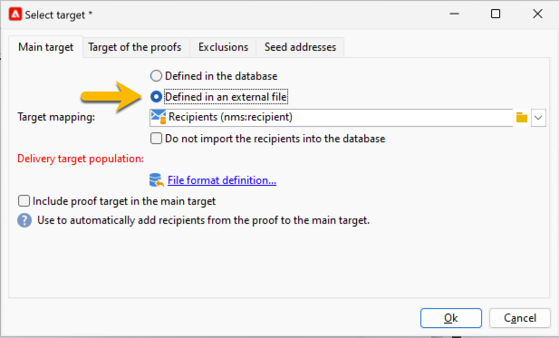

# Selecteer het publiek van uw levering van SMS {#sms-audience}

Alvorens uw publiek te selecteren, [ leer meer over publiek hier ](../../audiences/gs-audiences.md).

In de meeste gevallen wordt het hoofddoel van een levering opgehaald uit de Adobe Campaign-database (standaardmodus). Het publiek kan echter ook in een extern bestand worden opgeslagen. [ leer meer in deze sectie ](#external-audience).

## Publiek in Adobe Campaign

Volg onderstaande stappen om het publiek van uw levering te selecteren:

1. Klik in de bezorgingseditor op de koppeling **[!UICONTROL To]** . Er wordt een **[!UICONTROL Select target]** -venster geopend

1. Omdat het publiek wordt opgeslagen in de Adobe Campaign-database, kiest u **[!UICONTROL Defined in the database]** op het tabblad **[!UICONTROL Main target]** .

   {zoomable="yes"}

1. Selecteer de **[!UICONTROL Target mapping]** in de vervolgkeuzelijst. Standaard doeltoewijzing voor Adobe Campaign is Ontvangers op basis van **[!UICONTROL nms:recipient]** -schema.

   Andere doeltoewijzingen zijn beschikbaar, en sommige kunnen met uw specifieke configuratie verwant zijn. Voor meer op doelafbeeldingen, verwijs naar [ Werk met doelafbeeldingen ](../../audiences/target-mappings.md).

1. Klik op de knop **[!UICONTROL Add]** om beperkingsfilters te definiëren.

   Vervolgens kunt u het type filter selecteren dat u wilt toepassen:

   {zoomable="yes"}

   Als u een doeltype wilt gebruiken, selecteert u het en klikt u op de knop **[!UICONTROL Next]** .

   Hier zijn de doeltypes die door gebrek worden aangeboden:

   * **[!UICONTROL Filtering conditions]**: hiermee kunt u een query definiëren en het resultaat weergeven.
   * **[!UICONTROL A list of recipients]**: hiermee kunt u een lijst selecteren die u hebt voorbereid en die uw publiek bevat
   * **[!UICONTROL A recipient]**: hiermee kunt u rechtstreeks een ontvanger in de tabel selecteren.
   * **[!UICONTROL Recipients included in a folder]**: hiermee kunt u een map selecteren in de boomstructuur voor verkennersnavigatie
   * **[!UICONTROL Recipients of a delivery]**: hiermee kunt u het publiek van een vorige levering selecteren
   * **[!UICONTROL Recipients of deliveries belonging to a folder]**: hiermee kunt u het publiek selecteren van alle leveringen in een bepaalde map
   * **[!UICONTROL Subscribers of an information service]**: met deze optie kunt u een nieuwsbrief selecteren waarop de ontvangers moeten worden geabonneerd om als doel te hebben de levering die wordt gemaakt.
   * **[!UICONTROL User filters]** : hiermee kunt u de vooraf gedefinieerde filters gebruiken.

   Met de optie **[!UICONTROL Exclude recipients from this segment]** kunt u zich richten op ontvangers die niet aan de gedefinieerde doelcriteria voldoen. Als u deze optie wilt gebruiken, selecteert u het desbetreffende vak en past u vervolgens de focus toe, zoals eerder is gedefinieerd, om de resulterende profielen uit te sluiten.

1. Voer de naam van uw publiek in het labelveld in en klik op de knop **[!UICONTROL Finish]** om uw publiek te valideren.

   {zoomable="yes"}

   U kunt zoveel doelpopulatie toevoegen als u nodig hebt door nogmaals op de knop **[!UICONTROL Add]** te klikken. U kunt een aantal van hen ook schrappen door op het kruis te klikken dat na hun etiket wordt gevestigd.

## Publiek in een extern bestand {#external-audience}

Met Adobe Campaign kunt u een levering verzenden naar een publiek dat zich niet in de database bevindt, maar in een extern bestand.

Hier volgen de volgende stappen:

1. Klik in de bezorgingseditor op de koppeling **[!UICONTROL To]** . Er wordt een **[!UICONTROL Select target]** -venster geopend

1. Kies de optie **[!UICONTROL Defined in an external file]**.

   {zoomable="yes"}

1. Ontvangers worden standaard in de database geïmporteerd. In dat geval moet u **[!UICONTROL Target mapping]** selecteren. Voor meer op doelafbeeldingen, verwijs naar [ Werk met doelafbeeldingen ](../../audiences/target-mappings.md).

   Anders kunt u ook **[!UICONTROL Do not import the recipients into the database]** kiezen.

1. Klik tijdens het importeren van het bestand op de koppeling **[!UICONTROL File format definition…]** om het externe bestand te selecteren en te configureren.

1. Klik op **[!UICONTROL Finish]** om uw publiek te valideren.
