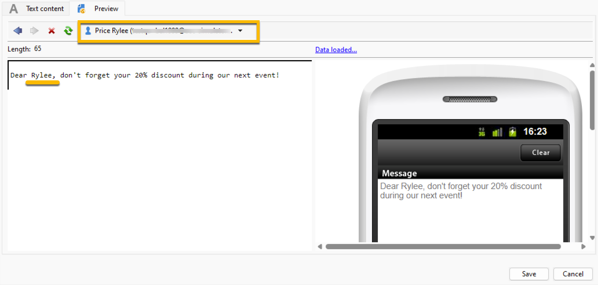

# De SMS-inhoud definiëren {#sms-content}

Om de inhoud van uw levering van SMS te vormen:

1. Voer de inhoud van het bericht in op het tabblad **[!UICONTROL Text content]** .

   {zoomable="yes"}

1. U kunt uw bericht personaliseren door verpersoonlijkingsgebieden op te nemen (bijvoorbeeld toevoegend de voornaam), of het opnemen van vooraf bepaald verpersoonlijkingsblok (bijvoorbeeld toevoegend de groeten). Klik op de verpersoonlijkingsknoop om deze toe te voegen:

   {zoomable="yes"}

   Nadat u bijvoorbeeld op **[!UICONTROL Recipient]** > **[!UICONTROL First name]** hebt geklikt, wordt de SMS-inhoud bijgewerkt met het aanpassingsveld, zoals hieronder:

   {zoomable="yes"}

   Leer meer over verpersoonlijking in Adobe Campaign in [ deze sectie ](../personalize.md).

1. U kunt een voorvertoning van uw inhoud weergeven via het tabblad **[!UICONTROL Preview]** . Als u uw aanpassingsinstellingen wilt controleren, klikt u op de vervolgkeuzelijst **[!UICONTROL Test personalization]** en selecteert u een ontvanger.

   {zoomable="yes"}

   Je kunt de voorvertoning van je SMS controleren met de personalisatie:

   {zoomable="yes"}

>[!NOTE]
>
>* SMS-berichten mogen niet langer zijn dan 160 tekens als de codepagina Latin-1 (ISO-8859-1) wordt gebruikt. Als het bericht in Unicode wordt geschreven, moet het niet 70 karakters overschrijden. Bepaalde speciale tekens kunnen de lengte van het bericht beïnvloeden. Voor meer informatie over berichtlengte, verwijs naar [ het karaktervertaling van SMS ](smpp-external-account.md#smpp-channel-settings) sectie.
>
>* Wanneer verpersoonlijkingsgebieden of voorwaardelijke inhoudsgebieden aanwezig zijn, varieert de grootte van het bericht van één ontvanger aan andere. De lengte van het bericht moet worden geëvalueerd wanneer de personalisatie is uitgevoerd.
>
>*Wanneer u de analyse lanceert, wordt de lengte van berichten gecontroleerd en een waarschuwing getoond in het geval van overstroming.

Na het creëren van de inhoud van uw levering, kunt u [ uw publiek ](sms-audience.md) selecteren.
