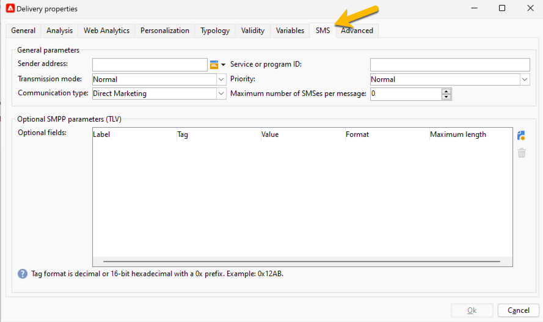

# Instellingen voor SMS-verzending {#sms-settings}

>[!IMPORTANT]
>
>Deze documentatie is van toepassing op Adobe Campaign v8.7.2 en hoger. Om van erfenis aan de nieuwe schakelaar van SMS over te schakelen, verwijs naar dit [ technote ](https://experienceleague.adobe.com/docs/campaign/technotes-ac/tn-new/sms-migration){target="_blank"}
>
>Voor oudere versies, gelieve de [ documentatie van Campaign Classic v7 ](https://experienceleague.adobe.com/en/docs/campaign-classic/using/sending-messages/sending-messages-on-mobiles/sms-set-up/sms-set-up){target="_blank"} te lezen.

De technische montages nodig voor een levering van SMS zijn:

* De externe rekening SMPP voor het bericht dat verplettert. [Meer informatie](smpp-external-account.md#smpp-connection-settings)
* Configureer het tabblad SMS. [ leer hoe ](#sms-tab)

U kunt deze allemaal instellen in een leveringssjabloon om te voorkomen dat u de instellingen voor elk sms-leveringsproject hoeft uit te voeren.

## Het tabblad SMS configureren {#sms-tab}

{zoomable="yes"}

Hier volgt de informatie die u nodig hebt om dit formulier in te vullen. Elk veld wordt hieronder uitgelegd:

* **[!UICONTROL Sender address]**

  Dit veld is optioneel. Het staat met voeten treedt afzenderadres (oADC) toe. De inhoud van dit gebied wordt geplaatst in het *source_addr* gebied van SUBMIT_SM PDU.

  Het veld is door de SMPP-specificatie beperkt tot 21 tekens, maar sommige providers staan mogelijk langere waarden toe. Houd er rekening mee dat in sommige landen zeer strikte beperkingen kunnen worden toegepast (lengte, inhoud, toegestane tekens, ...), zodat u mogelijk moet controleren of de inhoud die u hier plaatst, geldig is. Wees vooral voorzichtig wanneer u gepersonaliseerde velden gebruikt.

  Als dit veld leeg blijft, wordt in plaats daarvan de waarde gebruikt van het veld Source-nummer dat in de externe account is gedefinieerd. Als beide waarden leeg zijn, zal het *source_addr* gebied leeg worden verlaten.

* **[!UICONTROL Service or program ID]**

  >[!NOTE]
  >
  >Het gebruik van deze functie wordt afgeraden. Optionele SMPP-parameters bieden een veel flexibelere implementatie.
  >
  >Beide functies kunnen niet tegelijkertijd worden gebruikt.

  In combinatie met de instelling voor de overeenkomende externe account kunt u één optionele parameter met elke MT verzenden. In dit veld wordt het waardegedeelte van het TLV gedefinieerd.

* **[!UICONTROL Transmission mode]**

  In dit veld wordt het type SMS aangegeven dat u wilt overbrengen: normale of flash-berichten, die op de mobiele kaart of de simkaart worden opgeslagen. Deze instelling wordt verzonden in het optionele veld dest_addr_subunit in de SUBMIT_SM PDU.

   * **de Flits** plaatst de waarde aan 1. Er wordt een Flash-bericht verzonden dat op de mobiele telefoon verschijnt en niet in het geheugen is opgeslagen.
   * **Normaal** plaatst de waarde aan 0. Het stuurt een normaal bericht.
   * **sparen op mobiele** plaatst de waarde aan 2. Het vertelt de telefoon om SMS in intern geheugen op te slaan.
   * **sparen op terminal** plaatst de waarde aan 3. Het vertelt de telefoon om SMS in de kaart op te slaan SIM.

* **[!UICONTROL Priority, Communication type]**

  Deze gebieden worden genegeerd door de uitgebreide schakelaar SMPP.

* **[!UICONTROL Maximum number of SMS per message]**

  Deze instelling werkt alleen als de instelling Berichtlading is uitgeschakeld (zie de instellingen voor de externe account voor meer informatie). Als het bericht meer SMS dan deze waarde vereist, zal een fout worden teweeggebracht.

  Het protocol van SMS beperkt SMS tot 255 delen, maar sommige mobiele telefoons hebben moeite samenstellend lange berichten met meer dan 10 delen of zo (de grens hangt van het nauwkeurige model af). Als u veilig wilt zijn, ga niet meer dan 5 delen per bericht.

  Vanwege de manier waarop gepersonaliseerde berichten in Adobe Campaign werken, kan de grootte van berichten variëren. Als u veel zeer lange berichten hebt, kan dit de verzendkosten veel doen stijgen: dit op een redelijke waarde zetten helpt u deze kosten te beheersen.

  Als u 0 opgeeft, wordt de limiet uitgeschakeld.

* **[!UICONTROL Optional SMPP parameters (TLV)]**
U kunt extra velden opgeven die als optionele SMPP-parameters (TLV) moeten worden verzonden. Deze extra gebieden worden verzonden met elke MT en de gepersonaliseerde gebieden staan toe om verschillende waarden voor elke MT te hebben.
De lijst maakt een lijst van facultatieve parameters om met elk bericht te verzenden. Kolommen bevatten de volgende informatie:
   * **Etiket**: dit is een facultatief, vrij-vormetiket. Het wordt niet verzonden naar de leverancier. U kunt een tekstuele beschrijving van de parameter opgeven.
   * **Markering**: de markeringswaarde, of in decimaal formaat (b.v. 12345) of hexadecimaal met 0x prefix (b.v. 0x12ab). Tags kunnen tussen 0 en 65535 liggen. Vraag het servicebureau SMPP naar tags die ze ondersteunen.
   * **Waarde**: waarde om in de facultatieve parameter te verzenden. Dit is een gepersonaliseerd veld.
   * **Formaat**: Codering die voor de parameter wordt gebruikt. U kunt om het even welke gesteunde tekstcodering of de gemeenschappelijkste binaire formaten selecteren. Vraag de dienstverlener SMPP naar het vereiste formaat.
   * **Maximale lengte**: Maximum aantal bytes voor deze parameter. Dit wordt genegeerd voor binaire velden omdat binaire velden een vaste grootte hebben.

* **[!UICONTROL Using binary formats for TLV]**

  Campagne ondersteunt het verzenden van TLV in binaire indeling. Binair is beperkt tot het verzenden van nummers.

  Aangezien gepersonaliseerde velden altijd tekst uitvoeren, moet het gepersonaliseerde veld een decimale representatie van het getal bevatten (een willekeurige tekenreeks is OK zolang deze alleen cijfers bevat). Waarden kunnen zowel ondertekend als zonder teken zijn, de verpersoonlijkingsmotor zet het in de correcte binaire vertegenwoordiging om.

  Als u binaire indelingen gebruikt, maken speciale waarden &#39;&#39; (lege tekenreeks), &#39;null&#39; en &#39;undefined&#39; het veld volledig uit zonder een fout te genereren. In deze drie speciale gevallen wordt de tag helemaal niet doorgegeven. Hierdoor is het alleen mogelijk om een specifiek TLV voor bepaalde berichten door te geven wanneer u zorgvuldig gemaakte JavaScript gebruikt in het verpersoonlijkingsveld.

  >[!NOTE]
  >
  >Binaire indelingen worden altijd gecodeerd in de vorm big endian.

