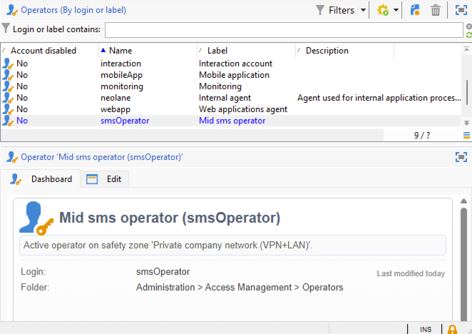

# SMS in een infrastructuur voor midsourcing {#sms-mid}

>[!IMPORTANT]
>
>Deze documentatie is van toepassing op Adobe Campaign v8.7.2 en hoger. Om van erfenis aan de nieuwe schakelaar van SMS over te schakelen, verwijs naar dit [ technote ](https://experienceleague.adobe.com/docs/campaign/technotes-ac/tn-new/sms-migration){target="_blank"}
>
>Voor oudere versies, gelieve de [ documentatie van Campaign Classic v7 ](https://experienceleague.adobe.com/en/docs/campaign-classic/using/sending-messages/sending-messages-on-mobiles/sms-set-up/sms-set-up){target="_blank"} te lezen.

Voor het verzenden van SMS-leveringen met een infrastructuur voor midsourcing is het volgende vereist:

1. Een SMS-operator op de middelste server. [ Leer hoe te om het te creëren hier ](#sms-operator-mid)
1. Een externe rekening van SMS op de server van de Marketing die de eerder gecreeerd exploitant zal gebruiken. [ Leer hoe te om het te creëren hier ](#sms-external-account)
1. Een externe SMPP-account op de mediaserver die de modus Kanaal en Levering halverwege de sourcing opgeeft. [ Leer hoe te om het te creëren hier ](#smpp-external-account-mid)
1. Een leveringsmalplaatje dat verwijzingen de externe rekening om het verzendende proces te stroomlijnen. [ Leer hoe te om het te creëren hier ](#sms-delivery-template)

## Maak de SMS-operator op de middelste server {#sms-operator-mid}

Eerst, moet u een exploitant van SMS op de mid-server tot stand brengen, die door de externe rekening van SMS op de server van de Marketing zal worden gebruikt.

Volg onderstaande stappen om uw SMS-operator te maken:

1. Klik in **[!UICONTROL Administration]** > **[!UICONTROL Access management]** > **[!UICONTROL Operators]** op het **[!UICONTROL New]** en vul het formulier in het nieuwe geopende venster.

   * **[!UICONTROL Name (login)]** en **[!UICONTROL Label]** zijn verplicht.
   * Wachtwoord is niet verplicht, maar wordt ten zeerste aanbevolen voor de beveiliging.

   Merk op dat de Naam (login) later moet worden gebruikt om uw externe rekening SMPP in de Midden-server te noemen.

   {zoomable="yes"}

1. Klik in **[!UICONTROL Groups and named rights]** -onderdeel op de knop **[!UICONTROL Add]** .
Kies in het geopende venster **[!UICONTROL Named rights]** in de lijst **[!UICONTROL Folder]** en selecteer **[!UICONTROL ADMINISTRATION]** in de lijst rechts.

1. Klik op de knop **[!UICONTROL Ok]** .

   {zoomable="yes"}

1. Klik op de knop **[!UICONTROL Save]** om het maken van uw SMS-operator te voltooien.

   {zoomable="yes"}

U ziet het nu in de lijst met operatoren.

{zoomable="yes"}

## Een externe SMS-account maken op de marketingserver {#sms-external-account}

In een infrastructuur halverwege, moet u een externe rekening van SMS op de server van de Marketing tot stand brengen zoals hieronder

>[!IMPORTANT]
>
>Het gebruik van hetzelfde account en wachtwoord voor meerdere externe SMS-accounts kan leiden tot conflicten en overlapping tussen de accounts. Leer meer op [ het oplossen van problemenpagina van SMS ](smpp-connection.md#sms-troubleshooting).

1. Klik in **[!UICONTROL Administration]** > **[!UICONTROL Platform]** > **[!UICONTROL External Accounts]** op het pictogram **[!UICONTROL New]**

   {zoomable="yes"}

1. Stel de **[!UICONTROL Label]** en de **[!UICONTROL Internal name]** van uw externe account in. Definieer het accounttype als **[!UICONTROL Routing]** , schakel het selectievakje **[!UICONTROL Enabled]** in, selecteer **[!UICONTROL Mobile (SMS)]** voor het kanaal en **[!UICONTROL Mid-sourcing]** voor de leveringsmodus.

   {zoomable="yes"}

1. Vul op het tabblad **[!UICONTROL Mid-sourcing]** het formulier in met de URL van de server voor midsourcing en de SMS-operator die eerder op de server voor middentransmissie is gemaakt.

   Bevestig de verbinding door op de knop **[!UICONTROL Test the connection]** te klikken.

   {zoomable="yes"}

1. Klik op **[!UICONTROL Save]**.

## Een externe SMPP-account maken op de mediumserver {#smpp-external-account-mid}

>[!IMPORTANT]
>
>Het gebruik van hetzelfde account en wachtwoord voor meerdere externe SMS-accounts kan leiden tot conflicten en overlapping tussen de accounts. Verwijs naar de [ het oplossen van problemenpagina van SMS ](smpp-connection.md#sms-troubleshooting).

Het doel is nu om uw externe rekening SMPP op de middelste-server te vestigen.

Hiervoor voert u de volgende stappen uit:

1. Klik in **[!UICONTROL Administration]** > **[!UICONTROL Platform]** > **[!UICONTROL External Accounts]** van de middelste server op het pictogram **[!UICONTROL New]**

1. Stel de **[!UICONTROL Label]** en de **[!UICONTROL Internal name]** van uw externe account in.

   >[!WARNING]
   >
   >Wanneer u een interne naam toewijst, moet u de opgegeven naamgevingsconventie volgen: `SMS Operator Name_Internal Name of the Marketing SMS external account` .
   >

   Definieer het accounttype als **[!UICONTROL Routing]** , schakel het selectievakje **[!UICONTROL Enabled]** in, selecteer **[!UICONTROL Mobile (SMS)]** voor het kanaal en **[!UICONTROL Bulk delivery]** voor de leveringsmodus.
   {zoomable="yes"}

1. Bewaar **[!UICONTROL Mobile]** in de vervolgkeuzelijst **[!UICONTROL Extended generic SMPP]** op het tabblad **[!UICONTROL Connector]** .

   Het vak **[!UICONTROL Send messages through a dedicated process]** is standaard ingeschakeld.

   {zoomable="yes"}

   Als u de verbinding wilt instellen, moet u de tabbladen van dit formulier invullen. Voor details, [ leren meer over externe rekening SMPP ](smpp-external-account.md#smpp-connection-settings).

## De leveringssjabloon configureren {#sms-delivery-template}

Om de verwezenlijking van uw levering van SMS te vergemakkelijken, creeer een malplaatje van de Levering van SMS waar al uw montages van verwijzingen worden voorzien.

Klik in **[!UICONTROL Resources]** > **[!UICONTROL Templates]** > **[!UICONTROL Delivery templates]** op de marketingserver met de rechtermuisknop op de bestaande Mobile-leveringssjabloon en kies **[!UICONTROL Duplicate]** .

{zoomable="yes"}

Wijzig de tags **[!UICONTROL Label]** en **[!UICONTROL Internal name]** van de sjabloon om deze gemakkelijk te herkennen en klik op de knop **[!UICONTROL Properties]** .

{zoomable="yes"}

Selecteer op het tabblad **[!UICONTROL General]** in **[!UICONTROL Routing]** de externe SMPP-account.

{zoomable="yes"}

Op het tabblad **[!UICONTROL SMS]** kunt u optionele parameters aan de sjabloon toevoegen.

{zoomable="yes"}

[ leer meer over deze het lusjeconfiguratie van SMS ](sms-delivery-settings.md).
